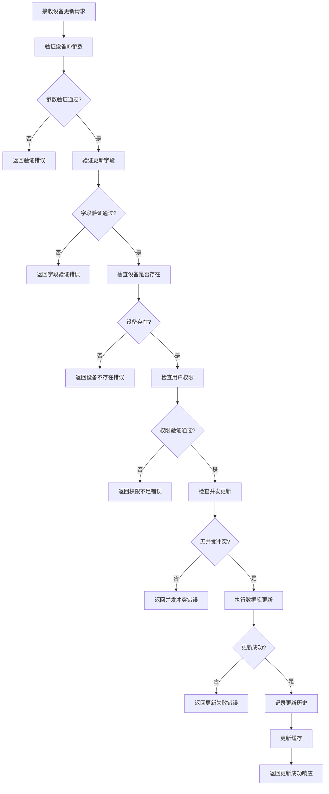
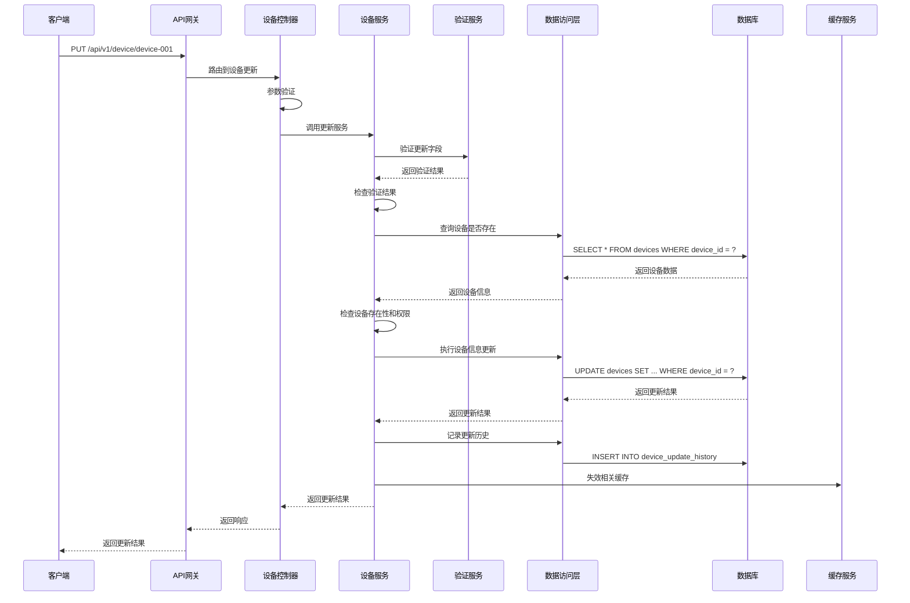

# 设备更新模块需求文档

## 1. 功能描述

设备更新模块是OneGoServer系统的核心管理功能，负责提供设备信息的修改和更新服务。该模块支持对设备的基本信息、网络配置、登录设置、元数据等进行安全、可控的更新操作，确保设备信息的准确性和一致性。

### 1.1 主要功能
- **设备基本信息更新**：更新设备名称、型号等基本信息
- **设备网络配置更新**：更新IP地址、端口、协议等网络配置
- **设备登录配置更新**：更新登录用户名、密码、公钥等认证信息
- **设备元数据更新**：更新设备标签、扩展配置等元数据
- **设备状态更新**：更新设备状态和健康度信息
- **更新历史记录**：记录设备信息变更历史

### 1.2 支持更新字段
- **基本信息**：name（设备名称）、model（设备型号）
- **网络信息**：ip_address（IP地址）、port（端口）、protocol（协议）
- **登录信息**：login_username（登录用户名）、login_password（登录密码）
- **元数据**：metadata（元数据）、tags（标签）

## 2. 功能目标

### 2.1 业务目标
- 提供安全、可控的设备信息更新服务
- 支持设备配置的灵活调整
- 确保设备信息的一致性和准确性
- 提供完整的更新历史追踪

### 2.2 技术目标
- 更新响应时间 < 200ms
- 支持部分字段更新
- 数据一致性保证
- 更新操作原子性

### 2.3 安全目标
- 防止未授权更新
- 保护敏感信息安全
- 支持更新操作审计
- 防止并发更新冲突

## 3. 输入输出说明

### 3.1 输入参数

#### 3.1.1 路径参数
```json
{
  "deviceId": "string"  // 设备ID，必填，不能为空
}
```

#### 3.1.2 请求体参数
```json
{
  "name": "string",              // 设备名称，可选，1-100字符
  "model": "string",             // 设备型号，可选，1-50字符
  "ip_address": "string",        // IP地址，可选，标准IP格式
  "port": 8080,                  // 端口，可选，1-65535
  "protocol": "string",          // 协议，可选：http|mqtt|tcp|udp
  "login_username": "string",    // 登录用户名，可选
  "login_password": "string",    // 登录密码，可选
  "metadata": "string",          // 元数据，可选，JSON字符串
  "tags": "string"               // 标签，可选，逗号分隔
}
```

### 3.2 输出参数

#### 3.2.1 成功响应
```json
{
  "code": 0,
  "message": "设备信息更新成功",
  "data": {
    "device_id": "device-001",
    "updated_fields": ["name", "ip_address", "port"],
    "update_time": "2024-01-01T15:30:00Z"
  }
}
```

#### 3.2.2 错误响应
```json
{
  "code": 400,
  "message": "参数验证失败",
  "data": {
    "field": "ip_address",
    "error": "IP地址格式不正确"
  }
}
```

## 4. 涉及接口以及接口设计

### 4.1 API接口定义

#### 4.1.1 设备信息更新接口
- **路径**：`PUT /api/v1/device/device/{deviceId}`
- **标签**：设备信息
- **摘要**：更新设备信息

### 4.2 内部接口

#### 4.2.1 设备更新接口
```go
type UpdateDeviceInput struct {
    Device *Device
}

type UpdateDeviceOutput struct {
    Message string
}
```

#### 4.2.2 设备验证接口
```go
type ValidateDeviceUpdateInput struct {
    DeviceID string
    Updates  map[string]interface{}
}

type ValidateDeviceUpdateOutput struct {
    IsValid bool
    Message string
    Errors  []string
}
```

## 5. 数据结构设计

### 5.1 数据库更新结构

#### 5.1.1 基础更新SQL
```sql
UPDATE devices 
SET 
    name = COALESCE(?, name),
    model = COALESCE(?, model),
    ip_address = COALESCE(?, ip_address),
    port = COALESCE(?, port),
    protocol = COALESCE(?, protocol),
    login_username = COALESCE(?, login_username),
    login_password = COALESCE(?, login_password),
    metadata = COALESCE(?, metadata),
    tags = COALESCE(?, tags),
    updated_at = CURRENT_TIMESTAMP,
    updated_by = ?
WHERE device_id = ? AND deleted_at IS NULL
```

#### 5.1.2 更新历史记录SQL
```sql
INSERT INTO device_update_history (
    device_id, field_name, old_value, new_value, 
    updated_by, update_time
) VALUES (?, ?, ?, ?, ?, CURRENT_TIMESTAMP)
```

### 5.2 缓存更新结构

#### 5.2.1 缓存失效策略
```go
type CacheInvalidationStrategy struct {
    DeviceID     string   // 设备ID
    InvalidKeys  []string // 需要失效的缓存键
    UpdateTime   time.Time // 更新时间
}
```

## 6. 异常处理

### 6.1 输入验证异常
- **设备ID为空**：返回400错误，提示"设备ID不能为空"
- **设备名称过长**：返回400错误，提示"设备名称长度为1-100字符"
- **设备型号过长**：返回400错误，提示"设备型号长度为1-50字符"
- **IP地址格式错误**：返回400错误，提示"IP地址格式不正确"
- **端口范围错误**：返回400错误，提示"端口范围为1-65535"
- **协议类型错误**：返回400错误，提示"协议只能是http,mqtt,tcp,udp"

### 6.2 业务逻辑异常
- **设备不存在**：返回404错误，提示"设备不存在"
- **设备已删除**：返回404错误，提示"设备已删除"
- **权限不足**：返回403错误，提示"权限不足，无法更新设备信息"
- **并发更新冲突**：返回409错误，提示"设备信息已被其他用户修改"

### 6.3 系统异常
- **数据库连接失败**：返回500错误，提示"数据库连接失败"
- **更新操作失败**：返回500错误，提示"设备信息更新失败"
- **缓存更新失败**：返回500错误，提示"缓存更新失败"

## 7. 交互流程图



## 8. 交互时序图



## 9. 安全与权限

### 9.1 访问控制
- **接口权限**：需要设备更新权限
- **数据权限**：根据用户权限限制可更新的设备
- **字段权限**：根据用户权限限制可更新的字段

### 9.2 数据安全
- **敏感信息加密**：设备密码等敏感信息需要加密存储
- **更新审计**：记录所有设备信息更新操作
- **数据验证**：严格验证更新数据的格式和内容

### 9.3 并发控制
- **乐观锁机制**：使用版本号防止并发更新冲突
- **更新锁定**：防止同一设备被多个用户同时更新
- **事务控制**：确保更新操作的原子性

## 10. 日志与审计要求

### 10.1 更新日志
- **更新操作日志**：记录设备信息更新的详细信息
- **字段变更日志**：记录每个字段的变更历史
- **权限验证日志**：记录权限验证的结果

### 10.2 审计日志
- **用户操作审计**：记录操作用户和时间
- **数据变更审计**：记录数据变更的详细信息
- **安全事件审计**：记录安全相关事件

### 10.3 日志格式
```json
{
  "timestamp": "2024-01-01T00:00:00Z",
  "level": "INFO",
  "service": "device-update",
  "operation": "update_device",
  "device_id": "device-001",
  "user_id": "user-123",
  "ip_address": "192.168.1.100",
  "updated_fields": ["name", "ip_address", "port"],
  "old_values": {
    "name": "旧设备名称",
    "ip_address": "192.168.1.100",
    "port": 8080
  },
  "new_values": {
    "name": "新设备名称",
    "ip_address": "192.168.1.101",
    "port": 9090
  },
  "result": "success",
  "duration_ms": 150
}
```

## 11. 测试用例

### 11.1 功能测试用例

#### 11.1.1 正常更新测试
- **测试目标**：验证设备信息正常更新功能
- **测试数据**：
  ```json
  PUT /api/v1/device/device-001
  {
    "name": "更新后的设备名称",
    "ip_address": "192.168.1.101",
    "port": 9090
  }
  ```
- **预期结果**：返回更新成功响应，设备信息被正确更新

#### 11.1.2 部分字段更新测试
- **测试目标**：验证部分字段更新功能
- **测试数据**：
  ```json
  PUT /api/v1/device/device-001
  {
    "name": "仅更新名称"
  }
  ```
- **预期结果**：仅更新指定字段，其他字段保持不变

#### 11.1.3 设备不存在测试
- **测试目标**：验证设备不存在时的处理
- **测试数据**：
  ```json
  PUT /api/v1/device/non-existent-device
  {
    "name": "测试名称"
  }
  ```
- **预期结果**：返回404错误，提示"设备不存在"

#### 11.1.4 参数验证测试
- **测试目标**：验证参数验证功能
- **测试数据**：
  ```json
  PUT /api/v1/device/device-001
  {
    "name": "",
    "port": 70000
  }
  ```
- **预期结果**：返回400错误，包含具体的验证错误信息

### 11.2 权限测试用例

#### 11.2.1 权限验证测试
- **测试目标**：验证权限控制功能
- **测试场景**：无权限用户尝试更新设备信息
- **预期结果**：返回403错误，提示"权限不足"

#### 11.2.2 字段权限测试
- **测试目标**：验证字段级权限控制
- **测试场景**：用户尝试更新无权限的字段
- **预期结果**：返回403错误，提示"无权限更新该字段"

### 11.3 并发测试用例

#### 11.3.1 并发更新测试
- **测试目标**：验证并发更新处理
- **测试场景**：两个用户同时更新同一设备
- **预期结果**：一个成功，另一个返回409并发冲突错误

#### 11.3.2 乐观锁测试
- **测试目标**：验证乐观锁机制
- **测试场景**：基于版本号的并发控制
- **预期结果**：版本号不匹配时返回409错误

### 11.4 安全测试用例

#### 11.4.1 SQL注入测试
- **测试目标**：验证SQL注入防护
- **测试数据**：在更新字段中包含SQL注入代码
- **预期结果**：系统正确过滤恶意代码

#### 11.4.2 敏感信息保护测试
- **测试目标**：验证敏感信息保护
- **测试场景**：更新设备密码等敏感信息
- **预期结果**：敏感信息被正确加密存储

### 11.5 异常测试用例

#### 11.5.1 数据库异常测试
- **测试目标**：验证数据库异常处理
- **测试场景**：模拟数据库连接失败
- **预期结果**：返回500错误，记录详细错误日志

#### 11.5.2 缓存异常测试
- **测试目标**：验证缓存异常处理
- **测试场景**：模拟缓存服务不可用
- **预期结果**：更新操作成功，缓存失效操作失败但不影响主功能

### 11.6 数据一致性测试

#### 11.6.1 事务一致性测试
- **测试目标**：验证事务一致性
- **测试场景**：更新过程中发生异常
- **预期结果**：数据回滚到更新前状态

#### 11.6.2 缓存一致性测试
- **测试目标**：验证缓存数据一致性
- **测试场景**：设备信息更新后查询
- **预期结果**：返回最新的设备信息

#### 11.6.3 历史记录完整性测试
- **测试目标**：验证更新历史记录
- **测试场景**：多次更新设备信息
- **预期结果**：所有更新操作都有完整的历史记录 