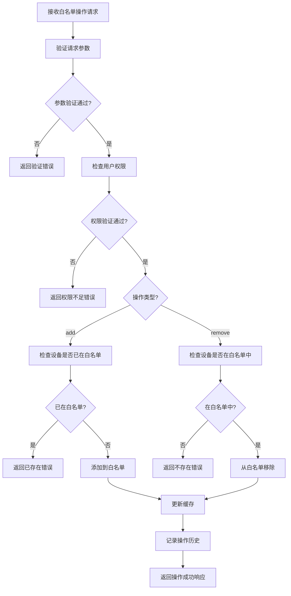
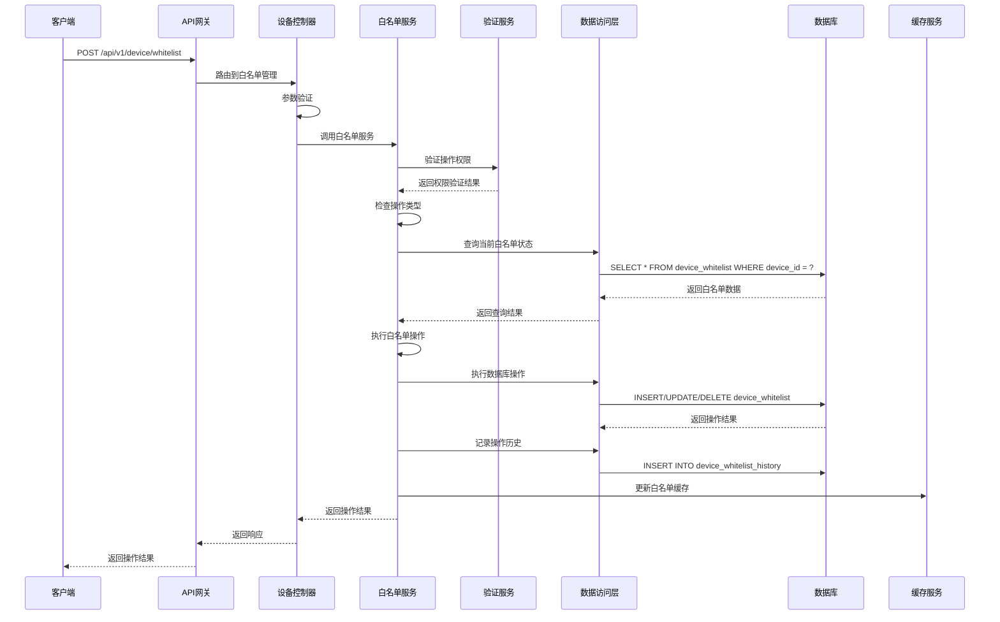

# 设备白名单模块需求文档

## 1. 功能描述

设备白名单模块是OneGoServer系统的安全管理功能，负责管理允许接入系统的设备列表。该模块通过白名单机制控制设备的注册和访问权限，确保只有经过授权的设备才能接入系统，提高系统的安全性和可控性。

### 1.1 主要功能
- **白名单添加**：将设备添加到白名单，允许设备注册
- **白名单移除**：从白名单中移除设备，禁止设备注册
- **白名单查询**：查询当前白名单中的设备列表
- **白名单验证**：验证设备是否在白名单中
- **批量操作**：支持批量添加和移除设备
- **白名单同步**：与设备注册流程同步验证

### 1.2 白名单类型
- **MAC地址白名单**：基于设备MAC地址的白名单
- **IP地址白名单**：基于设备IP地址的白名单
- **设备ID白名单**：基于设备ID的白名单
- **混合白名单**：支持多种标识符的白名单

## 2. 功能目标

### 2.1 业务目标
- 提供安全的设备接入控制
- 防止未授权设备注册
- 支持灵活的白名单管理
- 确保系统访问安全

### 2.2 技术目标
- 白名单验证响应时间 < 50ms
- 支持大规模白名单数据
- 白名单数据一致性保证
- 高效的白名单查询机制

### 2.3 安全目标
- 防止白名单绕过
- 保护白名单数据安全
- 支持白名单操作审计
- 防止未授权白名单修改

## 3. 输入输出说明

### 3.1 输入参数

#### 3.1.1 白名单管理请求
```json
{
  "device_id": "string",     // 设备ID，必填
  "action": "string",        // 操作类型：add|remove，必填
  "whitelist_type": "string", // 白名单类型：mac|ip|device_id，可选
  "description": "string"    // 描述信息，可选
}
```

#### 3.1.2 白名单查询请求
```json
{
  "whitelist_type": "string", // 白名单类型，可选
  "keyword": "string",        // 关键词搜索，可选
  "page": 1,                  // 页码，可选
  "size": 10                  // 每页数量，可选
}
```

### 3.2 输出参数

#### 3.2.1 成功响应
```json
{
  "code": 0,
  "message": "白名单操作成功",
  "data": {
    "device_id": "device-001",
    "action": "add",
    "whitelist_type": "device_id",
    "status": "success",
    "operation_time": "2024-01-01T15:30:00Z"
  }
}
```

#### 3.2.2 白名单查询响应
```json
{
  "code": 0,
  "message": "success",
  "data": {
    "list": [
      {
        "id": 1,
        "device_id": "device-001",
        "whitelist_type": "device_id",
        "identifier": "device-001",
        "description": "测试设备",
        "added_by": "admin",
        "added_at": "2024-01-01T10:00:00Z",
        "status": "active"
      }
    ],
    "total": 100,
    "page": 1,
    "size": 10
  }
}
```

## 4. 涉及接口以及接口设计

### 4.1 API接口定义

#### 4.1.1 设备白名单管理接口
- **路径**：`POST /api/v1/device/device/whitelist`
- **标签**：设备管理
- **摘要**：管理设备白名单

#### 4.1.2 设备白名单查询接口
- **路径**：`GET /api/v1/device/device/whitelist`
- **标签**：设备管理
- **摘要**：查询设备白名单

### 4.2 内部接口

#### 4.2.1 白名单管理接口
```go
type ManageDeviceWhitelistInput struct {
    DeviceID      string
    Action        string
    WhitelistType string
    Description   string
}

type ManageDeviceWhitelistOutput struct {
    Message string
}
```

#### 4.2.2 白名单验证接口
```go
type CheckDeviceWhitelistInput struct {
    DeviceID string
    MACAddress string
    IPAddress  string
}

type CheckDeviceWhitelistOutput struct {
    IsWhitelisted bool
    WhitelistType string
    Message       string
}
```

## 5. 数据结构设计

### 5.1 数据库表结构

#### 5.1.1 设备白名单表
```sql
CREATE TABLE device_whitelist (
    id BIGINT PRIMARY KEY AUTO_INCREMENT,
    device_id VARCHAR(36) NOT NULL,
    whitelist_type ENUM('mac', 'ip', 'device_id') NOT NULL,
    identifier VARCHAR(255) NOT NULL,
    description TEXT,
    status ENUM('active', 'inactive') DEFAULT 'active',
    added_by VARCHAR(50) NOT NULL,
    added_at TIMESTAMP DEFAULT CURRENT_TIMESTAMP,
    updated_at TIMESTAMP DEFAULT CURRENT_TIMESTAMP ON UPDATE CURRENT_TIMESTAMP,
    UNIQUE KEY uk_device_whitelist (device_id, whitelist_type, identifier)
);
```

#### 5.1.2 白名单操作历史表
```sql
CREATE TABLE device_whitelist_history (
    id BIGINT PRIMARY KEY AUTO_INCREMENT,
    device_id VARCHAR(36) NOT NULL,
    action ENUM('add', 'remove') NOT NULL,
    whitelist_type ENUM('mac', 'ip', 'device_id') NOT NULL,
    identifier VARCHAR(255) NOT NULL,
    operated_by VARCHAR(50) NOT NULL,
    operated_at TIMESTAMP DEFAULT CURRENT_TIMESTAMP,
    reason TEXT
);
```

### 5.2 缓存结构

#### 5.2.1 白名单缓存
```go
type WhitelistCache struct {
    Key         string    // 缓存键：whitelist:{type}:{identifier}
    DeviceID    string    // 设备ID
    Type        string    // 白名单类型
    Identifier  string    // 标识符
    Status      string    // 状态
    ExpireAt    time.Time // 过期时间
}
```

## 6. 异常处理

### 6.1 输入验证异常
- **设备ID为空**：返回400错误，提示"设备ID不能为空"
- **操作类型无效**：返回400错误，提示"操作类型只能是add,remove"
- **白名单类型无效**：返回400错误，提示"白名单类型无效"

### 6.2 业务逻辑异常
- **设备已在白名单中**：返回409错误，提示"设备已在白名单中"
- **设备不在白名单中**：返回404错误，提示"设备不在白名单中"
- **权限不足**：返回403错误，提示"权限不足，无法管理白名单"

### 6.3 系统异常
- **数据库连接失败**：返回500错误，提示"数据库连接失败"
- **白名单操作失败**：返回500错误，提示"白名单操作失败"
- **缓存更新失败**：返回500错误，提示"缓存更新失败"

## 7. 交互流程图



## 8. 交互时序图



## 9. 安全与权限

### 9.1 访问控制
- **接口权限**：需要白名单管理权限
- **操作权限**：根据用户权限限制白名单操作
- **数据权限**：根据用户权限限制可管理的白名单范围

### 9.2 数据安全
- **白名单加密**：敏感白名单数据需要加密存储
- **操作审计**：记录所有白名单操作
- **数据验证**：严格验证白名单数据的格式和内容

### 9.3 操作安全
- **操作确认**：重要白名单操作需要用户确认
- **批量操作限制**：限制批量操作的规模
- **操作频率限制**：限制白名单操作的频率

## 10. 日志与审计要求

### 10.1 操作日志
- **白名单操作日志**：记录白名单管理的详细信息
- **权限验证日志**：记录权限验证的结果
- **操作结果日志**：记录操作的结果和影响

### 10.2 审计日志
- **用户操作审计**：记录操作用户和时间
- **数据变更审计**：记录白名单数据变更的详细信息
- **安全事件审计**：记录安全相关事件

### 10.3 日志格式
```json
{
  "timestamp": "2024-01-01T00:00:00Z",
  "level": "INFO",
  "service": "device-whitelist",
  "operation": "manage_whitelist",
  "device_id": "device-001",
  "user_id": "user-123",
  "ip_address": "192.168.1.100",
  "action": "add",
  "whitelist_type": "device_id",
  "identifier": "device-001",
  "result": "success",
  "duration_ms": 80
}
```

## 11. 测试用例

### 11.1 功能测试用例

#### 11.1.1 添加白名单测试
- **测试目标**：验证添加设备到白名单功能
- **测试数据**：
  ```json
  POST /api/v1/device/whitelist
  {
    "device_id": "device-001",
    "action": "add",
    "whitelist_type": "device_id",
    "description": "测试设备"
  }
  ```
- **预期结果**：返回添加成功响应，设备被添加到白名单

#### 11.1.2 移除白名单测试
- **测试目标**：验证从白名单移除设备功能
- **测试数据**：
  ```json
  POST /api/v1/device/whitelist
  {
    "device_id": "device-001",
    "action": "remove",
    "whitelist_type": "device_id"
  }
  ```
- **预期结果**：返回移除成功响应，设备从白名单中移除

#### 11.1.3 重复添加测试
- **测试目标**：验证重复添加白名单的处理
- **测试场景**：尝试添加已存在的白名单记录
- **预期结果**：返回409错误，提示"设备已在白名单中"

#### 11.1.4 移除不存在记录测试
- **测试目标**：验证移除不存在记录的处理
- **测试场景**：尝试移除不存在的白名单记录
- **预期结果**：返回404错误，提示"设备不在白名单中"

### 11.2 查询测试用例

#### 11.2.1 白名单查询测试
- **测试目标**：验证白名单查询功能
- **测试数据**：
  ```
  GET /api/v1/device/whitelist?page=1&size=10
  ```
- **预期结果**：返回白名单列表，包含分页信息

#### 11.2.2 条件查询测试
- **测试目标**：验证条件查询功能
- **测试数据**：
  ```
  GET /api/v1/device/whitelist?whitelist_type=device_id&keyword=device-001
  ```
- **预期结果**：返回符合条件的白名单记录

### 11.3 权限测试用例

#### 11.3.1 权限验证测试
- **测试目标**：验证权限控制功能
- **测试场景**：无权限用户尝试管理白名单
- **预期结果**：返回403错误，提示"权限不足"

#### 11.3.2 操作权限测试
- **测试目标**：验证操作级权限控制
- **测试场景**：用户尝试执行无权限的操作
- **预期结果**：返回403错误，提示"无权限执行该操作"

### 11.4 安全测试用例

#### 11.4.1 白名单绕过测试
- **测试目标**：验证白名单绕过防护
- **测试场景**：尝试绕过白名单机制注册设备
- **预期结果**：设备注册被拒绝，返回权限不足错误

#### 11.4.2 批量操作测试
- **测试目标**：验证批量操作的安全性
- **测试场景**：批量添加大量设备到白名单
- **预期结果**：操作被限制或需要特殊权限

### 11.5 性能测试用例

#### 11.5.1 白名单验证性能测试
- **测试目标**：验证白名单验证性能
- **测试场景**：大量设备同时进行白名单验证
- **预期结果**：验证响应时间<50ms

#### 11.5.2 缓存性能测试
- **测试目标**：验证缓存机制性能
- **测试场景**：重复查询相同白名单记录
- **预期结果**：缓存命中后查询时间<10ms

### 11.6 异常测试用例

#### 11.6.1 数据库异常测试
- **测试目标**：验证数据库异常处理
- **测试场景**：模拟数据库连接失败
- **预期结果**：返回500错误，记录详细错误日志

#### 11.6.2 缓存异常测试
- **测试目标**：验证缓存异常处理
- **测试场景**：模拟缓存服务不可用
- **预期结果**：降级到直接查询数据库，不影响功能

### 11.7 数据一致性测试

#### 11.7.1 白名单数据一致性测试
- **测试目标**：验证白名单数据一致性
- **测试场景**：白名单操作后查询验证
- **预期结果**：数据保持一致，无脏数据

#### 11.7.2 历史记录完整性测试
- **测试目标**：验证操作历史记录完整性
- **测试场景**：多次白名单操作
- **预期结果**：所有操作都有完整的历史记录 