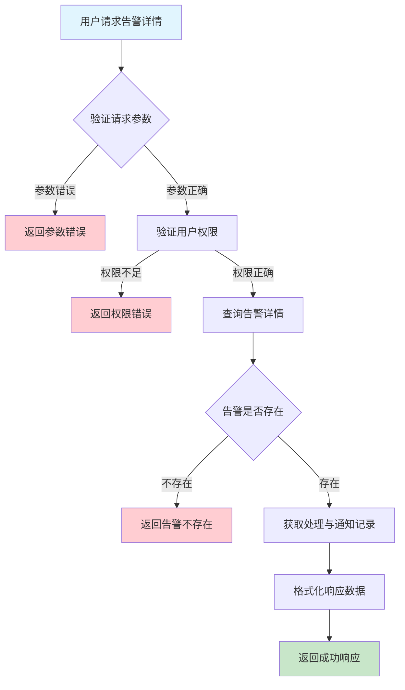
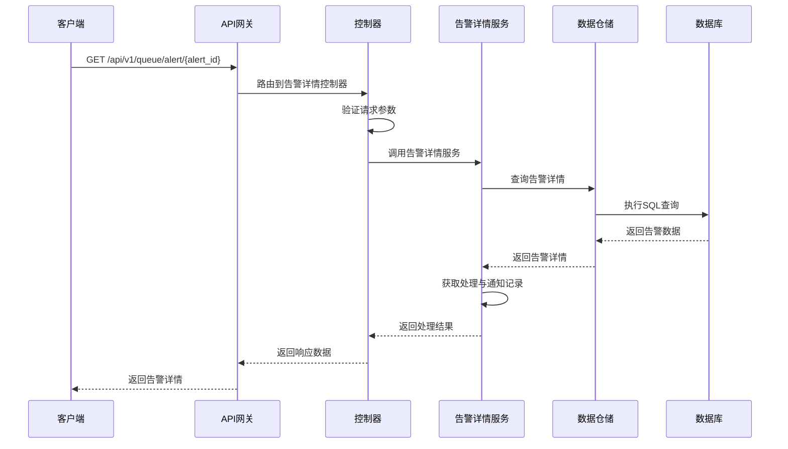

# 队列告警详情需求文档

## 1. 功能描述

### 1.1 功能概述
队列告警详情功能用于获取单条告警的详细信息，包括告警内容、产生原因、处理记录、通知记录等，便于异常定位和合规审计。

### 1.2 主要功能列表
- 查询单条告警详情
- 展示告警内容、产生原因、处理与通知记录
- 支持详情导出

### 1.3 支持的功能特性
- 结构化详情展示
- 告警处理与通知可追溯
- 告警详情导出

## 2. 功能目标

### 2.1 业务目标
- 支持异常快速定位与处理
- 满足合规与审计需求
- 优化运维体验

### 2.2 技术目标
- 高效查询单条告警详情
- 支持复杂告警结构解析
- 数据一致性保障

### 2.3 安全目标
- 告警详情访问权限控制
- 敏感信息保护
- 操作可审计

## 3. 输入输出说明

### 3.1 输入参数

#### 3.1.1 必需参数
- `alert_id` (string): 告警ID

#### 3.1.2 可选参数
- `include_records` (boolean): 是否包含处理与通知记录，默认true

### 3.2 输出参数

#### 3.2.1 成功响应
```json
{
  "code": 200,
  "message": "success",
  "data": {
    "alert_id": "alert_001",
    "queue_id": "queue_001",
    "alert_type": "error",
    "status": "active",
    "message": "队列阻塞异常",
    "created_at": "2024-01-16T18:30:00Z",
    "handled_at": null,
    "reason": "任务积压导致队列阻塞",
    "handle_records": [
      {"operator": "admin", "action": "acknowledge", "timestamp": "2024-01-16T18:31:00Z", "comment": "已知晓"}
    ],
    "notify_records": [
      {"notified_to": "user_001", "method": "email", "timestamp": "2024-01-16T18:32:00Z"}
    ]
  }
}
```

#### 3.2.2 错误响应
```json
{
  "code": 404,
  "message": "告警不存在",
  "data": null
}
```

### 3.3 参数格式和约束
- 告警ID：1-64字符，字母、数字、下划线
- 布尔参数：true/false

## 4. 涉及接口以及接口设计

### 4.1 API接口定义

#### 4.1.1 查询告警详情
```go
// 查询告警详情
GET /api/v1/queue/alert/{alert_id}
```

**请求参数：**
- Path参数：alert_id
- Query参数：include_records

**响应结构：**
```go
type QueueAlertDetailResponse struct {
    Code    int                `json:"code"`
    Message string             `json:"message"`
    Data    QueueAlertDetail   `json:"data"`
}

type QueueAlertDetail struct {
    AlertID       string                `json:"alert_id"`
    QueueID       string                `json:"queue_id"`
    AlertType     string                `json:"alert_type"`
    Status        string                `json:"status"`
    Message       string                `json:"message"`
    CreatedAt     string                `json:"created_at"`
    HandledAt     *string               `json:"handled_at"`
    Reason        string                `json:"reason"`
    HandleRecords []AlertHandleRecord   `json:"handle_records"`
    NotifyRecords []AlertNotifyRecord   `json:"notify_records"`
}

type AlertHandleRecord struct {
    Operator  string `json:"operator"`
    Action    string `json:"action"`
    Timestamp string `json:"timestamp"`
    Comment   string `json:"comment"`
}

type AlertNotifyRecord struct {
    NotifiedTo string `json:"notified_to"`
    Method     string `json:"method"`
    Timestamp  string `json:"timestamp"`
}
```

### 4.2 内部接口设计

#### 4.2.1 告警详情服务接口
```go
type QueueAlertDetailService interface {
    GetAlertDetail(ctx context.Context, alertID string, includeRecords bool) (*QueueAlertDetail, error)
}
```

#### 4.2.2 告警详情仓储接口
```go
type QueueAlertDetailRepository interface {
    GetByID(ctx context.Context, alertID string) (*QueueAlertDetail, error)
    GetHandleRecords(ctx context.Context, alertID string) ([]AlertHandleRecord, error)
    GetNotifyRecords(ctx context.Context, alertID string) ([]AlertNotifyRecord, error)
}
```

## 5. 数据结构设计

### 5.1 数据库表结构
- 复用 queue_alert 表
- 新增 alert_handle_record、alert_notify_record 表

#### 5.1.1 告警处理记录表 (alert_handle_record)
```sql
CREATE TABLE alert_handle_record (
    id BIGINT AUTO_INCREMENT PRIMARY KEY COMMENT '记录ID',
    alert_id VARCHAR(64) NOT NULL COMMENT '告警ID',
    operator VARCHAR(64) NOT NULL COMMENT '操作人',
    action VARCHAR(32) NOT NULL COMMENT '操作类型',
    timestamp TIMESTAMP DEFAULT CURRENT_TIMESTAMP COMMENT '操作时间',
    comment TEXT COMMENT '备注',
    INDEX idx_alert_id (alert_id),
    FOREIGN KEY (alert_id) REFERENCES queue_alert(alert_id) ON DELETE CASCADE
) ENGINE=InnoDB DEFAULT CHARSET=utf8mb4 COMMENT='告警处理记录表';
```

#### 5.1.2 告警通知记录表 (alert_notify_record)
```sql
CREATE TABLE alert_notify_record (
    id BIGINT AUTO_INCREMENT PRIMARY KEY COMMENT '记录ID',
    alert_id VARCHAR(64) NOT NULL COMMENT '告警ID',
    notified_to VARCHAR(64) NOT NULL COMMENT '通知对象',
    method VARCHAR(32) NOT NULL COMMENT '通知方式',
    timestamp TIMESTAMP DEFAULT CURRENT_TIMESTAMP COMMENT '通知时间',
    INDEX idx_alert_id (alert_id),
    FOREIGN KEY (alert_id) REFERENCES queue_alert(alert_id) ON DELETE CASCADE
) ENGINE=InnoDB DEFAULT CHARSET=utf8mb4 COMMENT='告警通知记录表';
```

### 5.2 模型结构定义
```go
type QueueAlertDetail struct {
    AlertID       string              `json:"alert_id" db:"alert_id"`
    QueueID       string              `json:"queue_id" db:"queue_id"`
    AlertType     string              `json:"alert_type" db:"alert_type"`
    Status        string              `json:"status" db:"status"`
    Message       string              `json:"message" db:"message"`
    CreatedAt     string              `json:"created_at" db:"created_at"`
    HandledAt     *string             `json:"handled_at" db:"handled_at"`
    Reason        string              `json:"reason" db:"reason"`
    HandleRecords []AlertHandleRecord `json:"handle_records"`
    NotifyRecords []AlertNotifyRecord `json:"notify_records"`
}

type AlertHandleRecord struct {
    Operator  string `json:"operator" db:"operator"`
    Action    string `json:"action" db:"action"`
    Timestamp string `json:"timestamp" db:"timestamp"`
    Comment   string `json:"comment" db:"comment"`
}

type AlertNotifyRecord struct {
    NotifiedTo string `json:"notified_to" db:"notified_to"`
    Method     string `json:"method" db:"method"`
    Timestamp  string `json:"timestamp" db:"timestamp"`
}
```

### 5.3 数据关系说明
- 告警详情与队列通过queue_id关联
- 处理、通知记录与告警通过alert_id关联

## 6. 异常处理

### 6.1 输入验证异常
- 告警ID为空或格式错误

### 6.2 业务逻辑异常
- 告警不存在
- 权限不足

### 6.3 系统异常
- 数据库连接失败
- 查询超时
- 系统资源不足

## 7. 交互流程图



## 8. 交互时序图



## 9. 安全与权限

### 9.1 访问控制策略
- 需要用户身份验证
- 验证用户对告警详情的访问权限
- 支持基于角色的访问控制(RBAC)
- 记录所有详情访问操作

### 9.2 数据安全要求
- 敏感信息脱敏
- 告警详情加密存储
- 支持数据访问审计
- 防止SQL注入

### 9.3 身份验证机制
- JWT令牌
- API密钥
- 请求频率限制
- IP白名单

## 10. 日志与审计要求

### 10.1 操作日志要求
- 记录所有详情访问操作
- 记录参数和结果
- 记录操作人员身份
- 记录操作时间和IP

### 10.2 审计日志要求
- 记录访问轨迹
- 记录身份和权限
- 记录访问目的
- 支持长期保存

### 10.3 日志格式规范
```json
{
  "timestamp": "2024-01-16T18:30:00Z",
  "level": "INFO",
  "service": "queue-alert-detail",
  "operation": "get_alert_detail",
  "user_id": "user_001",
  "alert_id": "alert_001",
  "parameters": {
    "include_records": true
  },
  "result": {
    "found": true
  }
}
```

## 11. 测试用例

### 11.1 功能测试用例

#### 11.1.1 正常查询测试
**测试场景：** 查询告警详情
**输入数据：**
```json
{
  "alert_id": "alert_001"
}
```
**预期结果：**
- 返回状态码：200
- 返回告警详细信息

#### 11.1.2 不含处理与通知记录测试
**测试场景：** 不包含处理与通知记录
**输入数据：**
```json
{
  "alert_id": "alert_001",
  "include_records": false
}
```
**预期结果：**
- 返回状态码：200
- 不包含handle_records和notify_records字段

### 11.2 性能测试用例

#### 11.2.1 大量告警详情查询测试
**测试场景：** 并发查询1000条告警详情
**预期结果：**
- 响应时间 < 1秒
- 错误率 < 1%

### 11.3 安全测试用例

#### 11.3.1 权限验证测试
**测试场景：** 验证用户告警详情访问权限
**测试数据：**
- 用户A：有权限
- 用户B：无权限
**预期结果：**
- 用户A：成功查询
- 用户B：返回权限错误

#### 11.3.2 敏感信息脱敏测试
**测试场景：** 敏感信息脱敏
**输入数据：**
```json
{
  "alert_id": "alert_with_sensitive"
}
```
**预期结果：**
- 敏感字段脱敏
- 不影响可用性

### 11.4 异常测试用例

#### 11.4.1 告警不存在测试
**测试场景：** 查询不存在的告警
**输入数据：**
```json
{
  "alert_id": "non_existent_alert"
}
```
**预期结果：**
- 返回404
- 错误信息友好

#### 11.4.2 参数错误测试
**测试场景：** 参数错误
**输入数据：**
```json
{
  "alert_id": ""
}
```
**预期结果：**
- 返回参数验证错误
- 状态码400

#### 11.4.3 系统异常测试
**测试场景：** 数据库连接失败
**测试方法：** 临时关闭数据库
**预期结果：**
- 返回500
- 记录详细错误日志 