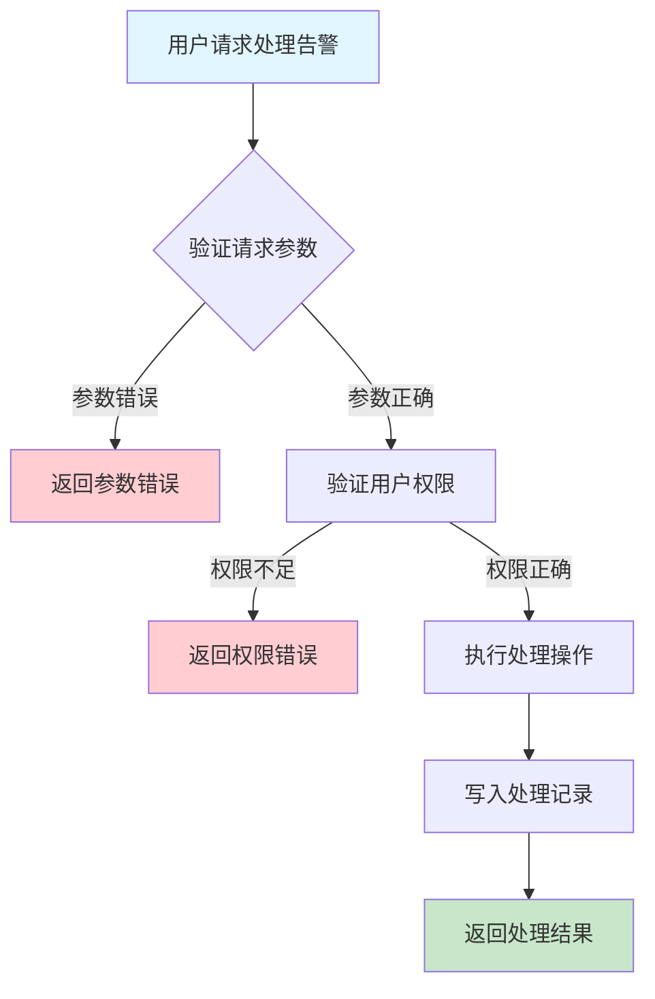
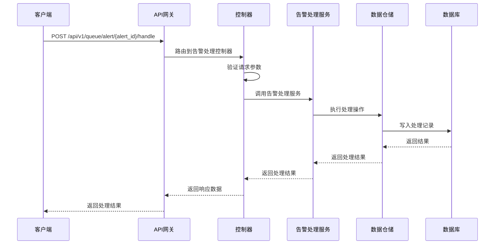

# 队列告警处理需求文档

## 1. 功能描述

### 1.1 功能概述
队列告警处理功能用于对队列产生的告警进行确认、处理、关闭等操作，支持处理记录、权限控制和操作审计。

### 1.2 主要功能列表
- 确认告警
- 处理告警（如分配、备注、关闭）
- 记录处理历史
- 支持批量处理

### 1.3 支持的功能特性
- 多种处理操作支持
- 处理过程可追溯
- 批量处理能力

## 2. 功能目标

### 2.1 业务目标
- 提高异常响应和处理效率
- 降低运维风险
- 满足合规与审计需求

### 2.2 技术目标
- 高并发处理能力
- 处理操作一致性保障
- 操作可追溯

### 2.3 安全目标
- 处理权限控制
- 防止误操作
- 操作可审计

## 3. 输入输出说明

### 3.1 输入参数

#### 3.1.1 必需参数
- `alert_id` (string): 告警ID
- `action` (string): 处理动作（acknowledge/assign/close等）

#### 3.1.2 可选参数
- `operator` (string): 操作人
- `comment` (string): 备注
- `assignee` (string): 分配对象（如action为assign时）

### 3.2 输出参数

#### 3.2.1 成功响应
```json
{
  "code": 200,
  "message": "success",
  "data": {
    "alert_id": "alert_001",
    "action": "acknowledge",
    "handled_at": "2024-01-16T18:40:00Z"
  }
}
```

#### 3.2.2 错误响应
```json
{
  "code": 400,
  "message": "参数错误或操作失败",
  "data": null
}
```

### 3.3 参数格式和约束
- 告警ID：1-64字符，字母、数字、下划线
- action：acknowledge、assign、close等

## 4. 涉及接口以及接口设计

### 4.1 API接口定义

#### 4.1.1 处理队列告警
```go
// 处理队列告警
POST /api/v1/queue/alert/{alert_id}/handle
```

**请求参数：**
- Path参数：alert_id
- Body参数：action, operator, comment, assignee

**响应结构：**
```go
type QueueAlertHandleResponse struct {
    Code    int    `json:"code"`
    Message string `json:"message"`
    Data    struct {
        AlertID   string `json:"alert_id"`
        Action    string `json:"action"`
        HandledAt string `json:"handled_at"`
    } `json:"data"`
}
```

### 4.2 内部接口设计

#### 4.2.1 告警处理服务接口
```go
type QueueAlertHandleService interface {
    HandleAlert(ctx context.Context, req *QueueAlertHandleRequest) (*QueueAlertHandleResult, error)
}
```

#### 4.2.2 告警处理仓储接口
```go
type QueueAlertHandleRepository interface {
    Handle(ctx context.Context, req *QueueAlertHandleRequest) (*QueueAlertHandleResult, error)
}
```

## 5. 数据结构设计

### 5.1 数据库表结构
- 复用 queue_alert、alert_handle_record 表

### 5.2 模型结构定义
```go
type QueueAlertHandleRequest struct {
    AlertID  string `json:"alert_id"`
    Action   string `json:"action"`
    Operator string `json:"operator"`
    Comment  string `json:"comment"`
    Assignee string `json:"assignee"`
}

type QueueAlertHandleResult struct {
    AlertID   string `json:"alert_id"`
    Action    string `json:"action"`
    HandledAt string `json:"handled_at"`
}
```

### 5.3 数据关系说明
- 处理记录与告警通过alert_id关联

## 6. 异常处理

### 6.1 输入验证异常
- 告警ID为空或格式错误
- action非法

### 6.2 业务逻辑异常
- 告警不存在
- 权限不足
- 操作失败

### 6.3 系统异常
- 数据库连接失败
- 处理超时
- 系统资源不足

## 7. 交互流程图



## 8. 交互时序图



## 9. 安全与权限

### 9.1 访问控制策略
- 需要用户身份验证
- 验证用户对告警处理的权限
- 支持基于角色的访问控制(RBAC)
- 记录所有处理操作

### 9.2 数据安全要求
- 防止误操作
- 处理操作需二次确认（如高危操作）
- 支持数据访问审计
- 防止SQL注入

### 9.3 身份验证机制
- JWT令牌
- API密钥
- 请求频率限制
- IP白名单

## 10. 日志与审计要求

### 10.1 操作日志要求
- 记录所有处理操作
- 记录参数和结果
- 记录操作人员身份
- 记录操作时间和IP

### 10.2 审计日志要求
- 记录处理轨迹
- 记录身份和权限
- 记录操作目的
- 支持长期保存

### 10.3 日志格式规范
```json
{
  "timestamp": "2024-01-16T18:40:00Z",
  "level": "INFO",
  "service": "queue-alert-handle",
  "operation": "handle_alert",
  "user_id": "user_001",
  "alert_id": "alert_001",
  "parameters": {
    "action": "acknowledge"
  },
  "result": {
    "handled": true
  }
}
```

## 11. 测试用例

### 11.1 功能测试用例

#### 11.1.1 确认告警测试
**测试场景：** 确认告警
**输入数据：**
```json
{
  "alert_id": "alert_001",
  "action": "acknowledge"
}
```
**预期结果：**
- 返回状态码：200
- 返回处理结果

#### 11.1.2 分配告警测试
**测试场景：** 分配告警
**输入数据：**
```json
{
  "alert_id": "alert_002",
  "action": "assign",
  "assignee": "user_002"
}
```
**预期结果：**
- 返回状态码：200
- 返回处理结果

### 11.2 性能测试用例

#### 11.2.1 大量告警处理测试
**测试场景：** 并发处理1000个告警
**预期结果：**
- 响应时间 < 2秒
- 错误率 < 1%

### 11.3 安全测试用例

#### 11.3.1 权限验证测试
**测试场景：** 验证用户处理权限
**测试数据：**
- 用户A：有权限
- 用户B：无权限
**预期结果：**
- 用户A：成功处理
- 用户B：返回权限错误

#### 11.3.2 误操作防护测试
**测试场景：** 高危操作需二次确认
**输入数据：**
```json
{
  "alert_id": "alert_003",
  "action": "close"
}
```
**预期结果：**
- 需二次确认
- 未确认时不执行

### 11.4 异常测试用例

#### 11.4.1 参数错误测试
**测试场景：** 参数错误
**输入数据：**
```json
{
  "alert_id": "",
  "action": "invalid"
}
```
**预期结果：**
- 返回参数验证错误
- 状态码400

#### 11.4.2 告警不存在测试
**测试场景：** 处理不存在的告警
**输入数据：**
```json
{
  "alert_id": "non_existent_alert",
  "action": "acknowledge"
}
```
**预期结果：**
- 返回404
- 错误信息友好

#### 11.4.3 系统异常测试
**测试场景：** 数据库连接失败
**测试方法：** 临时关闭数据库
**预期结果：**
- 返回500
- 记录详细错误日志 