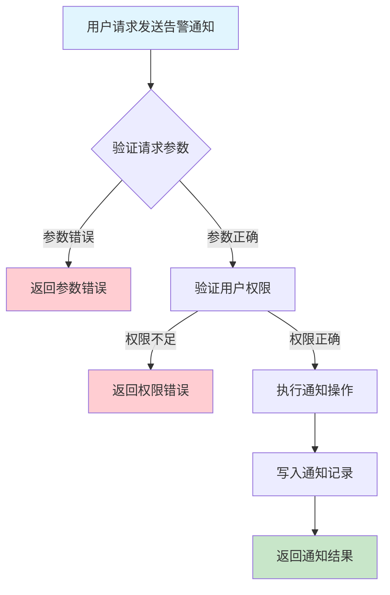
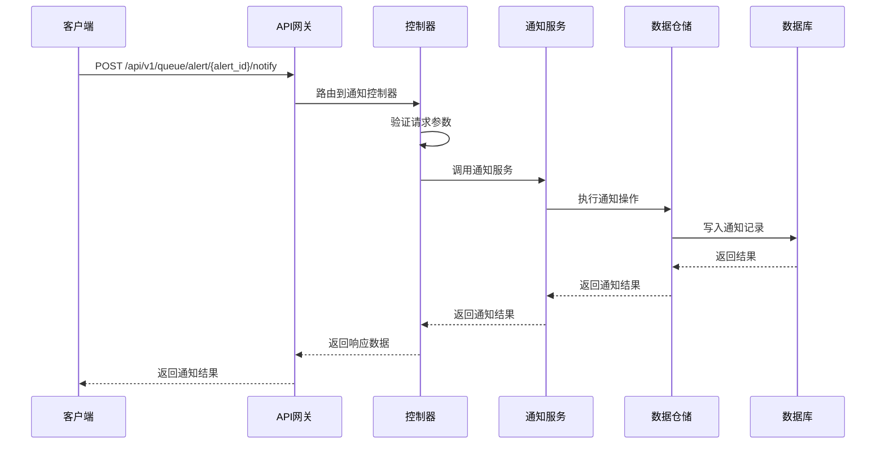

# 队列告警通知需求文档

## 1. 功能描述

### 1.1 功能概述
队列告警通知功能用于将队列异常、故障等告警信息通过多种方式（如邮件、短信、Webhook等）通知相关人员或系统，支持通知策略配置、通知记录查询与统计。

### 1.2 主要功能列表
- 告警自动通知
- 支持多种通知方式
- 通知策略配置
- 通知记录查询与统计

### 1.3 支持的功能特性
- 多方式通知支持
- 通知策略灵活配置
- 通知记录可追溯

## 2. 功能目标

### 2.1 业务目标
- 提高异常响应速度
- 降低运维风险
- 满足合规与审计需求

### 2.2 技术目标
- 高效通知分发能力
- 通知策略可扩展
- 通知数据一致性保障

### 2.3 安全目标
- 通知权限控制
- 敏感信息保护
- 通知操作可审计

## 3. 输入输出说明

### 3.1 输入参数

#### 3.1.1 必需参数
- `alert_id` (string): 告警ID
- `method` (string): 通知方式（email/sms/webhook等）
- `notified_to` (string): 通知对象

#### 3.1.2 可选参数
- `operator` (string): 操作人
- `comment` (string): 备注

### 3.2 输出参数

#### 3.2.1 成功响应
```json
{
  "code": 200,
  "message": "success",
  "data": {
    "alert_id": "alert_001",
    "method": "email",
    "notified_to": "user_001",
    "notified_at": "2024-01-16T19:10:00Z"
  }
}
```

#### 3.2.2 错误响应
```json
{
  "code": 400,
  "message": "参数错误或通知失败",
  "data": null
}
```

### 3.3 参数格式和约束
- 告警ID：1-64字符，字母、数字、下划线
- method：email、sms、webhook等
- notified_to：字符串

## 4. 涉及接口以及接口设计

### 4.1 API接口定义

#### 4.1.1 发送告警通知
```go
// 发送告警通知
POST /api/v1/queue/alert/{alert_id}/notify
```

**请求参数：**
- Path参数：alert_id
- Body参数：method, notified_to, operator, comment

**响应结构：**
```go
type QueueAlertNotifyResponse struct {
    Code    int    `json:"code"`
    Message string `json:"message"`
    Data    struct {
        AlertID    string `json:"alert_id"`
        Method     string `json:"method"`
        NotifiedTo string `json:"notified_to"`
        NotifiedAt string `json:"notified_at"`
    } `json:"data"`
}
```

### 4.2 内部接口设计

#### 4.2.1 通知服务接口
```go
type QueueAlertNotifyService interface {
    Notify(ctx context.Context, req *QueueAlertNotifyRequest) (*QueueAlertNotifyResult, error)
}
```

#### 4.2.2 通知仓储接口
```go
type QueueAlertNotifyRepository interface {
    Notify(ctx context.Context, req *QueueAlertNotifyRequest) (*QueueAlertNotifyResult, error)
}
```

## 5. 数据结构设计

### 5.1 数据库表结构
- 复用 alert_notify_record 表

### 5.2 模型结构定义
```go
type QueueAlertNotifyRequest struct {
    AlertID    string `json:"alert_id"`
    Method     string `json:"method"`
    NotifiedTo string `json:"notified_to"`
    Operator   string `json:"operator"`
    Comment    string `json:"comment"`
}

type QueueAlertNotifyResult struct {
    AlertID    string `json:"alert_id"`
    Method     string `json:"method"`
    NotifiedTo string `json:"notified_to"`
    NotifiedAt string `json:"notified_at"`
}
```

### 5.3 数据关系说明
- 通知记录与告警通过alert_id关联

## 6. 异常处理

### 6.1 输入验证异常
- 告警ID为空或格式错误
- method非法
- notified_to为空

### 6.2 业务逻辑异常
- 告警不存在
- 权限不足
- 通知失败

### 6.3 系统异常
- 通知服务不可用
- 数据库连接失败
- 系统资源不足

## 7. 交互流程图



## 8. 交互时序图



## 9. 安全与权限

### 9.1 访问控制策略
- 需要用户身份验证
- 验证用户对通知操作的权限
- 支持基于角色的访问控制(RBAC)
- 记录所有通知操作

### 9.2 数据安全要求
- 防止误通知
- 通知操作需二次确认（如高危通知）
- 支持数据访问审计
- 防止SQL注入

### 9.3 身份验证机制
- JWT令牌
- API密钥
- 请求频率限制
- IP白名单

## 10. 日志与审计要求

### 10.1 操作日志要求
- 记录所有通知操作
- 记录参数和结果
- 记录操作人员身份
- 记录操作时间和IP

### 10.2 审计日志要求
- 记录通知轨迹
- 记录身份和权限
- 记录操作目的
- 支持长期保存

### 10.3 日志格式规范
```json
{
  "timestamp": "2024-01-16T19:10:00Z",
  "level": "INFO",
  "service": "queue-alert-notify",
  "operation": "notify_alert",
  "user_id": "user_001",
  "alert_id": "alert_001",
  "parameters": {
    "method": "email",
    "notified_to": "user_001"
  },
  "result": {
    "notified": true
  }
}
```

## 11. 测试用例

### 11.1 功能测试用例

#### 11.1.1 邮件通知测试
**测试场景：** 邮件通知
**输入数据：**
```json
{
  "alert_id": "alert_001",
  "method": "email",
  "notified_to": "user_001"
}
```
**预期结果：**
- 返回状态码：200
- 返回通知结果

#### 11.1.2 Webhook通知测试
**测试场景：** Webhook通知
**输入数据：**
```json
{
  "alert_id": "alert_002",
  "method": "webhook",
  "notified_to": "http://example.com/webhook"
}
```
**预期结果：**
- 返回状态码：200
- 返回通知结果

### 11.2 性能测试用例

#### 11.2.1 大量通知测试
**测试场景：** 并发通知1000个对象
**预期结果：**
- 响应时间 < 2秒
- 错误率 < 1%

### 11.3 安全测试用例

#### 11.3.1 权限验证测试
**测试场景：** 验证用户通知权限
**测试数据：**
- 用户A：有权限
- 用户B：无权限
**预期结果：**
- 用户A：成功通知
- 用户B：返回权限错误

#### 11.3.2 误通知防护测试
**测试场景：** 高危通知需二次确认
**输入数据：**
```json
{
  "alert_id": "alert_003",
  "method": "sms",
  "notified_to": "user_003"
}
```
**预期结果：**
- 需二次确认
- 未确认时不执行

### 11.4 异常测试用例

#### 11.4.1 参数错误测试
**测试场景：** 参数错误
**输入数据：**
```json
{
  "alert_id": "",
  "method": "invalid"
}
```
**预期结果：**
- 返回参数验证错误
- 状态码400

#### 11.4.2 告警不存在测试
**测试场景：** 通知不存在的告警
**输入数据：**
```json
{
  "alert_id": "non_existent_alert",
  "method": "email",
  "notified_to": "user_001"
}
```
**预期结果：**
- 返回404
- 错误信息友好

#### 11.4.3 系统异常测试
**测试场景：** 通知服务不可用
**测试方法：** 临时关闭通知服务
**预期结果：**
- 返回500
- 记录详细错误日志 