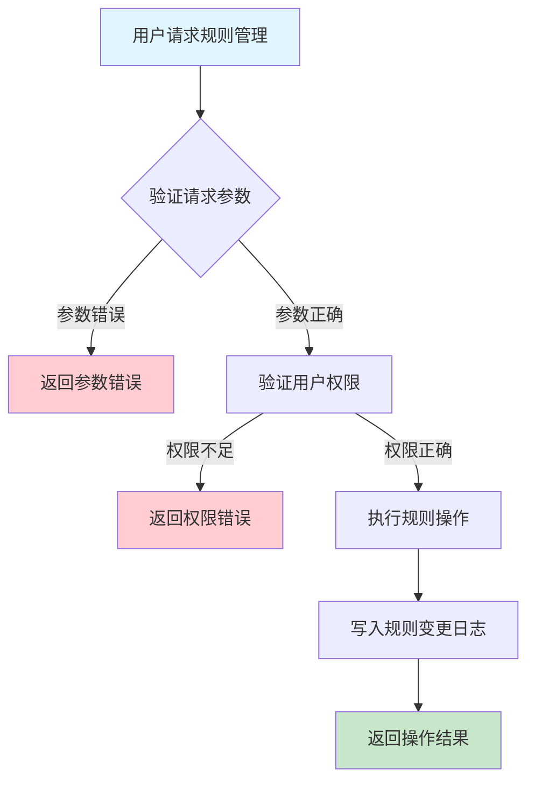
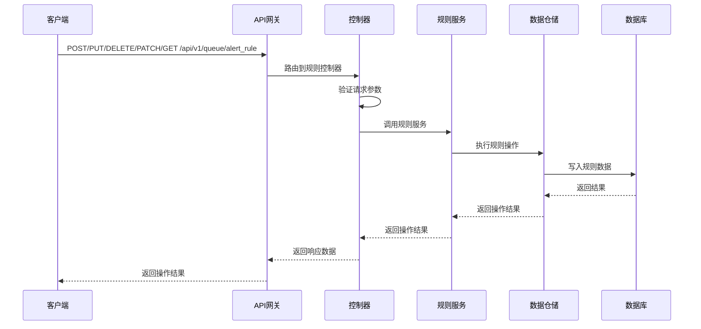

# 队列告警规则需求文档

## 1. 功能描述

### 1.1 功能概述
队列告警规则功能用于配置和管理队列的自动告警触发条件，包括阈值、状态、事件等，支持规则的创建、修改、删除、启用、禁用和查询。

### 1.2 主要功能列表
- 创建告警规则
- 修改告警规则
- 删除告警规则
- 启用/禁用规则
- 查询规则列表

### 1.3 支持的功能特性
- 多类型规则支持
- 规则启用/禁用灵活切换
- 规则变更可追溯

## 2. 功能目标

### 2.1 业务目标
- 支持灵活的队列监控策略
- 降低误报和漏报风险
- 满足合规与运维需求

### 2.2 技术目标
- 高效规则管理能力
- 规则变更一致性保障
- 支持大规模队列规则配置

### 2.3 安全目标
- 规则管理权限控制
- 规则操作可审计
- 防止误操作

## 3. 输入输出说明

### 3.1 输入参数

#### 3.1.1 必需参数
- `queue_id` (string): 队列ID
- `rule_type` (string): 规则类型（threshold/status/event等）
- `condition` (object): 规则条件

#### 3.1.2 可选参数
- `enabled` (boolean): 是否启用
- `description` (string): 规则描述
- `operator` (string): 操作人

### 3.2 输出参数

#### 3.2.1 成功响应
```json
{
  "code": 200,
  "message": "success",
  "data": {
    "rule_id": "rule_001",
    "queue_id": "queue_001",
    "rule_type": "threshold",
    "condition": {"max_pending": 100},
    "enabled": true,
    "description": "任务积压超100告警",
    "created_at": "2024-01-16T18:50:00Z"
  }
}
```

#### 3.2.2 错误响应
```json
{
  "code": 400,
  "message": "参数错误或操作失败",
  "data": null
}
```

### 3.3 参数格式和约束
- 队列ID：1-64字符，字母、数字、下划线
- 规则类型：threshold、status、event等
- condition：JSON对象

## 4. 涉及接口以及接口设计

### 4.1 API接口定义

#### 4.1.1 创建告警规则
```go
// 创建告警规则
POST /api/v1/queue/{queue_id}/alert_rule
```

#### 4.1.2 修改告警规则
```go
// 修改告警规则
PUT /api/v1/queue/alert_rule/{rule_id}
```

#### 4.1.3 删除告警规则
```go
// 删除告警规则
DELETE /api/v1/queue/alert_rule/{rule_id}
```

#### 4.1.4 启用/禁用规则
```go
// 启用/禁用规则
PATCH /api/v1/queue/alert_rule/{rule_id}/enable
```

#### 4.1.5 查询规则列表
```go
// 查询规则列表
GET /api/v1/queue/{queue_id}/alert_rules
```

**请求参数：**
- Path参数：queue_id, rule_id
- Body参数/Query参数：rule_type, condition, enabled, description, operator

**响应结构：**
```go
type QueueAlertRuleResponse struct {
    Code    int    `json:"code"`
    Message string `json:"message"`
    Data    QueueAlertRule `json:"data"`
}

type QueueAlertRule struct {
    RuleID      string                 `json:"rule_id"`
    QueueID     string                 `json:"queue_id"`
    RuleType    string                 `json:"rule_type"`
    Condition   map[string]interface{} `json:"condition"`
    Enabled     bool                   `json:"enabled"`
    Description string                 `json:"description"`
    CreatedAt   string                 `json:"created_at"`
}
```

### 4.2 内部接口设计

#### 4.2.1 规则服务接口
```go
type QueueAlertRuleService interface {
    CreateRule(ctx context.Context, req *QueueAlertRuleRequest) (*QueueAlertRule, error)
    UpdateRule(ctx context.Context, ruleID string, req *QueueAlertRuleRequest) (*QueueAlertRule, error)
    DeleteRule(ctx context.Context, ruleID string) error
    EnableRule(ctx context.Context, ruleID string, enabled bool) error
    ListRules(ctx context.Context, queueID string) ([]QueueAlertRule, error)
}
```

#### 4.2.2 规则仓储接口
```go
type QueueAlertRuleRepository interface {
    Create(ctx context.Context, rule *QueueAlertRule) error
    Update(ctx context.Context, ruleID string, rule *QueueAlertRule) error
    Delete(ctx context.Context, ruleID string) error
    Enable(ctx context.Context, ruleID string, enabled bool) error
    List(ctx context.Context, queueID string) ([]QueueAlertRule, error)
}
```

## 5. 数据结构设计

### 5.1 数据库表结构
- 新增 queue_alert_rule 表

#### 5.1.1 队列告警规则表 (queue_alert_rule)
```sql
CREATE TABLE queue_alert_rule (
    rule_id BIGINT AUTO_INCREMENT PRIMARY KEY COMMENT '规则ID',
    queue_id VARCHAR(64) NOT NULL COMMENT '队列ID',
    rule_type VARCHAR(32) NOT NULL COMMENT '规则类型',
    condition JSON NOT NULL COMMENT '规则条件',
    enabled TINYINT(1) DEFAULT 1 COMMENT '是否启用',
    description VARCHAR(255) COMMENT '规则描述',
    created_at TIMESTAMP DEFAULT CURRENT_TIMESTAMP COMMENT '创建时间',
    INDEX idx_queue_id (queue_id),
    INDEX idx_rule_type (rule_type)
) ENGINE=InnoDB DEFAULT CHARSET=utf8mb4 COMMENT='队列告警规则表';
```

### 5.2 模型结构定义
```go
type QueueAlertRuleRequest struct {
    QueueID     string                 `json:"queue_id"`
    RuleType    string                 `json:"rule_type"`
    Condition   map[string]interface{} `json:"condition"`
    Enabled     bool                   `json:"enabled"`
    Description string                 `json:"description"`
    Operator    string                 `json:"operator"`
}

type QueueAlertRule struct {
    RuleID      string                 `json:"rule_id" db:"rule_id"`
    QueueID     string                 `json:"queue_id" db:"queue_id"`
    RuleType    string                 `json:"rule_type" db:"rule_type"`
    Condition   map[string]interface{} `json:"condition" db:"condition"`
    Enabled     bool                   `json:"enabled" db:"enabled"`
    Description string                 `json:"description" db:"description"`
    CreatedAt   string                 `json:"created_at" db:"created_at"`
}
```

### 5.3 数据关系说明
- 规则与队列通过queue_id关联

## 6. 异常处理

### 6.1 输入验证异常
- 队列ID为空或格式错误
- 规则类型非法
- condition非法

### 6.2 业务逻辑异常
- 队列不存在
- 权限不足
- 操作失败

### 6.3 系统异常
- 数据库连接失败
- 操作超时
- 系统资源不足

## 7. 交互流程图



## 8. 交互时序图



## 9. 安全与权限

### 9.1 访问控制策略
- 需要用户身份验证
- 验证用户对规则管理的权限
- 支持基于角色的访问控制(RBAC)
- 记录所有规则操作

### 9.2 数据安全要求
- 防止误操作
- 规则变更需二次确认（如高危规则）
- 支持数据访问审计
- 防止SQL注入

### 9.3 身份验证机制
- JWT令牌
- API密钥
- 请求频率限制
- IP白名单

## 10. 日志与审计要求

### 10.1 操作日志要求
- 记录所有规则操作
- 记录参数和结果
- 记录操作人员身份
- 记录操作时间和IP

### 10.2 审计日志要求
- 记录规则变更轨迹
- 记录身份和权限
- 记录操作目的
- 支持长期保存

### 10.3 日志格式规范
```json
{
  "timestamp": "2024-01-16T18:50:00Z",
  "level": "INFO",
  "service": "queue-alert-rule",
  "operation": "create_rule",
  "user_id": "user_001",
  "queue_id": "queue_001",
  "parameters": {
    "rule_type": "threshold"
  },
  "result": {
    "rule_id": "rule_001"
  }
}
```

## 11. 测试用例

### 11.1 功能测试用例

#### 11.1.1 创建规则测试
**测试场景：** 创建告警规则
**输入数据：**
```json
{
  "queue_id": "queue_001",
  "rule_type": "threshold",
  "condition": {"max_pending": 100}
}
```
**预期结果：**
- 返回状态码：200
- 返回新规则ID

#### 11.1.2 启用/禁用规则测试
**测试场景：** 启用规则
**输入数据：**
```json
{
  "rule_id": "rule_001",
  "enabled": true
}
```
**预期结果：**
- 返回状态码：200
- 规则状态变更

### 11.2 性能测试用例

#### 11.2.1 大量规则管理测试
**测试场景：** 并发管理1000条规则
**预期结果：**
- 响应时间 < 2秒
- 错误率 < 1%

### 11.3 安全测试用例

#### 11.3.1 权限验证测试
**测试场景：** 验证用户规则管理权限
**测试数据：**
- 用户A：有权限
- 用户B：无权限
**预期结果：**
- 用户A：成功操作
- 用户B：返回权限错误

#### 11.3.2 误操作防护测试
**测试场景：** 高危规则变更需二次确认
**输入数据：**
```json
{
  "queue_id": "queue_001",
  "rule_type": "threshold",
  "condition": {"max_pending": 1000}
}
```
**预期结果：**
- 需二次确认
- 未确认时不执行

### 11.4 异常测试用例

#### 11.4.1 参数错误测试
**测试场景：** 参数错误
**输入数据：**
```json
{
  "queue_id": "",
  "rule_type": "invalid"
}
```
**预期结果：**
- 返回参数验证错误
- 状态码400

#### 11.4.2 队列不存在测试
**测试场景：** 创建规则时队列不存在
**输入数据：**
```json
{
  "queue_id": "non_existent_queue",
  "rule_type": "threshold",
  "condition": {"max_pending": 100}
}
```
**预期结果：**
- 返回404
- 错误信息友好

#### 11.4.3 系统异常测试
**测试场景：** 数据库连接失败
**测试方法：** 临时关闭数据库
**预期结果：**
- 返回500
- 记录详细错误日志 