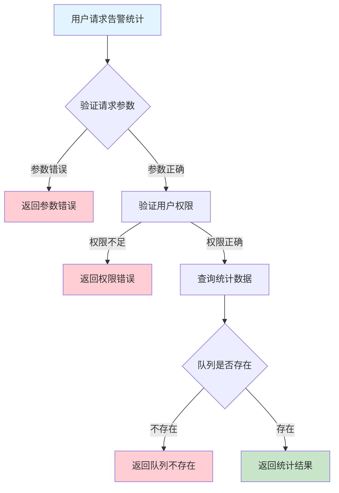
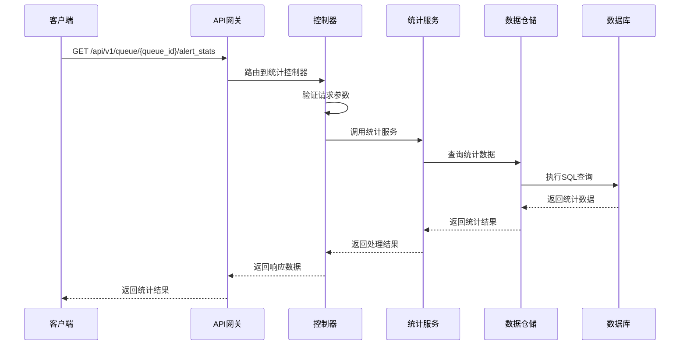

# 队列告警统计需求文档

## 1. 功能描述

### 1.1 功能概述
队列告警统计功能用于对队列告警进行多维度统计分析，包括告警总数、各类型分布、处理率、平均响应时长等，支持按时间、队列、类型等维度聚合。

### 1.2 主要功能列表
- 统计队列告警总数、各类型数量
- 统计处理率、平均响应时长
- 支持多维度聚合与筛选
- 支持统计结果导出

### 1.3 支持的功能特性
- 多维度灵活统计
- 实时与历史统计
- 统计结果可导出

## 2. 功能目标

### 2.1 业务目标
- 提升队列运维与管理效率
- 支持异常分析与优化
- 提供决策支持数据

### 2.2 技术目标
- 高效大数据量统计
- 支持复杂聚合与筛选
- 统计数据一致性保障

### 2.3 安全目标
- 统计数据访问权限控制
- 敏感数据保护
- 操作可审计

## 3. 输入输出说明

### 3.1 输入参数

#### 3.1.1 必需参数
- `queue_id` (string): 队列ID

#### 3.1.2 可选参数
- `start_time` (string): 统计起始时间
- `end_time` (string): 统计结束时间
- `group_by` (string): 聚合维度（type/status等）

### 3.2 输出参数

#### 3.2.1 成功响应
```json
{
  "code": 200,
  "message": "success",
  "data": {
    "total_alerts": 10,
    "type_distribution": {
      "error": 5,
      "threshold": 3,
      "status": 2
    },
    "handled_rate": 0.8,
    "avg_response_time": 15.2
  }
}
```

#### 3.2.2 错误响应
```json
{
  "code": 400,
  "message": "参数错误或无权限",
  "data": null
}
```

### 3.3 参数格式和约束
- 队列ID：1-64字符，字母、数字、下划线
- 时间：ISO 8601格式
- group_by：type、status等

## 4. 涉及接口以及接口设计

### 4.1 API接口定义

#### 4.1.1 查询队列告警统计
```go
// 查询队列告警统计
GET /api/v1/queue/{queue_id}/alert_stats
```

**请求参数：**
- Path参数：queue_id
- Query参数：start_time, end_time, group_by

**响应结构：**
```go
type QueueAlertStatsResponse struct {
    Code    int    `json:"code"`
    Message string `json:"message"`
    Data    QueueAlertStats `json:"data"`
}

type QueueAlertStats struct {
    TotalAlerts      int             `json:"total_alerts"`
    TypeDistribution map[string]int `json:"type_distribution"`
    HandledRate      float64         `json:"handled_rate"`
    AvgResponseTime  float64         `json:"avg_response_time"`
}
```

### 4.2 内部接口设计

#### 4.2.1 统计服务接口
```go
type QueueAlertStatsService interface {
    GetAlertStats(ctx context.Context, queueID string, filter QueueAlertStatsFilter) (*QueueAlertStats, error)
}
```

#### 4.2.2 统计仓储接口
```go
type QueueAlertStatsRepository interface {
    Query(ctx context.Context, queueID string, filter QueueAlertStatsFilter) (*QueueAlertStats, error)
}
```

## 5. 数据结构设计

### 5.1 数据库表结构
- 复用 queue_alert 表
- 可用统计中间表优化

### 5.2 模型结构定义
```go
type QueueAlertStatsFilter struct {
    StartTime string
    EndTime   string
    GroupBy   string
}

type QueueAlertStats struct {
    TotalAlerts      int             `json:"total_alerts"`
    TypeDistribution map[string]int `json:"type_distribution"`
    HandledRate      float64         `json:"handled_rate"`
    AvgResponseTime  float64         `json:"avg_response_time"`
}
```

### 5.3 数据关系说明
- 统计数据与队列、告警通过queue_id关联

## 6. 异常处理

### 6.1 输入验证异常
- 队列ID为空或格式错误
- 时间参数非法

### 6.2 业务逻辑异常
- 队列不存在
- 权限不足

### 6.3 系统异常
- 数据库连接失败
- 统计超时
- 系统资源不足

## 7. 交互流程图



## 8. 交互时序图



## 9. 安全与权限

### 9.1 访问控制策略
- 需要用户身份验证
- 验证用户对统计数据的访问权限
- 支持基于角色的访问控制(RBAC)
- 记录所有统计查询操作

### 9.2 数据安全要求
- 敏感数据脱敏
- 统计数据加密存储
- 支持数据访问审计
- 防止SQL注入

### 9.3 身份验证机制
- JWT令牌
- API密钥
- 请求频率限制
- IP白名单

## 10. 日志与审计要求

### 10.1 操作日志要求
- 记录所有统计查询操作
- 记录参数和结果
- 记录操作人员身份
- 记录操作时间和IP

### 10.2 审计日志要求
- 记录统计访问轨迹
- 记录身份和权限
- 记录访问目的
- 支持长期保存

### 10.3 日志格式规范
```json
{
  "timestamp": "2024-01-16T19:00:00Z",
  "level": "INFO",
  "service": "queue-alert-stats",
  "operation": "get_alert_stats",
  "user_id": "user_001",
  "queue_id": "queue_001",
  "parameters": {
    "group_by": "type"
  },
  "result": {
    "total_alerts": 10
  }
}
```

## 11. 测试用例

### 11.1 功能测试用例

#### 11.1.1 正常统计查询测试
**测试场景：** 查询队列告警统计
**输入数据：**
```json
{
  "queue_id": "queue_001"
}
```
**预期结果：**
- 返回状态码：200
- 返回统计数据

#### 11.1.2 按类型聚合测试
**测试场景：** 按类型聚合
**输入数据：**
```json
{
  "queue_id": "queue_001",
  "group_by": "type"
}
```
**预期结果：**
- 返回状态码：200
- 返回各类型分布

### 11.2 性能测试用例

#### 11.2.1 大量数据统计测试
**测试场景：** 并发统计1000个队列
**预期结果：**
- 响应时间 < 2秒
- 错误率 < 1%

### 11.3 安全测试用例

#### 11.3.1 权限验证测试
**测试场景：** 验证用户统计访问权限
**测试数据：**
- 用户A：有权限
- 用户B：无权限
**预期结果：**
- 用户A：成功查询
- 用户B：返回权限错误

#### 11.3.2 敏感数据脱敏测试
**测试场景：** 敏感数据脱敏
**输入数据：**
```json
{
  "queue_id": "queue_with_sensitive"
}
```
**预期结果：**
- 敏感字段脱敏
- 不影响可用性

### 11.4 异常测试用例

#### 11.4.1 队列不存在测试
**测试场景：** 查询不存在的队列告警统计
**输入数据：**
```json
{
  "queue_id": "non_existent_queue"
}
```
**预期结果：**
- 返回404
- 错误信息友好

#### 11.4.2 参数错误测试
**测试场景：** 参数错误
**输入数据：**
```json
{
  "queue_id": "",
  "group_by": "invalid"
}
```
**预期结果：**
- 返回参数验证错误
- 状态码400

#### 11.4.3 系统异常测试
**测试场景：** 数据库连接失败
**测试方法：** 临时关闭数据库
**预期结果：**
- 返回500
- 记录详细错误日志 