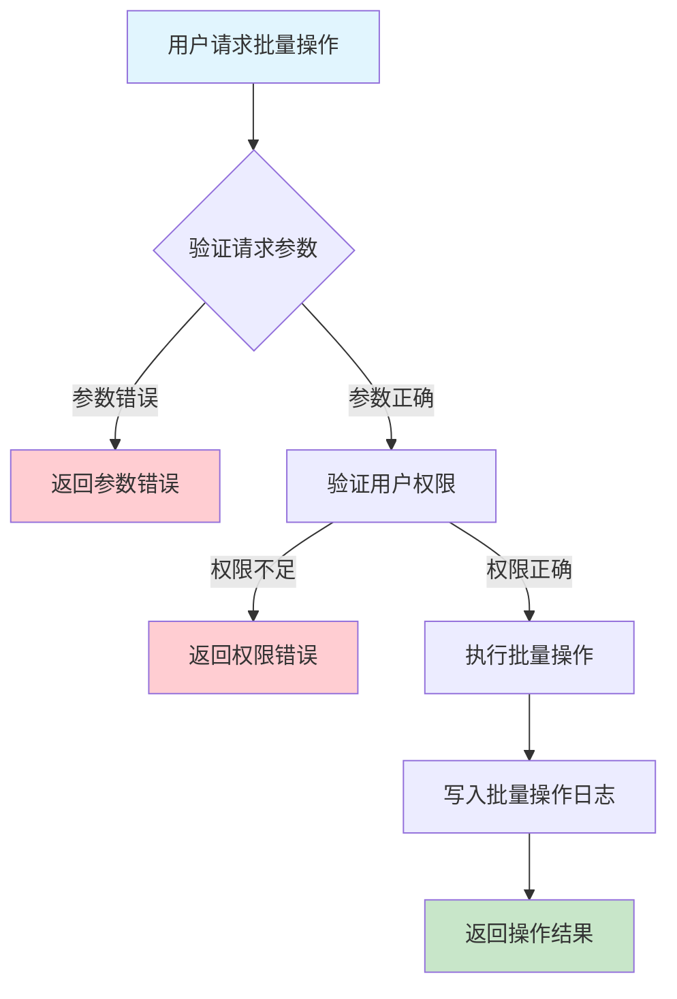
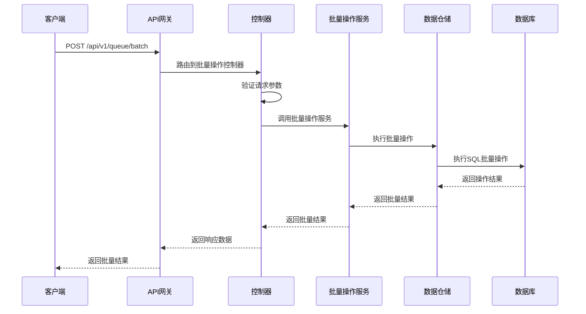

# 队列批量操作需求文档

## 1. 功能描述

### 1.1 功能概述
队列批量操作功能用于对多个队列或任务进行批量处理，包括批量创建、删除、分配、状态变更等，提升运维效率。

### 1.2 主要功能列表
- 批量创建队列/任务
- 批量删除队列/任务
- 批量分配任务
- 批量状态变更
- 批量操作结果反馈

### 1.3 支持的功能特性
- 支持多种批量操作类型
- 操作过程可追溯
- 支持批量操作日志

## 2. 功能目标

### 2.1 业务目标
- 提高队列和任务管理效率
- 降低重复性操作成本
- 支持大规模运维场景

### 2.2 技术目标
- 高并发批量处理能力
- 操作原子性保障
- 操作可追溯

### 2.3 安全目标
- 批量操作权限控制
- 防止误操作
- 操作可审计

## 3. 输入输出说明

### 3.1 输入参数

#### 3.1.1 必需参数
- `operation` (string): 批量操作类型（create/delete/assign/update_status等）
- `items` (array): 操作对象列表（队列ID或任务ID）

#### 3.1.2 可选参数
- `parameters` (object): 操作参数（如目标队列、状态等）
- `operator` (string): 操作人

### 3.2 输出参数

#### 3.2.1 成功响应
```json
{
  "code": 200,
  "message": "success",
  "data": {
    "operation": "delete",
    "items": ["queue_001", "queue_002"],
    "success_count": 2,
    "fail_count": 0,
    "results": [
      {"item": "queue_001", "success": true},
      {"item": "queue_002", "success": true}
    ]
  }
}
```

#### 3.2.2 错误响应
```json
{
  "code": 400,
  "message": "参数错误或操作失败",
  "data": null
}
```

### 3.3 参数格式和约束
- operation：create、delete、assign、update_status等
- items：字符串数组，1-64字符

## 4. 涉及接口以及接口设计

### 4.1 API接口定义

#### 4.1.1 批量操作接口
```go
// 批量操作
POST /api/v1/queue/batch
```

**请求参数：**
- Body参数：operation, items, parameters, operator

**响应结构：**
```go
type QueueBatchResponse struct {
    Code    int    `json:"code"`
    Message string `json:"message"`
    Data    struct {
        Operation    string         `json:"operation"`
        Items        []string       `json:"items"`
        SuccessCount int            `json:"success_count"`
        FailCount    int            `json:"fail_count"`
        Results      []BatchResult  `json:"results"`
    } `json:"data"`
}

type BatchResult struct {
    Item    string `json:"item"`
    Success bool   `json:"success"`
    Error   string `json:"error,omitempty"`
}
```

### 4.2 内部接口设计

#### 4.2.1 批量操作服务接口
```go
type QueueBatchService interface {
    BatchOperate(ctx context.Context, req *QueueBatchRequest) (*QueueBatchResult, error)
}
```

#### 4.2.2 批量操作仓储接口
```go
type QueueBatchRepository interface {
    Batch(ctx context.Context, req *QueueBatchRequest) (*QueueBatchResult, error)
}
```

## 5. 数据结构设计

### 5.1 数据库表结构
- 复用 queue、queue_task 表
- 可用批量操作日志表

#### 5.1.1 批量操作日志表 (batch_log)
```sql
CREATE TABLE batch_log (
    id BIGINT AUTO_INCREMENT PRIMARY KEY COMMENT '日志ID',
    operation VARCHAR(32) NOT NULL COMMENT '操作类型',
    item VARCHAR(64) NOT NULL COMMENT '操作对象',
    success TINYINT(1) NOT NULL COMMENT '是否成功',
    error TEXT COMMENT '错误信息',
    operator VARCHAR(64) NOT NULL COMMENT '操作人',
    timestamp TIMESTAMP DEFAULT CURRENT_TIMESTAMP COMMENT '操作时间',
    INDEX idx_operation (operation),
    INDEX idx_item (item)
) ENGINE=InnoDB DEFAULT CHARSET=utf8mb4 COMMENT='批量操作日志表';
```

### 5.2 模型结构定义
```go
type QueueBatchRequest struct {
    Operation  string                 `json:"operation"`
    Items      []string               `json:"items"`
    Parameters map[string]interface{} `json:"parameters"`
    Operator   string                 `json:"operator"`
}

type QueueBatchResult struct {
    Operation    string        `json:"operation"`
    Items        []string      `json:"items"`
    SuccessCount int           `json:"success_count"`
    FailCount    int           `json:"fail_count"`
    Results      []BatchResult `json:"results"`
}

type BatchResult struct {
    Item    string `json:"item"`
    Success bool   `json:"success"`
    Error   string `json:"error,omitempty"`
}
```

### 5.3 数据关系说明
- 批量操作与队列、任务通过item关联
- 批量日志与操作人、时间关联

## 6. 异常处理

### 6.1 输入验证异常
- operation非法
- items为空或格式错误

### 6.2 业务逻辑异常
- 操作对象不存在
- 权限不足
- 部分操作失败

### 6.3 系统异常
- 数据库连接失败
- 批量操作超时
- 系统资源不足

## 7. 交互流程图



## 8. 交互时序图



## 9. 安全与权限

### 9.1 访问控制策略
- 需要用户身份验证
- 验证用户对批量操作的权限
- 支持基于角色的访问控制(RBAC)
- 记录所有批量操作

### 9.2 数据安全要求
- 防止误操作
- 批量操作需二次确认（如高危操作）
- 支持数据访问审计
- 防止SQL注入

### 9.3 身份验证机制
- JWT令牌
- API密钥
- 请求频率限制
- IP白名单

## 10. 日志与审计要求

### 10.1 操作日志要求
- 记录所有批量操作
- 记录参数和结果
- 记录操作人员身份
- 记录操作时间和IP

### 10.2 审计日志要求
- 记录批量操作轨迹
- 记录身份和权限
- 记录操作目的
- 支持长期保存

### 10.3 日志格式规范
```json
{
  "timestamp": "2024-01-16T17:00:00Z",
  "level": "INFO",
  "service": "queue-batch",
  "operation": "batch_delete",
  "user_id": "user_001",
  "parameters": {
    "items": ["queue_001", "queue_002"]
  },
  "result": {
    "success_count": 2,
    "fail_count": 0
  }
}
```

## 11. 测试用例

### 11.1 功能测试用例

#### 11.1.1 批量删除测试
**测试场景：** 批量删除队列
**输入数据：**
```json
{
  "operation": "delete",
  "items": ["queue_001", "queue_002"]
}
```
**预期结果：**
- 返回状态码：200
- 返回批量删除结果

#### 11.1.2 批量分配测试
**测试场景：** 批量分配任务
**输入数据：**
```json
{
  "operation": "assign",
  "items": ["task_001", "task_002"],
  "parameters": {"queue_id": "queue_001"}
}
```
**预期结果：**
- 返回状态码：200
- 返回批量分配结果

### 11.2 性能测试用例

#### 11.2.1 大量批量操作测试
**测试场景：** 并发批量操作1000个对象
**预期结果：**
- 响应时间 < 2秒
- 错误率 < 1%

### 11.3 安全测试用例

#### 11.3.1 权限验证测试
**测试场景：** 验证用户批量操作权限
**测试数据：**
- 用户A：有权限
- 用户B：无权限
**预期结果：**
- 用户A：成功操作
- 用户B：返回权限错误

#### 11.3.2 误操作防护测试
**测试场景：** 高危批量操作需二次确认
**输入数据：**
```json
{
  "operation": "delete",
  "items": ["queue_003"],
  "parameters": {"force": true}
}
```
**预期结果：**
- 需二次确认
- 未确认时不执行

### 11.4 异常测试用例

#### 11.4.1 参数错误测试
**测试场景：** 参数错误
**输入数据：**
```json
{
  "operation": "",
  "items": []
}
```
**预期结果：**
- 返回参数验证错误
- 状态码400

#### 11.4.2 操作对象不存在测试
**测试场景：** 操作不存在的对象
**输入数据：**
```json
{
  "operation": "delete",
  "items": ["non_existent_queue"]
}
```
**预期结果：**
- 返回404
- 错误信息友好

#### 11.4.3 系统异常测试
**测试场景：** 数据库连接失败
**测试方法：** 临时关闭数据库
**预期结果：**
- 返回500
- 记录详细错误日志 