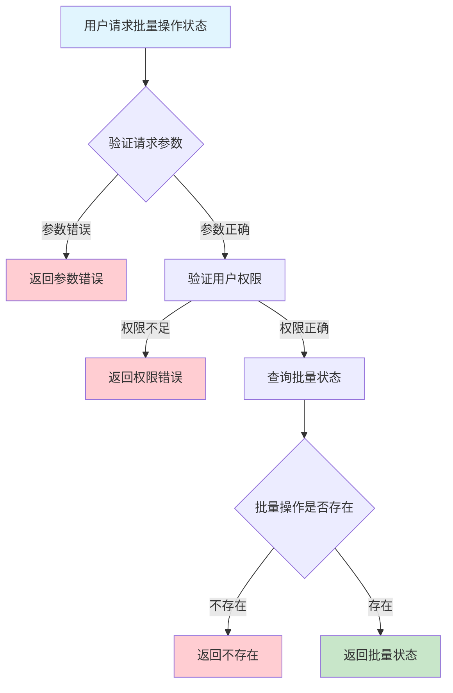
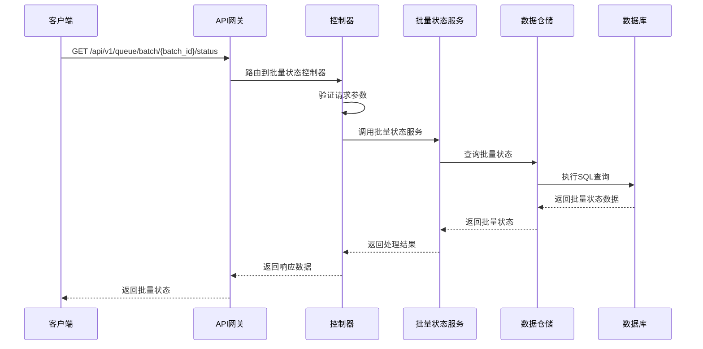

# 队列批量操作状态需求文档

## 1. 功能描述

### 1.1 功能概述
队列批量操作状态功能用于查询批量操作的执行进度和结果，支持按批次ID、操作类型、时间等条件筛选，便于批量任务跟踪和异常处理。

### 1.2 主要功能列表
- 查询批量操作状态
- 展示批量操作进度、成功/失败明细
- 支持多条件筛选
- 支持状态导出

### 1.3 支持的功能特性
- 实时进度查询
- 多条件筛选
- 状态导出

## 2. 功能目标

### 2.1 业务目标
- 提高批量运维可观测性
- 降低批量操作风险
- 支持批量异常快速定位

### 2.2 技术目标
- 实时高效状态采集
- 状态数据一致性保障
- 支持大规模批量任务监控

### 2.3 安全目标
- 状态数据访问权限控制
- 状态变更操作可审计
- 防止敏感状态泄露

## 3. 输入输出说明

### 3.1 输入参数

#### 3.1.1 必需参数
- `batch_id` (string): 批量操作ID

#### 3.1.2 可选参数
- `operation` (string): 操作类型
- `status` (string): 状态筛选
- `page` (int): 页码
- `page_size` (int): 每页数量

### 3.2 输出参数

#### 3.2.1 成功响应
```json
{
  "code": 200,
  "message": "success",
  "data": {
    "batch_id": "batch_001",
    "operation": "delete",
    "total": 2,
    "success_count": 2,
    "fail_count": 0,
    "results": [
      {"item": "queue_001", "success": true},
      {"item": "queue_002", "success": true}
    ],
    "progress": 100,
    "created_at": "2024-01-16T17:10:00Z"
  }
}
```

#### 3.2.2 错误响应
```json
{
  "code": 404,
  "message": "批量操作不存在",
  "data": null
}
```

### 3.3 参数格式和约束
- batch_id：1-64字符，字母、数字、下划线
- 分页：page>=1, page_size<=100

## 4. 涉及接口以及接口设计

### 4.1 API接口定义

#### 4.1.1 查询批量操作状态
```go
// 查询批量操作状态
GET /api/v1/queue/batch/{batch_id}/status
```

**请求参数：**
- Path参数：batch_id
- Query参数：operation, status, page, page_size

**响应结构：**
```go
type QueueBatchStatusResponse struct {
    Code    int    `json:"code"`
    Message string `json:"message"`
    Data    struct {
        BatchID      string        `json:"batch_id"`
        Operation    string        `json:"operation"`
        Total        int           `json:"total"`
        SuccessCount int           `json:"success_count"`
        FailCount    int           `json:"fail_count"`
        Results      []BatchResult `json:"results"`
        Progress     int           `json:"progress"`
        CreatedAt    string        `json:"created_at"`
    } `json:"data"`
}

type BatchResult struct {
    Item    string `json:"item"`
    Success bool   `json:"success"`
    Error   string `json:"error,omitempty"`
}
```

### 4.2 内部接口设计

#### 4.2.1 批量状态服务接口
```go
type QueueBatchStatusService interface {
    GetBatchStatus(ctx context.Context, batchID string, filter QueueBatchStatusFilter) (*QueueBatchStatus, error)
}
```

#### 4.2.2 批量状态仓储接口
```go
type QueueBatchStatusRepository interface {
    Query(ctx context.Context, batchID string, filter QueueBatchStatusFilter) (*QueueBatchStatus, error)
}
```

## 5. 数据结构设计

### 5.1 数据库表结构
- 复用 batch_log 表

### 5.2 模型结构定义
```go
type QueueBatchStatusFilter struct {
    Operation string
    Status    string
    Page      int
    PageSize  int
}

type QueueBatchStatus struct {
    BatchID      string        `json:"batch_id" db:"batch_id"`
    Operation    string        `json:"operation" db:"operation"`
    Total        int           `json:"total" db:"total"`
    SuccessCount int           `json:"success_count" db:"success_count"`
    FailCount    int           `json:"fail_count" db:"fail_count"`
    Results      []BatchResult `json:"results" db:"results"`
    Progress     int           `json:"progress" db:"progress"`
    CreatedAt    string        `json:"created_at" db:"created_at"`
}

type BatchResult struct {
    Item    string `json:"item" db:"item"`
    Success bool   `json:"success" db:"success"`
    Error   string `json:"error,omitempty" db:"error"`
}
```

### 5.3 数据关系说明
- 批量状态与批量日志通过batch_id关联

## 6. 异常处理

### 6.1 输入验证异常
- batch_id为空或格式错误
- 分页参数非法

### 6.2 业务逻辑异常
- 批量操作不存在
- 权限不足

### 6.3 系统异常
- 数据库连接失败
- 查询超时
- 系统资源不足

## 7. 交互流程图



## 8. 交互时序图



## 9. 安全与权限

### 9.1 访问控制策略
- 需要用户身份验证
- 验证用户对批量状态的访问权限
- 支持基于角色的访问控制(RBAC)
- 记录所有批量状态查询操作

### 9.2 数据安全要求
- 敏感状态脱敏
- 状态数据加密存储
- 支持数据访问审计
- 防止SQL注入

### 9.3 身份验证机制
- JWT令牌
- API密钥
- 请求频率限制
- IP白名单

## 10. 日志与审计要求

### 10.1 操作日志要求
- 记录所有批量状态查询操作
- 记录参数和结果
- 记录操作人员身份
- 记录操作时间和IP

### 10.2 审计日志要求
- 记录批量状态访问轨迹
- 记录身份和权限
- 记录访问目的
- 支持长期保存

### 10.3 日志格式规范
```json
{
  "timestamp": "2024-01-16T17:10:00Z",
  "level": "INFO",
  "service": "queue-batch-status",
  "operation": "get_batch_status",
  "user_id": "user_001",
  "batch_id": "batch_001",
  "parameters": {
    "operation": "delete"
  },
  "result": {
    "progress": 100
  }
}
```

## 11. 测试用例

### 11.1 功能测试用例

#### 11.1.1 正常状态查询测试
**测试场景：** 查询批量操作状态
**输入数据：**
```json
{
  "batch_id": "batch_001"
}
```
**预期结果：**
- 返回状态码：200
- 返回批量状态数据

#### 11.1.2 条件筛选测试
**测试场景：** 按操作类型筛选
**输入数据：**
```json
{
  "batch_id": "batch_001",
  "operation": "delete"
}
```
**预期结果：**
- 返回状态码：200
- 只包含delete类型结果

### 11.2 性能测试用例

#### 11.2.1 大量批量状态查询测试
**测试场景：** 并发查询1000个批量状态
**预期结果：**
- 响应时间 < 2秒
- 错误率 < 1%

### 11.3 安全测试用例

#### 11.3.1 权限验证测试
**测试场景：** 验证用户批量状态访问权限
**测试数据：**
- 用户A：有权限
- 用户B：无权限
**预期结果：**
- 用户A：成功查询
- 用户B：返回权限错误

#### 11.3.2 敏感状态脱敏测试
**测试场景：** 敏感状态脱敏
**输入数据：**
```json
{
  "batch_id": "batch_with_sensitive"
}
```
**预期结果：**
- 敏感字段脱敏
- 不影响可用性

### 11.4 异常测试用例

#### 11.4.1 批量操作不存在测试
**测试场景：** 查询不存在的批量操作
**输入数据：**
```json
{
  "batch_id": "non_existent_batch"
}
```
**预期结果：**
- 返回404
- 错误信息友好

#### 11.4.2 参数错误测试
**测试场景：** 参数错误
**输入数据：**
```json
{
  "batch_id": "",
  "page": 0
}
```
**预期结果：**
- 返回参数验证错误
- 状态码400

#### 11.4.3 系统异常测试
**测试场景：** 数据库连接失败
**测试方法：** 临时关闭数据库
**预期结果：**
- 返回500
- 记录详细错误日志 