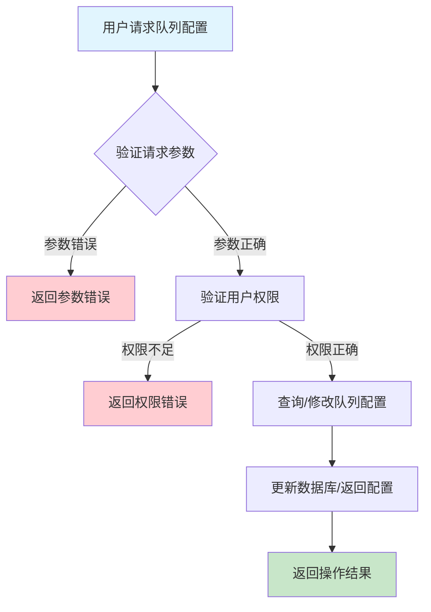
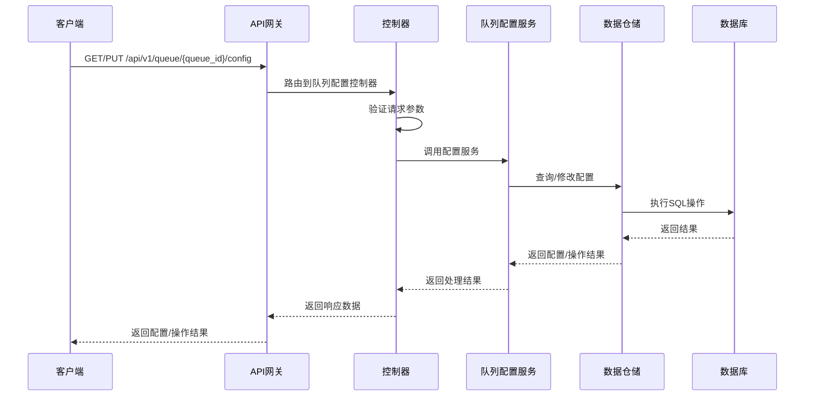

# 队列配置需求文档

## 1. 功能描述

### 1.1 功能概述
队列配置功能用于管理队列的各项运行参数，包括容量、优先级、超时时间、重试策略等，支持配置的查询、修改、历史追踪。

### 1.2 主要功能列表
- 查询队列配置
- 修改队列配置
- 配置变更历史记录
- 配置导出与导入

### 1.3 支持的功能特性
- 多参数灵活配置
- 配置变更可追溯
- 配置导入导出

## 2. 功能目标

### 2.1 业务目标
- 支持队列参数灵活调整
- 提高队列运行效率
- 便于配置管理与追溯

### 2.2 技术目标
- 高效配置查询与修改
- 配置变更一致性保障
- 配置历史可追溯

### 2.3 安全目标
- 配置操作权限控制
- 配置变更可审计
- 防止误操作

## 3. 输入输出说明

### 3.1 输入参数

#### 3.1.1 必需参数
- `queue_id` (string): 队列ID

#### 3.1.2 可选参数
- `config` (object): 配置参数（如capacity、priority、timeout、retry等）
- `operator` (string): 操作人

### 3.2 输出参数

#### 3.2.1 成功响应
```json
{
  "code": 200,
  "message": "success",
  "data": {
    "queue_id": "queue_001",
    "config": {
      "capacity": 1000,
      "priority": "high",
      "timeout": 60,
      "retry": 3
    },
    "updated_at": "2024-01-16T14:00:00Z"
  }
}
```

#### 3.2.2 错误响应
```json
{
  "code": 400,
  "message": "参数错误或操作不允许",
  "data": null
}
```

### 3.3 参数格式和约束
- 队列ID：1-64字符，字母、数字、下划线
- 配置参数：见具体业务约束

## 4. 涉及接口以及接口设计

### 4.1 API接口定义

#### 4.1.1 查询队列配置
```go
// 查询队列配置
GET /api/v1/queue/{queue_id}/config
```

#### 4.1.2 修改队列配置
```go
// 修改队列配置
PUT /api/v1/queue/{queue_id}/config
```

**请求参数：**
- Path参数：queue_id
- Body参数：config, operator

**响应结构：**
```go
type QueueConfigResponse struct {
    Code    int    `json:"code"`
    Message string `json:"message"`
    Data    struct {
        QueueID   string                 `json:"queue_id"`
        Config    map[string]interface{} `json:"config"`
        UpdatedAt string                 `json:"updated_at"`
    } `json:"data"`
}
```

### 4.2 内部接口设计

#### 4.2.1 队列配置服务接口
```go
type QueueConfigService interface {
    GetConfig(ctx context.Context, queueID string) (map[string]interface{}, error)
    UpdateConfig(ctx context.Context, queueID string, config map[string]interface{}, operator string) error
}
```

#### 4.2.2 队列配置仓储接口
```go
type QueueConfigRepository interface {
    Get(ctx context.Context, queueID string) (map[string]interface{}, error)
    Update(ctx context.Context, queueID string, config map[string]interface{}) error
    AddHistory(ctx context.Context, queueID string, config map[string]interface{}, operator string) error
}
```

## 5. 数据结构设计

### 5.1 数据库表结构
- 复用 queue 表
- 新增 queue_config_history 表

#### 5.1.1 队列配置历史表 (queue_config_history)
```sql
CREATE TABLE queue_config_history (
    id BIGINT AUTO_INCREMENT PRIMARY KEY COMMENT '历史ID',
    queue_id VARCHAR(64) NOT NULL COMMENT '队列ID',
    config JSON NOT NULL COMMENT '配置内容',
    operator VARCHAR(64) NOT NULL COMMENT '操作人',
    updated_at TIMESTAMP DEFAULT CURRENT_TIMESTAMP COMMENT '变更时间',
    INDEX idx_queue_id (queue_id),
    FOREIGN KEY (queue_id) REFERENCES queue(id) ON DELETE CASCADE
) ENGINE=InnoDB DEFAULT CHARSET=utf8mb4 COMMENT='队列配置历史表';
```

### 5.2 模型结构定义
```go
type QueueConfigHistory struct {
    ID        int64                  `json:"id" db:"id"`
    QueueID   string                 `json:"queue_id" db:"queue_id"`
    Config    map[string]interface{} `json:"config" db:"config"`
    Operator  string                 `json:"operator" db:"operator"`
    UpdatedAt string                 `json:"updated_at" db:"updated_at"`
}
```

### 5.3 数据关系说明
- 配置历史与队列表通过queue_id关联
- 支持多次配置变更追溯

## 6. 异常处理

### 6.1 输入验证异常
- 队列ID为空或格式错误
- 配置参数非法

### 6.2 业务逻辑异常
- 队列不存在
- 权限不足

### 6.3 系统异常
- 数据库连接失败
- 配置变更超时
- 系统资源不足

## 7. 交互流程图



## 8. 交互时序图



## 9. 安全与权限

### 9.1 访问控制策略
- 需要用户身份验证
- 验证用户对队列配置的权限
- 支持基于角色的访问控制(RBAC)
- 记录所有配置操作

### 9.2 数据安全要求
- 防止误操作
- 配置变更需二次确认（如高危参数）
- 支持数据访问审计
- 防止SQL注入

### 9.3 身份验证机制
- JWT令牌
- API密钥
- 请求频率限制
- IP白名单

## 10. 日志与审计要求

### 10.1 操作日志要求
- 记录所有配置操作
- 记录参数和结果
- 记录操作人员身份
- 记录操作时间和IP

### 10.2 审计日志要求
- 记录配置变更轨迹
- 记录身份和权限
- 记录操作目的
- 支持长期保存

### 10.3 日志格式规范
```json
{
  "timestamp": "2024-01-16T14:00:00Z",
  "level": "INFO",
  "service": "queue-config",
  "operation": "update_config",
  "user_id": "user_001",
  "parameters": {
    "queue_id": "queue_001",
    "config": {"capacity": 1000, "priority": "high"}
  },
  "result": {
    "success": true
  }
}
```

## 11. 测试用例

### 11.1 功能测试用例

#### 11.1.1 查询配置测试
**测试场景：** 查询队列配置
**输入数据：**
```json
{
  "queue_id": "queue_001"
}
```
**预期结果：**
- 返回状态码：200
- 返回队列配置

#### 11.1.2 修改配置测试
**测试场景：** 修改队列配置
**输入数据：**
```json
{
  "queue_id": "queue_001",
  "config": {"capacity": 2000}
}
```
**预期结果：**
- 返回状态码：200
- 配置变更生效

### 11.2 性能测试用例

#### 11.2.1 大量配置变更测试
**测试场景：** 并发修改1000个队列配置
**预期结果：**
- 响应时间 < 2秒
- 错误率 < 1%

### 11.3 安全测试用例

#### 11.3.1 权限验证测试
**测试场景：** 验证用户配置操作权限
**测试数据：**
- 用户A：有权限
- 用户B：无权限
**预期结果：**
- 用户A：成功操作
- 用户B：返回权限错误

#### 11.3.2 误操作防护测试
**测试场景：** 高危参数变更需二次确认
**输入数据：**
```json
{
  "queue_id": "queue_002",
  "config": {"priority": "critical"}
}
```
**预期结果：**
- 需二次确认
- 未确认时不执行

### 11.4 异常测试用例

#### 11.4.1 参数错误测试
**测试场景：** 参数错误
**输入数据：**
```json
{
  "queue_id": "",
  "config": {}
}
```
**预期结果：**
- 返回参数验证错误
- 状态码400

#### 11.4.2 队列不存在测试
**测试场景：** 修改不存在的队列配置
**输入数据：**
```json
{
  "queue_id": "non_existent_queue",
  "config": {"capacity": 100}
}
```
**预期结果：**
- 返回404
- 错误信息友好

#### 11.4.3 系统异常测试
**测试场景：** 数据库连接失败
**测试方法：** 临时关闭数据库
**预期结果：**
- 返回500
- 记录详细错误日志 