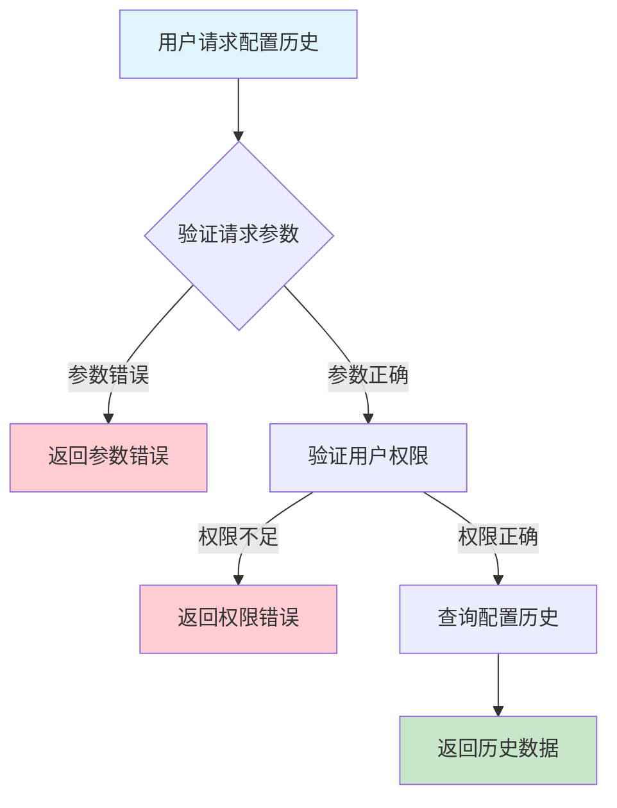
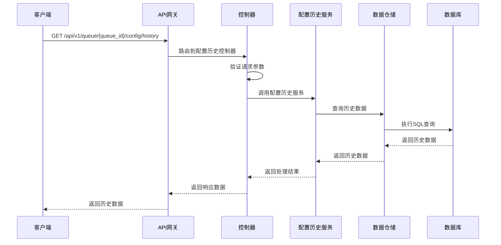

# 队列配置历史需求文档

## 1. 功能描述

### 1.1 功能概述
队列配置历史功能用于记录和查询队列配置的所有变更历史，支持按队列、时间、操作人等多条件筛选，便于追溯配置变更过程和异常分析。

### 1.2 主要功能列表
- 记录配置变更历史
- 查询配置历史记录
- 支持按队列、时间、操作人等多条件筛选
- 配置历史导出

### 1.3 支持的功能特性
- 多条件筛选
- 历史数据可追溯
- 支持批量导出

## 2. 功能目标

### 2.1 业务目标
- 提高配置管理透明度
- 支持异常追溯与分析
- 优化配置管理策略

### 2.2 技术目标
- 高效大数据量历史查询
- 历史数据完整性保障
- 支持多维度筛选

### 2.3 安全目标
- 配置历史访问权限控制
- 防止敏感数据泄露
- 操作可审计

## 3. 输入输出说明

### 3.1 输入参数

#### 3.1.1 必需参数
- `queue_id` (string): 队列ID

#### 3.1.2 可选参数
- `operator` (string): 操作人
- `start_time` (string): 查询起始时间
- `end_time` (string): 查询结束时间
- `limit` (int): 返回条数
- `offset` (int): 分页偏移

### 3.2 输出参数

#### 3.2.1 成功响应
```json
{
  "code": 200,
  "message": "success",
  "data": {
    "history": [
      {
        "id": 1,
        "queue_id": "queue_001",
        "config": {"capacity": 1000, "priority": "high"},
        "operator": "user_001",
        "updated_at": "2024-01-16T14:10:00Z"
      }
    ],
    "total": 1
  }
}
```

#### 3.2.2 错误响应
```json
{
  "code": 400,
  "message": "参数错误或操作不允许",
  "data": null
}
```

### 3.3 参数格式和约束
- 队列ID：1-64字符，字母、数字、下划线
- 时间：ISO 8601格式
- 分页：limit最大1000

## 4. 涉及接口以及接口设计

### 4.1 API接口定义

#### 4.1.1 查询配置历史
```go
// 查询配置历史
GET /api/v1/queue/{queue_id}/config/history
```

**请求参数：**
- Path参数：queue_id
- Query参数：operator, start_time, end_time, limit, offset

**响应结构：**
```go
type QueueConfigHistoryResponse struct {
    Code    int    `json:"code"`
    Message string `json:"message"`
    Data    struct {
        History []QueueConfigHistory `json:"history"`
        Total   int                  `json:"total"`
    } `json:"data"`
}

type QueueConfigHistory struct {
    ID        int64                  `json:"id"`
    QueueID   string                 `json:"queue_id"`
    Config    map[string]interface{} `json:"config"`
    Operator  string                 `json:"operator"`
    UpdatedAt string                 `json:"updated_at"`
}
```

### 4.2 内部接口设计

#### 4.2.1 配置历史服务接口
```go
type QueueConfigHistoryService interface {
    QueryHistory(ctx context.Context, req *QueueConfigHistoryRequest) (*QueueConfigHistoryResponse, error)
}
```

#### 4.2.2 配置历史仓储接口
```go
type QueueConfigHistoryRepository interface {
    Query(ctx context.Context, filter *QueueConfigHistoryFilter) ([]QueueConfigHistory, int, error)
}
```

## 5. 数据结构设计

### 5.1 数据库表结构
- 复用 queue_config_history 表

### 5.2 模型结构定义
```go
type QueueConfigHistoryRequest struct {
    QueueID   string `json:"queue_id" v:"required"`
    Operator  string `json:"operator"`
    StartTime string `json:"start_time"`
    EndTime   string `json:"end_time"`
    Limit     int    `json:"limit"`
    Offset    int    `json:"offset"`
}

type QueueConfigHistory struct {
    ID        int64                  `json:"id" db:"id"`
    QueueID   string                 `json:"queue_id" db:"queue_id"`
    Config    map[string]interface{} `json:"config" db:"config"`
    Operator  string                 `json:"operator" db:"operator"`
    UpdatedAt string                 `json:"updated_at" db:"updated_at"`
}
```

### 5.3 数据关系说明
- 配置历史与队列表通过queue_id关联
- 支持多条件筛选

## 6. 异常处理

### 6.1 输入验证异常
- 队列ID为空或格式错误
- 分页参数非法

### 6.2 业务逻辑异常
- 队列不存在
- 权限不足

### 6.3 系统异常
- 数据库连接失败
- 查询超时
- 系统资源不足

## 7. 交互流程图



## 8. 交互时序图



## 9. 安全与权限

### 9.1 访问控制策略
- 需要用户身份验证
- 验证用户对配置历史的访问权限
- 支持基于角色的访问控制(RBAC)
- 记录所有历史访问操作

### 9.2 数据安全要求
- 敏感信息脱敏
- 历史数据加密存储
- 支持数据访问审计
- 防止SQL注入

### 9.3 身份验证机制
- JWT令牌
- API密钥
- 请求频率限制
- IP白名单

## 10. 日志与审计要求

### 10.1 操作日志要求
- 记录所有历史访问操作
- 记录参数和结果
- 记录操作人员身份
- 记录操作时间和IP

### 10.2 审计日志要求
- 记录历史访问轨迹
- 记录身份和权限
- 记录访问目的
- 支持长期保存

### 10.3 日志格式规范
```json
{
  "timestamp": "2024-01-16T14:10:00Z",
  "level": "INFO",
  "service": "queue-config-history",
  "operation": "query_config_history",
  "user_id": "user_001",
  "parameters": {
    "queue_id": "queue_001"
  },
  "result": {
    "total": 1
  }
}
```

## 11. 测试用例

### 11.1 功能测试用例

#### 11.1.1 单队列历史查询测试
**测试场景：** 查询单个队列配置历史
**输入数据：**
```json
{
  "queue_id": "queue_001"
}
```
**预期结果：**
- 返回状态码：200
- 返回历史数据

#### 11.1.2 多条件筛选测试
**测试场景：** 按操作人、时间筛选
**输入数据：**
```json
{
  "queue_id": "queue_001",
  "operator": "user_001"
}
```
**预期结果：**
- 返回状态码：200
- 返回筛选后的历史数据

### 11.2 性能测试用例

#### 11.2.1 大量历史查询测试
**测试场景：** 查询10万条历史数据
**预期结果：**
- 响应时间 < 2秒
- 错误率 < 1%

### 11.3 安全测试用例

#### 11.3.1 权限验证测试
**测试场景：** 验证用户历史访问权限
**测试数据：**
- 用户A：有权限
- 用户B：无权限
**预期结果：**
- 用户A：成功获取历史
- 用户B：返回权限错误

#### 11.3.2 敏感信息脱敏测试
**测试场景：** 敏感信息脱敏
**输入数据：**
```json
{
  "queue_id": "queue_001"
}
```
**预期结果：**
- 敏感字段脱敏
- 不影响可用性

### 11.4 异常测试用例

#### 11.4.1 参数错误测试
**测试场景：** 参数错误
**输入数据：**
```json
{
  "queue_id": ""
}
```
**预期结果：**
- 返回参数验证错误
- 状态码400

#### 11.4.2 队列不存在测试
**测试场景：** 查询不存在的队列历史
**输入数据：**
```json
{
  "queue_id": "non_existent_queue"
}
```
**预期结果：**
- 返回404
- 错误信息友好

#### 11.4.3 系统异常测试
**测试场景：** 数据库连接失败
**测试方法：** 临时关闭数据库
**预期结果：**
- 返回500
- 记录详细错误日志 