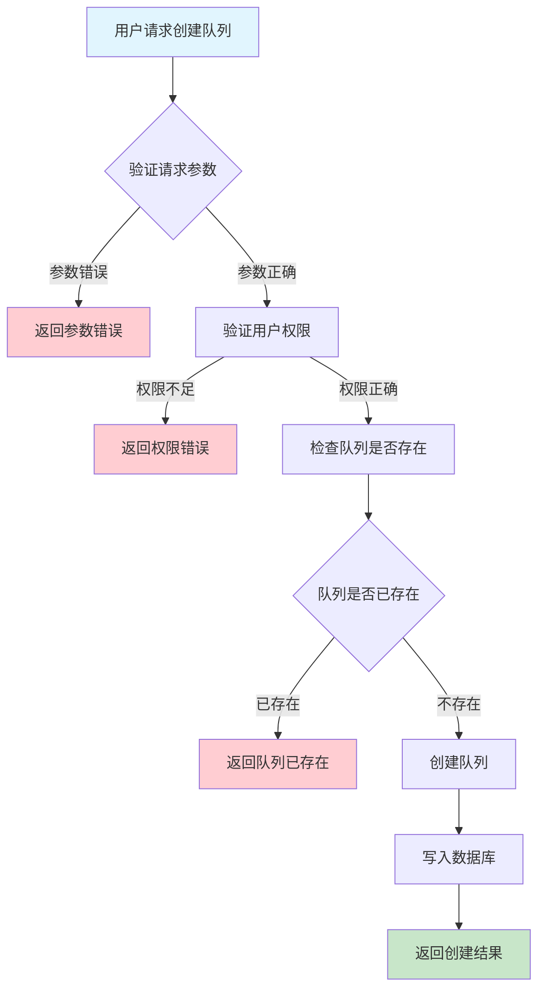
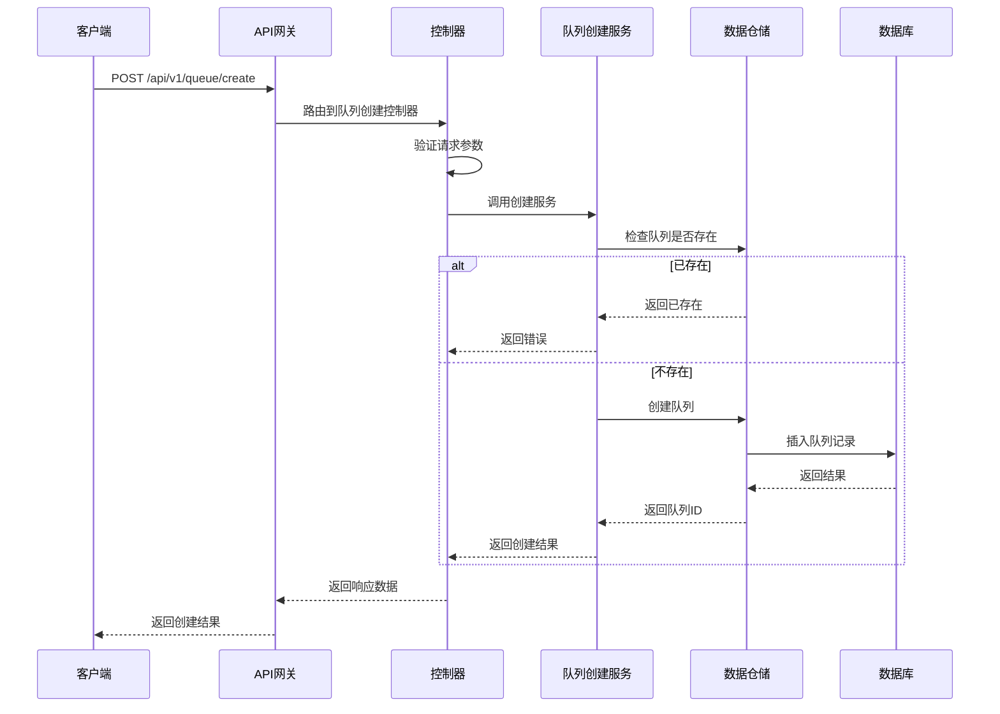

# 队列创建需求文档

## 1. 功能描述

### 1.1 功能概述
队列创建功能用于在系统中新增队列资源，支持多种队列类型、容量、属性配置，为任务调度、消息传递等业务场景提供基础队列。

### 1.2 主要功能列表
- 新建队列
- 指定队列类型、容量、属性
- 队列唯一性校验
- 创建结果反馈

### 1.3 支持的功能特性
- 多类型队列支持
- 队列属性自定义
- 创建操作权限控制

## 2. 功能目标

### 2.1 业务目标
- 支持多业务场景下的队列资源管理
- 提高队列创建效率
- 保证队列唯一性和一致性

### 2.2 技术目标
- 高并发创建能力
- 队列属性灵活扩展
- 创建操作可追溯

### 2.3 安全目标
- 创建权限控制
- 防止重复创建
- 操作可审计

## 3. 输入输出说明

### 3.1 输入参数

#### 3.1.1 必需参数
- `queue_name` (string): 队列名称
- `queue_type` (string): 队列类型（normal/priority/delay等）

#### 3.1.2 可选参数
- `capacity` (int): 队列容量
- `attributes` (object): 队列自定义属性
- `description` (string): 队列描述

### 3.2 输出参数

#### 3.2.1 成功响应
```json
{
  "code": 200,
  "message": "success",
  "data": {
    "queue_id": "queue_001",
    "queue_name": "main_queue",
    "queue_type": "normal",
    "created_at": "2024-01-16T13:00:00Z"
  }
}
```

#### 3.2.2 错误响应
```json
{
  "code": 400,
  "message": "参数错误或队列已存在",
  "data": null
}
```

### 3.3 参数格式和约束
- 队列名称：1-64字符，字母、数字、下划线
- 队列类型：normal、priority、delay等
- 容量：正整数

## 4. 涉及接口以及接口设计

### 4.1 API接口定义

#### 4.1.1 创建队列
```go
// 创建队列
POST /api/v1/queue/create
```

**请求参数：**
- Body参数：queue_name, queue_type, capacity, attributes, description

**响应结构：**
```go
type QueueCreateResponse struct {
    Code    int    `json:"code"`
    Message string `json:"message"`
    Data    struct {
        QueueID   string `json:"queue_id"`
        QueueName string `json:"queue_name"`
        QueueType string `json:"queue_type"`
        CreatedAt string `json:"created_at"`
    } `json:"data"`
}
```

### 4.2 内部接口设计

#### 4.2.1 队列创建服务接口
```go
type QueueCreateService interface {
    CreateQueue(ctx context.Context, req *QueueCreateRequest) (*QueueCreateResult, error)
}
```

#### 4.2.2 队列创建仓储接口
```go
type QueueCreateRepository interface {
    Create(ctx context.Context, queue *Queue) error
    Exists(ctx context.Context, queueName string) (bool, error)
}
```

## 5. 数据结构设计

### 5.1 数据库表结构
- 复用 queue 表

### 5.2 模型结构定义
```go
type Queue struct {
    ID         string                 `json:"queue_id" db:"id"`
    QueueName  string                 `json:"queue_name" db:"queue_name"`
    QueueType  string                 `json:"queue_type" db:"queue_type"`
    Capacity   int                    `json:"capacity" db:"capacity"`
    Attributes map[string]interface{} `json:"attributes" db:"attributes"`
    Description string                `json:"description" db:"description"`
    CreatedAt  string                 `json:"created_at" db:"created_at"`
    UpdatedAt  string                 `json:"updated_at" db:"updated_at"`
}

type QueueCreateRequest struct {
    QueueName   string                 `json:"queue_name" v:"required"`
    QueueType   string                 `json:"queue_type" v:"required"`
    Capacity    int                    `json:"capacity"`
    Attributes  map[string]interface{} `json:"attributes"`
    Description string                 `json:"description"`
}

type QueueCreateResult struct {
    QueueID   string `json:"queue_id"`
    QueueName string `json:"queue_name"`
    QueueType string `json:"queue_type"`
    CreatedAt string `json:"created_at"`
}
```

### 5.3 数据关系说明
- 队列与任务、消息等通过queue_id关联

## 6. 异常处理

### 6.1 输入验证异常
- 队列名称为空或格式错误
- 队列类型非法
- 容量非法

### 6.2 业务逻辑异常
- 队列已存在
- 权限不足

### 6.3 系统异常
- 数据库连接失败
- 网络超时
- 系统资源不足

## 7. 交互流程图



## 8. 交互时序图



## 9. 安全与权限

### 9.1 访问控制策略
- 需要用户身份验证
- 验证用户对队列创建的权限
- 支持基于角色的访问控制(RBAC)
- 记录所有创建操作

### 9.2 数据安全要求
- 防止重复创建
- 队列名称唯一性校验
- 支持数据访问审计
- 防止SQL注入

### 9.3 身份验证机制
- JWT令牌
- API密钥
- 请求频率限制
- IP白名单

## 10. 日志与审计要求

### 10.1 操作日志要求
- 记录所有创建操作
- 记录参数和结果
- 记录操作人员身份
- 记录操作时间和IP

### 10.2 审计日志要求
- 记录创建轨迹
- 记录身份和权限
- 记录操作目的
- 支持长期保存

### 10.3 日志格式规范
```json
{
  "timestamp": "2024-01-16T13:00:00Z",
  "level": "INFO",
  "service": "queue-create",
  "operation": "create_queue",
  "user_id": "user_001",
  "parameters": {
    "queue_name": "main_queue",
    "queue_type": "normal"
  },
  "result": {
    "queue_id": "queue_001"
  }
}
```

## 11. 测试用例

### 11.1 功能测试用例

#### 11.1.1 正常创建测试
**测试场景：** 创建新队列
**输入数据：**
```json
{
  "queue_name": "main_queue",
  "queue_type": "normal"
}
```
**预期结果：**
- 返回状态码：200
- 返回新队列ID

#### 11.1.2 重复创建测试
**测试场景：** 创建已存在队列
**输入数据：**
```json
{
  "queue_name": "main_queue",
  "queue_type": "normal"
}
```
**预期结果：**
- 返回400
- 错误信息友好

### 11.2 性能测试用例

#### 11.2.1 大量队列创建测试
**测试场景：** 并发创建1000个队列
**预期结果：**
- 响应时间 < 2秒
- 错误率 < 1%

### 11.3 安全测试用例

#### 11.3.1 权限验证测试
**测试场景：** 验证用户创建权限
**测试数据：**
- 用户A：有权限
- 用户B：无权限
**预期结果：**
- 用户A：成功创建
- 用户B：返回权限错误

### 11.4 异常测试用例

#### 11.4.1 参数错误测试
**测试场景：** 参数错误
**输入数据：**
```json
{
  "queue_name": "",
  "queue_type": "invalid"
}
```
**预期结果：**
- 返回参数验证错误
- 状态码400

#### 11.4.2 系统异常测试
**测试场景：** 数据库连接失败
**测试方法：** 临时关闭数据库
**预期结果：**
- 返回500
- 记录详细错误日志 