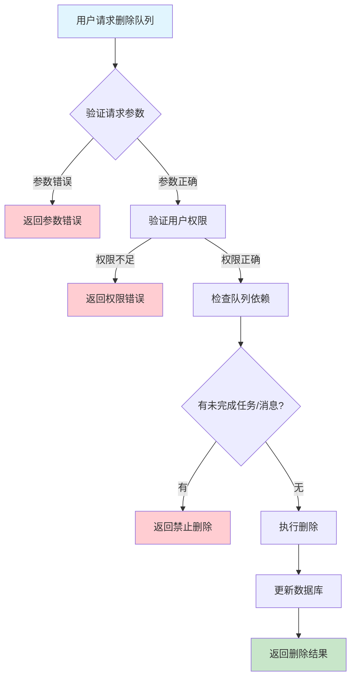
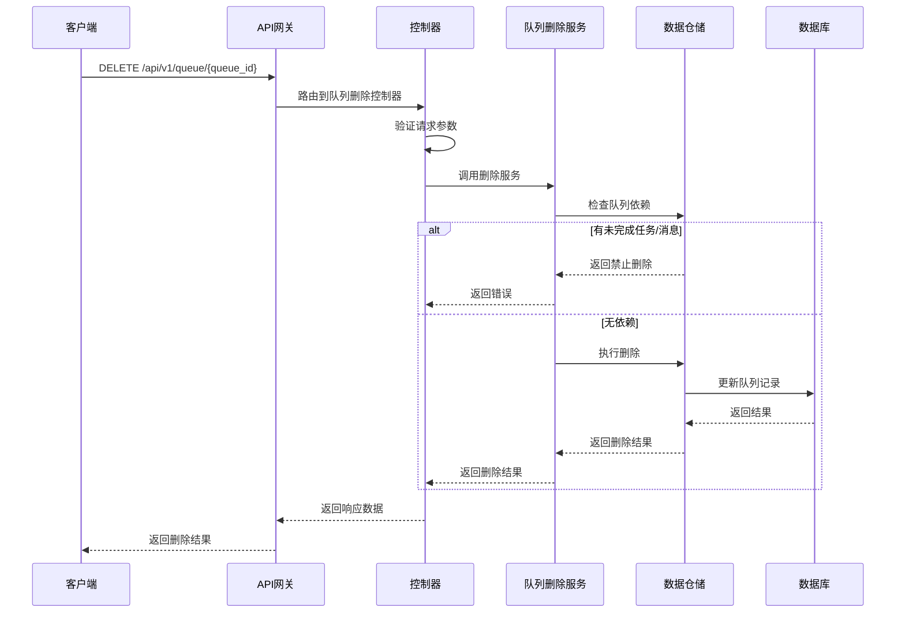

# 队列删除需求文档

## 1. 功能描述

### 1.1 功能概述
队列删除功能用于从系统中移除指定队列资源，支持逻辑删除和物理删除，确保队列及其相关数据的安全清理。

### 1.2 主要功能列表
- 删除指定队列
- 支持逻辑删除和物理删除
- 删除操作权限控制
- 删除结果反馈

### 1.3 支持的功能特性
- 队列删除前依赖检查
- 删除操作可追溯
- 删除后数据安全保障

## 2. 功能目标

### 2.1 业务目标
- 支持队列资源的安全回收
- 防止误删和数据丢失
- 提高队列管理灵活性

### 2.2 技术目标
- 高效安全的删除能力
- 删除操作一致性保障
- 删除操作可追溯

### 2.3 安全目标
- 删除权限控制
- 删除操作可审计
- 防止误操作

## 3. 输入输出说明

### 3.1 输入参数

#### 3.1.1 必需参数
- `queue_id` (string): 队列ID

#### 3.1.2 可选参数
- `force` (boolean): 是否强制物理删除，默认false
- `operator` (string): 操作人

### 3.2 输出参数

#### 3.2.1 成功响应
```json
{
  "code": 200,
  "message": "success",
  "data": {
    "queue_id": "queue_001",
    "deleted": true,
    "deleted_at": "2024-01-16T13:30:00Z"
  }
}
```

#### 3.2.2 错误响应
```json
{
  "code": 400,
  "message": "参数错误或操作不允许",
  "data": null
}
```

### 3.3 参数格式和约束
- 队列ID：1-64字符，字母、数字、下划线
- 布尔参数：true/false

## 4. 涉及接口以及接口设计

### 4.1 API接口定义

#### 4.1.1 删除队列
```go
// 删除队列
DELETE /api/v1/queue/{queue_id}
```

**请求参数：**
- Path参数：queue_id
- Query参数：force, operator

**响应结构：**
```go
type QueueDeleteResponse struct {
    Code    int    `json:"code"`
    Message string `json:"message"`
    Data    struct {
        QueueID   string `json:"queue_id"`
        Deleted   bool   `json:"deleted"`
        DeletedAt string `json:"deleted_at"`
    } `json:"data"`
}
```

### 4.2 内部接口设计

#### 4.2.1 队列删除服务接口
```go
type QueueDeleteService interface {
    DeleteQueue(ctx context.Context, req *QueueDeleteRequest) (*QueueDeleteResult, error)
}
```

#### 4.2.2 队列删除仓储接口
```go
type QueueDeleteRepository interface {
    Delete(ctx context.Context, queueID string, force bool) error
    Exists(ctx context.Context, queueID string) (bool, error)
}
```

## 5. 数据结构设计

### 5.1 数据库表结构
- 复用 queue 表，增加 deleted 字段

#### 5.1.1 队列表 (queue)
```sql
ALTER TABLE queue ADD COLUMN deleted TINYINT(1) DEFAULT 0 COMMENT '逻辑删除标记';
```

### 5.2 模型结构定义
```go
type QueueDeleteRequest struct {
    QueueID  string `json:"queue_id" v:"required"`
    Force    bool   `json:"force"`
    Operator string `json:"operator"`
}

type QueueDeleteResult struct {
    QueueID   string `json:"queue_id"`
    Deleted   bool   `json:"deleted"`
    DeletedAt string `json:"deleted_at"`
}
```

### 5.3 数据关系说明
- 队列与任务、消息等通过queue_id关联
- 删除操作需检查依赖

## 6. 异常处理

### 6.1 输入验证异常
- 队列ID为空或格式错误

### 6.2 业务逻辑异常
- 队列不存在
- 队列有未完成任务/消息，禁止删除
- 权限不足

### 6.3 系统异常
- 数据库连接失败
- 删除超时
- 系统资源不足

## 7. 交互流程图



## 8. 交互时序图



## 9. 安全与权限

### 9.1 访问控制策略
- 需要用户身份验证
- 验证用户对队列删除的权限
- 支持基于角色的访问控制(RBAC)
- 记录所有删除操作

### 9.2 数据安全要求
- 防止误操作
- 删除操作需二次确认（如强制删除）
- 支持数据访问审计
- 防止SQL注入

### 9.3 身份验证机制
- JWT令牌
- API密钥
- 请求频率限制
- IP白名单

## 10. 日志与审计要求

### 10.1 操作日志要求
- 记录所有删除操作
- 记录参数和结果
- 记录操作人员身份
- 记录操作时间和IP

### 10.2 审计日志要求
- 记录删除轨迹
- 记录身份和权限
- 记录操作目的
- 支持长期保存

### 10.3 日志格式规范
```json
{
  "timestamp": "2024-01-16T13:30:00Z",
  "level": "INFO",
  "service": "queue-delete",
  "operation": "delete_queue",
  "user_id": "user_001",
  "parameters": {
    "queue_id": "queue_001",
    "force": false
  },
  "result": {
    "deleted": true
  }
}
```

## 11. 测试用例

### 11.1 功能测试用例

#### 11.1.1 正常删除测试
**测试场景：** 删除空闲队列
**输入数据：**
```json
{
  "queue_id": "queue_001"
}
```
**预期结果：**
- 返回状态码：200
- 队列被逻辑删除

#### 11.1.2 强制删除测试
**测试场景：** 强制物理删除
**输入数据：**
```json
{
  "queue_id": "queue_002",
  "force": true
}
```
**预期结果：**
- 返回状态码：200
- 队列被物理删除

### 11.2 性能测试用例

#### 11.2.1 大量队列删除测试
**测试场景：** 并发删除1000个队列
**预期结果：**
- 响应时间 < 2秒
- 错误率 < 1%

### 11.3 安全测试用例

#### 11.3.1 权限验证测试
**测试场景：** 验证用户删除权限
**测试数据：**
- 用户A：有权限
- 用户B：无权限
**预期结果：**
- 用户A：成功删除
- 用户B：返回权限错误

#### 11.3.2 误操作防护测试
**测试场景：** 强制删除需二次确认
**输入数据：**
```json
{
  "queue_id": "queue_003",
  "force": true
}
```
**预期结果：**
- 需二次确认
- 未确认时不执行

### 11.4 异常测试用例

#### 11.4.1 参数错误测试
**测试场景：** 参数错误
**输入数据：**
```json
{
  "queue_id": ""
}
```
**预期结果：**
- 返回参数验证错误
- 状态码400

#### 11.4.2 队列不存在测试
**测试场景：** 删除不存在的队列
**输入数据：**
```json
{
  "queue_id": "non_existent_queue"
}
```
**预期结果：**
- 返回404
- 错误信息友好

#### 11.4.3 系统异常测试
**测试场景：** 数据库连接失败
**测试方法：** 临时关闭数据库
**预期结果：**
- 返回500
- 记录详细错误日志 