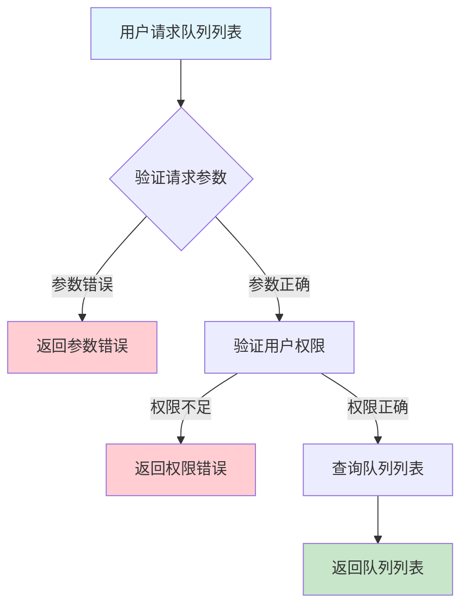
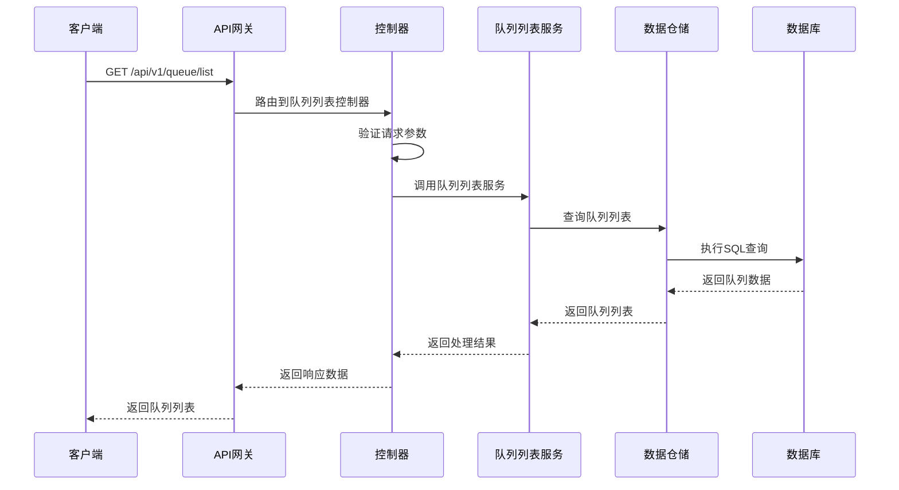

# 队列列表需求文档

## 1. 功能描述

### 1.1 功能概述
队列列表功能用于查询系统中已注册的所有队列，支持多条件筛选、分页、排序，便于运维和开发人员管理和查看队列资源。

### 1.2 主要功能列表
- 查询队列列表
- 支持按类型、状态、名称等筛选
- 支持分页、排序
- 支持导出队列列表

### 1.3 支持的功能特性
- 多条件筛选
- 分页与排序
- 列表导出

## 2. 功能目标

### 2.1 业务目标
- 提高队列资源管理效率
- 支持大规模队列查询
- 支持多维度队列检索

### 2.2 技术目标
- 高效分页查询
- 支持灵活筛选与排序
- 查询结果实时性保障

### 2.3 安全目标
- 查询权限控制
- 防止敏感数据泄露
- 查询操作可审计

## 3. 输入输出说明

### 3.1 输入参数

#### 3.1.1 可选参数
- `queue_type` (string): 队列类型
- `status` (string): 队列状态
- `name` (string): 队列名称模糊查询
- `page` (int): 页码
- `page_size` (int): 每页条数
- `sort_by` (string): 排序字段
- `order` (string): 排序方式（asc/desc）

### 3.2 输出参数

#### 3.2.1 成功响应
```json
{
  "code": 200,
  "message": "success",
  "data": {
    "list": [
      {
        "queue_id": "queue_001",
        "queue_name": "main_queue",
        "queue_type": "normal",
        "status": "active",
        "capacity": 1000,
        "created_at": "2024-01-16T10:00:00Z"
      }
    ],
    "total": 1,
    "page": 1,
    "page_size": 20
  }
}
```

#### 3.2.2 错误响应
```json
{
  "code": 400,
  "message": "参数错误或操作不允许",
  "data": null
}
```

### 3.3 参数格式和约束
- 队列类型：normal、priority、delay等
- 状态：active、inactive、deleted等
- 分页：page、page_size为正整数

## 4. 涉及接口以及接口设计

### 4.1 API接口定义

#### 4.1.1 查询队列列表
```go
// 查询队列列表
GET /api/v1/queue/list
```

**请求参数：**
- Query参数：queue_type, status, name, page, page_size, sort_by, order

**响应结构：**
```go
type QueueListResponse struct {
    Code    int    `json:"code"`
    Message string `json:"message"`
    Data    struct {
        List      []QueueListItem `json:"list"`
        Total     int             `json:"total"`
        Page      int             `json:"page"`
        PageSize  int             `json:"page_size"`
    } `json:"data"`
}

type QueueListItem struct {
    QueueID    string `json:"queue_id"`
    QueueName  string `json:"queue_name"`
    QueueType  string `json:"queue_type"`
    Status     string `json:"status"`
    Capacity   int    `json:"capacity"`
    CreatedAt  string `json:"created_at"`
}
```

### 4.2 内部接口设计

#### 4.2.1 队列列表服务接口
```go
type QueueListService interface {
    GetQueueList(ctx context.Context, filter *QueueListFilter) (*QueueListResponse, error)
}
```

#### 4.2.2 队列列表仓储接口
```go
type QueueListRepository interface {
    Query(ctx context.Context, filter *QueueListFilter) ([]QueueListItem, int, error)
}
```

## 5. 数据结构设计

### 5.1 数据库表结构
- 复用 queue 表

### 5.2 模型结构定义
```go
type QueueListFilter struct {
    QueueType string `json:"queue_type"`
    Status    string `json:"status"`
    Name      string `json:"name"`
    Page      int    `json:"page"`
    PageSize  int    `json:"page_size"`
    SortBy    string `json:"sort_by"`
    Order     string `json:"order"`
}

type QueueListItem struct {
    QueueID    string `json:"queue_id" db:"id"`
    QueueName  string `json:"queue_name" db:"queue_name"`
    QueueType  string `json:"queue_type" db:"queue_type"`
    Status     string `json:"status" db:"status"`
    Capacity   int    `json:"capacity" db:"capacity"`
    CreatedAt  string `json:"created_at" db:"created_at"`
}
```

### 5.3 数据关系说明
- 队列与任务、消息等通过queue_id关联

## 6. 异常处理

### 6.1 输入验证异常
- 分页参数非法
- 排序参数非法

### 6.2 业务逻辑异常
- 权限不足
- 查询范围无数据

### 6.3 系统异常
- 数据库连接失败
- 查询超时
- 系统资源不足

## 7. 交互流程图



## 8. 交互时序图



## 9. 安全与权限

### 9.1 访问控制策略
- 需要用户身份验证
- 验证用户对队列列表的访问权限
- 支持基于角色的访问控制(RBAC)
- 记录所有列表查询操作

### 9.2 数据安全要求
- 敏感信息脱敏
- 列表数据加密存储
- 支持数据访问审计
- 防止SQL注入

### 9.3 身份验证机制
- JWT令牌
- API密钥
- 请求频率限制
- IP白名单

## 10. 日志与审计要求

### 10.1 操作日志要求
- 记录所有列表查询操作
- 记录参数和结果
- 记录操作人员身份
- 记录操作时间和IP

### 10.2 审计日志要求
- 记录列表访问轨迹
- 记录身份和权限
- 记录访问目的
- 支持长期保存

### 10.3 日志格式规范
```json
{
  "timestamp": "2024-01-16T10:10:00Z",
  "level": "INFO",
  "service": "queue-list",
  "operation": "get_queue_list",
  "user_id": "user_001",
  "parameters": {
    "queue_type": "normal",
    "page": 1
  },
  "result": {
    "total": 1
  }
}
```

## 11. 测试用例

### 11.1 功能测试用例

#### 11.1.1 正常查询测试
**测试场景：** 查询队列列表
**输入数据：**
```json
{
  "queue_type": "normal",
  "page": 1,
  "page_size": 20
}
```
**预期结果：**
- 返回状态码：200
- 返回队列列表

#### 11.1.2 条件筛选测试
**测试场景：** 按名称模糊查询
**输入数据：**
```json
{
  "name": "main"
}
```
**预期结果：**
- 返回状态码：200
- 返回筛选后的队列列表

### 11.2 性能测试用例

#### 11.2.1 大量队列查询测试
**测试场景：** 查询10000条队列
**预期结果：**
- 响应时间 < 2秒
- 错误率 < 1%

### 11.3 安全测试用例

#### 11.3.1 权限验证测试
**测试场景：** 验证用户列表访问权限
**测试数据：**
- 用户A：有权限
- 用户B：无权限
**预期结果：**
- 用户A：成功获取列表
- 用户B：返回权限错误

#### 11.3.2 敏感信息脱敏测试
**测试场景：** 敏感信息脱敏
**输入数据：**
```json
{
  "queue_type": "priority"
}
```
**预期结果：**
- 敏感字段脱敏
- 不影响可用性

### 11.4 异常测试用例

#### 11.4.1 参数错误测试
**测试场景：** 参数错误
**输入数据：**
```json
{
  "page": 0,
  "page_size": -1
}
```
**预期结果：**
- 返回参数验证错误
- 状态码400

#### 11.4.2 查询范围无数据测试
**测试场景：** 查询无数据
**输入数据：**
```json
{
  "queue_type": "non_existent_type"
}
```
**预期结果：**
- 返回200
- 列表为空

#### 11.4.3 系统异常测试
**测试场景：** 数据库连接失败
**测试方法：** 临时关闭数据库
**预期结果：**
- 返回500
- 记录详细错误日志 