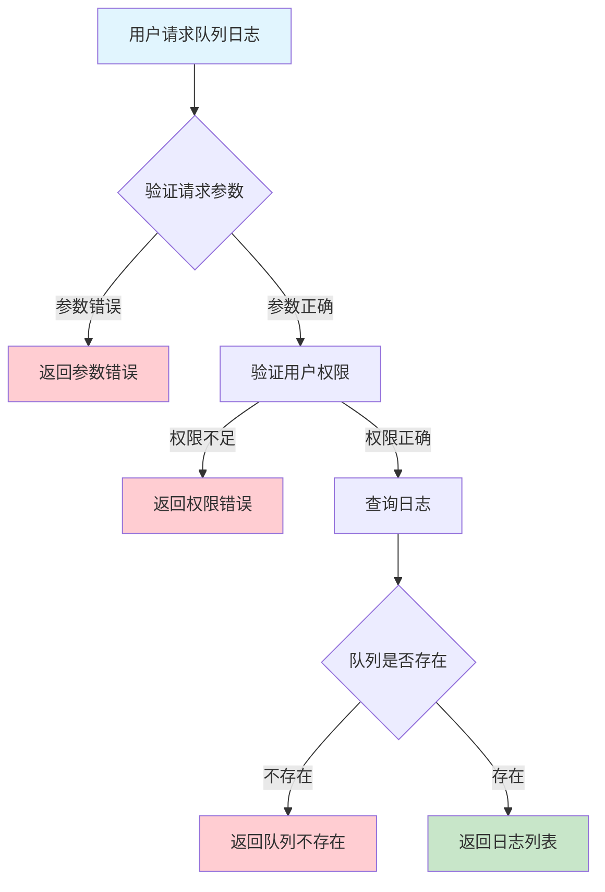
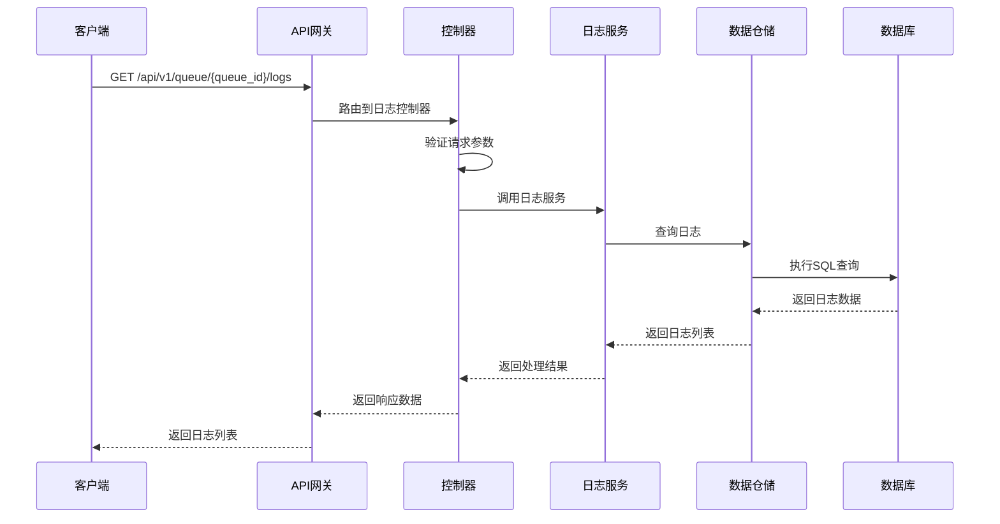

# 队列日志需求文档

## 1. 功能描述

### 1.1 功能概述
队列日志功能用于记录和查询队列相关的操作日志、运行日志、异常日志等，支持多条件筛选和导出，便于问题追踪和运维审计。

### 1.2 主要功能列表
- 记录队列操作日志
- 查询队列运行日志
- 支持多条件筛选
- 日志导出

### 1.3 支持的功能特性
- 多类型日志支持
- 多条件灵活筛选
- 日志导出

## 2. 功能目标

### 2.1 业务目标
- 提高队列运维可观测性
- 支持问题快速定位
- 满足合规审计需求

### 2.2 技术目标
- 高效日志采集与查询
- 日志数据一致性保障
- 支持大规模日志存储

### 2.3 安全目标
- 日志访问权限控制
- 敏感信息保护
- 日志操作可审计

## 3. 输入输出说明

### 3.1 输入参数

#### 3.1.1 必需参数
- `queue_id` (string): 队列ID

#### 3.1.2 可选参数
- `log_type` (string): 日志类型（operation/running/error等）
- `level` (string): 日志级别
- `start_time` (string): 查询起始时间
- `end_time` (string): 查询结束时间
- `keyword` (string): 关键字
- `page` (int): 页码
- `page_size` (int): 每页数量

### 3.2 输出参数

#### 3.2.1 成功响应
```json
{
  "code": 200,
  "message": "success",
  "data": {
    "logs": [
      {
        "log_id": "log_001",
        "queue_id": "queue_001",
        "log_type": "operation",
        "level": "INFO",
        "message": "队列创建成功",
        "operator": "user_001",
        "timestamp": "2024-01-16T18:00:00Z"
      }
    ],
    "total": 1,
    "page": 1,
    "page_size": 20
  }
}
```

#### 3.2.2 错误响应
```json
{
  "code": 400,
  "message": "参数错误或无权限",
  "data": null
}
```

### 3.3 参数格式和约束
- 队列ID：1-64字符，字母、数字、下划线
- 日志类型：operation、running、error等
- 分页：page>=1, page_size<=100

## 4. 涉及接口以及接口设计

### 4.1 API接口定义

#### 4.1.1 查询队列日志
```go
// 查询队列日志
GET /api/v1/queue/{queue_id}/logs
```

**请求参数：**
- Path参数：queue_id
- Query参数：log_type, level, start_time, end_time, keyword, page, page_size

**响应结构：**
```go
type QueueLogListResponse struct {
    Code    int    `json:"code"`
    Message string `json:"message"`
    Data    struct {
        Logs     []QueueLog `json:"logs"`
        Total    int        `json:"total"`
        Page     int        `json:"page"`
        PageSize int        `json:"page_size"`
    } `json:"data"`
}

type QueueLog struct {
    LogID     string `json:"log_id"`
    QueueID   string `json:"queue_id"`
    LogType   string `json:"log_type"`
    Level     string `json:"level"`
    Message   string `json:"message"`
    Operator  string `json:"operator"`
    Timestamp string `json:"timestamp"`
}
```

### 4.2 内部接口设计

#### 4.2.1 日志服务接口
```go
type QueueLogService interface {
    ListLogs(ctx context.Context, queueID string, filter QueueLogListFilter) ([]QueueLog, int, error)
}
```

#### 4.2.2 日志仓储接口
```go
type QueueLogRepository interface {
    Query(ctx context.Context, queueID string, filter QueueLogListFilter) ([]QueueLog, int, error)
}
```

## 5. 数据结构设计

### 5.1 数据库表结构
- 新增 queue_log 表

#### 5.1.1 队列日志表 (queue_log)
```sql
CREATE TABLE queue_log (
    log_id BIGINT AUTO_INCREMENT PRIMARY KEY COMMENT '日志ID',
    queue_id VARCHAR(64) NOT NULL COMMENT '队列ID',
    log_type VARCHAR(32) NOT NULL COMMENT '日志类型',
    level VARCHAR(16) NOT NULL COMMENT '日志级别',
    message TEXT NOT NULL COMMENT '日志内容',
    operator VARCHAR(64) COMMENT '操作人',
    timestamp TIMESTAMP DEFAULT CURRENT_TIMESTAMP COMMENT '日志时间',
    INDEX idx_queue_id (queue_id),
    INDEX idx_log_type (log_type)
) ENGINE=InnoDB DEFAULT CHARSET=utf8mb4 COMMENT='队列日志表';
```

### 5.2 模型结构定义
```go
type QueueLogListFilter struct {
    LogType   string
    Level     string
    StartTime string
    EndTime   string
    Keyword   string
    Page      int
    PageSize  int
}

type QueueLog struct {
    LogID     string `json:"log_id" db:"log_id"`
    QueueID   string `json:"queue_id" db:"queue_id"`
    LogType   string `json:"log_type" db:"log_type"`
    Level     string `json:"level" db:"level"`
    Message   string `json:"message" db:"message"`
    Operator  string `json:"operator" db:"operator"`
    Timestamp string `json:"timestamp" db:"timestamp"`
}
```

### 5.3 数据关系说明
- 日志与队列通过queue_id关联

## 6. 异常处理

### 6.1 输入验证异常
- 队列ID为空或格式错误
- 分页参数非法

### 6.2 业务逻辑异常
- 队列不存在
- 权限不足

### 6.3 系统异常
- 数据库连接失败
- 查询超时
- 系统资源不足

## 7. 交互流程图



## 8. 交互时序图



## 9. 安全与权限

### 9.1 访问控制策略
- 需要用户身份验证
- 验证用户对日志的访问权限
- 支持基于角色的访问控制(RBAC)
- 记录所有日志查询操作

### 9.2 数据安全要求
- 敏感信息脱敏
- 日志数据加密存储
- 支持数据访问审计
- 防止SQL注入

### 9.3 身份验证机制
- JWT令牌
- API密钥
- 请求频率限制
- IP白名单

## 10. 日志与审计要求

### 10.1 操作日志要求
- 记录所有日志查询操作
- 记录参数和结果
- 记录操作人员身份
- 记录操作时间和IP

### 10.2 审计日志要求
- 记录日志访问轨迹
- 记录身份和权限
- 记录访问目的
- 支持长期保存

### 10.3 日志格式规范
```json
{
  "timestamp": "2024-01-16T18:00:00Z",
  "level": "INFO",
  "service": "queue-log",
  "operation": "list_logs",
  "user_id": "user_001",
  "queue_id": "queue_001",
  "parameters": {
    "log_type": "operation",
    "page": 1
  },
  "result": {
    "total": 1
  }
}
```

## 11. 测试用例

### 11.1 功能测试用例

#### 11.1.1 正常查询测试
**测试场景：** 查询队列日志
**输入数据：**
```json
{
  "queue_id": "queue_001"
}
```
**预期结果：**
- 返回状态码：200
- 返回日志列表

#### 11.1.2 条件筛选测试
**测试场景：** 按类型筛选
**输入数据：**
```json
{
  "queue_id": "queue_001",
  "log_type": "operation"
}
```
**预期结果：**
- 返回状态码：200
- 只包含operation类型日志

### 11.2 性能测试用例

#### 11.2.1 大量日志查询测试
**测试场景：** 并发查询1000个队列日志
**预期结果：**
- 响应时间 < 2秒
- 错误率 < 1%

### 11.3 安全测试用例

#### 11.3.1 权限验证测试
**测试场景：** 验证用户日志访问权限
**测试数据：**
- 用户A：有权限
- 用户B：无权限
**预期结果：**
- 用户A：成功查询
- 用户B：返回权限错误

#### 11.3.2 敏感信息脱敏测试
**测试场景：** 敏感信息脱敏
**输入数据：**
```json
{
  "queue_id": "queue_with_sensitive"
}
```
**预期结果：**
- 敏感字段脱敏
- 不影响可用性

### 11.4 异常测试用例

#### 11.4.1 队列不存在测试
**测试场景：** 查询不存在的队列日志
**输入数据：**
```json
{
  "queue_id": "non_existent_queue"
}
```
**预期结果：**
- 返回404
- 错误信息友好

#### 11.4.2 参数错误测试
**测试场景：** 参数错误
**输入数据：**
```json
{
  "queue_id": "",
  "page": 0
}
```
**预期结果：**
- 返回参数验证错误
- 状态码400

#### 11.4.3 系统异常测试
**测试场景：** 数据库连接失败
**测试方法：** 临时关闭数据库
**预期结果：**
- 返回500
- 记录详细错误日志 