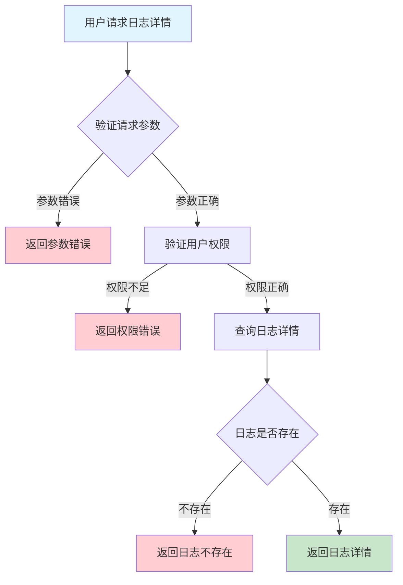
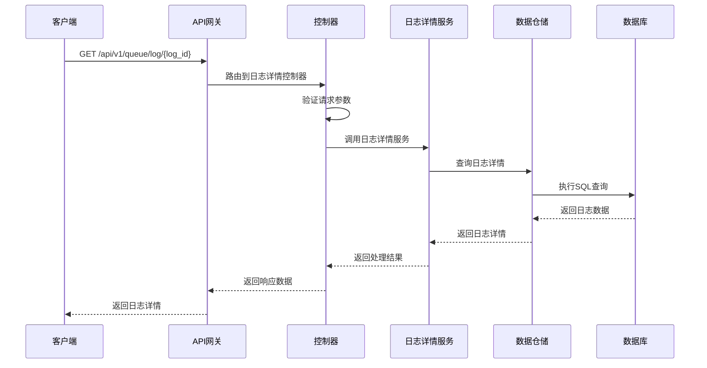

# 队列日志详情需求文档

## 1. 功能描述

### 1.1 功能概述
队列日志详情功能用于获取单条日志的详细信息，包括日志内容、操作人、时间、上下文等，便于问题定位和审计。

### 1.2 主要功能列表
- 查询单条日志详情
- 展示日志内容、上下文、操作人
- 支持详情导出

### 1.3 支持的功能特性
- 结构化详情展示
- 日志上下文可追溯
- 日志详情导出

## 2. 功能目标

### 2.1 业务目标
- 支持日志问题快速定位
- 满足合规审计需求
- 优化运维体验

### 2.2 技术目标
- 高效查询单条日志详情
- 支持复杂日志结构解析
- 数据一致性保障

### 2.3 安全目标
- 日志详情访问权限控制
- 敏感信息保护
- 操作可审计

## 3. 输入输出说明

### 3.1 输入参数

#### 3.1.1 必需参数
- `log_id` (string): 日志ID

#### 3.1.2 可选参数
- `include_context` (boolean): 是否包含上下文，默认true

### 3.2 输出参数

#### 3.2.1 成功响应
```json
{
  "code": 200,
  "message": "success",
  "data": {
    "log_id": "log_001",
    "queue_id": "queue_001",
    "log_type": "operation",
    "level": "INFO",
    "message": "队列创建成功",
    "operator": "user_001",
    "timestamp": "2024-01-16T18:10:00Z",
    "context": {
      "ip": "192.168.1.1",
      "user_agent": "Mozilla/5.0"
    }
  }
}
```

#### 3.2.2 错误响应
```json
{
  "code": 404,
  "message": "日志不存在",
  "data": null
}
```

### 3.3 参数格式和约束
- 日志ID：1-64字符，字母、数字、下划线
- 布尔参数：true/false

## 4. 涉及接口以及接口设计

### 4.1 API接口定义

#### 4.1.1 查询日志详情
```go
// 查询日志详情
GET /api/v1/queue/log/{log_id}
```

**请求参数：**
- Path参数：log_id
- Query参数：include_context

**响应结构：**
```go
type QueueLogDetailResponse struct {
    Code    int            `json:"code"`
    Message string         `json:"message"`
    Data    QueueLogDetail `json:"data"`
}

type QueueLogDetail struct {
    LogID     string                 `json:"log_id"`
    QueueID   string                 `json:"queue_id"`
    LogType   string                 `json:"log_type"`
    Level     string                 `json:"level"`
    Message   string                 `json:"message"`
    Operator  string                 `json:"operator"`
    Timestamp string                 `json:"timestamp"`
    Context   map[string]interface{} `json:"context"`
}
```

### 4.2 内部接口设计

#### 4.2.1 日志详情服务接口
```go
type QueueLogDetailService interface {
    GetLogDetail(ctx context.Context, logID string, includeContext bool) (*QueueLogDetail, error)
}
```

#### 4.2.2 日志详情仓储接口
```go
type QueueLogDetailRepository interface {
    GetByID(ctx context.Context, logID string) (*QueueLogDetail, error)
}
```

## 5. 数据结构设计

### 5.1 数据库表结构
- 复用 queue_log 表

### 5.2 模型结构定义
```go
type QueueLogDetail struct {
    LogID     string                 `json:"log_id" db:"log_id"`
    QueueID   string                 `json:"queue_id" db:"queue_id"`
    LogType   string                 `json:"log_type" db:"log_type"`
    Level     string                 `json:"level" db:"level"`
    Message   string                 `json:"message" db:"message"`
    Operator  string                 `json:"operator" db:"operator"`
    Timestamp string                 `json:"timestamp" db:"timestamp"`
    Context   map[string]interface{} `json:"context" db:"context"`
}
```

### 5.3 数据关系说明
- 日志详情与队列通过queue_id关联

## 6. 异常处理

### 6.1 输入验证异常
- 日志ID为空或格式错误

### 6.2 业务逻辑异常
- 日志不存在
- 权限不足

### 6.3 系统异常
- 数据库连接失败
- 查询超时
- 系统资源不足

## 7. 交互流程图



## 8. 交互时序图



## 9. 安全与权限

### 9.1 访问控制策略
- 需要用户身份验证
- 验证用户对日志详情的访问权限
- 支持基于角色的访问控制(RBAC)
- 记录所有详情访问操作

### 9.2 数据安全要求
- 敏感信息脱敏
- 日志详情加密存储
- 支持数据访问审计
- 防止SQL注入

### 9.3 身份验证机制
- JWT令牌
- API密钥
- 请求频率限制
- IP白名单

## 10. 日志与审计要求

### 10.1 操作日志要求
- 记录所有详情访问操作
- 记录参数和结果
- 记录操作人员身份
- 记录操作时间和IP

### 10.2 审计日志要求
- 记录访问轨迹
- 记录身份和权限
- 记录访问目的
- 支持长期保存

### 10.3 日志格式规范
```json
{
  "timestamp": "2024-01-16T18:10:00Z",
  "level": "INFO",
  "service": "queue-log-detail",
  "operation": "get_log_detail",
  "user_id": "user_001",
  "log_id": "log_001",
  "parameters": {
    "include_context": true
  },
  "result": {
    "found": true
  }
}
```

## 11. 测试用例

### 11.1 功能测试用例

#### 11.1.1 正常查询测试
**测试场景：** 查询日志详情
**输入数据：**
```json
{
  "log_id": "log_001"
}
```
**预期结果：**
- 返回状态码：200
- 返回日志详细信息

#### 11.1.2 不含上下文测试
**测试场景：** 不包含上下文
**输入数据：**
```json
{
  "log_id": "log_001",
  "include_context": false
}
```
**预期结果：**
- 返回状态码：200
- 不包含context字段

### 11.2 性能测试用例

#### 11.2.1 大量日志详情查询测试
**测试场景：** 并发查询1000条日志详情
**预期结果：**
- 响应时间 < 1秒
- 错误率 < 1%

### 11.3 安全测试用例

#### 11.3.1 权限验证测试
**测试场景：** 验证用户日志详情访问权限
**测试数据：**
- 用户A：有权限
- 用户B：无权限
**预期结果：**
- 用户A：成功查询
- 用户B：返回权限错误

#### 11.3.2 敏感信息脱敏测试
**测试场景：** 敏感信息脱敏
**输入数据：**
```json
{
  "log_id": "log_with_sensitive"
}
```
**预期结果：**
- 敏感字段脱敏
- 不影响可用性

### 11.4 异常测试用例

#### 11.4.1 日志不存在测试
**测试场景：** 查询不存在的日志
**输入数据：**
```json
{
  "log_id": "non_existent_log"
}
```
**预期结果：**
- 返回404
- 错误信息友好

#### 11.4.2 参数错误测试
**测试场景：** 参数错误
**输入数据：**
```json
{
  "log_id": ""
}
```
**预期结果：**
- 返回参数验证错误
- 状态码400

#### 11.4.3 系统异常测试
**测试场景：** 数据库连接失败
**测试方法：** 临时关闭数据库
**预期结果：**
- 返回500
- 记录详细错误日志 