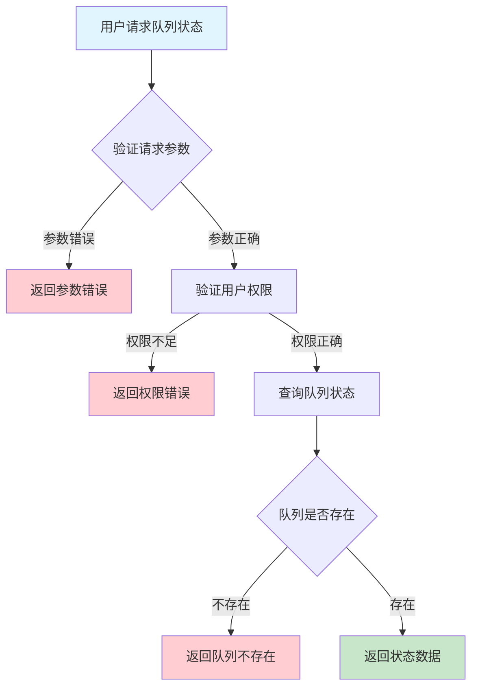
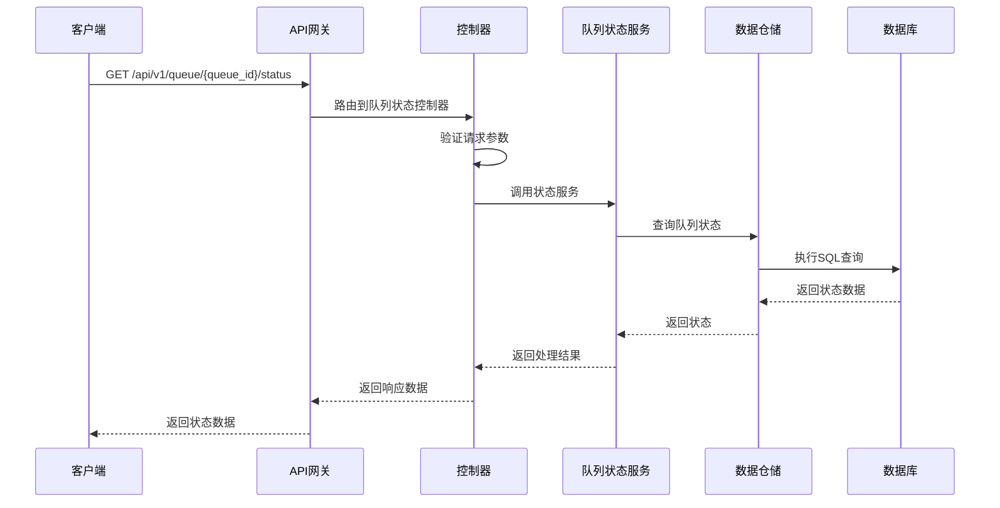

# 队列状态需求文档

## 1. 功能描述

### 1.1 功能概述
队列状态功能用于实时获取和监控队列的运行状态，包括队列当前容量、任务数量、活跃状态、阻塞状态、异常状态等，便于运维和自动化监控。

### 1.2 主要功能列表
- 查询队列当前状态
- 展示队列容量、任务数、活跃/阻塞/异常状态
- 支持状态变更通知

### 1.3 支持的功能特性
- 实时状态查询
- 多维度状态展示
- 状态变更事件推送

## 2. 功能目标

### 2.1 业务目标
- 提高队列可观测性
- 支持自动化运维和告警
- 降低故障响应时间

### 2.2 技术目标
- 实时高效状态采集
- 状态数据一致性保障
- 支持大规模队列监控

### 2.3 安全目标
- 状态数据访问权限控制
- 状态变更操作可审计
- 防止敏感状态泄露

## 3. 输入输出说明

### 3.1 输入参数

#### 3.1.1 必需参数
- `queue_id` (string): 队列ID

#### 3.1.2 可选参数
- `fields` (array): 需要查询的状态字段

### 3.2 输出参数

#### 3.2.1 成功响应
```json
{
  "code": 200,
  "message": "success",
  "data": {
    "queue_id": "queue_001",
    "capacity": 1000,
    "current_size": 200,
    "active": true,
    "blocked": false,
    "error": false,
    "last_updated": "2024-01-16T15:00:00Z"
  }
}
```

#### 3.2.2 错误响应
```json
{
  "code": 404,
  "message": "队列不存在",
  "data": null
}
```

### 3.3 参数格式和约束
- 队列ID：1-64字符，字母、数字、下划线
- fields：可选，字符串数组

## 4. 涉及接口以及接口设计

### 4.1 API接口定义

#### 4.1.1 查询队列状态
```go
// 查询队列状态
GET /api/v1/queue/{queue_id}/status
```

**请求参数：**
- Path参数：queue_id
- Query参数：fields

**响应结构：**
```go
type QueueStatusResponse struct {
    Code    int         `json:"code"`
    Message string      `json:"message"`
    Data    QueueStatus `json:"data"`
}

type QueueStatus struct {
    QueueID     string `json:"queue_id"`
    Capacity    int    `json:"capacity"`
    CurrentSize int    `json:"current_size"`
    Active      bool   `json:"active"`
    Blocked     bool   `json:"blocked"`
    Error       bool   `json:"error"`
    LastUpdated string `json:"last_updated"`
}
```

### 4.2 内部接口设计

#### 4.2.1 队列状态服务接口
```go
type QueueStatusService interface {
    GetStatus(ctx context.Context, queueID string, fields []string) (*QueueStatus, error)
}
```

#### 4.2.2 队列状态仓储接口
```go
type QueueStatusRepository interface {
    Get(ctx context.Context, queueID string) (*QueueStatus, error)
}
```

## 5. 数据结构设计

### 5.1 数据库表结构
- 复用 queue 表，增加状态字段

### 5.2 模型结构定义
```go
type QueueStatus struct {
    QueueID     string `json:"queue_id" db:"queue_id"`
    Capacity    int    `json:"capacity" db:"capacity"`
    CurrentSize int    `json:"current_size" db:"current_size"`
    Active      bool   `json:"active" db:"active"`
    Blocked     bool   `json:"blocked" db:"blocked"`
    Error       bool   `json:"error" db:"error"`
    LastUpdated string `json:"last_updated" db:"last_updated"`
}
```

### 5.3 数据关系说明
- 队列状态与队列表通过queue_id关联

## 6. 异常处理

### 6.1 输入验证异常
- 队列ID为空或格式错误

### 6.2 业务逻辑异常
- 队列不存在
- 权限不足

### 6.3 系统异常
- 数据库连接失败
- 状态采集超时
- 系统资源不足

## 7. 交互流程图



## 8. 交互时序图



## 9. 安全与权限

### 9.1 访问控制策略
- 需要用户身份验证
- 验证用户对队列状态的访问权限
- 支持基于角色的访问控制(RBAC)
- 记录所有状态查询操作

### 9.2 数据安全要求
- 敏感状态脱敏
- 状态数据加密存储
- 支持数据访问审计
- 防止SQL注入

### 9.3 身份验证机制
- JWT令牌
- API密钥
- 请求频率限制
- IP白名单

## 10. 日志与审计要求

### 10.1 操作日志要求
- 记录所有状态查询操作
- 记录参数和结果
- 记录操作人员身份
- 记录操作时间和IP

### 10.2 审计日志要求
- 记录状态访问轨迹
- 记录身份和权限
- 记录访问目的
- 支持长期保存

### 10.3 日志格式规范
```json
{
  "timestamp": "2024-01-16T15:00:00Z",
  "level": "INFO",
  "service": "queue-status",
  "operation": "get_queue_status",
  "user_id": "user_001",
  "queue_id": "queue_001",
  "parameters": {
    "fields": ["capacity", "current_size"]
  },
  "result": {
    "active": true,
    "blocked": false
  }
}
```

## 11. 测试用例

### 11.1 功能测试用例

#### 11.1.1 正常状态查询测试
**测试场景：** 查询队列状态
**输入数据：**
```json
{
  "queue_id": "queue_001"
}
```
**预期结果：**
- 返回状态码：200
- 返回队列状态数据

#### 11.1.2 指定字段查询测试
**测试场景：** 查询部分状态字段
**输入数据：**
```json
{
  "queue_id": "queue_001",
  "fields": ["capacity", "active"]
}
```
**预期结果：**
- 返回状态码：200
- 只包含指定字段

### 11.2 性能测试用例

#### 11.2.1 大量队列状态查询测试
**测试场景：** 并发查询1000个队列状态
**预期结果：**
- 响应时间 < 2秒
- 错误率 < 1%

### 11.3 安全测试用例

#### 11.3.1 权限验证测试
**测试场景：** 验证用户状态访问权限
**测试数据：**
- 用户A：有权限
- 用户B：无权限
**预期结果：**
- 用户A：成功查询
- 用户B：返回权限错误

#### 11.3.2 敏感状态脱敏测试
**测试场景：** 敏感状态脱敏
**输入数据：**
```json
{
  "queue_id": "queue_with_sensitive"
}
```
**预期结果：**
- 敏感状态脱敏
- 不影响可用性

### 11.4 异常测试用例

#### 11.4.1 队列不存在测试
**测试场景：** 查询不存在的队列状态
**输入数据：**
```json
{
  "queue_id": "non_existent_queue"
}
```
**预期结果：**
- 返回404
- 错误信息友好

#### 11.4.2 参数错误测试
**测试场景：** 参数错误
**输入数据：**
```json
{
  "queue_id": ""
}
```
**预期结果：**
- 返回参数验证错误
- 状态码400

#### 11.4.3 系统异常测试
**测试场景：** 数据库连接失败
**测试方法：** 临时关闭数据库
**预期结果：**
- 返回500
- 记录详细错误日志 