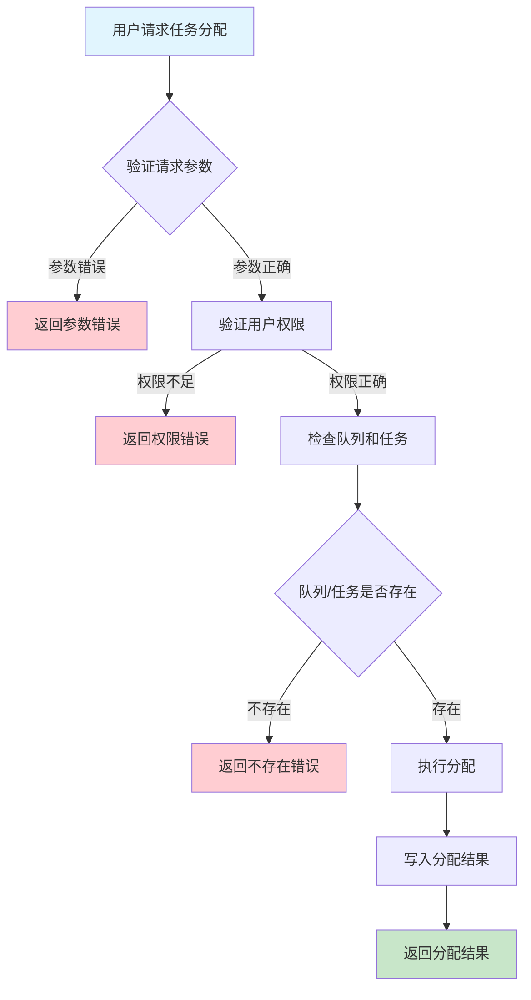
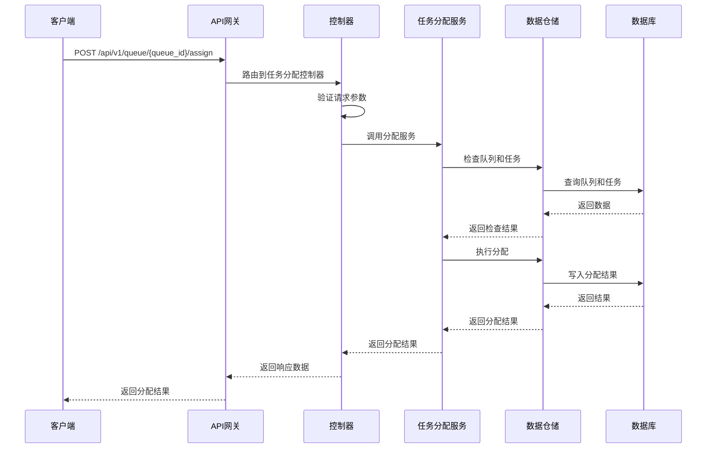

# 队列任务分配需求文档

## 1. 功能描述

### 1.1 功能概述
队列任务分配功能用于将任务按照一定策略分配到指定队列，实现任务的高效调度和负载均衡，支持多种分配策略和优先级。

### 1.2 主要功能列表
- 任务分配到队列
- 支持多种分配策略（轮询、优先级、加权等）
- 分配结果反馈
- 分配日志记录

### 1.3 支持的功能特性
- 策略灵活可配置
- 分配过程可追溯
- 支持批量分配

## 2. 功能目标

### 2.1 业务目标
- 提高任务调度效率
- 实现队列负载均衡
- 降低任务延迟

### 2.2 技术目标
- 高并发分配能力
- 分配策略可扩展
- 分配操作可追溯

### 2.3 安全目标
- 分配权限控制
- 分配操作可审计
- 防止非法分配

## 3. 输入输出说明

### 3.1 输入参数

#### 3.1.1 必需参数
- `queue_id` (string): 队列ID
- `task_ids` (array): 任务ID列表

#### 3.1.2 可选参数
- `strategy` (string): 分配策略（round_robin/priority/weighted等）
- `operator` (string): 操作人

### 3.2 输出参数

#### 3.2.1 成功响应
```json
{
  "code": 200,
  "message": "success",
  "data": {
    "queue_id": "queue_001",
    "assigned_tasks": ["task_001", "task_002"],
    "strategy": "round_robin",
    "assigned_at": "2024-01-16T15:30:00Z"
  }
}
```

#### 3.2.2 错误响应
```json
{
  "code": 400,
  "message": "参数错误或分配失败",
  "data": null
}
```

### 3.3 参数格式和约束
- 队列ID：1-64字符，字母、数字、下划线
- 任务ID：字符串数组，1-64字符
- 策略：round_robin、priority、weighted等

## 4. 涉及接口以及接口设计

### 4.1 API接口定义

#### 4.1.1 分配任务到队列
```go
// 分配任务到队列
POST /api/v1/queue/{queue_id}/assign
```

**请求参数：**
- Path参数：queue_id
- Body参数：task_ids, strategy, operator

**响应结构：**
```go
type QueueTaskAssignResponse struct {
    Code    int    `json:"code"`
    Message string `json:"message"`
    Data    struct {
        QueueID       string   `json:"queue_id"`
        AssignedTasks []string `json:"assigned_tasks"`
        Strategy      string   `json:"strategy"`
        AssignedAt    string   `json:"assigned_at"`
    } `json:"data"`
}
```

### 4.2 内部接口设计

#### 4.2.1 任务分配服务接口
```go
type QueueTaskAssignService interface {
    AssignTasks(ctx context.Context, queueID string, taskIDs []string, strategy string, operator string) (*QueueTaskAssignResult, error)
}
```

#### 4.2.2 任务分配仓储接口
```go
type QueueTaskAssignRepository interface {
    Assign(ctx context.Context, queueID string, taskIDs []string, strategy string) error
}
```

## 5. 数据结构设计

### 5.1 数据库表结构
- 复用 queue_task 表

### 5.2 模型结构定义
```go
type QueueTaskAssignRequest struct {
    QueueID  string   `json:"queue_id" v:"required"`
    TaskIDs  []string `json:"task_ids" v:"required"`
    Strategy string   `json:"strategy"`
    Operator string   `json:"operator"`
}

type QueueTaskAssignResult struct {
    QueueID       string   `json:"queue_id"`
    AssignedTasks []string `json:"assigned_tasks"`
    Strategy      string   `json:"strategy"`
    AssignedAt    string   `json:"assigned_at"`
}
```

### 5.3 数据关系说明
- 任务与队列通过queue_id和task_id关联

## 6. 异常处理

### 6.1 输入验证异常
- 队列ID或任务ID为空或格式错误
- 策略非法

### 6.2 业务逻辑异常
- 队列不存在
- 任务不存在
- 权限不足
- 分配失败

### 6.3 系统异常
- 数据库连接失败
- 分配超时
- 系统资源不足

## 7. 交互流程图



## 8. 交互时序图



## 9. 安全与权限

### 9.1 访问控制策略
- 需要用户身份验证
- 验证用户对任务分配的权限
- 支持基于角色的访问控制(RBAC)
- 记录所有分配操作

### 9.2 数据安全要求
- 防止非法分配
- 分配操作需二次确认（如高危分配）
- 支持数据访问审计
- 防止SQL注入

### 9.3 身份验证机制
- JWT令牌
- API密钥
- 请求频率限制
- IP白名单

## 10. 日志与审计要求

### 10.1 操作日志要求
- 记录所有分配操作
- 记录参数和结果
- 记录操作人员身份
- 记录操作时间和IP

### 10.2 审计日志要求
- 记录分配轨迹
- 记录身份和权限
- 记录操作目的
- 支持长期保存

### 10.3 日志格式规范
```json
{
  "timestamp": "2024-01-16T15:30:00Z",
  "level": "INFO",
  "service": "queue-task-assign",
  "operation": "assign_tasks",
  "user_id": "user_001",
  "queue_id": "queue_001",
  "parameters": {
    "task_ids": ["task_001", "task_002"],
    "strategy": "round_robin"
  },
  "result": {
    "assigned": true
  }
}
```

## 11. 测试用例

### 11.1 功能测试用例

#### 11.1.1 正常分配测试
**测试场景：** 分配任务到队列
**输入数据：**
```json
{
  "queue_id": "queue_001",
  "task_ids": ["task_001", "task_002"]
}
```
**预期结果：**
- 返回状态码：200
- 返回分配结果

#### 11.1.2 指定策略分配测试
**测试场景：** 使用优先级策略分配
**输入数据：**
```json
{
  "queue_id": "queue_001",
  "task_ids": ["task_003"],
  "strategy": "priority"
}
```
**预期结果：**
- 返回状态码：200
- 分配策略为priority

### 11.2 性能测试用例

#### 11.2.1 大量任务分配测试
**测试场景：** 并发分配1000个任务
**预期结果：**
- 响应时间 < 2秒
- 错误率 < 1%

### 11.3 安全测试用例

#### 11.3.1 权限验证测试
**测试场景：** 验证用户分配权限
**测试数据：**
- 用户A：有权限
- 用户B：无权限
**预期结果：**
- 用户A：成功分配
- 用户B：返回权限错误

#### 11.3.2 非法分配防护测试
**测试场景：** 非法分配
**输入数据：**
```json
{
  "queue_id": "queue_001",
  "task_ids": ["task_999"]
}
```
**预期结果：**
- 返回400
- 错误信息友好

### 11.4 异常测试用例

#### 11.4.1 队列不存在测试
**测试场景：** 分配到不存在的队列
**输入数据：**
```json
{
  "queue_id": "non_existent_queue",
  "task_ids": ["task_001"]
}
```
**预期结果：**
- 返回404
- 错误信息友好

#### 11.4.2 参数错误测试
**测试场景：** 参数错误
**输入数据：**
```json
{
  "queue_id": "",
  "task_ids": []
}
```
**预期结果：**
- 返回参数验证错误
- 状态码400

#### 11.4.3 系统异常测试
**测试场景：** 数据库连接失败
**测试方法：** 临时关闭数据库
**预期结果：**
- 返回500
- 记录详细错误日志 