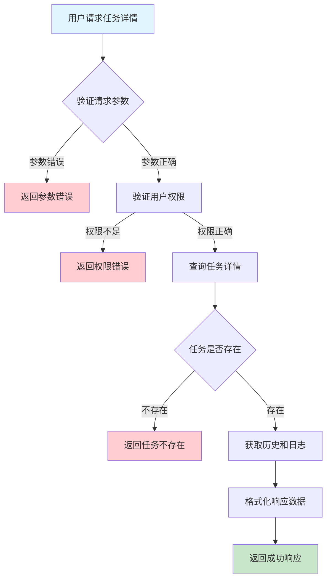
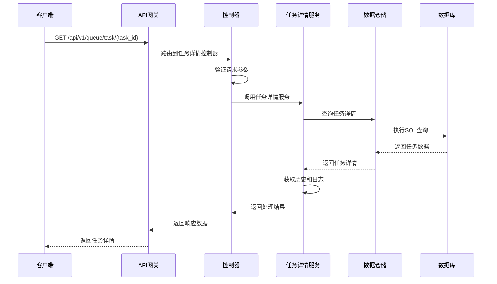

# 队列任务详情需求文档

## 1. 功能描述

### 1.1 功能概述
队列任务详情功能用于获取指定任务的详细信息，包括任务属性、状态、执行历史、日志等，便于任务跟踪和问题排查。

### 1.2 主要功能列表
- 查询任务详细信息
- 展示任务属性、状态、执行历史
- 支持任务日志查看
- 支持详情导出

### 1.3 支持的功能特性
- 结构化详情展示
- 任务执行历史可追溯
- 日志关联展示

## 2. 功能目标

### 2.1 业务目标
- 提高任务跟踪与分析能力
- 支持任务问题快速定位
- 优化任务运维体验

### 2.2 技术目标
- 高效查询单个任务详情
- 支持复杂数据结构解析
- 数据一致性保障

### 2.3 安全目标
- 任务详情访问权限控制
- 敏感信息保护
- 操作可审计

## 3. 输入输出说明

### 3.1 输入参数

#### 3.1.1 必需参数
- `task_id` (string): 任务ID

#### 3.1.2 可选参数
- `include_history` (boolean): 是否包含执行历史，默认true
- `include_logs` (boolean): 是否包含日志，默认false

### 3.2 输出参数

#### 3.2.1 成功响应
```json
{
  "code": 200,
  "message": "success",
  "data": {
    "task_id": "task_001",
    "queue_id": "queue_001",
    "status": "running",
    "priority": "high",
    "attributes": {"type": "job"},
    "created_at": "2024-01-16T16:20:00Z",
    "updated_at": "2024-01-16T16:30:00Z",
    "history": [
      {"status": "pending", "timestamp": "2024-01-16T16:20:00Z"},
      {"status": "running", "timestamp": "2024-01-16T16:25:00Z"}
    ],
    "logs": [
      {"level": "INFO", "message": "任务启动", "timestamp": "2024-01-16T16:25:01Z"}
    ]
  }
}
```

#### 3.2.2 错误响应
```json
{
  "code": 404,
  "message": "任务不存在",
  "data": null
}
```

### 3.3 参数格式和约束
- 任务ID：1-64字符，字母、数字、下划线
- 布尔参数：true/false

## 4. 涉及接口以及接口设计

### 4.1 API接口定义

#### 4.1.1 查询任务详情
```go
// 查询任务详情
GET /api/v1/queue/task/{task_id}
```

**请求参数：**
- Path参数：task_id
- Query参数：include_history, include_logs

**响应结构：**
```go
type QueueTaskDetailResponse struct {
    Code    int            `json:"code"`
    Message string         `json:"message"`
    Data    QueueTaskDetail `json:"data"`
}

type QueueTaskDetail struct {
    TaskID     string                 `json:"task_id"`
    QueueID    string                 `json:"queue_id"`
    Status     string                 `json:"status"`
    Priority   string                 `json:"priority"`
    Attributes map[string]interface{} `json:"attributes"`
    CreatedAt  string                 `json:"created_at"`
    UpdatedAt  string                 `json:"updated_at"`
    History    []TaskHistory          `json:"history"`
    Logs       []TaskLog              `json:"logs"`
}

type TaskHistory struct {
    Status    string `json:"status"`
    Timestamp string `json:"timestamp"`
}

type TaskLog struct {
    Level     string `json:"level"`
    Message   string `json:"message"`
    Timestamp string `json:"timestamp"`
}
```

### 4.2 内部接口设计

#### 4.2.1 任务详情服务接口
```go
type QueueTaskDetailService interface {
    GetTaskDetail(ctx context.Context, taskID string, includeHistory, includeLogs bool) (*QueueTaskDetail, error)
}
```

#### 4.2.2 任务详情仓储接口
```go
type QueueTaskDetailRepository interface {
    GetByID(ctx context.Context, taskID string) (*QueueTaskDetail, error)
    GetHistory(ctx context.Context, taskID string) ([]TaskHistory, error)
    GetLogs(ctx context.Context, taskID string) ([]TaskLog, error)
}
```

## 5. 数据结构设计

### 5.1 数据库表结构
- 复用 queue_task 表
- 新增 task_history、task_log 表

#### 5.1.1 任务历史表 (task_history)
```sql
CREATE TABLE task_history (
    id BIGINT AUTO_INCREMENT PRIMARY KEY COMMENT '历史ID',
    task_id VARCHAR(64) NOT NULL COMMENT '任务ID',
    status VARCHAR(32) NOT NULL COMMENT '状态',
    timestamp TIMESTAMP DEFAULT CURRENT_TIMESTAMP COMMENT '变更时间',
    INDEX idx_task_id (task_id),
    FOREIGN KEY (task_id) REFERENCES queue_task(task_id) ON DELETE CASCADE
) ENGINE=InnoDB DEFAULT CHARSET=utf8mb4 COMMENT='任务历史表';
```

#### 5.1.2 任务日志表 (task_log)
```sql
CREATE TABLE task_log (
    id BIGINT AUTO_INCREMENT PRIMARY KEY COMMENT '日志ID',
    task_id VARCHAR(64) NOT NULL COMMENT '任务ID',
    level VARCHAR(16) NOT NULL COMMENT '日志级别',
    message TEXT NOT NULL COMMENT '日志内容',
    timestamp TIMESTAMP DEFAULT CURRENT_TIMESTAMP COMMENT '日志时间',
    INDEX idx_task_id (task_id),
    FOREIGN KEY (task_id) REFERENCES queue_task(task_id) ON DELETE CASCADE
) ENGINE=InnoDB DEFAULT CHARSET=utf8mb4 COMMENT='任务日志表';
```

### 5.2 模型结构定义
```go
type QueueTaskDetail struct {
    TaskID     string                 `json:"task_id" db:"task_id"`
    QueueID    string                 `json:"queue_id" db:"queue_id"`
    Status     string                 `json:"status" db:"status"`
    Priority   string                 `json:"priority" db:"priority"`
    Attributes map[string]interface{} `json:"attributes" db:"attributes"`
    CreatedAt  string                 `json:"created_at" db:"created_at"`
    UpdatedAt  string                 `json:"updated_at" db:"updated_at"`
    History    []TaskHistory          `json:"history"`
    Logs       []TaskLog              `json:"logs"`
}

type TaskHistory struct {
    Status    string `json:"status" db:"status"`
    Timestamp string `json:"timestamp" db:"timestamp"`
}

type TaskLog struct {
    Level     string `json:"level" db:"level"`
    Message   string `json:"message" db:"message"`
    Timestamp string `json:"timestamp" db:"timestamp"`
}
```

### 5.3 数据关系说明
- 任务详情与队列通过queue_id关联
- 任务历史、日志与任务通过task_id关联

## 6. 异常处理

### 6.1 输入验证异常
- 任务ID为空或格式错误

### 6.2 业务逻辑异常
- 任务不存在
- 权限不足

### 6.3 系统异常
- 数据库连接失败
- 查询超时
- 系统资源不足

## 7. 交互流程图



## 8. 交互时序图



## 9. 安全与权限

### 9.1 访问控制策略
- 需要用户身份验证
- 验证用户对任务详情的访问权限
- 支持基于角色的访问控制(RBAC)
- 记录所有详情访问操作

### 9.2 数据安全要求
- 敏感信息脱敏
- 详情数据加密存储
- 支持数据访问审计
- 防止SQL注入

### 9.3 身份验证机制
- JWT令牌
- API密钥
- 请求频率限制
- IP白名单

## 10. 日志与审计要求

### 10.1 操作日志要求
- 记录所有详情访问操作
- 记录参数和结果
- 记录操作人员身份
- 记录操作时间和IP

### 10.2 审计日志要求
- 记录访问轨迹
- 记录身份和权限
- 记录访问目的
- 支持长期保存

### 10.3 日志格式规范
```json
{
  "timestamp": "2024-01-16T16:20:00Z",
  "level": "INFO",
  "service": "queue-task-detail",
  "operation": "get_task_detail",
  "user_id": "user_001",
  "task_id": "task_001",
  "parameters": {
    "include_history": true,
    "include_logs": false
  },
  "result": {
    "found": true
  }
}
```

## 11. 测试用例

### 11.1 功能测试用例

#### 11.1.1 正常查询测试
**测试场景：** 查询任务详情
**输入数据：**
```json
{
  "task_id": "task_001"
}
```
**预期结果：**
- 返回状态码：200
- 返回任务详细信息

#### 11.1.2 不含历史和日志测试
**测试场景：** 不包含历史和日志
**输入数据：**
```json
{
  "task_id": "task_001",
  "include_history": false,
  "include_logs": false
}
```
**预期结果：**
- 返回状态码：200
- 不包含history和logs字段

### 11.2 性能测试用例

#### 11.2.1 大量历史和日志查询测试
**测试场景：** 查询包含大量历史和日志的任务
**测试数据：** 1000条历史、1000条日志
**预期结果：**
- 查询响应时间 < 1秒
- 数据完整

### 11.3 安全测试用例

#### 11.3.1 权限验证测试
**测试场景：** 验证用户访问权限
**测试数据：**
- 用户A：有任务访问权限
- 用户B：无任务访问权限
**预期结果：**
- 用户A：成功获取详情
- 用户B：返回权限错误

#### 11.3.2 敏感信息脱敏测试
**测试场景：** 敏感信息脱敏
**输入数据：**
```json
{
  "task_id": "task_with_sensitive"
}
```
**预期结果：**
- 敏感信息脱敏
- 不影响可读性

### 11.4 异常测试用例

#### 11.4.1 任务不存在测试
**测试场景：** 查询不存在的任务
**输入数据：**
```json
{
  "task_id": "non_existent_task"
}
```
**预期结果：**
- 返回404
- 错误信息友好

#### 11.4.2 参数错误测试
**测试场景：** 参数错误
**输入数据：**
```json
{
  "task_id": ""
}
```
**预期结果：**
- 返回参数验证错误
- 状态码400

#### 11.4.3 系统异常测试
**测试场景：** 数据库连接失败
**测试方法：** 临时关闭数据库
**预期结果：**
- 返回500
- 记录详细错误日志 