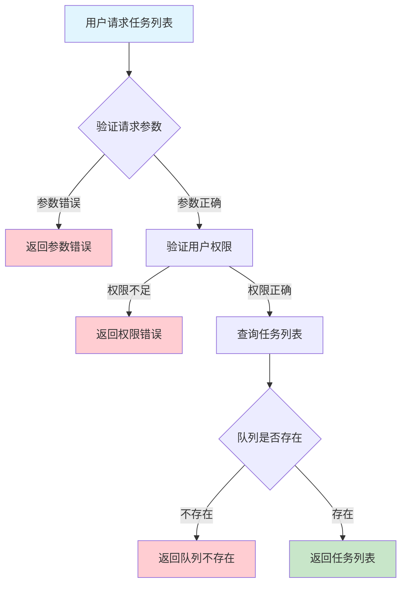
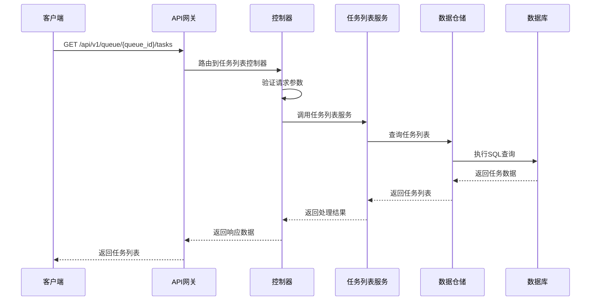

# 队列任务列表需求文档

## 1. 功能描述

### 1.1 功能概述
队列任务列表功能用于查询指定队列下的所有任务，支持多条件筛选、分页、排序，便于任务管理和监控。

### 1.2 主要功能列表
- 查询队列下所有任务
- 支持按状态、优先级、时间等筛选
- 支持分页与排序
- 支持导出任务列表

### 1.3 支持的功能特性
- 多条件灵活筛选
- 分页高效查询
- 列表导出

## 2. 功能目标

### 2.1 业务目标
- 提高任务管理效率
- 支持大规模任务查询
- 便于任务监控与分析

### 2.2 技术目标
- 高效分页查询
- 支持复杂筛选条件
- 数据一致性保障

### 2.3 安全目标
- 任务列表访问权限控制
- 查询操作可审计
- 防止敏感信息泄露

## 3. 输入输出说明

### 3.1 输入参数

#### 3.1.1 必需参数
- `queue_id` (string): 队列ID

#### 3.1.2 可选参数
- `status` (string): 任务状态
- `priority` (string): 任务优先级
- `page` (int): 页码
- `page_size` (int): 每页数量
- `sort_by` (string): 排序字段
- `order` (string): 排序方式（asc/desc）

### 3.2 输出参数

#### 3.2.1 成功响应
```json
{
  "code": 200,
  "message": "success",
  "data": {
    "tasks": [
      {
        "task_id": "task_001",
        "status": "pending",
        "priority": "high",
        "created_at": "2024-01-16T16:00:00Z",
        "updated_at": "2024-01-16T16:10:00Z"
      }
    ],
    "total": 1,
    "page": 1,
    "page_size": 20
  }
}
```

#### 3.2.2 错误响应
```json
{
  "code": 400,
  "message": "参数错误或无权限",
  "data": null
}
```

### 3.3 参数格式和约束
- 队列ID：1-64字符，字母、数字、下划线
- 状态、优先级：字符串
- 分页：page>=1, page_size<=100

## 4. 涉及接口以及接口设计

### 4.1 API接口定义

#### 4.1.1 查询队列任务列表
```go
// 查询队列任务列表
GET /api/v1/queue/{queue_id}/tasks
```

**请求参数：**
- Path参数：queue_id
- Query参数：status, priority, page, page_size, sort_by, order

**响应结构：**
```go
type QueueTaskListResponse struct {
    Code    int    `json:"code"`
    Message string `json:"message"`
    Data    struct {
        Tasks    []QueueTask `json:"tasks"`
        Total    int         `json:"total"`
        Page     int         `json:"page"`
        PageSize int         `json:"page_size"`
    } `json:"data"`
}

type QueueTask struct {
    TaskID    string `json:"task_id"`
    Status    string `json:"status"`
    Priority  string `json:"priority"`
    CreatedAt string `json:"created_at"`
    UpdatedAt string `json:"updated_at"`
}
```

### 4.2 内部接口设计

#### 4.2.1 任务列表服务接口
```go
type QueueTaskListService interface {
    ListTasks(ctx context.Context, queueID string, filter QueueTaskListFilter) ([]QueueTask, int, error)
}
```

#### 4.2.2 任务列表仓储接口
```go
type QueueTaskListRepository interface {
    Query(ctx context.Context, queueID string, filter QueueTaskListFilter) ([]QueueTask, int, error)
}
```

## 5. 数据结构设计

### 5.1 数据库表结构
- 复用 queue_task 表

### 5.2 模型结构定义
```go
type QueueTaskListFilter struct {
    Status    string
    Priority  string
    Page      int
    PageSize  int
    SortBy    string
    Order     string
}

type QueueTask struct {
    TaskID    string `json:"task_id" db:"task_id"`
    Status    string `json:"status" db:"status"`
    Priority  string `json:"priority" db:"priority"`
    CreatedAt string `json:"created_at" db:"created_at"`
    UpdatedAt string `json:"updated_at" db:"updated_at"`
}
```

### 5.3 数据关系说明
- 任务与队列通过queue_id关联

## 6. 异常处理

### 6.1 输入验证异常
- 队列ID为空或格式错误
- 分页参数非法

### 6.2 业务逻辑异常
- 队列不存在
- 权限不足

### 6.3 系统异常
- 数据库连接失败
- 查询超时
- 系统资源不足

## 7. 交互流程图



## 8. 交互时序图



## 9. 安全与权限

### 9.1 访问控制策略
- 需要用户身份验证
- 验证用户对任务列表的访问权限
- 支持基于角色的访问控制(RBAC)
- 记录所有任务列表查询操作

### 9.2 数据安全要求
- 敏感信息脱敏
- 任务数据加密存储
- 支持数据访问审计
- 防止SQL注入

### 9.3 身份验证机制
- JWT令牌
- API密钥
- 请求频率限制
- IP白名单

## 10. 日志与审计要求

### 10.1 操作日志要求
- 记录所有任务列表查询操作
- 记录参数和结果
- 记录操作人员身份
- 记录操作时间和IP

### 10.2 审计日志要求
- 记录任务列表访问轨迹
- 记录身份和权限
- 记录访问目的
- 支持长期保存

### 10.3 日志格式规范
```json
{
  "timestamp": "2024-01-16T16:00:00Z",
  "level": "INFO",
  "service": "queue-task-list",
  "operation": "list_tasks",
  "user_id": "user_001",
  "queue_id": "queue_001",
  "parameters": {
    "status": "pending",
    "page": 1
  },
  "result": {
    "total": 1
  }
}
```

## 11. 测试用例

### 11.1 功能测试用例

#### 11.1.1 正常查询测试
**测试场景：** 查询队列任务列表
**输入数据：**
```json
{
  "queue_id": "queue_001"
}
```
**预期结果：**
- 返回状态码：200
- 返回任务列表

#### 11.1.2 条件筛选测试
**测试场景：** 按状态筛选
**输入数据：**
```json
{
  "queue_id": "queue_001",
  "status": "pending"
}
```
**预期结果：**
- 返回状态码：200
- 只包含pending状态任务

### 11.2 性能测试用例

#### 11.2.1 大量任务查询测试
**测试场景：** 并发查询1000个队列任务
**预期结果：**
- 响应时间 < 2秒
- 错误率 < 1%

### 11.3 安全测试用例

#### 11.3.1 权限验证测试
**测试场景：** 验证用户任务列表访问权限
**测试数据：**
- 用户A：有权限
- 用户B：无权限
**预期结果：**
- 用户A：成功查询
- 用户B：返回权限错误

#### 11.3.2 敏感信息脱敏测试
**测试场景：** 敏感信息脱敏
**输入数据：**
```json
{
  "queue_id": "queue_with_sensitive"
}
```
**预期结果：**
- 敏感字段脱敏
- 不影响可用性

### 11.4 异常测试用例

#### 11.4.1 队列不存在测试
**测试场景：** 查询不存在的队列任务
**输入数据：**
```json
{
  "queue_id": "non_existent_queue"
}
```
**预期结果：**
- 返回404
- 错误信息友好

#### 11.4.2 参数错误测试
**测试场景：** 参数错误
**输入数据：**
```json
{
  "queue_id": "",
  "page": 0
}
```
**预期结果：**
- 返回参数验证错误
- 状态码400

#### 11.4.3 系统异常测试
**测试场景：** 数据库连接失败
**测试方法：** 临时关闭数据库
**预期结果：**
- 返回500
- 记录详细错误日志 