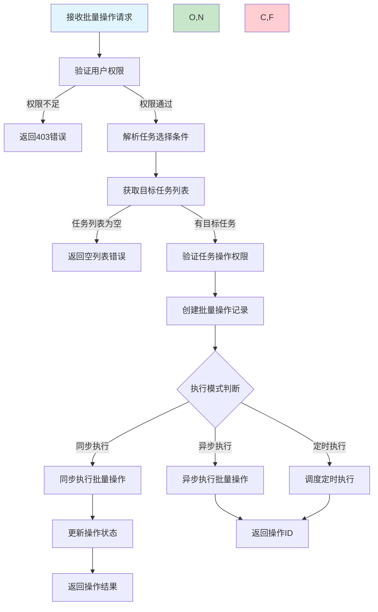
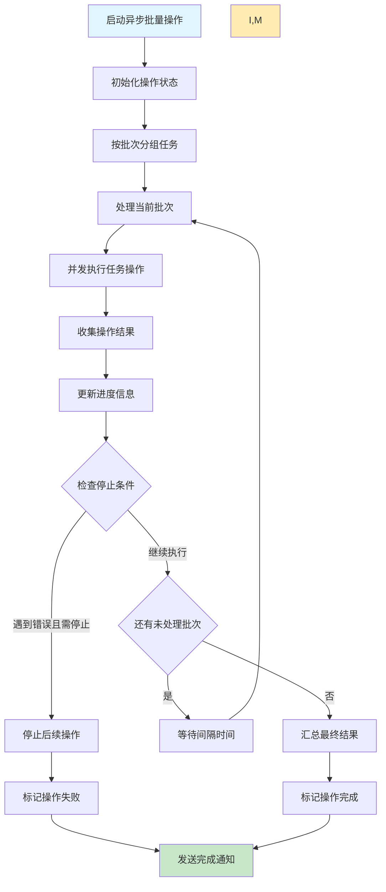
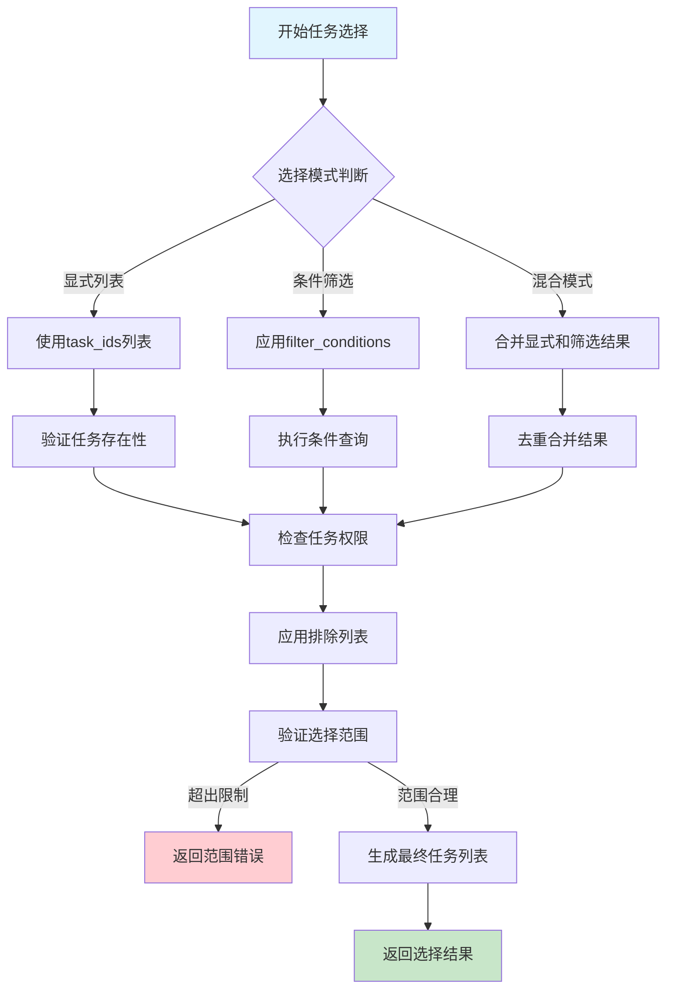

# 任务批量操作需求文档

## 1. 功能描述

### 1.1 功能概述
任务批量操作功能提供对多个任务的统一管理能力，支持批量创建、启动、停止、删除、更新等操作，提高任务管理的效率和便利性。

### 1.2 主要功能列表
- 批量任务创建
- 批量任务启动和停止
- 批量任务删除和恢复
- 批量任务配置更新
- 批量状态查询和监控
- 批量操作进度跟踪
- 批量操作结果报告

### 1.3 操作类型
- **同步批量操作**：所有任务同时执行操作
- **异步批量操作**：任务按顺序或分组执行操作
- **条件批量操作**：基于条件筛选的批量操作
- **定时批量操作**：定时执行的批量操作

## 2. 功能目标

### 2.1 业务目标
- 提高任务管理的操作效率
- 减少重复性的任务操作
- 支持大规模任务的统一管理
- 确保批量操作的一致性

### 2.2 技术目标
- 单次批量操作支持1000+任务
- 批量操作响应时间小于5秒
- 操作成功率达到99%以上
- 支持操作进度的实时反馈

### 2.3 安全目标
- 批量操作的权限验证
- 操作范围的安全限制
- 批量操作的审计记录
- 危险操作的确认机制

## 3. 输入输出

### 3.1 输入参数

#### 3.1.1 批量选择参数
- `task_ids` (array): 任务ID列表
- `filter_conditions` (object): 筛选条件
- `exclude_task_ids` (array): 排除的任务ID
- `selection_mode` (string): 选择模式，explicit/filter/mixed

#### 3.1.2 批量操作参数
- `operation_type` (string): 操作类型
- `execution_mode` (string): 执行模式，sync/async/scheduled
- `batch_size` (int): 批次大小，默认100
- `max_concurrency` (int): 最大并发数，默认10
- `operation_config` (object): 操作特定配置

#### 3.1.3 操作配置参数
- `timeout` (int): 操作超时时间
- `retry_on_failure` (boolean): 失败时是否重试
- `stop_on_error` (boolean): 遇到错误是否停止
- `confirmation_required` (boolean): 是否需要确认

### 3.2 输出参数

#### 3.2.1 批量操作响应
```json
{
  "code": 200,
  "message": "批量操作已启动",
  "data": {
    "batch_operation_id": "batch_20240116_001",
    "operation_type": "start_tasks",
    "total_tasks": 150,
    "execution_mode": "async",
    "estimated_duration": 300,
    "started_at": "2024-01-16T21:00:00Z",
    "progress": {
      "completed": 0,
      "failed": 0,
      "pending": 150,
      "percentage": 0
    },
    "status": "running"
  }
}
```

#### 3.2.2 批量操作状态响应
```json
{
  "code": 200,
  "message": "查询成功",
  "data": {
    "batch_operation_id": "batch_20240116_001",
    "operation_type": "start_tasks",
    "status": "completed",
    "progress": {
      "completed": 145,
      "failed": 5,
      "pending": 0,
      "percentage": 100
    },
    "results": {
      "successful_tasks": ["task_001", "task_002"],
      "failed_tasks": [
        {
          "task_id": "task_003",
          "error": "Task is already running",
          "error_code": "TASK_ALREADY_RUNNING"
        }
      ]
    },
    "started_at": "2024-01-16T21:00:00Z",
    "completed_at": "2024-01-16T21:05:30Z",
    "duration": 330
  }
}
```

## 4. 接口设计

### 4.1 API接口定义

#### 4.1.1 批量启动任务
```
POST /api/v1/tasks/batch/start
Content-Type: application/json
Authorization: Bearer {token}
```

**请求体示例：**
```json
{
  "selection": {
    "task_ids": ["task_001", "task_002", "task_003"],
    "filter_conditions": {
      "status": ["pending", "stopped"],
      "tags": ["production"],
      "created_after": "2024-01-15T00:00:00Z"
    },
    "selection_mode": "mixed"
  },
  "execution_config": {
    "execution_mode": "async",
    "batch_size": 50,
    "max_concurrency": 5,
    "stop_on_error": false,
    "timeout": 300
  }
}
```

#### 4.1.2 批量停止任务
```
POST /api/v1/tasks/batch/stop
Content-Type: application/json
```

#### 4.1.3 批量删除任务
```
POST /api/v1/tasks/batch/delete
Content-Type: application/json
```

#### 4.1.4 批量更新任务
```
POST /api/v1/tasks/batch/update
Content-Type: application/json
```

**请求体示例：**
```json
{
  "selection": {
    "filter_conditions": {
      "category": "data-processing",
      "status": ["pending"]
    }
  },
  "update_config": {
    "timeout": 7200,
    "retry_policy": {
      "max_retries": 5,
      "retry_delay": 120
    },
    "tags": ["updated", "optimized"]
  },
  "execution_config": {
    "execution_mode": "sync",
    "confirmation_required": true
  }
}
```

#### 4.1.5 查询批量操作状态
```
GET /api/v1/tasks/batch/{batch_operation_id}/status
```

#### 4.1.6 取消批量操作
```
POST /api/v1/tasks/batch/{batch_operation_id}/cancel
```

### 4.2 内部服务接口
```go
type TaskBatchService interface {
    StartBatchOperation(ctx context.Context, req *BatchOperationRequest) (*BatchOperationResponse, error)
    GetBatchOperationStatus(ctx context.Context, batchID string) (*BatchOperationStatus, error)
    CancelBatchOperation(ctx context.Context, batchID string) error
    ListBatchOperations(ctx context.Context, req *ListBatchOperationsRequest) (*ListBatchOperationsResponse, error)
    RetryFailedTasks(ctx context.Context, batchID string) (*BatchOperationResponse, error)
}
```

## 5. 数据结构

### 5.1 批量操作表（batch_operations）
```sql
CREATE TABLE batch_operations (
    id BIGINT AUTO_INCREMENT PRIMARY KEY COMMENT '主键ID',
    batch_operation_id VARCHAR(64) UNIQUE NOT NULL COMMENT '批量操作ID',
    operation_type ENUM('start', 'stop', 'delete', 'update', 'create') NOT NULL COMMENT '操作类型',
    selection_criteria JSON NOT NULL COMMENT '选择条件',
    operation_config JSON NOT NULL COMMENT '操作配置',
    execution_mode ENUM('sync', 'async', 'scheduled') NOT NULL COMMENT '执行模式',
    status ENUM('pending', 'running', 'completed', 'failed', 'cancelled') DEFAULT 'pending' COMMENT '状态',
    total_tasks INT NOT NULL COMMENT '总任务数',
    completed_tasks INT DEFAULT 0 COMMENT '完成任务数',
    failed_tasks INT DEFAULT 0 COMMENT '失败任务数',
    progress_percentage DECIMAL(5,2) DEFAULT 0.00 COMMENT '进度百分比',
    started_at DATETIME COMMENT '开始时间',
    completed_at DATETIME COMMENT '完成时间',
    estimated_duration INT COMMENT '预计耗时(秒)',
    actual_duration INT COMMENT '实际耗时(秒)',
    created_by VARCHAR(64) NOT NULL COMMENT '创建人',
    created_at DATETIME DEFAULT CURRENT_TIMESTAMP COMMENT '创建时间',
    INDEX idx_operation_type (operation_type),
    INDEX idx_status (status),
    INDEX idx_created_by (created_by),
    INDEX idx_started_at (started_at)
) COMMENT='批量操作表';
```

### 5.2 批量操作任务表（batch_operation_tasks）
```sql
CREATE TABLE batch_operation_tasks (
    id BIGINT AUTO_INCREMENT PRIMARY KEY COMMENT '主键ID',
    batch_operation_id VARCHAR(64) NOT NULL COMMENT '批量操作ID',
    task_id VARCHAR(64) NOT NULL COMMENT '任务ID',
    operation_status ENUM('pending', 'processing', 'completed', 'failed', 'skipped') DEFAULT 'pending' COMMENT '操作状态',
    error_message TEXT COMMENT '错误信息',
    error_code VARCHAR(64) COMMENT '错误代码',
    started_at DATETIME COMMENT '开始时间',
    completed_at DATETIME COMMENT '完成时间',
    processing_time INT COMMENT '处理时间(毫秒)',
    retry_count INT DEFAULT 0 COMMENT '重试次数',
    INDEX idx_batch_operation_id (batch_operation_id),
    INDEX idx_task_id (task_id),
    INDEX idx_operation_status (operation_status),
    UNIQUE KEY uk_batch_task (batch_operation_id, task_id)
) COMMENT='批量操作任务表';
```

### 5.3 Go数据结构
```go
type BatchOperationRequest struct {
    OperationType    string                 `json:"operation_type" v:"required|in:start,stop,delete,update,create"`
    Selection        *TaskSelection         `json:"selection" v:"required"`
    OperationConfig  map[string]interface{} `json:"operation_config"`
    ExecutionConfig  *ExecutionConfig       `json:"execution_config"`
}

type TaskSelection struct {
    TaskIDs          []string               `json:"task_ids"`
    FilterConditions map[string]interface{} `json:"filter_conditions"`
    ExcludeTaskIDs   []string               `json:"exclude_task_ids"`
    SelectionMode    string                 `json:"selection_mode" v:"in:explicit,filter,mixed"`
}

type ExecutionConfig struct {
    ExecutionMode        string `json:"execution_mode" v:"in:sync,async,scheduled"`
    BatchSize           int    `json:"batch_size" v:"min:1,max:1000"`
    MaxConcurrency      int    `json:"max_concurrency" v:"min:1,max:100"`
    Timeout             int    `json:"timeout" v:"min:1"`
    StopOnError         bool   `json:"stop_on_error"`
    RetryOnFailure      bool   `json:"retry_on_failure"`
    ConfirmationRequired bool   `json:"confirmation_required"`
}

type BatchOperationResponse struct {
    BatchOperationID    string                `json:"batch_operation_id"`
    OperationType       string                `json:"operation_type"`
    TotalTasks          int                   `json:"total_tasks"`
    ExecutionMode       string                `json:"execution_mode"`
    EstimatedDuration   int                   `json:"estimated_duration"`
    StartedAt           string                `json:"started_at"`
    Progress            *OperationProgress    `json:"progress"`
    Status              string                `json:"status"`
}

type OperationProgress struct {
    Completed   int     `json:"completed"`
    Failed      int     `json:"failed"`
    Pending     int     `json:"pending"`
    Percentage  float64 `json:"percentage"`
}

type BatchOperationStatus struct {
    BatchOperationID string                `json:"batch_operation_id"`
    OperationType    string                `json:"operation_type"`
    Status           string                `json:"status"`
    Progress         *OperationProgress    `json:"progress"`
    Results          *OperationResults     `json:"results"`
    StartedAt        string                `json:"started_at"`
    CompletedAt      string                `json:"completed_at,omitempty"`
    Duration         int                   `json:"duration"`
}

type OperationResults struct {
    SuccessfulTasks []string      `json:"successful_tasks"`
    FailedTasks     []FailedTask  `json:"failed_tasks"`
}

type FailedTask struct {
    TaskID    string `json:"task_id"`
    Error     string `json:"error"`
    ErrorCode string `json:"error_code"`
}

type ListBatchOperationsRequest struct {
    OperationType string `json:"operation_type"`
    Status        string `json:"status"`
    CreatedBy     string `json:"created_by"`
    StartTime     string `json:"start_time"`
    EndTime       string `json:"end_time"`
    Page          int    `json:"page" v:"min:1"`
    PageSize      int    `json:"page_size" v:"min:1,max:100"`
}
```

## 6. 异常处理

### 6.1 选择异常
- **无效选择条件**：任务选择条件格式错误或无效
- **任务不存在**：指定的任务ID不存在
- **权限不足**：对某些任务没有操作权限
- **选择范围过大**：选择的任务数量超出限制

### 6.2 执行异常
- **批量操作超时**：批量操作执行超时
- **并发冲突**：多个批量操作产生冲突
- **资源不足**：系统资源不足以执行批量操作
- **部分失败**：部分任务操作失败

### 6.3 状态异常
- **状态不一致**：任务状态与期望状态不符
- **操作被取消**：批量操作被用户取消
- **系统异常**：系统故障导致操作中断
- **重复操作**：对已处理的任务重复操作

## 7. 流程图

### 7.1 批量操作执行流程



### 7.2 异步批量操作流程



### 7.3 任务选择流程



## 8. 安全性考虑

### 8.1 权限控制
- **批量操作权限**：验证用户是否有批量操作的权限
- **任务级权限**：验证用户对每个任务的操作权限
- **操作范围限制**：限制单次批量操作的任务数量
- **危险操作确认**：删除等危险操作需要额外确认

### 8.2 操作安全
- **操作隔离**：确保不同用户的批量操作相互隔离
- **状态验证**：操作前验证任务的当前状态
- **回滚机制**：支持部分操作的回滚
- **操作日志**：记录详细的操作日志用于审计

### 8.3 系统保护
- **资源限制**：限制并发批量操作的数量
- **超时保护**：设置合理的操作超时时间
- **错误处理**：优雅处理各种异常情况
- **监控告警**：监控批量操作的异常情况

## 9. 日志与监控

### 9.1 操作日志
- **批量操作启动**：记录批量操作的启动信息
- **进度更新**：记录批量操作的进度变化
- **错误记录**：记录操作过程中的错误信息
- **完成状态**：记录批量操作的最终结果

### 9.2 性能监控
- **操作耗时**：监控批量操作的执行时间
- **成功率**：监控批量操作的成功率
- **并发度**：监控系统的并发批量操作数量
- **资源使用**：监控批量操作的资源消耗

### 9.3 业务监控
- **操作频率**：统计批量操作的使用频率
- **热门操作**：分析最常用的批量操作类型
- **用户使用**：统计不同用户的批量操作使用情况
- **错误分析**：分析批量操作失败的原因

### 9.4 日志格式
```json
{
  "timestamp": "2024-01-16T21:00:00Z",
  "level": "INFO",
  "service": "task-batch",
  "operation": "batch_start_tasks",
  "batch_operation_id": "batch_20240116_001",
  "user_id": "user_123",
  "total_tasks": 150,
  "completed_tasks": 45,
  "failed_tasks": 2,
  "progress_percentage": 30.0,
  "processing_time_ms": 15000,
  "result": "in_progress"
}
```

## 10. 测试用例

### 10.1 功能测试用例

#### 10.1.1 批量启动任务测试
**测试目标：** 验证批量启动任务功能

**测试用例：**
- 批量启动指定ID列表的任务
- 基于条件筛选批量启动任务
- 混合模式批量启动任务
- 验证权限控制功能

**预期结果：** 所有符合条件的任务正确启动

#### 10.1.2 批量操作进度跟踪测试
**测试目标：** 验证批量操作进度跟踪功能

**测试场景：** 启动大量任务并跟踪执行进度
**预期结果：** 进度信息实时更新，准确反映操作状态

#### 10.1.3 批量操作错误处理测试
**测试目标：** 验证批量操作的错误处理机制

**测试场景：**
- 部分任务操作失败
- 批量操作超时
- 操作被取消

**预期结果：** 错误正确处理，提供详细的错误信息

#### 10.1.4 批量更新任务配置测试
**测试目标：** 验证批量更新任务配置功能

**测试场景：** 批量修改任务的超时时间和重试策略
**预期结果：** 所有任务配置正确更新

### 10.2 性能测试用例

#### 10.2.1 大规模批量操作测试
**测试目标：** 验证大规模批量操作的性能

**测试场景：** 批量操作1000个任务
**预期结果：** 操作在合理时间内完成，系统稳定

#### 10.2.2 并发批量操作测试
**测试目标：** 验证并发批量操作的性能

**测试场景：** 多个用户同时执行批量操作
**预期结果：** 所有操作正常完成，无性能降级

#### 10.2.3 批量操作资源消耗测试
**测试目标：** 验证批量操作的资源消耗

**测试场景：** 监控批量操作过程中的CPU和内存使用
**预期结果：** 资源使用在合理范围内

### 10.3 异常测试用例

#### 10.3.1 权限异常测试
**测试目标：** 验证权限异常的处理

**测试场景：** 用户尝试批量操作无权限的任务
**预期结果：** 系统拒绝操作并返回权限错误

#### 10.3.2 系统异常测试
**测试目标：** 验证系统异常时的处理

**测试场景：** 模拟数据库连接断开等系统异常
**预期结果：** 批量操作优雅中断，状态正确记录

#### 10.3.3 网络异常测试
**测试目标：** 验证网络异常的处理

**测试场景：** 模拟网络中断导致操作失败
**预期结果：** 系统正确处理网络异常，支持重试机制 