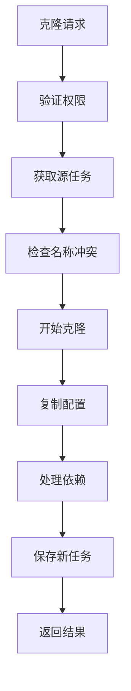

# 任务克隆功能需求文档

## 1. 功能描述

任务克隆功能允许用户快速复制现有任务并创建新的任务实例，支持完整克隆和选择性克隆两种模式。该功能通过深度复制任务的配置、依赖关系、调度设置等信息，帮助用户快速创建相似任务，提高任务创建效率。

### 核心功能
- **完整克隆**：复制任务的所有配置信息和关联数据
- **选择性克隆**：允许用户选择需要复制的配置项
- **批量克隆**：同时克隆多个任务
- **克隆模板化**：将常用克隆配置保存为模板
- **关系处理**：智能处理任务间的依赖关系

## 2. 功能目标

### 2.1 性能目标
- **响应时间**：单个任务克隆操作 ≤ 2秒
- **批量操作**：100个任务批量克隆 ≤ 30秒
- **并发处理**：支持50个并发克隆操作
- **成功率**：克隆操作成功率 ≥ 99.5%

### 2.2 功能目标
- **克隆精度**：配置信息完整复制准确率 = 100%
- **关系处理**：依赖关系正确处理率 ≥ 95%
- **冲突检测**：名称和标识符冲突检测准确率 = 100%
- **回滚能力**：克隆失败时支持完整回滚

## 3. 输入输出

### 3.1 输入参数

#### 单个任务克隆
```json
{
  "source_task_id": "12345",
  "clone_config": {
    "new_name": "新任务名称",
    "clone_mode": "full|selective",
    "clone_options": {
      "include_schedule": true,
      "include_dependencies": true,
      "include_notifications": true
    }
  }
}
```

### 3.2 输出结果
```json
{
  "status": "success",
  "data": {
    "cloned_tasks": [
      {
        "original_task_id": "12345",
        "new_task_id": "67890",
        "task_name": "新任务名称",
        "clone_time": "2024-01-01T10:00:00Z"
      }
    ]
  }
}
```

## 4. 接口设计

### 4.1 RESTful API接口

#### 4.1.1 单个任务克隆
```http
POST /api/v1/tasks/{id}/clone
Content-Type: application/json
Authorization: Bearer {token}
```

#### 4.1.2 批量任务克隆
```http
POST /api/v1/tasks/batch-clone
Content-Type: application/json
Authorization: Bearer {token}
```

#### 4.1.3 克隆预览
```http
POST /api/v1/tasks/{id}/clone/preview
Content-Type: application/json
Authorization: Bearer {token}
```

## 5. 数据结构

### 5.1 数据库表设计

#### task_clone_history表
```sql
CREATE TABLE task_clone_history (
    id BIGINT PRIMARY KEY AUTO_INCREMENT,
    batch_id VARCHAR(50) NOT NULL,
    source_task_id BIGINT NOT NULL,
    target_task_id BIGINT NULL,
    clone_config JSON NOT NULL,
    status ENUM('pending', 'processing', 'success', 'failed') DEFAULT 'pending',
    created_by BIGINT NOT NULL,
    created_at TIMESTAMP DEFAULT CURRENT_TIMESTAMP,
    
    INDEX idx_batch_id (batch_id),
    INDEX idx_source_task (source_task_id),
    FOREIGN KEY (source_task_id) REFERENCES tasks(id) ON DELETE CASCADE
);
```

### 5.2 Go语言数据结构

```go
type CloneConfig struct {
    NewName      string      `json:"new_name" validate:"required,min=1,max=100"`
    CloneMode    CloneMode   `json:"clone_mode" validate:"required"`
    CloneOptions *CloneOptions `json:"clone_options,omitempty"`
}

type CloneOptions struct {
    IncludeSchedule      bool `json:"include_schedule"`
    IncludeDependencies  bool `json:"include_dependencies"`
    IncludeNotifications bool `json:"include_notifications"`
}
```

## 6. 异常处理

### 6.1 异常类型定义
```go
const (
    ErrTaskNotFound      = "TASK_NOT_FOUND"
    ErrNameConflict      = "NAME_CONFLICT"
    ErrPermissionDenied  = "PERMISSION_DENIED"
    ErrDependencyLoop    = "DEPENDENCY_LOOP"
)
```

### 6.2 回滚机制
- 事务性克隆操作，失败时自动回滚
- 批量克隆部分失败时清理已创建资源
- 提供手动回滚接口

## 7. 流程图



## 8. 安全性考虑

### 8.1 访问控制
- 验证用户对源任务的读取权限
- 检查用户的任务创建权限
- 配额限制检查

### 8.2 数据保护
- 输入验证和格式检查
- SQL注入防护
- 敏感信息过滤

### 8.3 审计日志
- 记录所有克隆操作
- 跟踪配置变更历史
- 用户行为审计

## 9. 日志与监控

### 9.1 日志规范
```go
s.logger.Info("任务克隆成功",
    zap.Int64("source_task_id", sourceTaskID),
    zap.Int64("new_task_id", newTaskID),
    zap.Duration("duration", duration))
```

### 9.2 监控指标
- 克隆操作响应时间
- 克隆成功率统计
- 并发操作数量
- 错误率监控

### 9.3 告警配置
- 克隆失败率超过5%时告警
- 响应时间超过5秒时告警
- 并发操作数超过限制时告警

## 10. 测试用例

### 10.1 功能测试
- 单个任务克隆成功场景
- 选择性克隆功能验证
- 批量克隆操作测试
- 名称冲突处理测试

### 10.2 性能测试
- 单个克隆响应时间 < 2秒
- 批量克隆性能测试
- 并发克隆压力测试

### 10.3 异常测试
- 权限不足异常处理
- 依赖循环检测
- 网络异常恢复测试

### 10.4 集成测试
- 完整克隆流程验证
- 与其他模块交互测试
- 数据一致性验证 