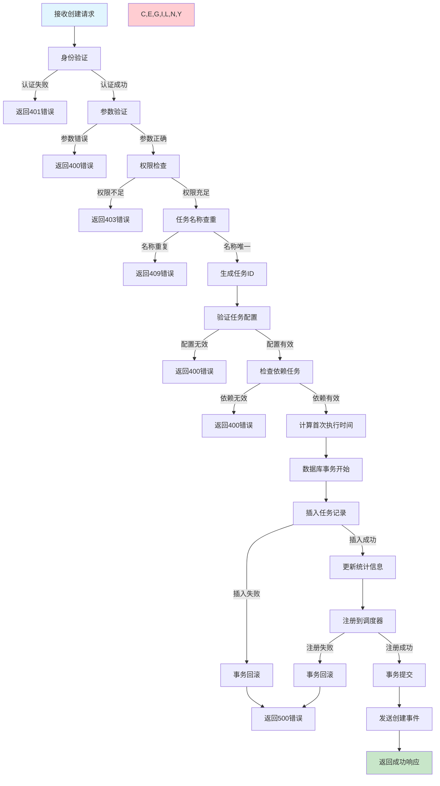
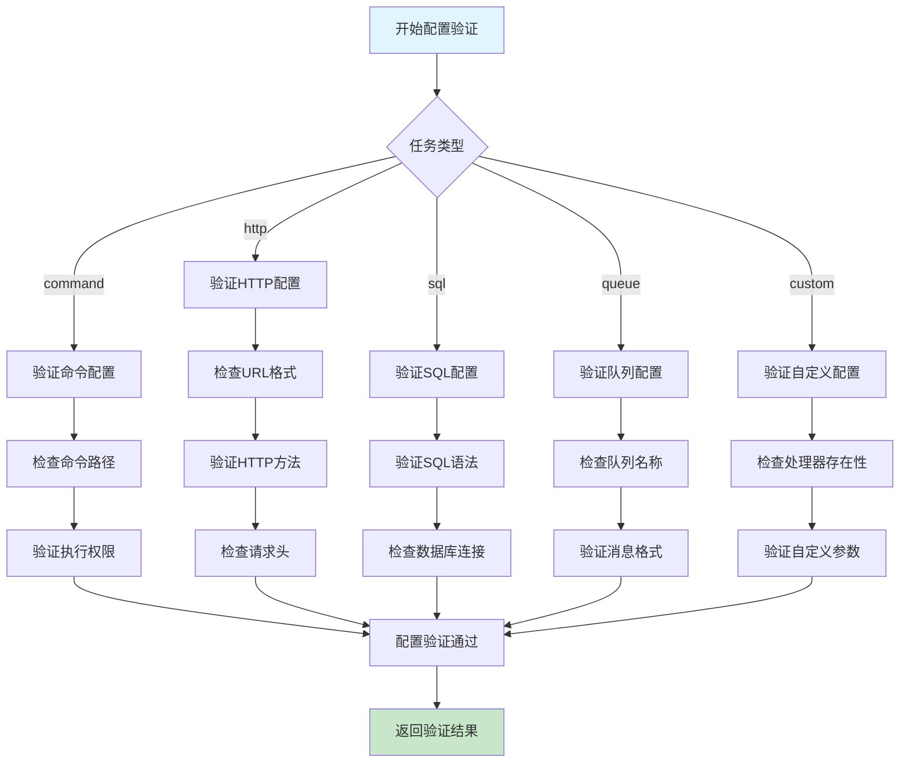

# 任务创建需求文档

## 1. 功能描述

### 1.1 功能概述
任务创建功能用于在系统中新增各种类型的任务，支持定时任务、即时任务、循环任务等多种任务类型的创建和配置。提供灵活的参数配置和执行策略设置。

### 1.2 主要功能列表
- 创建定时任务（支持Cron表达式）
- 创建即时任务（立即执行）
- 创建循环任务（按间隔重复执行）
- 任务参数配置和验证
- 任务执行环境设置
- 任务依赖关系配置
- 任务优先级设置

### 1.3 支持的任务类型
- **命令行任务**：执行系统命令或脚本
- **HTTP任务**：发送HTTP请求
- **数据库任务**：执行SQL语句
- **消息队列任务**：发送消息到队列
- **自定义任务**：执行自定义业务逻辑

## 2. 功能目标

### 2.1 业务目标
- 支持多种业务场景的任务创建需求
- 提供灵活的任务配置和调度策略
- 确保任务创建的可靠性和一致性
- 支持任务的快速部署和上线

### 2.2 技术目标
- 高并发任务创建能力（支持1000+/分钟）
- 任务配置的动态验证和优化
- 任务创建操作的原子性和一致性
- 支持任务模板的复用和扩展

### 2.3 安全目标
- 严格的权限控制和身份验证
- 任务参数的安全验证和过滤
- 防止恶意任务的创建和执行
- 完整的操作审计和日志记录

## 3. 输入输出

### 3.1 输入参数

#### 3.1.1 必需参数
- `task_name` (string): 任务名称，1-100字符
- `task_type` (string): 任务类型（command/http/sql/queue/custom）
- `task_config` (object): 任务配置信息
- `schedule_type` (string): 调度类型（immediate/cron/interval）

#### 3.1.2 可选参数
- `description` (string): 任务描述，最大500字符
- `priority` (int): 任务优先级，1-10，默认5
- `timeout` (int): 超时时间（秒），默认3600
- `retry_count` (int): 重试次数，默认3
- `retry_interval` (int): 重试间隔（秒），默认60
- `dependencies` (array): 依赖任务ID列表
- `tags` (array): 任务标签列表
- `environment` (object): 执行环境变量

### 3.2 输出参数

#### 3.2.1 成功响应
```json
{
  "code": 200,
  "message": "任务创建成功",
  "data": {
    "task_id": "task_20240116_001",
    "task_name": "数据备份任务",
    "task_type": "command",
    "status": "pending",
    "next_run_time": "2024-01-17T02:00:00Z",
    "created_at": "2024-01-16T14:30:00Z"
  }
}
```

#### 3.2.2 错误响应
```json
{
  "code": 400,
  "message": "任务配置参数错误",
  "data": {
    "error_details": [
      {
        "field": "task_config.command",
        "message": "命令参数不能为空"
      }
    ]
  }
}
```

### 3.3 参数验证规则
- 任务名称：必须唯一，支持中文、英文、数字、下划线
- Cron表达式：必须是有效的标准Cron格式
- 超时时间：范围1-86400秒
- 重试次数：范围0-10次
- 优先级：范围1-10，数字越大优先级越高

## 4. 接口设计

### 4.1 API接口定义

#### 4.1.1 创建任务
```
POST /api/v1/task/create
Content-Type: application/json
Authorization: Bearer {token}
```

**请求体示例：**
```json
{
  "task_name": "数据同步任务",
  "task_type": "command",
  "description": "每日凌晨数据同步",
  "schedule_type": "cron",
  "schedule_config": {
    "cron_expression": "0 2 * * *"
  },
  "task_config": {
    "command": "/app/scripts/sync_data.sh",
    "working_directory": "/app",
    "environment": {
      "ENV": "production"
    }
  },
  "priority": 8,
  "timeout": 1800,
  "retry_count": 3,
  "retry_interval": 300,
  "tags": ["data", "sync", "daily"]
}
```

### 4.2 内部服务接口

#### 4.2.1 任务创建服务
```go
type TaskCreateService interface {
    CreateTask(ctx context.Context, req *CreateTaskRequest) (*CreateTaskResponse, error)
    ValidateTaskConfig(ctx context.Context, taskType string, config map[string]interface{}) error
    GenerateTaskID(ctx context.Context, taskType string) (string, error)
}
```

#### 4.2.2 任务调度服务
```go
type TaskScheduleService interface {
    ScheduleTask(ctx context.Context, task *Task) error
    CalculateNextRunTime(ctx context.Context, scheduleConfig *ScheduleConfig) (time.Time, error)
}
```

### 4.3 数据访问接口
```go
type TaskRepository interface {
    Create(ctx context.Context, task *Task) error
    ExistsByName(ctx context.Context, taskName string) (bool, error)
    GetByID(ctx context.Context, taskID string) (*Task, error)
}
```

## 5. 数据结构

### 5.1 核心数据模型

#### 5.1.1 任务主表（tasks）
```sql
CREATE TABLE tasks (
    id VARCHAR(64) PRIMARY KEY COMMENT '任务ID',
    task_name VARCHAR(100) NOT NULL UNIQUE COMMENT '任务名称',
    task_type VARCHAR(20) NOT NULL COMMENT '任务类型',
    description TEXT COMMENT '任务描述',
    status VARCHAR(20) DEFAULT 'pending' COMMENT '任务状态',
    priority INT DEFAULT 5 COMMENT '优先级',
    timeout INT DEFAULT 3600 COMMENT '超时时间(秒)',
    retry_count INT DEFAULT 3 COMMENT '重试次数',
    retry_interval INT DEFAULT 60 COMMENT '重试间隔(秒)',
    schedule_type VARCHAR(20) NOT NULL COMMENT '调度类型',
    schedule_config JSON COMMENT '调度配置',
    task_config JSON NOT NULL COMMENT '任务配置',
    environment JSON COMMENT '环境变量',
    dependencies JSON COMMENT '依赖任务',
    tags JSON COMMENT '任务标签',
    next_run_time DATETIME COMMENT '下次执行时间',
    last_run_time DATETIME COMMENT '上次执行时间',
    created_by VARCHAR(64) NOT NULL COMMENT '创建人',
    created_at DATETIME DEFAULT CURRENT_TIMESTAMP COMMENT '创建时间',
    updated_at DATETIME DEFAULT CURRENT_TIMESTAMP ON UPDATE CURRENT_TIMESTAMP COMMENT '更新时间',
    INDEX idx_task_name (task_name),
    INDEX idx_task_type (task_type),
    INDEX idx_status (status),
    INDEX idx_next_run_time (next_run_time),
    INDEX idx_created_by (created_by)
) COMMENT='任务主表';
```

#### 5.1.2 任务统计表（task_stats）
```sql
CREATE TABLE task_stats (
    task_type VARCHAR(20) PRIMARY KEY COMMENT '任务类型',
    total_count INT DEFAULT 0 COMMENT '总任务数',
    active_count INT DEFAULT 0 COMMENT '活跃任务数',
    success_count INT DEFAULT 0 COMMENT '成功执行次数',
    failed_count INT DEFAULT 0 COMMENT '失败执行次数',
    avg_duration DECIMAL(10,2) DEFAULT 0 COMMENT '平均执行时长(秒)',
    updated_at DATETIME DEFAULT CURRENT_TIMESTAMP ON UPDATE CURRENT_TIMESTAMP COMMENT '更新时间'
) COMMENT='任务统计表';
```

### 5.2 Go数据结构定义

#### 5.2.1 请求响应结构
```go
type CreateTaskRequest struct {
    TaskName        string                 `json:"task_name" v:"required|length:1,100"`
    TaskType        string                 `json:"task_type" v:"required|in:command,http,sql,queue,custom"`
    Description     string                 `json:"description" v:"length:0,500"`
    ScheduleType    string                 `json:"schedule_type" v:"required|in:immediate,cron,interval"`
    ScheduleConfig  map[string]interface{} `json:"schedule_config"`
    TaskConfig      map[string]interface{} `json:"task_config" v:"required"`
    Priority        int                    `json:"priority" v:"between:1,10"`
    Timeout         int                    `json:"timeout" v:"between:1,86400"`
    RetryCount      int                    `json:"retry_count" v:"between:0,10"`
    RetryInterval   int                    `json:"retry_interval" v:"between:1,3600"`
    Dependencies    []string               `json:"dependencies"`
    Tags            []string               `json:"tags"`
    Environment     map[string]string      `json:"environment"`
}

type CreateTaskResponse struct {
    TaskID      string    `json:"task_id"`
    TaskName    string    `json:"task_name"`
    TaskType    string    `json:"task_type"`
    Status      string    `json:"status"`
    NextRunTime time.Time `json:"next_run_time"`
    CreatedAt   time.Time `json:"created_at"`
}
```

#### 5.2.2 任务实体结构
```go
type Task struct {
    ID             string                 `json:"id" db:"id"`
    TaskName       string                 `json:"task_name" db:"task_name"`
    TaskType       string                 `json:"task_type" db:"task_type"`
    Description    string                 `json:"description" db:"description"`
    Status         string                 `json:"status" db:"status"`
    Priority       int                    `json:"priority" db:"priority"`
    Timeout        int                    `json:"timeout" db:"timeout"`
    RetryCount     int                    `json:"retry_count" db:"retry_count"`
    RetryInterval  int                    `json:"retry_interval" db:"retry_interval"`
    ScheduleType   string                 `json:"schedule_type" db:"schedule_type"`
    ScheduleConfig map[string]interface{} `json:"schedule_config" db:"schedule_config"`
    TaskConfig     map[string]interface{} `json:"task_config" db:"task_config"`
    Environment    map[string]string      `json:"environment" db:"environment"`
    Dependencies   []string               `json:"dependencies" db:"dependencies"`
    Tags           []string               `json:"tags" db:"tags"`
    NextRunTime    *time.Time             `json:"next_run_time" db:"next_run_time"`
    LastRunTime    *time.Time             `json:"last_run_time" db:"last_run_time"`
    CreatedBy      string                 `json:"created_by" db:"created_by"`
    CreatedAt      time.Time              `json:"created_at" db:"created_at"`
    UpdatedAt      time.Time              `json:"updated_at" db:"updated_at"`
}
```

## 6. 异常处理

### 6.1 参数验证异常
- **任务名称异常**：空值、超长、重复、非法字符
- **任务类型异常**：不支持的任务类型
- **配置参数异常**：缺少必需配置、参数格式错误
- **调度配置异常**：无效的Cron表达式、间隔时间超出范围

### 6.2 业务逻辑异常
- **权限异常**：用户无任务创建权限
- **依赖异常**：依赖任务不存在或循环依赖
- **资源异常**：系统资源不足，无法创建新任务
- **模板异常**：任务模板不存在或已过期

### 6.3 系统异常
- **数据库异常**：连接失败、写入失败、事务回滚
- **调度服务异常**：调度器不可用、任务注册失败
- **网络异常**：外部服务调用超时
- **存储异常**：文件系统空间不足

### 6.4 异常处理策略
- **参数异常**：返回详细错误信息，指导用户修正
- **业务异常**：记录操作日志，返回友好错误提示
- **系统异常**：记录错误日志，返回通用错误信息
- **临时异常**：支持重试机制，自动恢复

## 7. 流程图

### 7.1 任务创建主流程



### 7.2 任务配置验证流程



## 8. 安全性考虑

### 8.1 身份认证
- **Token验证**：使用JWT令牌进行用户身份验证
- **会话管理**：支持会话超时和令牌刷新机制
- **多因子认证**：支持高权限操作的二次验证

### 8.2 权限控制
- **角色权限**：基于RBAC的任务创建权限控制
- **资源隔离**：用户只能创建指定范围内的任务
- **操作审计**：记录所有任务创建操作的详细日志

### 8.3 数据安全
- **参数过滤**：防止SQL注入、命令注入等安全漏洞
- **敏感信息加密**：任务配置中的密码等敏感信息加密存储
- **数据脱敏**：日志中的敏感信息自动脱敏处理

### 8.4 执行安全
- **沙箱执行**：任务在隔离环境中执行，防止系统污染
- **资源限制**：限制任务的CPU、内存、磁盘等资源使用
- **网络隔离**：限制任务的网络访问权限

## 9. 日志与监控

### 9.1 操作日志
- **创建日志**：记录任务创建的详细信息
- **验证日志**：记录参数验证和权限检查过程
- **错误日志**：记录创建失败的原因和堆栈信息

### 9.2 业务监控
- **创建速率**：监控任务创建的QPS和成功率
- **类型分布**：统计不同类型任务的创建数量
- **用户行为**：分析用户的任务创建模式

### 9.3 性能监控
- **响应时间**：监控任务创建接口的响应时间
- **数据库性能**：监控数据库连接池和查询性能
- **调度器性能**：监控任务注册到调度器的耗时

### 9.4 告警规则
- **创建失败率过高**：5分钟内失败率超过10%
- **响应时间过长**：平均响应时间超过2秒
- **数据库连接异常**：数据库连接失败
- **调度器异常**：任务注册失败率超过5%

### 9.5 日志格式
```json
{
  "timestamp": "2024-01-16T14:30:00Z",
  "level": "INFO",
  "service": "task-create",
  "operation": "create_task",
  "task_id": "task_20240116_001",
  "task_name": "数据备份任务",
  "task_type": "command",
  "user_id": "user_123",
  "ip_address": "192.168.1.100",
  "duration_ms": 150,
  "result": "success",
  "message": "任务创建成功"
}
```

## 10. 测试用例

### 10.1 功能测试用例

#### 10.1.1 正常创建测试
**测试目标：** 验证各种类型任务的正常创建功能

**测试用例：**
- 创建命令行任务
- 创建HTTP任务
- 创建SQL任务
- 创建队列任务
- 创建自定义任务

**测试数据：**
```json
{
  "task_name": "测试命令任务",
  "task_type": "command",
  "schedule_type": "cron",
  "schedule_config": {
    "cron_expression": "0 */6 * * *"
  },
  "task_config": {
    "command": "echo 'Hello World'",
    "working_directory": "/tmp"
  },
  "priority": 5,
  "timeout": 300
}
```

**预期结果：** 返回成功响应，包含生成的任务ID和执行时间

#### 10.1.2 参数验证测试
**测试目标：** 验证参数验证功能的完整性

**测试场景：**
- 任务名称为空或超长
- 无效的任务类型
- 错误的Cron表达式
- 缺少必需的任务配置
- 超出范围的优先级和超时时间

**预期结果：** 返回400错误，包含具体的验证错误信息

#### 10.1.3 权限控制测试
**测试目标：** 验证权限控制机制

**测试场景：**
- 无效的认证Token
- 无任务创建权限的用户
- 跨租户任务创建

**预期结果：** 返回相应的401或403错误

#### 10.1.4 重复性检查测试
**测试目标：** 验证任务名称唯一性检查

**测试步骤：**
1. 创建任务A
2. 使用相同名称再次创建任务
3. 删除任务A后重新创建

**预期结果：** 第二次创建返回409错误，删除后可正常创建

### 10.2 性能测试用例

#### 10.2.1 并发创建测试
**测试目标：** 验证高并发场景下的任务创建性能

**测试场景：** 100个并发用户同时创建不同的任务

**性能指标：**
- 响应时间：95%请求在2秒内完成
- 成功率：成功率不低于99%
- 吞吐量：支持100+ QPS

#### 10.2.2 大批量创建测试
**测试目标：** 验证大批量任务创建的系统稳定性

**测试场景：** 单用户连续创建1000个任务

**预期结果：** 系统稳定运行，内存和CPU使用正常

### 10.3 安全测试用例

#### 10.3.1 注入攻击测试
**测试目标：** 验证SQL注入和命令注入防护

**测试数据：** 在任务配置中包含恶意代码
```json
{
  "task_config": {
    "command": "echo 'test'; rm -rf /"
  }
}
```

**预期结果：** 系统正确识别并拒绝恶意输入

#### 10.3.2 越权访问测试
**测试目标：** 验证垂直和水平越权防护

**测试场景：**
- 普通用户尝试创建高权限任务
- 用户A尝试在用户B的命名空间创建任务

**预期结果：** 返回403权限不足错误

### 10.4 异常测试用例

#### 10.4.1 数据库异常测试
**测试目标：** 验证数据库异常时的系统行为

**测试场景：**
- 数据库连接中断
- 数据库空间不足
- 事务死锁

**预期结果：** 返回500错误，记录详细错误日志，不影响其他操作

#### 10.4.2 调度器异常测试
**测试目标：** 验证调度器不可用时的处理

**测试场景：** 调度服务宕机或网络不通

**预期结果：** 任务记录已保存，调度器恢复后自动注册任务

#### 10.4.3 依赖任务异常测试
**测试目标：** 验证依赖关系的异常处理

**测试场景：**
- 依赖任务不存在
- 依赖关系形成循环
- 依赖任务状态异常

**预期结果：** 返回400错误，提供清晰的错误说明 