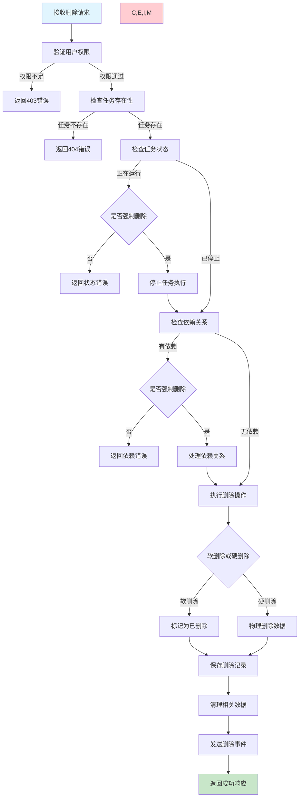
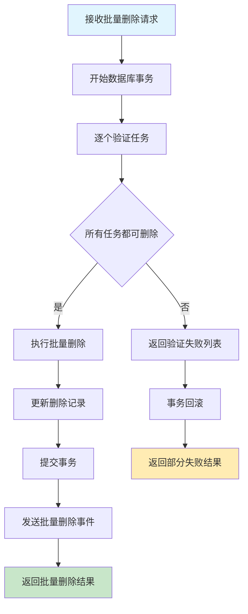
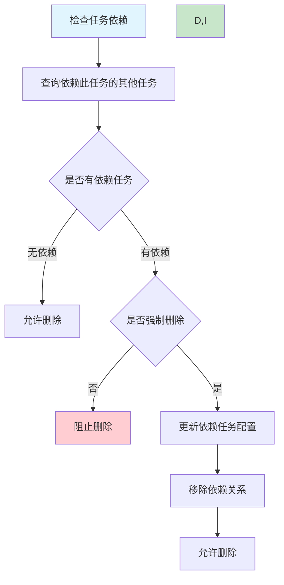

# 任务删除需求文档

## 1. 功能描述

### 1.1 功能概述
任务删除功能提供安全的任务移除机制，支持单个任务删除、批量删除、软删除和硬删除，确保数据的完整性和可恢复性。

### 1.2 主要功能列表
- 单个任务删除
- 批量任务删除
- 软删除（标记删除，可恢复）
- 硬删除（物理删除，不可恢复）
- 删除前安全检查
- 级联删除关联数据
- 删除操作审计

### 1.3 删除策略
- **软删除优先**：默认使用软删除机制
- **权限验证**：严格的删除权限控制
- **依赖检查**：检查任务间依赖关系
- **数据保护**：重要任务的删除保护

## 2. 功能目标

### 2.1 业务目标
- 提供安全可靠的任务删除功能
- 防止误删重要任务
- 支持删除操作的可追溯
- 确保系统数据的一致性

### 2.2 技术目标
- 删除操作响应时间小于2秒
- 批量删除支持事务处理
- 软删除不影响系统性能
- 支持大数据量的清理操作

### 2.3 安全目标
- 多级权限验证机制
- 重要任务删除确认
- 完整的操作审计日志
- 数据恢复能力保障

## 3. 输入输出

### 3.1 输入参数

#### 3.1.1 单个删除参数
- `task_id` (string): 任务ID
- `delete_type` (string): 删除类型，soft/hard，默认soft
- `force` (boolean): 是否强制删除，默认false
- `reason` (string): 删除原因

#### 3.1.2 批量删除参数
- `task_ids` (array): 任务ID列表
- `delete_type` (string): 删除类型
- `force` (boolean): 是否强制删除
- `reason` (string): 删除原因

#### 3.1.3 条件删除参数
- `filters` (object): 删除条件
- `delete_type` (string): 删除类型
- `preview` (boolean): 是否仅预览，默认false

### 3.2 输出参数

#### 3.2.1 成功响应
```json
{
  "code": 200,
  "message": "任务删除成功",
  "data": {
    "deleted_count": 3,
    "failed_count": 1,
    "deleted_tasks": [
      {
        "task_id": "task_20240116_001",
        "task_name": "数据同步任务",
        "delete_type": "soft",
        "deleted_at": "2024-01-16T16:30:00Z"
      }
    ],
    "failed_tasks": [
      {
        "task_id": "task_20240116_002",
        "reason": "任务正在运行中，无法删除"
      }
    ]
  }
}
```

#### 3.2.2 删除预览响应
```json
{
  "code": 200,
  "message": "删除预览",
  "data": {
    "can_delete_count": 5,
    "cannot_delete_count": 2,
    "can_delete_tasks": ["task_001", "task_002"],
    "cannot_delete_tasks": [
      {
        "task_id": "task_003",
        "reason": "任务有其他任务依赖"
      }
    ],
    "warnings": [
      "删除后将无法恢复执行历史记录"
    ]
  }
}
```

## 4. 接口设计

### 4.1 API接口定义

#### 4.1.1 删除单个任务
```
DELETE /api/v1/task/{task_id}
Content-Type: application/json
Authorization: Bearer {token}
```

**请求体示例：**
```json
{
  "delete_type": "soft",
  "force": false,
  "reason": "任务已废弃，不再使用"
}
```

#### 4.1.2 批量删除任务
```
DELETE /api/v1/task/batch
Content-Type: application/json
```

**请求体示例：**
```json
{
  "task_ids": ["task_001", "task_002", "task_003"],
  "delete_type": "soft",
  "force": false,
  "reason": "清理测试任务"
}
```

#### 4.1.3 条件删除任务
```
POST /api/v1/task/delete-by-condition
Content-Type: application/json
```

#### 4.1.4 恢复已删除任务
```
POST /api/v1/task/{task_id}/restore
Content-Type: application/json
```

### 4.2 内部服务接口
```go
type TaskDeleteService interface {
    DeleteTask(ctx context.Context, req *DeleteTaskRequest) (*DeleteTaskResponse, error)
    BatchDeleteTasks(ctx context.Context, req *BatchDeleteRequest) (*BatchDeleteResponse, error)
    DeleteByCondition(ctx context.Context, req *DeleteByConditionRequest) (*DeleteByConditionResponse, error)
    RestoreTask(ctx context.Context, taskID string, userID string) error
    PreviewDelete(ctx context.Context, req *DeletePreviewRequest) (*DeletePreviewResponse, error)
}
```

## 5. 数据结构

### 5.1 任务删除记录表（task_delete_logs）
```sql
CREATE TABLE task_delete_logs (
    id BIGINT AUTO_INCREMENT PRIMARY KEY COMMENT '主键ID',
    task_id VARCHAR(64) NOT NULL COMMENT '任务ID',
    task_name VARCHAR(255) NOT NULL COMMENT '任务名称',
    delete_type ENUM('soft', 'hard') NOT NULL COMMENT '删除类型',
    deleted_by VARCHAR(64) NOT NULL COMMENT '删除人',
    delete_reason VARCHAR(500) COMMENT '删除原因',
    task_config JSON COMMENT '任务配置快照',
    deleted_at DATETIME DEFAULT CURRENT_TIMESTAMP COMMENT '删除时间',
    can_restore BOOLEAN DEFAULT TRUE COMMENT '是否可恢复',
    INDEX idx_task_id (task_id),
    INDEX idx_deleted_by (deleted_by),
    INDEX idx_deleted_at (deleted_at)
) COMMENT='任务删除记录表';
```

### 5.2 Go数据结构
```go
type DeleteTaskRequest struct {
    TaskID     string `json:"task_id" v:"required"`
    DeleteType string `json:"delete_type" v:"in:soft,hard"`
    Force      bool   `json:"force"`
    Reason     string `json:"reason" v:"length:0,500"`
}

type DeleteTaskResponse struct {
    TaskID      string `json:"task_id"`
    TaskName    string `json:"task_name"`
    DeleteType  string `json:"delete_type"`
    DeletedAt   string `json:"deleted_at"`
    CanRestore  bool   `json:"can_restore"`
}

type BatchDeleteRequest struct {
    TaskIDs    []string `json:"task_ids" v:"required|array:min,1"`
    DeleteType string   `json:"delete_type" v:"in:soft,hard"`
    Force      bool     `json:"force"`
    Reason     string   `json:"reason" v:"length:0,500"`
}

type BatchDeleteResponse struct {
    DeletedCount int                    `json:"deleted_count"`
    FailedCount  int                    `json:"failed_count"`
    DeletedTasks []*DeleteTaskResponse  `json:"deleted_tasks"`
    FailedTasks  []*FailedDeleteResult  `json:"failed_tasks"`
}

type FailedDeleteResult struct {
    TaskID string `json:"task_id"`
    Reason string `json:"reason"`
}
```

## 6. 异常处理

### 6.1 参数验证异常
- **任务不存在**：指定的任务ID无效
- **任务已删除**：尝试删除已删除的任务
- **参数格式错误**：删除类型或其他参数格式错误

### 6.2 业务逻辑异常
- **权限不足**：用户无任务删除权限
- **任务状态异常**：任务正在运行中无法删除
- **依赖关系冲突**：有其他任务依赖此任务
- **强制删除限制**：系统关键任务不允许强制删除

### 6.3 系统异常
- **数据库异常**：删除操作失败
- **事务异常**：批量删除事务回滚
- **存储异常**：配置快照保存失败

## 7. 流程图

### 7.1 任务删除主流程



### 7.2 批量删除流程



### 7.3 依赖关系处理流程



## 8. 安全性考虑

### 8.1 权限控制
- **删除权限验证**：只有有权限的用户才能删除任务
- **任务所有权**：用户只能删除自己创建的任务（除非是管理员）
- **系统任务保护**：系统关键任务不允许普通用户删除

### 8.2 数据安全
- **删除确认机制**：重要任务删除需要二次确认
- **软删除优先**：默认使用软删除保护数据
- **配置备份**：删除前备份任务配置

### 8.3 操作审计
- **删除日志**：完整记录删除操作的详情
- **用户追踪**：记录删除操作的执行用户
- **原因记录**：要求提供删除原因

## 9. 日志与监控

### 9.1 操作日志
- **删除日志**：记录任务删除的详细信息
- **权限日志**：记录权限验证过程
- **错误日志**：记录删除失败的原因

### 9.2 业务监控
- **删除频率**：监控任务删除的频率和模式
- **删除成功率**：监控删除操作的成功率
- **恢复频率**：监控软删除任务的恢复频率

### 9.3 安全监控
- **批量删除告警**：大批量删除操作告警
- **频繁删除告警**：用户频繁删除任务告警
- **权限异常告警**：异常的删除权限访问

### 9.4 日志格式
```json
{
  "timestamp": "2024-01-16T16:30:00Z",
  "level": "INFO",
  "service": "task-delete",
  "operation": "delete_task",
  "task_id": "task_20240116_001",
  "task_name": "数据同步任务",
  "delete_type": "soft",
  "user_id": "user_123",
  "reason": "任务已废弃",
  "force": false,
  "duration_ms": 150,
  "result": "success"
}
```

## 10. 测试用例

### 10.1 功能测试用例

#### 10.1.1 正常删除测试
**测试目标：** 验证正常的任务删除功能

**测试用例：**
- 软删除单个任务
- 硬删除单个任务
- 删除已停止的任务
- 删除无依赖的任务

**测试数据：**
```json
{
  "task_id": "task_20240116_001",
  "delete_type": "soft",
  "force": false,
  "reason": "测试删除功能"
}
```

**预期结果：** 删除成功，返回删除详情

#### 10.1.2 权限控制测试
**测试目标：** 验证删除权限控制

**测试场景：**
- 无权限用户尝试删除任务
- 普通用户删除其他用户的任务
- 管理员删除任意任务

**预期结果：** 根据权限返回相应结果

#### 10.1.3 依赖关系测试
**测试目标：** 验证任务依赖关系处理

**测试场景：**
- 删除有依赖关系的任务（非强制）
- 强制删除有依赖关系的任务
- 删除被依赖的任务

**预期结果：** 正确处理依赖关系

#### 10.1.4 批量删除测试
**测试目标：** 验证批量删除功能

**测试场景：** 同时删除5个任务
**预期结果：** 所有任务删除成功，操作具有原子性

#### 10.1.5 任务恢复测试
**测试目标：** 验证软删除任务的恢复功能

**测试步骤：**
1. 软删除一个任务
2. 恢复已删除的任务

**预期结果：** 任务成功恢复到删除前状态

### 10.2 异常测试用例

#### 10.2.1 状态异常测试
**测试目标：** 验证运行中任务的删除处理

**测试场景：**
- 删除正在运行的任务（非强制）
- 强制删除正在运行的任务

**预期结果：** 正确处理任务状态

#### 10.2.2 并发删除测试
**测试目标：** 验证并发删除的处理

**测试场景：** 两个用户同时删除同一个任务
**预期结果：** 只有一个删除成功，另一个返回适当错误

#### 10.2.3 事务回滚测试
**测试目标：** 验证批量删除的事务处理

**测试场景：** 批量删除中部分任务无法删除
**预期结果：** 整个批量操作回滚

### 10.3 性能测试用例

#### 10.3.1 大批量删除测试
**测试目标：** 验证大批量删除的性能

**测试场景：** 批量删除1000个任务
**预期结果：** 删除操作在30秒内完成

#### 10.3.2 软删除性能测试
**测试目标：** 验证软删除对系统性能的影响

**测试场景：** 软删除大量任务后的系统查询性能
**预期结果：** 查询性能不受明显影响

### 10.4 安全测试用例

#### 10.4.1 权限边界测试
**测试目标：** 验证权限边界控制

**测试场景：** 用户尝试删除超出权限范围的任务
**预期结果：** 返回权限不足错误

#### 10.4.2 数据恢复测试
**测试目标：** 验证硬删除的不可恢复性

**测试场景：** 硬删除任务后尝试恢复
**预期结果：** 无法恢复硬删除的任务

#### 10.4.3 审计日志测试
**测试目标：** 验证删除操作的审计记录

**测试场景：** 执行各种删除操作
**预期结果：** 所有操作都有完整的审计记录 