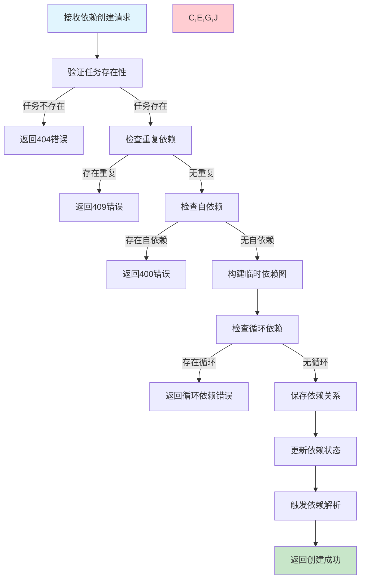
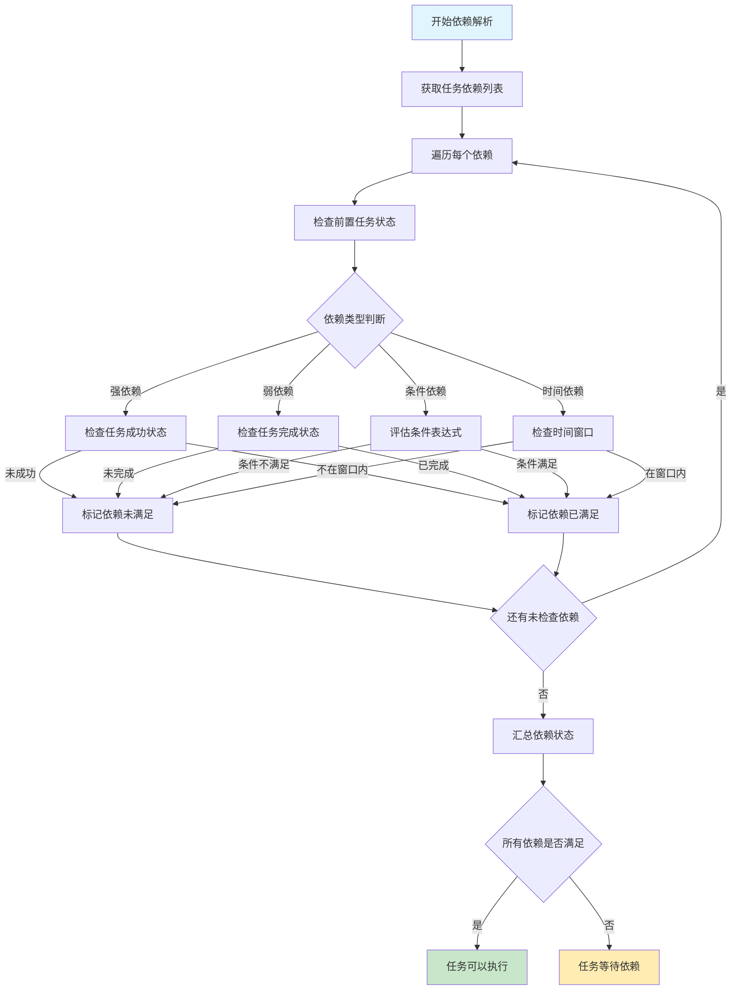
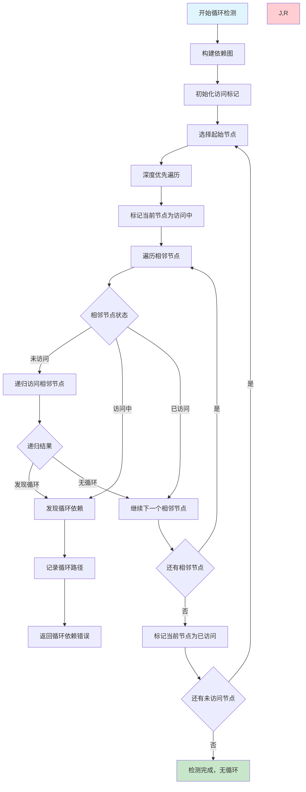

# 任务依赖管理需求文档

## 1. 功能描述

### 1.1 功能概述
任务依赖管理功能提供复杂的任务间依赖关系定义、自动依赖解析、执行顺序控制和循环依赖检测，确保任务按正确的顺序执行。

### 1.2 主要功能列表
- 任务依赖关系定义
- 依赖关系图可视化
- 自动依赖解析和排序
- 循环依赖检测和告警
- 条件依赖支持
- 依赖状态实时更新
- 依赖失败处理策略

### 1.3 依赖类型
- **强依赖**：前置任务必须成功完成
- **弱依赖**：前置任务完成即可（包括失败）
- **条件依赖**：基于条件判断的依赖关系
- **时间依赖**：基于时间窗口的依赖

## 2. 功能目标

### 2.1 业务目标
- 支持复杂的任务编排需求
- 确保任务执行的正确顺序
- 提供灵活的依赖配置能力
- 支持大规模任务流的管理

### 2.2 技术目标
- 依赖解析速度小于100ms
- 支持1万+节点的依赖图
- 循环依赖检测准确率100%
- 依赖状态更新延迟小于1秒

### 2.3 安全目标
- 依赖配置的权限控制
- 依赖关系的完整性验证
- 恶意依赖攻击防护
- 依赖操作的审计追踪

## 3. 输入输出

### 3.1 输入参数

#### 3.1.1 依赖定义参数
- `task_id` (string): 当前任务ID
- `dependency_type` (string): 依赖类型，strong/weak/conditional/time
- `prerequisite_tasks` (array): 前置任务列表
- `condition` (object): 条件配置（条件依赖）
- `time_window` (object): 时间窗口配置（时间依赖）

#### 3.1.2 依赖查询参数
- `task_id` (string): 任务ID
- `depth` (int): 查询深度，默认无限制
- `direction` (string): 查询方向，upstream/downstream/both
- `include_indirect` (boolean): 是否包含间接依赖

#### 3.1.3 依赖验证参数
- `dependency_graph` (object): 依赖图配置
- `check_cycles` (boolean): 是否检查循环依赖
- `validate_existence` (boolean): 是否验证任务存在性

### 3.2 输出参数

#### 3.2.1 依赖创建响应
```json
{
  "code": 200,
  "message": "依赖创建成功",
  "data": {
    "dependency_id": "dep_20240116_001",
    "task_id": "task_20240116_003",
    "prerequisite_tasks": [
      {
        "task_id": "task_20240116_001",
        "dependency_type": "strong",
        "created_at": "2024-01-16T20:00:00Z"
      },
      {
        "task_id": "task_20240116_002",
        "dependency_type": "weak",
        "created_at": "2024-01-16T20:00:00Z"
      }
    ],
    "execution_order": 3,
    "estimated_start_time": "2024-01-17T02:15:00Z"
  }
}
```

#### 3.2.2 依赖图响应
```json
{
  "code": 200,
  "message": "查询成功",
  "data": {
    "dependency_graph": {
      "nodes": [
        {
          "task_id": "task_001",
          "task_name": "数据提取",
          "status": "completed",
          "level": 0
        },
        {
          "task_id": "task_002",
          "task_name": "数据转换",
          "status": "running",
          "level": 1
        }
      ],
      "edges": [
        {
          "from": "task_001",
          "to": "task_002",
          "dependency_type": "strong",
          "status": "satisfied"
        }
      ]
    },
    "execution_plan": {
      "total_levels": 3,
      "estimated_duration": 3600,
      "critical_path": ["task_001", "task_002", "task_003"]
    }
  }
}
```

## 4. 接口设计

### 4.1 API接口定义

#### 4.1.1 创建任务依赖
```
POST /api/v1/task/{task_id}/dependencies
Content-Type: application/json
Authorization: Bearer {token}
```

**请求体示例：**
```json
{
  "dependencies": [
    {
      "prerequisite_task_id": "task_20240116_001",
      "dependency_type": "strong",
      "condition": null
    },
    {
      "prerequisite_task_id": "task_20240116_002",
      "dependency_type": "conditional",
      "condition": {
        "field": "status",
        "operator": "eq",
        "value": "success"
      }
    }
  ]
}
```

#### 4.1.2 获取任务依赖
```
GET /api/v1/task/{task_id}/dependencies?direction=upstream&depth=5
```

#### 4.1.3 删除任务依赖
```
DELETE /api/v1/task/{task_id}/dependencies/{prerequisite_task_id}
```

#### 4.1.4 获取依赖图
```
POST /api/v1/dependencies/graph
Content-Type: application/json
```

#### 4.1.5 验证依赖关系
```
POST /api/v1/dependencies/validate
Content-Type: application/json
```

### 4.2 内部服务接口
```go
type TaskDependencyService interface {
    CreateDependency(ctx context.Context, req *CreateDependencyRequest) (*CreateDependencyResponse, error)
    DeleteDependency(ctx context.Context, req *DeleteDependencyRequest) error
    GetDependencies(ctx context.Context, req *GetDependenciesRequest) (*GetDependenciesResponse, error)
    GetDependencyGraph(ctx context.Context, req *DependencyGraphRequest) (*DependencyGraphResponse, error)
    ValidateDependencies(ctx context.Context, req *ValidateDependenciesRequest) (*ValidationResponse, error)
    ResolveDependencies(ctx context.Context, taskID string) (*ResolutionResponse, error)
    CheckCycles(ctx context.Context, dependencies []Dependency) ([]string, error)
}
```

## 5. 数据结构

### 5.1 任务依赖表（task_dependencies）
```sql
CREATE TABLE task_dependencies (
    id BIGINT AUTO_INCREMENT PRIMARY KEY COMMENT '主键ID',
    dependency_id VARCHAR(64) UNIQUE NOT NULL COMMENT '依赖ID',
    task_id VARCHAR(64) NOT NULL COMMENT '任务ID',
    prerequisite_task_id VARCHAR(64) NOT NULL COMMENT '前置任务ID',
    dependency_type ENUM('strong', 'weak', 'conditional', 'time') NOT NULL COMMENT '依赖类型',
    condition_config JSON COMMENT '条件配置',
    time_window_config JSON COMMENT '时间窗口配置',
    status ENUM('pending', 'satisfied', 'failed', 'skipped') DEFAULT 'pending' COMMENT '依赖状态',
    created_by VARCHAR(64) NOT NULL COMMENT '创建人',
    created_at DATETIME DEFAULT CURRENT_TIMESTAMP COMMENT '创建时间',
    updated_at DATETIME DEFAULT CURRENT_TIMESTAMP ON UPDATE CURRENT_TIMESTAMP COMMENT '更新时间',
    INDEX idx_task_id (task_id),
    INDEX idx_prerequisite_task_id (prerequisite_task_id),
    INDEX idx_dependency_type (dependency_type),
    INDEX idx_status (status),
    UNIQUE KEY uk_task_dependency (task_id, prerequisite_task_id)
) COMMENT='任务依赖表';
```

### 5.2 依赖解析记录表（dependency_resolutions）
```sql
CREATE TABLE dependency_resolutions (
    id BIGINT AUTO_INCREMENT PRIMARY KEY COMMENT '主键ID',
    resolution_id VARCHAR(64) UNIQUE NOT NULL COMMENT '解析ID',
    task_id VARCHAR(64) NOT NULL COMMENT '任务ID',
    resolution_status ENUM('pending', 'resolved', 'blocked', 'failed') NOT NULL COMMENT '解析状态',
    blocking_dependencies JSON COMMENT '阻塞的依赖',
    resolution_time DATETIME COMMENT '解析时间',
    execution_level INT COMMENT '执行层级',
    estimated_start_time DATETIME COMMENT '预计开始时间',
    created_at DATETIME DEFAULT CURRENT_TIMESTAMP COMMENT '创建时间',
    INDEX idx_task_id (task_id),
    INDEX idx_resolution_status (resolution_status),
    INDEX idx_execution_level (execution_level)
) COMMENT='依赖解析记录表';
```

### 5.3 Go数据结构
```go
type CreateDependencyRequest struct {
    TaskID       string       `json:"task_id" v:"required"`
    Dependencies []Dependency `json:"dependencies" v:"required|array:min,1"`
}

type Dependency struct {
    PrerequisiteTaskID string                 `json:"prerequisite_task_id" v:"required"`
    DependencyType     string                 `json:"dependency_type" v:"required|in:strong,weak,conditional,time"`
    Condition          *DependencyCondition   `json:"condition,omitempty"`
    TimeWindow         *TimeWindowConfig      `json:"time_window,omitempty"`
}

type DependencyCondition struct {
    Field    string      `json:"field" v:"required"`
    Operator string      `json:"operator" v:"required|in:eq,ne,gt,lt,ge,le,in,nin"`
    Value    interface{} `json:"value" v:"required"`
}

type TimeWindowConfig struct {
    StartTime string `json:"start_time" v:"required"`
    EndTime   string `json:"end_time" v:"required"`
    Timezone  string `json:"timezone"`
}

type DependencyGraphRequest struct {
    TaskIDs         []string `json:"task_ids"`
    MaxDepth        int      `json:"max_depth"`
    IncludeIndirect bool     `json:"include_indirect"`
    ShowStatus      bool     `json:"show_status"`
}

type DependencyGraphResponse struct {
    DependencyGraph *DependencyGraph `json:"dependency_graph"`
    ExecutionPlan   *ExecutionPlan   `json:"execution_plan"`
}

type DependencyGraph struct {
    Nodes []GraphNode `json:"nodes"`
    Edges []GraphEdge `json:"edges"`
}

type GraphNode struct {
    TaskID   string `json:"task_id"`
    TaskName string `json:"task_name"`
    Status   string `json:"status"`
    Level    int    `json:"level"`
}

type GraphEdge struct {
    From           string `json:"from"`
    To             string `json:"to"`
    DependencyType string `json:"dependency_type"`
    Status         string `json:"status"`
}

type ExecutionPlan struct {
    TotalLevels       int      `json:"total_levels"`
    EstimatedDuration int      `json:"estimated_duration"`
    CriticalPath      []string `json:"critical_path"`
    ParallelGroups    [][]string `json:"parallel_groups"`
}

type ResolutionResponse struct {
    CanExecute         bool                `json:"can_execute"`
    BlockingDependencies []BlockingDependency `json:"blocking_dependencies"`
    ExecutionLevel     int                 `json:"execution_level"`
    EstimatedStartTime string              `json:"estimated_start_time"`
}

type BlockingDependency struct {
    PrerequisiteTaskID string `json:"prerequisite_task_id"`
    PrerequisiteStatus string `json:"prerequisite_status"`
    DependencyType     string `json:"dependency_type"`
    Reason             string `json:"reason"`
}
```

## 6. 异常处理

### 6.1 依赖配置异常
- **循环依赖**：检测到任务间的循环依赖关系
- **任务不存在**：依赖的任务不存在
- **重复依赖**：相同的依赖关系重复定义
- **自依赖**：任务依赖自身

### 6.2 依赖解析异常
- **解析超时**：依赖关系解析耗时过长
- **图过于复杂**：依赖图节点数量超出限制
- **状态不一致**：依赖状态与实际状态不符
- **条件计算错误**：条件依赖的条件计算失败

### 6.3 执行异常
- **依赖未满足**：前置依赖未满足无法执行
- **依赖失效**：运行时依赖状态发生变化
- **超时等待**：等待依赖满足超时
- **并发冲突**：多个任务同时修改依赖状态

## 7. 流程图

### 7.1 依赖创建流程



### 7.2 依赖解析流程



### 7.3 循环依赖检测流程



## 8. 安全性考虑

### 8.1 权限控制
- **依赖创建权限**：只有有权限的用户才能创建依赖关系
- **跨任务依赖**：验证用户对依赖任务的访问权限
- **系统任务保护**：系统关键任务的依赖需要特殊权限

### 8.2 完整性验证
- **依赖关系验证**：确保依赖关系的逻辑正确性
- **状态一致性**：确保依赖状态与任务状态的一致性
- **数据完整性**：防止依赖数据的意外损坏

### 8.3 安全防护
- **恶意依赖攻击**：防止通过依赖关系进行的攻击
- **资源消耗攻击**：防止复杂依赖图消耗过多资源
- **权限绕过**：防止通过依赖关系绕过权限控制

## 9. 日志与监控

### 9.1 依赖操作日志
- **依赖创建日志**：记录依赖关系的创建操作
- **依赖解析日志**：记录依赖解析的过程和结果
- **状态变更日志**：记录依赖状态的变更

### 9.2 性能监控
- **解析性能**：监控依赖解析的性能指标
- **图复杂度**：监控依赖图的复杂度指标
- **解析成功率**：监控依赖解析的成功率

### 9.3 业务监控
- **依赖使用统计**：统计依赖关系的使用情况
- **循环依赖检测**：监控循环依赖的发现情况
- **阻塞任务统计**：统计因依赖阻塞的任务数量

### 9.4 日志格式
```json
{
  "timestamp": "2024-01-16T20:00:00Z",
  "level": "INFO",
  "service": "task-dependency",
  "operation": "resolve_dependencies",
  "task_id": "task_20240116_003",
  "dependencies_count": 2,
  "satisfied_count": 1,
  "blocking_count": 1,
  "resolution_time_ms": 85,
  "result": "blocked"
}
```

## 10. 测试用例

### 10.1 功能测试用例

#### 10.1.1 依赖创建测试
**测试目标：** 验证依赖关系创建功能

**测试用例：**
- 创建强依赖关系
- 创建条件依赖关系
- 创建时间依赖关系
- 验证重复依赖检测

**预期结果：** 依赖关系正确创建，重复依赖被拒绝

#### 10.1.2 循环依赖检测测试
**测试目标：** 验证循环依赖检测功能

**测试场景：**
- 直接循环依赖（A->B->A）
- 间接循环依赖（A->B->C->A）
- 复杂循环依赖（多节点环）

**预期结果：** 所有循环依赖都被正确检测并拒绝

#### 10.1.3 依赖解析测试
**测试目标：** 验证依赖解析的准确性

**测试场景：**
- 简单线性依赖链
- 复杂树状依赖图
- 包含条件依赖的解析

**预期结果：** 依赖状态正确解析，执行顺序正确

#### 10.1.4 依赖图查询测试
**测试目标：** 验证依赖图查询功能

**测试场景：** 查询不同深度的依赖关系
**预期结果：** 依赖图信息完整准确

### 10.2 性能测试用例

#### 10.2.1 大规模依赖图测试
**测试目标：** 验证大规模依赖图的处理性能

**测试场景：** 创建包含10000个节点的依赖图
**预期结果：** 系统稳定处理，性能满足要求

#### 10.2.2 依赖解析性能测试
**测试目标：** 验证依赖解析的性能

**测试场景：** 解析包含1000个依赖的任务
**预期结果：** 解析时间小于100ms

#### 10.2.3 并发依赖操作测试
**测试目标：** 验证并发依赖操作的性能

**测试场景：** 100个任务同时创建依赖关系
**预期结果：** 所有操作正常完成，无数据冲突

### 10.3 异常测试用例

#### 10.3.1 循环依赖异常测试
**测试目标：** 验证循环依赖的异常处理

**测试场景：** 尝试创建循环依赖关系
**预期结果：** 系统拒绝创建并返回错误信息

#### 10.3.2 依赖状态不一致测试
**测试目标：** 验证依赖状态不一致的处理

**测试场景：** 模拟依赖状态与任务状态不一致
**预期结果：** 系统检测到不一致并自动修复

#### 10.3.3 依赖解析超时测试
**测试目标：** 验证依赖解析超时的处理

**测试场景：** 创建极其复杂的依赖图导致解析超时
**预期结果：** 系统优雅处理超时，返回适当错误 