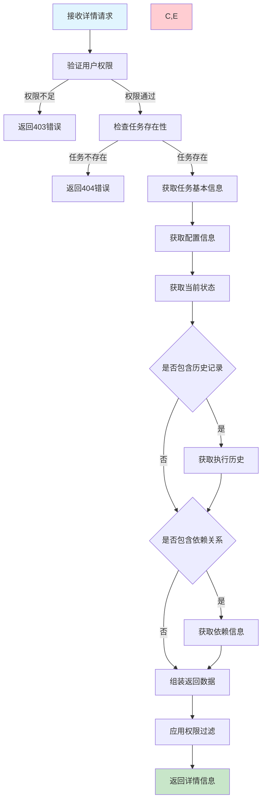
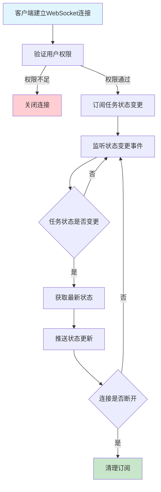

# 任务详情查看需求文档

## 1. 功能描述

### 1.1 功能概述
任务详情查看功能提供完整的任务信息展示，包括基本配置、运行状态、执行历史、依赖关系、日志信息等，为用户提供全面的任务管理视图。

### 1.2 主要功能列表
- 任务基本信息展示
- 配置参数详细显示
- 运行状态实时更新
- 执行历史记录查看
- 依赖关系图形化展示
- 性能指标监控
- 日志信息查看

### 1.3 应用场景
- **任务监控**：实时查看任务运行状态
- **问题诊断**：查看执行历史和错误日志
- **配置检查**：验证任务配置的正确性
- **依赖分析**：了解任务间的依赖关系

## 2. 功能目标

### 2.1 业务目标
- 提供完整的任务信息视图
- 支持实时状态监控
- 便于问题诊断和排查
- 提升任务管理效率

### 2.2 技术目标
- 详情页面响应时间小于1秒
- 支持大量历史记录的分页显示
- 实时状态更新机制
- 多维度信息整合展示

### 2.3 用户体验目标
- 信息展示清晰直观
- 关键信息突出显示
- 支持快速操作入口
- 响应式界面设计

## 3. 输入输出

### 3.1 输入参数

#### 3.1.1 必需参数
- `task_id` (string): 任务ID

#### 3.1.2 可选参数
- `include_history` (boolean): 是否包含执行历史，默认true
- `include_logs` (boolean): 是否包含日志信息，默认false
- `include_dependencies` (boolean): 是否包含依赖关系，默认true
- `history_limit` (int): 历史记录数量限制，默认20
- `log_level` (string): 日志级别过滤，默认all

### 3.2 输出参数

#### 3.2.1 成功响应
```json
{
  "code": 200,
  "message": "获取任务详情成功",
  "data": {
    "task_info": {
      "task_id": "task_20240116_001",
      "task_name": "数据同步任务",
      "task_type": "command",
      "status": "running",
      "priority": 8,
      "description": "定时同步数据库数据",
      "created_by": "admin",
      "created_at": "2024-01-16T14:30:00Z",
      "updated_at": "2024-01-16T15:30:00Z",
      "tags": ["data", "sync", "database"]
    },
    "schedule_config": {
      "type": "cron",
      "cron_expression": "0 2 * * *",
      "timezone": "Asia/Shanghai",
      "next_run_time": "2024-01-17T02:00:00Z",
      "enabled": true
    },
    "execution_config": {
      "timeout": 3600,
      "retry_count": 3,
      "retry_interval": 60,
      "command": "python /scripts/sync_data.py",
      "environment": {
        "DB_HOST": "localhost",
        "DB_PORT": "3306"
      }
    },
    "current_status": {
      "status": "running",
      "started_at": "2024-01-16T16:00:00Z",
      "progress": 65,
      "message": "正在处理第650/1000条记录",
      "pid": 12345,
      "resource_usage": {
        "cpu_percent": 15.5,
        "memory_mb": 256,
        "disk_io_mb": 45
      }
    },
    "statistics": {
      "total_runs": 156,
      "success_runs": 148,
      "failed_runs": 8,
      "average_duration": 1245,
      "last_success_time": "2024-01-16T02:00:00Z",
      "last_failure_time": "2024-01-15T02:00:00Z"
    },
    "execution_history": [
      {
        "execution_id": "exec_20240116_001",
        "started_at": "2024-01-16T02:00:00Z",
        "ended_at": "2024-01-16T02:20:35Z",
        "status": "success",
        "duration": 1235,
        "exit_code": 0,
        "message": "执行成功，处理1000条记录"
      }
    ],
    "dependencies": {
      "depends_on": [
        {
          "task_id": "task_20240116_pre",
          "task_name": "数据预处理任务",
          "status": "success"
        }
      ],
      "dependents": [
        {
          "task_id": "task_20240116_post",
          "task_name": "数据后处理任务",
          "status": "waiting"
        }
      ]
    }
  }
}
```

### 3.3 权限相关
- `permissions` (object): 当前用户对该任务的操作权限

## 4. 接口设计

### 4.1 API接口定义

#### 4.1.1 获取任务详情
```
GET /api/v1/task/{task_id}/detail
Authorization: Bearer {token}
```

**查询参数示例：**
```
GET /api/v1/task/task_20240116_001/detail?include_history=true&include_logs=false&history_limit=10
```

#### 4.1.2 获取任务实时状态
```
GET /api/v1/task/{task_id}/status
Authorization: Bearer {token}
```

#### 4.1.3 获取任务执行历史
```
GET /api/v1/task/{task_id}/history?page=1&page_size=20
Authorization: Bearer {token}
```

#### 4.1.4 获取任务依赖关系
```
GET /api/v1/task/{task_id}/dependencies
Authorization: Bearer {token}
```

### 4.2 WebSocket接口
```
WS /api/v1/task/{task_id}/realtime
Authorization: Bearer {token}
```

**实时状态推送：**
```json
{
  "type": "status_update",
  "data": {
    "task_id": "task_20240116_001",
    "status": "running",
    "progress": 75,
    "message": "正在处理第750/1000条记录",
    "timestamp": "2024-01-16T16:15:00Z"
  }
}
```

### 4.3 内部服务接口
```go
type TaskDetailService interface {
    GetTaskDetail(ctx context.Context, taskID string, options *DetailOptions) (*TaskDetailResponse, error)
    GetTaskStatus(ctx context.Context, taskID string) (*TaskStatusResponse, error)
    GetExecutionHistory(ctx context.Context, taskID string, req *HistoryRequest) (*HistoryResponse, error)
    GetDependencies(ctx context.Context, taskID string) (*DependencyResponse, error)
    SubscribeStatusUpdates(ctx context.Context, taskID string) (<-chan *StatusUpdate, error)
}
```

## 5. 数据结构

### 5.1 Go数据结构
```go
type TaskDetailResponse struct {
    TaskInfo        *TaskInfo        `json:"task_info"`
    ScheduleConfig  *ScheduleConfig  `json:"schedule_config"`
    ExecutionConfig *ExecutionConfig `json:"execution_config"`
    CurrentStatus   *CurrentStatus   `json:"current_status"`
    Statistics      *TaskStatistics  `json:"statistics"`
    ExecutionHistory []*ExecutionRecord `json:"execution_history,omitempty"`
    Dependencies    *DependencyInfo  `json:"dependencies,omitempty"`
    Permissions     *UserPermissions `json:"permissions"`
}

type TaskInfo struct {
    TaskID      string   `json:"task_id"`
    TaskName    string   `json:"task_name"`
    TaskType    string   `json:"task_type"`
    Status      string   `json:"status"`
    Priority    int      `json:"priority"`
    Description string   `json:"description"`
    CreatedBy   string   `json:"created_by"`
    CreatedAt   string   `json:"created_at"`
    UpdatedAt   string   `json:"updated_at"`
    Tags        []string `json:"tags"`
}

type CurrentStatus struct {
    Status        string         `json:"status"`
    StartedAt     *string        `json:"started_at,omitempty"`
    Progress      int            `json:"progress"`
    Message       string         `json:"message"`
    PID           int            `json:"pid,omitempty"`
    ResourceUsage *ResourceUsage `json:"resource_usage,omitempty"`
}

type ResourceUsage struct {
    CPUPercent float64 `json:"cpu_percent"`
    MemoryMB   int     `json:"memory_mb"`
    DiskIOMB   int     `json:"disk_io_mb"`
}

type TaskStatistics struct {
    TotalRuns       int     `json:"total_runs"`
    SuccessRuns     int     `json:"success_runs"`
    FailedRuns      int     `json:"failed_runs"`
    AverageDuration int     `json:"average_duration"`
    LastSuccessTime *string `json:"last_success_time,omitempty"`
    LastFailureTime *string `json:"last_failure_time,omitempty"`
}

type ExecutionRecord struct {
    ExecutionID string  `json:"execution_id"`
    StartedAt   string  `json:"started_at"`
    EndedAt     *string `json:"ended_at,omitempty"`
    Status      string  `json:"status"`
    Duration    int     `json:"duration"`
    ExitCode    *int    `json:"exit_code,omitempty"`
    Message     string  `json:"message"`
}

type DependencyInfo struct {
    DependsOn  []*TaskDependency `json:"depends_on"`
    Dependents []*TaskDependency `json:"dependents"`
}

type TaskDependency struct {
    TaskID   string `json:"task_id"`
    TaskName string `json:"task_name"`
    Status   string `json:"status"`
}
```

## 6. 异常处理

### 6.1 参数验证异常
- **任务不存在**：指定的任务ID不存在
- **权限不足**：用户无权限查看该任务
- **参数格式错误**：查询参数格式不正确

### 6.2 业务逻辑异常
- **任务已删除**：任务已被软删除或硬删除
- **数据不完整**：部分信息缺失或损坏
- **状态异常**：任务状态异常导致无法获取详情

### 6.3 系统异常
- **数据库异常**：查询执行失败
- **缓存异常**：缓存服务不可用
- **服务超时**：获取详情信息超时

## 7. 流程图

### 7.1 任务详情获取主流程



### 7.2 实时状态更新流程



## 8. 安全性考虑

### 8.1 权限控制
- **查看权限验证**：用户只能查看有权限的任务详情
- **字段级权限**：敏感配置信息根据权限级别显示
- **操作权限标识**：标识用户可执行的操作

### 8.2 数据安全
- **敏感信息脱敏**：密码等敏感信息在详情中脱敏
- **日志过滤**：过滤日志中的敏感信息
- **配置保护**：重要配置信息需要特殊权限查看

### 8.3 访问控制
- **频率限制**：防止频繁请求详情接口
- **会话验证**：每次请求都验证用户会话
- **IP限制**：支持IP白名单访问控制

## 9. 日志与监控

### 9.1 访问日志
- **详情查看日志**：记录用户查看任务详情的操作
- **权限日志**：记录权限验证过程
- **性能日志**：记录详情页面的加载时间

### 9.2 业务监控
- **访问频率**：监控任务详情的访问频率
- **热点任务**：统计最常查看的任务
- **用户行为**：分析用户的查看模式

### 9.3 性能监控
- **响应时间**：监控详情页面的响应时间
- **数据库查询**：监控相关数据库查询性能
- **缓存效率**：监控缓存命中率

### 9.4 日志格式
```json
{
  "timestamp": "2024-01-16T16:45:00Z",
  "level": "INFO",
  "service": "task-detail",
  "operation": "get_task_detail",
  "task_id": "task_20240116_001",
  "user_id": "user_123",
  "include_history": true,
  "include_logs": false,
  "duration_ms": 250,
  "result": "success"
}
```

## 10. 测试用例

### 10.1 功能测试用例

#### 10.1.1 基础详情获取测试
**测试目标：** 验证基础任务详情获取功能

**测试用例：**
- 获取存在任务的详情
- 获取不同类型任务的详情
- 获取不同状态任务的详情

**预期结果：** 返回完整的任务详情信息

#### 10.1.2 可选信息获取测试
**测试目标：** 验证可选信息的获取

**测试场景：**
- 包含执行历史的详情获取
- 包含依赖关系的详情获取
- 包含日志信息的详情获取
- 不包含可选信息的详情获取

**预期结果：** 根据参数返回相应的信息

#### 10.1.3 权限控制测试
**测试目标：** 验证详情查看权限控制

**测试场景：**
- 有权限用户查看任务详情
- 无权限用户查看任务详情
- 不同权限级别用户查看敏感信息

**预期结果：** 根据权限返回相应内容

#### 10.1.4 实时状态更新测试
**测试目标：** 验证WebSocket实时状态推送

**测试场景：** 任务状态变更时的实时推送
**预期结果：** 客户端及时收到状态更新

### 10.2 性能测试用例

#### 10.2.1 响应时间测试
**测试目标：** 验证详情页面的响应性能

**测试场景：** 获取包含大量历史记录的任务详情
**预期结果：** 响应时间不超过1秒

#### 10.2.2 并发访问测试
**测试目标：** 验证并发访问的性能

**测试场景：** 100个用户同时访问相同任务详情
**预期结果：** 所有请求正常响应

#### 10.2.3 大数据量测试
**测试目标：** 验证大数据量场景下的性能

**测试场景：** 获取包含10000条执行历史的任务详情
**预期结果：** 系统稳定运行，分页正常

### 10.3 安全测试用例

#### 10.3.1 权限越界测试
**测试目标：** 验证权限边界控制

**测试场景：** 用户尝试查看无权限的任务详情
**预期结果：** 返回权限不足错误

#### 10.3.2 敏感信息保护测试
**测试目标：** 验证敏感信息的脱敏处理

**测试场景：** 查看包含密码等敏感信息的任务详情
**预期结果：** 敏感信息正确脱敏显示

### 10.4 异常测试用例

#### 10.4.1 数据异常测试
**测试目标：** 验证数据异常时的处理

**测试场景：**
- 任务不存在
- 任务已删除
- 部分数据损坏

**预期结果：** 返回相应的错误信息

#### 10.4.2 服务异常测试
**测试目标：** 验证依赖服务异常的处理

**测试场景：**
- 数据库服务不可用
- 缓存服务异常
- 网络超时

**预期结果：** 系统降级服务，返回基本信息

#### 10.4.3 WebSocket异常测试
**测试目标：** 验证WebSocket连接异常的处理

**测试场景：**
- 连接中断
- 权限变更
- 服务重启

**预期结果：** 客户端能够正确处理连接异常 