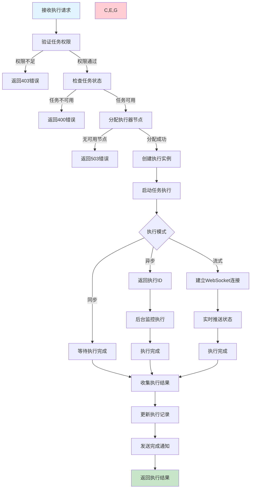
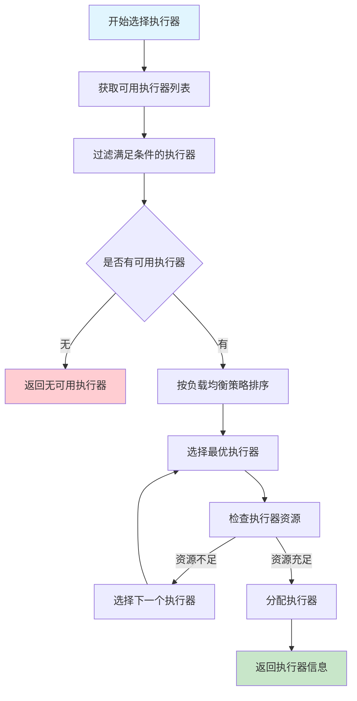

# 任务执行需求文档

## 1. 功能描述

### 1.1 功能概述
任务执行功能是任务调度系统的核心组件，负责接收调度器的执行指令，启动任务实例，监控执行过程，处理执行结果，并提供实时的执行状态反馈。

### 1.2 主要功能列表
- 接收并解析任务执行请求
- 创建任务执行实例
- 实时监控任务执行状态
- 处理任务执行超时和重试
- 收集和记录执行日志
- 发送执行结果通知

### 1.3 支持的执行模式
- **同步执行**：等待任务完成后返回结果
- **异步执行**：立即返回执行ID，后续查询结果
- **流式执行**：实时推送执行进度和日志
- **批量执行**：同时执行多个相关任务

## 2. 功能目标

### 2.1 业务目标
- 确保任务执行的可靠性和稳定性
- 提供完整的执行过程可观测性
- 支持多种任务类型的执行需求
- 实现任务执行的自动化管理

### 2.2 技术目标
- 高并发执行能力（支持1000+并发任务）
- 执行延迟控制在秒级以内
- 执行成功率达到99.9%以上
- 支持水平扩展和负载均衡

### 2.3 安全目标
- 任务执行环境隔离
- 执行权限严格控制
- 敏感信息安全处理
- 完整的执行审计追踪

## 3. 输入输出

### 3.1 输入参数

#### 3.1.1 必需参数
- `execution_id` (string): 执行实例ID
- `task_id` (string): 任务ID
- `execution_mode` (string): 执行模式（sync/async/stream）
- `execution_config` (object): 执行配置

#### 3.1.2 可选参数
- `parameters` (object): 执行时参数覆盖
- `timeout_override` (int): 超时时间覆盖
- `priority_boost` (int): 优先级提升
- `execution_context` (object): 执行上下文信息

### 3.2 输出参数

#### 3.2.1 同步执行响应
```json
{
  "code": 200,
  "message": "任务执行完成",
  "data": {
    "execution_id": "exec_20240116_001",
    "task_id": "task_20240116_001",
    "status": "completed",
    "result": {
      "exit_code": 0,
      "output": "任务执行成功",
      "error": null
    },
    "start_time": "2024-01-16T14:30:00Z",
    "end_time": "2024-01-16T14:32:15Z",
    "duration": 135
  }
}
```

#### 3.2.2 异步执行响应
```json
{
  "code": 200,
  "message": "任务已开始执行",
  "data": {
    "execution_id": "exec_20240116_002",
    "task_id": "task_20240116_001",
    "status": "running",
    "start_time": "2024-01-16T14:35:00Z",
    "estimated_duration": 300
  }
}
```

## 4. 接口设计

### 4.1 API接口定义

#### 4.1.1 立即执行任务
```
POST /api/v1/task/{task_id}/execute
Content-Type: application/json
Authorization: Bearer {token}
```

#### 4.1.2 查询执行状态
```
GET /api/v1/task/execution/{execution_id}/status
```

#### 4.1.3 停止任务执行
```
POST /api/v1/task/execution/{execution_id}/stop
```

### 4.2 内部服务接口

```go
type TaskExecuteService interface {
    ExecuteTask(ctx context.Context, req *ExecuteTaskRequest) (*ExecuteTaskResponse, error)
    GetExecutionStatus(ctx context.Context, executionID string) (*ExecutionStatus, error)
    StopExecution(ctx context.Context, executionID string) error
}
```

## 5. 数据结构

### 5.1 任务执行记录表（task_executions）
```sql
CREATE TABLE task_executions (
    execution_id VARCHAR(64) PRIMARY KEY COMMENT '执行实例ID',
    task_id VARCHAR(64) NOT NULL COMMENT '任务ID',
    status VARCHAR(20) NOT NULL COMMENT '执行状态',
    start_time DATETIME NOT NULL COMMENT '开始时间',
    end_time DATETIME COMMENT '结束时间',
    duration INT COMMENT '执行时长(秒)',
    exit_code INT COMMENT '退出码',
    output TEXT COMMENT '执行输出',
    error_message TEXT COMMENT '错误信息',
    execution_log TEXT COMMENT '执行日志',
    executor_node VARCHAR(64) COMMENT '执行节点',
    created_at DATETIME DEFAULT CURRENT_TIMESTAMP,
    INDEX idx_task_id (task_id),
    INDEX idx_status (status),
    INDEX idx_start_time (start_time)
) COMMENT='任务执行记录表';
```

## 6. 异常处理

### 6.1 执行前异常
- **任务不存在**：指定的任务ID无效
- **权限不足**：用户无执行权限
- **资源不足**：系统资源不足，无法启动新的执行实例
- **依赖未满足**：依赖任务未完成或执行失败

### 6.2 执行中异常
- **执行超时**：任务执行时间超过配置的超时限制
- **进程崩溃**：执行进程异常退出
- **资源耗尽**：内存、磁盘空间不足
- **网络异常**：网络连接中断或外部服务不可用

### 6.3 执行后异常
- **结果处理失败**：执行结果解析或存储失败
- **通知发送失败**：执行完成通知发送失败
- **清理失败**：执行环境清理失败

## 7. 流程图

### 7.1 任务执行主流程



### 7.2 执行器选择流程



## 8. 安全性考虑

### 8.1 执行环境隔离
- **容器化执行**：每个任务在独立容器中执行
- **资源限制**：限制CPU、内存、网络等资源使用
- **文件系统隔离**：限制文件访问权限和范围

### 8.2 权限控制
- **执行权限验证**：验证用户对特定任务的执行权限
- **参数安全检查**：过滤和验证执行参数
- **敏感信息保护**：加密存储和传输敏感配置

### 8.3 审计追踪
- **执行日志记录**：完整记录任务执行过程
- **操作审计**：记录所有执行相关的操作
- **安全事件监控**：监控异常执行行为

## 9. 日志与监控

### 9.1 执行日志
- **启动日志**：记录任务启动过程和参数
- **执行日志**：记录任务执行过程中的输出
- **错误日志**：记录执行过程中的异常和错误
- **完成日志**：记录任务完成状态和结果

### 9.2 性能监控
- **执行延迟**：监控从接收请求到开始执行的延迟
- **执行时长**：统计任务执行的时间分布
- **资源使用**：监控执行过程中的资源消耗
- **成功率**：统计任务执行的成功率

### 9.3 告警规则
- **执行失败率过高**：5分钟内失败率超过5%
- **执行延迟过长**：平均启动延迟超过10秒
- **资源使用过高**：CPU或内存使用率超过80%
- **执行器不可用**：可用执行器数量低于阈值

## 10. 测试用例

### 10.1 功能测试用例

#### 10.1.1 正常执行测试
**测试目标：** 验证各种类型任务的正常执行
**测试用例：**
- 命令行任务正常执行
- HTTP任务正常执行
- SQL任务正常执行
- 自定义任务正常执行

#### 10.1.2 异常处理测试
**测试目标：** 验证各种异常情况的处理
**测试场景：**
- 任务执行超时
- 执行权限不足
- 系统资源不足
- 依赖任务失败

#### 10.1.3 并发执行测试
**测试目标：** 验证高并发场景下的执行稳定性
**测试场景：** 同时执行100个不同类型的任务
**预期结果：** 所有任务正常执行，系统稳定运行

### 10.2 性能测试用例

#### 10.2.1 执行延迟测试
**测试目标：** 验证任务执行的响应时间
**测试场景：** 测量从接收请求到开始执行的时间
**预期结果：** 95%的请求在5秒内开始执行

#### 10.2.2 吞吐量测试
**测试目标：** 验证系统的任务执行吞吐量
**测试场景：** 持续提交任务执行请求
**预期结果：** 支持1000+并发任务执行

### 10.3 安全测试用例

#### 10.3.1 权限验证测试
**测试目标：** 验证执行权限控制
**测试场景：** 无权限用户尝试执行任务
**预期结果：** 返回403权限不足错误

#### 10.3.2 环境隔离测试
**测试目标：** 验证任务执行环境隔离
**测试场景：** 恶意任务尝试访问系统资源
**预期结果：** 任务被限制在隔离环境中

### 10.4 异常测试用例

#### 10.4.1 超时处理测试
**测试目标：** 验证任务执行超时处理
**测试场景：** 创建一个超长时间运行的任务
**预期结果：** 任务在超时后被自动终止

#### 10.4.2 资源耗尽测试
**测试目标：** 验证资源耗尽时的处理
**测试场景：** 创建消耗大量资源的任务
**预期结果：** 任务被资源限制约束，不影响系统稳定性 