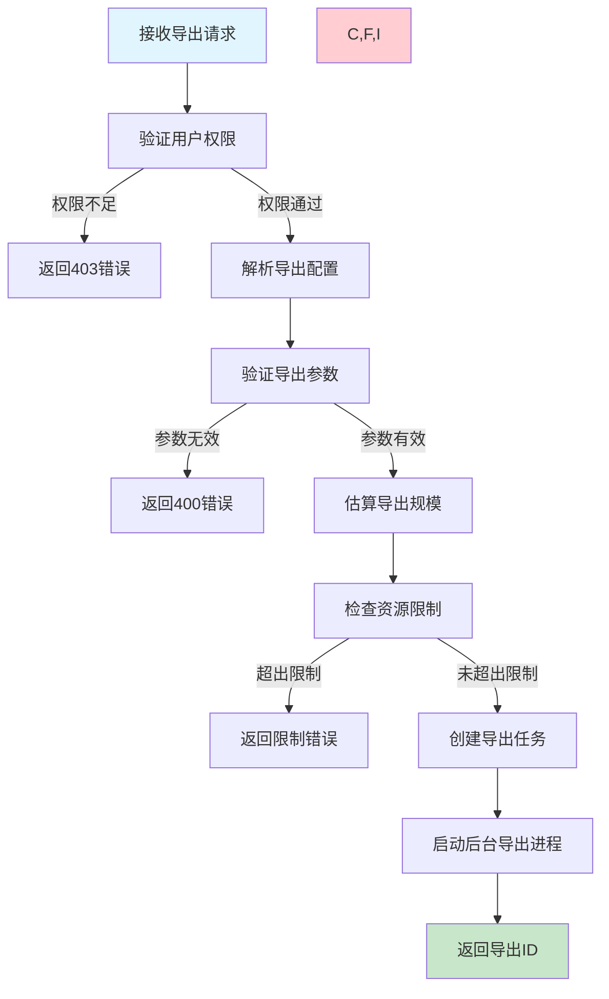
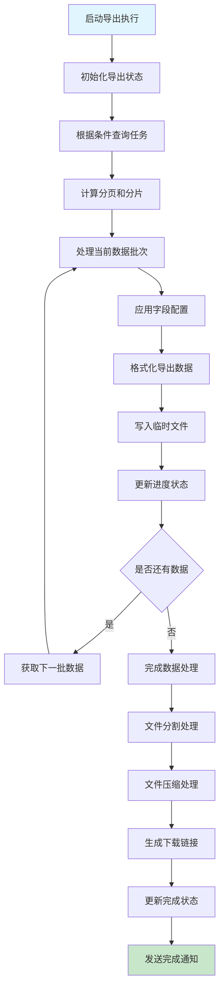
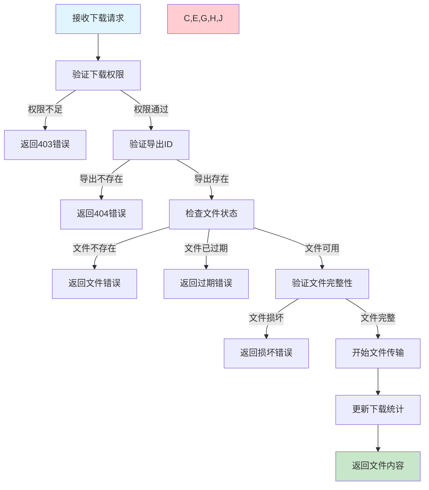

# 任务导出需求文档

## 1. 功能描述

### 1.1 功能概述
任务导出功能提供将任务数据和配置导出到各种格式文件的能力，支持多种导出格式、自定义导出内容和批量导出，便于数据备份、分析和迁移。

### 1.2 主要功能列表
- 多格式任务导出（JSON、CSV、Excel、XML）
- 自定义导出字段和过滤条件
- 批量任务导出
- 导出进度跟踪
- 导出文件压缩和分割
- 导出历史记录管理
- 导出模板配置

### 1.3 导出类型
- **单任务导出**：导出指定单个任务的详细信息
- **批量导出**：导出多个任务的信息
- **配置导出**：导出任务配置用于备份或迁移
- **报告导出**：导出任务执行报告和统计信息

## 2. 功能目标

### 2.1 业务目标
- 支持任务数据的备份和迁移
- 提供数据分析和报告能力
- 满足合规和审计要求
- 支持系统间的数据交换

### 2.2 技术目标
- 导出操作响应时间小于10秒
- 支持单次导出10万+任务
- 导出文件大小自动分割管理
- 导出成功率达到99.9%

### 2.3 安全目标
- 敏感数据的安全导出
- 导出权限的严格控制
- 导出操作的审计追踪
- 导出文件的安全存储

## 3. 输入输出

### 3.1 输入参数

#### 3.1.1 导出选择参数
- `task_ids` (array): 指定任务ID列表
- `filter_conditions` (object): 任务筛选条件
- `export_type` (string): 导出类型，single/batch/config/report
- `date_range` (object): 时间范围筛选

#### 3.1.2 导出格式参数
- `export_format` (string): 导出格式，json/csv/excel/xml
- `include_fields` (array): 包含的字段列表
- `exclude_fields` (array): 排除的字段列表
- `custom_fields` (object): 自定义字段配置

#### 3.1.3 导出配置参数
- `compression` (boolean): 是否压缩，默认true
- `split_size` (int): 文件分割大小(MB)，默认100
- `password_protection` (boolean): 是否密码保护
- `include_attachments` (boolean): 是否包含附件

### 3.2 输出参数

#### 3.2.1 导出启动响应
```json
{
  "code": 200,
  "message": "导出任务已启动",
  "data": {
    "export_id": "export_20240116_001",
    "export_type": "batch",
    "export_format": "excel",
    "total_tasks": 1500,
    "estimated_file_size": "45MB",
    "estimated_duration": 180,
    "started_at": "2024-01-16T21:30:00Z",
    "status": "processing"
  }
}
```

#### 3.2.2 导出状态响应
```json
{
  "code": 200,
  "message": "查询成功",
  "data": {
    "export_id": "export_20240116_001",
    "status": "completed",
    "progress": {
      "processed_tasks": 1500,
      "total_tasks": 1500,
      "percentage": 100
    },
    "result": {
      "file_count": 2,
      "total_size": "42.5MB",
      "download_urls": [
        {
          "file_name": "tasks_export_part1.xlsx",
          "file_size": "25.8MB",
          "download_url": "/api/v1/exports/download/export_20240116_001_part1",
          "expires_at": "2024-01-17T21:30:00Z"
        },
        {
          "file_name": "tasks_export_part2.xlsx", 
          "file_size": "16.7MB",
          "download_url": "/api/v1/exports/download/export_20240116_001_part2",
          "expires_at": "2024-01-17T21:30:00Z"
        }
      ]
    },
    "started_at": "2024-01-16T21:30:00Z",
    "completed_at": "2024-01-16T21:33:15Z",
    "duration": 195
  }
}
```

## 4. 接口设计

### 4.1 API接口定义

#### 4.1.1 创建导出任务
```
POST /api/v1/tasks/export
Content-Type: application/json
Authorization: Bearer {token}
```

**请求体示例：**
```json
{
  "export_config": {
    "export_type": "batch",
    "export_format": "excel",
    "selection": {
      "filter_conditions": {
        "status": ["completed", "failed"],
        "created_after": "2024-01-01T00:00:00Z",
        "created_before": "2024-01-16T23:59:59Z",
        "tags": ["production"]
      }
    },
    "fields_config": {
      "include_fields": [
        "task_id", "task_name", "status", "created_at", 
        "started_at", "completed_at", "duration", "error_message"
      ],
      "custom_fields": {
        "execution_time_hours": "duration / 3600",
        "status_chinese": "CASE WHEN status='completed' THEN '已完成' WHEN status='failed' THEN '失败' ELSE status END"
      }
    },
    "output_config": {
      "compression": true,
      "split_size": 50,
      "password_protection": false,
      "include_metadata": true
    }
  }
}
```

#### 4.1.2 查询导出状态
```
GET /api/v1/tasks/export/{export_id}/status
```

#### 4.1.3 下载导出文件
```
GET /api/v1/tasks/export/{export_id}/download/{file_part}
Authorization: Bearer {token}
```

#### 4.1.4 取消导出任务
```
POST /api/v1/tasks/export/{export_id}/cancel
```

#### 4.1.5 获取导出历史
```
GET /api/v1/tasks/export/history?page=1&page_size=20&start_time=xxx&end_time=xxx
```

#### 4.1.6 删除导出文件
```
DELETE /api/v1/tasks/export/{export_id}
```

### 4.2 内部服务接口
```go
type TaskExportService interface {
    CreateExport(ctx context.Context, req *CreateExportRequest) (*CreateExportResponse, error)
    GetExportStatus(ctx context.Context, exportID string) (*ExportStatusResponse, error)
    CancelExport(ctx context.Context, exportID string) error
    DownloadExport(ctx context.Context, exportID string, filePart string) (*ExportFile, error)
    ListExports(ctx context.Context, req *ListExportsRequest) (*ListExportsResponse, error)
    DeleteExport(ctx context.Context, exportID string) error
    GetExportTemplates(ctx context.Context) ([]*ExportTemplate, error)
}
```

## 5. 数据结构

### 5.1 任务导出表（task_exports）
```sql
CREATE TABLE task_exports (
    id BIGINT AUTO_INCREMENT PRIMARY KEY COMMENT '主键ID',
    export_id VARCHAR(64) UNIQUE NOT NULL COMMENT '导出ID',
    export_type ENUM('single', 'batch', 'config', 'report') NOT NULL COMMENT '导出类型',
    export_format ENUM('json', 'csv', 'excel', 'xml') NOT NULL COMMENT '导出格式',
    selection_criteria JSON NOT NULL COMMENT '选择条件',
    fields_config JSON NOT NULL COMMENT '字段配置',
    output_config JSON NOT NULL COMMENT '输出配置',
    status ENUM('pending', 'processing', 'completed', 'failed', 'cancelled') DEFAULT 'pending' COMMENT '状态',
    total_tasks INT COMMENT '总任务数',
    processed_tasks INT DEFAULT 0 COMMENT '已处理任务数',
    file_count INT DEFAULT 0 COMMENT '文件数量',
    total_file_size BIGINT DEFAULT 0 COMMENT '总文件大小(字节)',
    progress_percentage DECIMAL(5,2) DEFAULT 0.00 COMMENT '进度百分比',
    error_message TEXT COMMENT '错误信息',
    started_at DATETIME COMMENT '开始时间',
    completed_at DATETIME COMMENT '完成时间',
    expires_at DATETIME COMMENT '过期时间',
    created_by VARCHAR(64) NOT NULL COMMENT '创建人',
    created_at DATETIME DEFAULT CURRENT_TIMESTAMP COMMENT '创建时间',
    INDEX idx_export_type (export_type),
    INDEX idx_status (status),
    INDEX idx_created_by (created_by),
    INDEX idx_created_at (created_at)
) COMMENT='任务导出表';
```

### 5.2 导出文件表（export_files）
```sql
CREATE TABLE export_files (
    id BIGINT AUTO_INCREMENT PRIMARY KEY COMMENT '主键ID',
    export_id VARCHAR(64) NOT NULL COMMENT '导出ID',
    file_part VARCHAR(32) NOT NULL COMMENT '文件分片标识',
    file_name VARCHAR(255) NOT NULL COMMENT '文件名',
    file_path VARCHAR(512) NOT NULL COMMENT '文件路径',
    file_size BIGINT NOT NULL COMMENT '文件大小(字节)',
    file_hash VARCHAR(64) COMMENT '文件哈希值',
    download_count INT DEFAULT 0 COMMENT '下载次数',
    created_at DATETIME DEFAULT CURRENT_TIMESTAMP COMMENT '创建时间',
    INDEX idx_export_id (export_id),
    UNIQUE KEY uk_export_part (export_id, file_part)
) COMMENT='导出文件表';
```

### 5.3 导出模板表（export_templates）
```sql
CREATE TABLE export_templates (
    id BIGINT AUTO_INCREMENT PRIMARY KEY COMMENT '主键ID',
    template_id VARCHAR(64) UNIQUE NOT NULL COMMENT '模板ID',
    template_name VARCHAR(255) NOT NULL COMMENT '模板名称',
    template_type ENUM('single', 'batch', 'config', 'report') NOT NULL COMMENT '模板类型',
    export_format ENUM('json', 'csv', 'excel', 'xml') NOT NULL COMMENT '导出格式',
    fields_config JSON NOT NULL COMMENT '字段配置',
    output_config JSON NOT NULL COMMENT '输出配置',
    is_public BOOLEAN DEFAULT FALSE COMMENT '是否公开',
    usage_count INT DEFAULT 0 COMMENT '使用次数',
    created_by VARCHAR(64) NOT NULL COMMENT '创建人',
    created_at DATETIME DEFAULT CURRENT_TIMESTAMP COMMENT '创建时间',
    updated_at DATETIME DEFAULT CURRENT_TIMESTAMP ON UPDATE CURRENT_TIMESTAMP COMMENT '更新时间',
    INDEX idx_template_type (template_type),
    INDEX idx_created_by (created_by)
) COMMENT='导出模板表';
```

### 5.4 Go数据结构
```go
type CreateExportRequest struct {
    ExportConfig *ExportConfig `json:"export_config" v:"required"`
}

type ExportConfig struct {
    ExportType    string         `json:"export_type" v:"required|in:single,batch,config,report"`
    ExportFormat  string         `json:"export_format" v:"required|in:json,csv,excel,xml"`
    Selection     *Selection     `json:"selection" v:"required"`
    FieldsConfig  *FieldsConfig  `json:"fields_config" v:"required"`
    OutputConfig  *OutputConfig  `json:"output_config"`
}

type Selection struct {
    TaskIDs          []string               `json:"task_ids"`
    FilterConditions map[string]interface{} `json:"filter_conditions"`
    DateRange        *DateRange             `json:"date_range"`
}

type DateRange struct {
    StartDate string `json:"start_date"`
    EndDate   string `json:"end_date"`
}

type FieldsConfig struct {
    IncludeFields []string            `json:"include_fields"`
    ExcludeFields []string            `json:"exclude_fields"`
    CustomFields  map[string]string   `json:"custom_fields"`
}

type OutputConfig struct {
    Compression        bool   `json:"compression"`
    SplitSize         int    `json:"split_size" v:"min:1,max:1000"`
    PasswordProtection bool   `json:"password_protection"`
    IncludeMetadata   bool   `json:"include_metadata"`
    IncludeAttachments bool   `json:"include_attachments"`
}

type CreateExportResponse struct {
    ExportID         string `json:"export_id"`
    ExportType       string `json:"export_type"`
    ExportFormat     string `json:"export_format"`
    TotalTasks       int    `json:"total_tasks"`
    EstimatedFileSize string `json:"estimated_file_size"`
    EstimatedDuration int    `json:"estimated_duration"`
    StartedAt        string `json:"started_at"`
    Status           string `json:"status"`
}

type ExportStatusResponse struct {
    ExportID    string          `json:"export_id"`
    Status      string          `json:"status"`
    Progress    *ExportProgress `json:"progress"`
    Result      *ExportResult   `json:"result,omitempty"`
    StartedAt   string          `json:"started_at"`
    CompletedAt string          `json:"completed_at,omitempty"`
    Duration    int             `json:"duration"`
    ErrorMessage string         `json:"error_message,omitempty"`
}

type ExportProgress struct {
    ProcessedTasks int     `json:"processed_tasks"`
    TotalTasks     int     `json:"total_tasks"`
    Percentage     float64 `json:"percentage"`
}

type ExportResult struct {
    FileCount    int              `json:"file_count"`
    TotalSize    string           `json:"total_size"`
    DownloadURLs []*DownloadFile  `json:"download_urls"`
}

type DownloadFile struct {
    FileName    string `json:"file_name"`
    FileSize    string `json:"file_size"`
    DownloadURL string `json:"download_url"`
    ExpiresAt   string `json:"expires_at"`
}

type ExportFile struct {
    FileName    string    `json:"file_name"`
    ContentType string    `json:"content_type"`
    FileSize    int64     `json:"file_size"`
    Content     io.Reader `json:"-"`
}

type ExportTemplate struct {
    TemplateID   string        `json:"template_id"`
    TemplateName string        `json:"template_name"`
    TemplateType string        `json:"template_type"`
    ExportFormat string        `json:"export_format"`
    FieldsConfig *FieldsConfig `json:"fields_config"`
    OutputConfig *OutputConfig `json:"output_config"`
    IsPublic     bool          `json:"is_public"`
    UsageCount   int           `json:"usage_count"`
    CreatedBy    string        `json:"created_by"`
    CreatedAt    string        `json:"created_at"`
}
```

## 6. 异常处理

### 6.1 数据选择异常
- **无效筛选条件**：任务筛选条件格式错误
- **数据量过大**：选择的任务数量超出限制
- **权限不足**：对某些任务没有导出权限
- **任务不存在**：指定的任务ID不存在

### 6.2 导出过程异常
- **导出超时**：导出操作执行超时
- **文件生成失败**：导出文件生成过程失败
- **存储空间不足**：导出文件存储空间不足
- **格式转换错误**：数据格式转换失败

### 6.3 文件操作异常
- **文件损坏**：导出文件在生成过程中损坏
- **下载失败**：文件下载过程中网络错误
- **文件过期**：导出文件超过有效期
- **压缩失败**：文件压缩操作失败

## 7. 流程图

### 7.1 导出任务创建流程



### 7.2 导出执行流程



### 7.3 文件下载流程



## 8. 安全性考虑

### 8.1 数据安全
- **敏感数据脱敏**：导出时自动脱敏敏感信息
- **权限验证**：严格验证用户的导出权限
- **数据加密**：敏感导出文件加密存储
- **访问控制**：基于角色的导出功能访问控制

### 8.2 文件安全
- **文件加密**：支持导出文件的密码保护
- **安全存储**：导出文件存储在安全的位置
- **访问限制**：限制文件下载的时间和次数
- **文件清理**：定期清理过期的导出文件

### 8.3 操作安全
- **操作审计**：记录所有导出操作的详细日志
- **下载监控**：监控文件下载的行为
- **异常检测**：检测异常的导出行为
- **防滥用**：防止恶意的大量导出操作

## 9. 日志与监控

### 9.1 导出操作日志
- **导出启动**：记录导出任务的启动信息
- **进度更新**：记录导出进度的变化
- **完成状态**：记录导出任务的最终状态
- **下载记录**：记录文件下载的详细信息

### 9.2 性能监控
- **导出性能**：监控导出操作的性能指标
- **文件大小**：监控导出文件的大小分布
- **成功率**：监控导出操作的成功率
- **资源使用**：监控导出过程的资源消耗

### 9.3 业务监控
- **导出频率**：统计导出功能的使用频率
- **格式偏好**：分析用户偏好的导出格式
- **数据量分析**：分析导出的数据量分布
- **用户使用**：统计不同用户的导出使用情况

### 9.4 日志格式
```json
{
  "timestamp": "2024-01-16T21:30:00Z",
  "level": "INFO",
  "service": "task-export",
  "operation": "create_export",
  "export_id": "export_20240116_001",
  "export_type": "batch",
  "export_format": "excel",
  "user_id": "user_123",
  "total_tasks": 1500,
  "estimated_file_size_mb": 45,
  "processing_time_ms": 15000,
  "result": "success"
}
```

## 10. 测试用例

### 10.1 功能测试用例

#### 10.1.1 基本导出功能测试
**测试目标：** 验证基本导出功能的正确性

**测试用例：**
- 单任务导出测试
- 批量任务导出测试
- 不同格式导出测试（JSON、CSV、Excel、XML）
- 自定义字段导出测试

**预期结果：** 所有格式导出功能正常，数据准确完整

#### 10.1.2 导出文件管理测试
**测试目标：** 验证导出文件的管理功能

**测试场景：**
- 文件分割功能测试
- 文件压缩功能测试
- 文件下载功能测试
- 文件过期清理测试

**预期结果：** 文件管理功能正常，支持各种操作

#### 10.1.3 导出模板功能测试
**测试目标：** 验证导出模板的功能

**测试场景：**
- 创建导出模板
- 使用模板导出
- 模板共享功能

**预期结果：** 模板功能正常，提高导出效率

#### 10.1.4 权限控制测试
**测试目标：** 验证导出功能的权限控制

**测试场景：** 不同权限用户的导出功能访问
**预期结果：** 权限控制有效，无权限用户无法导出

### 10.2 性能测试用例

#### 10.2.1 大数据量导出测试
**测试目标：** 验证大数据量导出的性能

**测试场景：** 导出包含10万个任务的数据
**预期结果：** 导出在合理时间内完成，文件正确生成

#### 10.2.2 并发导出测试
**测试目标：** 验证并发导出的性能

**测试场景：** 多个用户同时执行导出操作
**预期结果：** 所有导出正常完成，无性能降级

#### 10.2.3 文件下载性能测试
**测试目标：** 验证文件下载的性能

**测试场景：** 下载大型导出文件
**预期结果：** 下载速度稳定，支持断点续传

### 10.3 异常测试用例

#### 10.3.1 导出中断测试
**测试目标：** 验证导出中断的处理

**测试场景：**
- 导出过程中系统重启
- 导出过程中网络中断
- 导出过程中磁盘空间不足

**预期结果：** 系统正确处理中断，提供恢复机制

#### 10.3.2 文件损坏测试
**测试目标：** 验证文件损坏的处理

**测试场景：** 模拟导出文件损坏
**预期结果：** 系统检测到损坏并提供重新导出选项

#### 10.3.3 权限异常测试
**测试目标：** 验证权限异常的处理

**测试场景：** 导出过程中权限变更
**预期结果：** 系统正确处理权限变更，停止未授权操作 