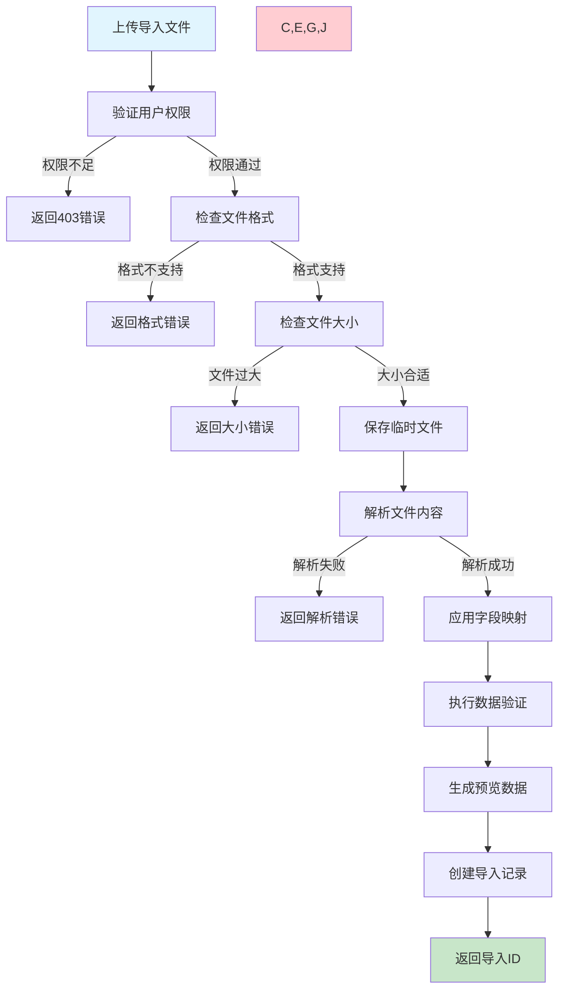
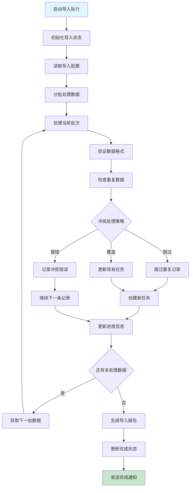
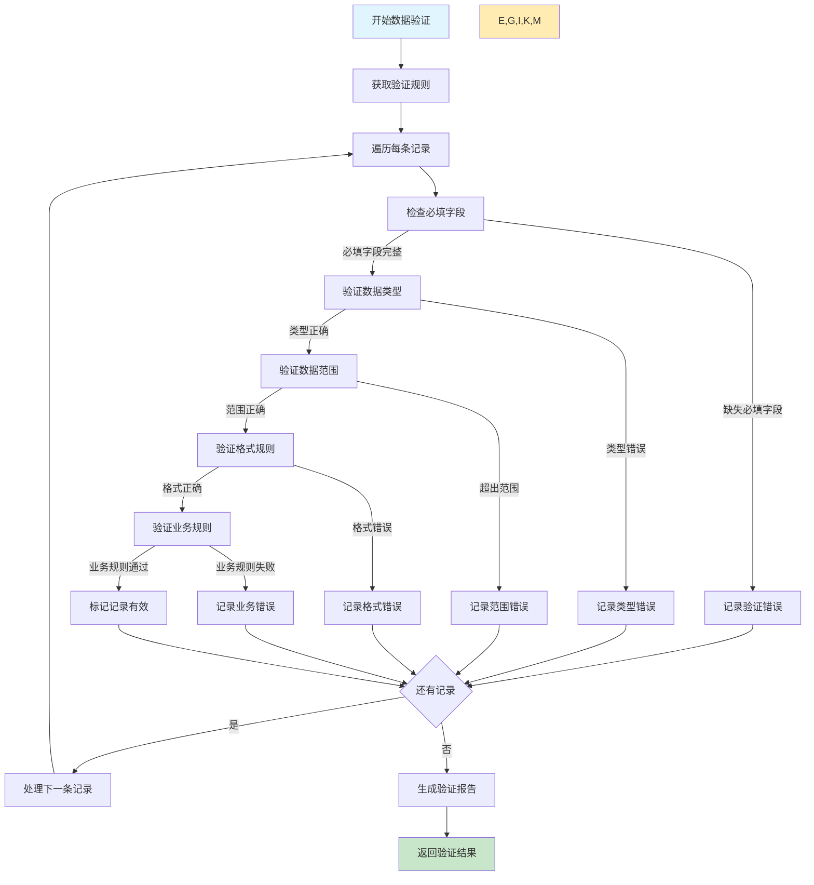

# 任务导入需求文档

## 1. 功能描述

### 1.1 功能概述
任务导入功能提供从各种格式文件批量导入任务数据的能力，支持多种文件格式解析、数据验证、冲突处理和批量创建，便于数据迁移和批量任务创建。

### 1.2 主要功能列表
- 多格式文件导入（JSON、CSV、Excel、XML）
- 数据格式验证和转换
- 重复任务检测和处理
- 批量任务创建
- 导入进度跟踪和错误报告
- 导入预览和确认机制
- 导入模板和映射配置

### 1.3 导入类型
- **新建导入**：创建全新的任务
- **更新导入**：更新现有任务的配置
- **增量导入**：仅导入新增或变更的任务
- **配置导入**：导入任务配置模板

## 2. 功能目标

### 2.1 业务目标
- 支持大规模任务的快速创建
- 简化系统间的数据迁移
- 提供灵活的数据导入配置
- 确保导入数据的准确性和完整性

### 2.2 技术目标
- 单次导入支持10万+任务
- 导入处理速度达到1000任务/秒
- 数据验证准确率达到99.9%
- 导入成功率达到95%以上

### 2.3 安全目标
- 导入数据的安全验证
- 导入权限的严格控制
- 导入操作的审计追踪
- 恶意数据的检测和防护

## 3. 输入输出

### 3.1 输入参数

#### 3.1.1 文件上传参数
- `import_file` (file): 导入文件
- `file_format` (string): 文件格式，json/csv/excel/xml
- `file_encoding` (string): 文件编码，默认UTF-8
- `import_type` (string): 导入类型，create/update/upsert

#### 3.1.2 导入配置参数
- `field_mapping` (object): 字段映射配置
- `validation_rules` (array): 数据验证规则
- `conflict_resolution` (string): 冲突处理策略
- `batch_size` (int): 批次大小，默认1000

#### 3.1.3 处理选项参数
- `preview_mode` (boolean): 是否预览模式
- `skip_invalid` (boolean): 是否跳过无效数据
- `auto_generate_ids` (boolean): 是否自动生成ID
- `validate_references` (boolean): 是否验证引用关系

### 3.2 输出参数

#### 3.2.1 导入启动响应
```json
{
  "code": 200,
  "message": "导入任务已启动",
  "data": {
    "import_id": "import_20240116_001",
    "import_type": "create",
    "file_format": "excel",
    "total_records": 2500,
    "estimated_duration": 250,
    "started_at": "2024-01-16T22:00:00Z",
    "status": "processing",
    "preview_data": [
      {
        "row_number": 1,
        "task_name": "数据同步任务-001",
        "task_type": "scheduled",
        "status": "valid"
      },
      {
        "row_number": 2,
        "task_name": "报表生成任务-001",
        "task_type": "manual",
        "status": "valid"
      }
    ]
  }
}
```

#### 3.2.2 导入状态响应
```json
{
  "code": 200,
  "message": "查询成功",
  "data": {
    "import_id": "import_20240116_001",
    "status": "completed",
    "progress": {
      "total_records": 2500,
      "processed_records": 2500,
      "successful_records": 2350,
      "failed_records": 150,
      "percentage": 100
    },
    "summary": {
      "created_tasks": 2350,
      "updated_tasks": 0,
      "skipped_records": 150,
      "validation_errors": 85,
      "duplicate_records": 65
    },
    "error_details": [
      {
        "row_number": 15,
        "error_type": "validation_error",
        "error_message": "任务名称不能为空",
        "field": "task_name"
      },
      {
        "row_number": 28,
        "error_type": "duplicate_error",
        "error_message": "任务ID已存在",
        "field": "task_id",
        "existing_value": "task_001"
      }
    ],
    "started_at": "2024-01-16T22:00:00Z",
    "completed_at": "2024-01-16T22:04:10Z",
    "duration": 250
  }
}
```

## 4. 接口设计

### 4.1 API接口定义

#### 4.1.1 上传导入文件
```
POST /api/v1/tasks/import/upload
Content-Type: multipart/form-data
Authorization: Bearer {token}
```

**请求参数：**
```
import_file: file (必填)
file_format: string (可选，自动检测)
import_config: json string (可选)
```

**导入配置示例：**
```json
{
  "import_type": "create",
  "field_mapping": {
    "task_name": "任务名称",
    "task_type": "任务类型", 
    "description": "描述",
    "timeout": "超时时间",
    "schedule_expression": "调度表达式"
  },
  "validation_rules": [
    {
      "field": "task_name",
      "required": true,
      "max_length": 255
    },
    {
      "field": "timeout",
      "type": "integer",
      "min_value": 60,
      "max_value": 86400
    }
  ],
  "processing_options": {
    "preview_mode": false,
    "skip_invalid": true,
    "batch_size": 1000,
    "conflict_resolution": "skip"
  }
}
```

#### 4.1.2 预览导入数据
```
POST /api/v1/tasks/import/preview
Content-Type: multipart/form-data
```

#### 4.1.3 确认导入执行
```
POST /api/v1/tasks/import/{import_id}/confirm
Content-Type: application/json
```

#### 4.1.4 查询导入状态
```
GET /api/v1/tasks/import/{import_id}/status
```

#### 4.1.5 下载错误报告
```
GET /api/v1/tasks/import/{import_id}/errors
Authorization: Bearer {token}
```

#### 4.1.6 取消导入任务
```
POST /api/v1/tasks/import/{import_id}/cancel
```

#### 4.1.7 获取导入历史
```
GET /api/v1/tasks/import/history?page=1&page_size=20
```

### 4.2 内部服务接口
```go
type TaskImportService interface {
    UploadImportFile(ctx context.Context, req *UploadImportRequest) (*UploadImportResponse, error)
    PreviewImport(ctx context.Context, req *PreviewImportRequest) (*PreviewImportResponse, error)
    StartImport(ctx context.Context, importID string) (*ImportStatusResponse, error)
    GetImportStatus(ctx context.Context, importID string) (*ImportStatusResponse, error)
    CancelImport(ctx context.Context, importID string) error
    DownloadErrorReport(ctx context.Context, importID string) (*ErrorReport, error)
    ListImports(ctx context.Context, req *ListImportsRequest) (*ListImportsResponse, error)
    ValidateImportFile(ctx context.Context, req *ValidateFileRequest) (*ValidationResponse, error)
}
```

## 5. 数据结构

### 5.1 任务导入表（task_imports）
```sql
CREATE TABLE task_imports (
    id BIGINT AUTO_INCREMENT PRIMARY KEY COMMENT '主键ID',
    import_id VARCHAR(64) UNIQUE NOT NULL COMMENT '导入ID',
    import_type ENUM('create', 'update', 'upsert') NOT NULL COMMENT '导入类型',
    file_format ENUM('json', 'csv', 'excel', 'xml') NOT NULL COMMENT '文件格式',
    file_name VARCHAR(255) NOT NULL COMMENT '文件名',
    file_path VARCHAR(512) NOT NULL COMMENT '文件路径',
    file_size BIGINT NOT NULL COMMENT '文件大小(字节)',
    field_mapping JSON NOT NULL COMMENT '字段映射',
    validation_rules JSON COMMENT '验证规则',
    processing_options JSON COMMENT '处理选项',
    status ENUM('uploaded', 'validating', 'processing', 'completed', 'failed', 'cancelled') DEFAULT 'uploaded' COMMENT '状态',
    total_records INT COMMENT '总记录数',
    processed_records INT DEFAULT 0 COMMENT '已处理记录数',
    successful_records INT DEFAULT 0 COMMENT '成功记录数',
    failed_records INT DEFAULT 0 COMMENT '失败记录数',
    created_tasks INT DEFAULT 0 COMMENT '创建任务数',
    updated_tasks INT DEFAULT 0 COMMENT '更新任务数',
    progress_percentage DECIMAL(5,2) DEFAULT 0.00 COMMENT '进度百分比',
    error_message TEXT COMMENT '错误信息',
    started_at DATETIME COMMENT '开始时间',
    completed_at DATETIME COMMENT '完成时间',
    created_by VARCHAR(64) NOT NULL COMMENT '创建人',
    created_at DATETIME DEFAULT CURRENT_TIMESTAMP COMMENT '创建时间',
    INDEX idx_import_type (import_type),
    INDEX idx_status (status),
    INDEX idx_created_by (created_by),
    INDEX idx_created_at (created_at)
) COMMENT='任务导入表';
```

### 5.2 导入错误记录表（import_errors）
```sql
CREATE TABLE import_errors (
    id BIGINT AUTO_INCREMENT PRIMARY KEY COMMENT '主键ID',
    import_id VARCHAR(64) NOT NULL COMMENT '导入ID',
    row_number INT NOT NULL COMMENT '行号',
    error_type ENUM('validation_error', 'duplicate_error', 'reference_error', 'format_error') NOT NULL COMMENT '错误类型',
    error_code VARCHAR(64) COMMENT '错误代码',
    error_message TEXT NOT NULL COMMENT '错误信息',
    field_name VARCHAR(128) COMMENT '字段名',
    field_value TEXT COMMENT '字段值',
    raw_data JSON COMMENT '原始数据',
    created_at DATETIME DEFAULT CURRENT_TIMESTAMP COMMENT '创建时间',
    INDEX idx_import_id (import_id),
    INDEX idx_error_type (error_type),
    INDEX idx_row_number (row_number)
) COMMENT='导入错误记录表';
```

### 5.3 导入模板表（import_templates）
```sql
CREATE TABLE import_templates (
    id BIGINT AUTO_INCREMENT PRIMARY KEY COMMENT '主键ID',
    template_id VARCHAR(64) UNIQUE NOT NULL COMMENT '模板ID',
    template_name VARCHAR(255) NOT NULL COMMENT '模板名称',
    file_format ENUM('json', 'csv', 'excel', 'xml') NOT NULL COMMENT '文件格式',
    field_mapping JSON NOT NULL COMMENT '字段映射',
    validation_rules JSON COMMENT '验证规则',
    processing_options JSON COMMENT '处理选项',
    is_public BOOLEAN DEFAULT FALSE COMMENT '是否公开',
    usage_count INT DEFAULT 0 COMMENT '使用次数',
    created_by VARCHAR(64) NOT NULL COMMENT '创建人',
    created_at DATETIME DEFAULT CURRENT_TIMESTAMP COMMENT '创建时间',
    updated_at DATETIME DEFAULT CURRENT_TIMESTAMP ON UPDATE CURRENT_TIMESTAMP COMMENT '更新时间',
    INDEX idx_file_format (file_format),
    INDEX idx_created_by (created_by)
) COMMENT='导入模板表';
```

### 5.4 Go数据结构
```go
type UploadImportRequest struct {
    ImportFile     io.Reader              `json:"-"`
    FileName       string                 `json:"file_name" v:"required"`
    FileFormat     string                 `json:"file_format"`
    ImportConfig   *ImportConfig          `json:"import_config"`
}

type ImportConfig struct {
    ImportType         string                    `json:"import_type" v:"required|in:create,update,upsert"`
    FieldMapping       map[string]string         `json:"field_mapping" v:"required"`
    ValidationRules    []*ValidationRule         `json:"validation_rules"`
    ProcessingOptions  *ProcessingOptions        `json:"processing_options"`
}

type ValidationRule struct {
    Field       string      `json:"field" v:"required"`
    Required    bool        `json:"required"`
    Type        string      `json:"type" v:"in:string,integer,float,boolean,date"`
    MinLength   int         `json:"min_length"`
    MaxLength   int         `json:"max_length"`
    MinValue    float64     `json:"min_value"`
    MaxValue    float64     `json:"max_value"`
    Pattern     string      `json:"pattern"`
    AllowedValues []string  `json:"allowed_values"`
}

type ProcessingOptions struct {
    PreviewMode         bool   `json:"preview_mode"`
    SkipInvalid        bool   `json:"skip_invalid"`
    BatchSize          int    `json:"batch_size" v:"min:1,max:10000"`
    ConflictResolution string `json:"conflict_resolution" v:"in:skip,overwrite,error"`
    AutoGenerateIDs    bool   `json:"auto_generate_ids"`
    ValidateReferences bool   `json:"validate_references"`
}

type UploadImportResponse struct {
    ImportID        string              `json:"import_id"`
    ImportType      string              `json:"import_type"`
    FileFormat      string              `json:"file_format"`
    TotalRecords    int                 `json:"total_records"`
    EstimatedDuration int               `json:"estimated_duration"`
    StartedAt       string              `json:"started_at"`
    Status          string              `json:"status"`
    PreviewData     []*PreviewRecord    `json:"preview_data,omitempty"`
}

type PreviewRecord struct {
    RowNumber    int                    `json:"row_number"`
    MappedData   map[string]interface{} `json:"mapped_data"`
    ValidationStatus string             `json:"validation_status"`
    ValidationErrors []string           `json:"validation_errors,omitempty"`
}

type ImportStatusResponse struct {
    ImportID     string            `json:"import_id"`
    Status       string            `json:"status"`
    Progress     *ImportProgress   `json:"progress"`
    Summary      *ImportSummary    `json:"summary"`
    ErrorDetails []*ImportError    `json:"error_details,omitempty"`
    StartedAt    string            `json:"started_at"`
    CompletedAt  string            `json:"completed_at,omitempty"`
    Duration     int               `json:"duration"`
    ErrorMessage string            `json:"error_message,omitempty"`
}

type ImportProgress struct {
    TotalRecords     int     `json:"total_records"`
    ProcessedRecords int     `json:"processed_records"`
    SuccessfulRecords int    `json:"successful_records"`
    FailedRecords    int     `json:"failed_records"`
    Percentage       float64 `json:"percentage"`
}

type ImportSummary struct {
    CreatedTasks      int `json:"created_tasks"`
    UpdatedTasks      int `json:"updated_tasks"`
    SkippedRecords    int `json:"skipped_records"`
    ValidationErrors  int `json:"validation_errors"`
    DuplicateRecords  int `json:"duplicate_records"`
}

type ImportError struct {
    RowNumber    int    `json:"row_number"`
    ErrorType    string `json:"error_type"`
    ErrorMessage string `json:"error_message"`
    Field        string `json:"field,omitempty"`
    Value        string `json:"value,omitempty"`
}

type ErrorReport struct {
    ImportID     string         `json:"import_id"`
    FileName     string         `json:"file_name"`
    ContentType  string         `json:"content_type"`
    FileSize     int64          `json:"file_size"`
    Content      io.Reader      `json:"-"`
}

type ImportTemplate struct {
    TemplateID        string                 `json:"template_id"`
    TemplateName      string                 `json:"template_name"`
    FileFormat        string                 `json:"file_format"`
    FieldMapping      map[string]string      `json:"field_mapping"`
    ValidationRules   []*ValidationRule      `json:"validation_rules"`
    ProcessingOptions *ProcessingOptions     `json:"processing_options"`
    IsPublic          bool                   `json:"is_public"`
    UsageCount        int                    `json:"usage_count"`
    CreatedBy         string                 `json:"created_by"`
    CreatedAt         string                 `json:"created_at"`
}
```

## 6. 异常处理

### 6.1 文件处理异常
- **文件格式错误**：上传的文件格式不支持或损坏
- **文件过大**：文件大小超出系统限制
- **编码错误**：文件编码不支持或识别失败
- **解析失败**：文件内容解析失败

### 6.2 数据验证异常
- **必填字段缺失**：必填字段为空或不存在
- **数据类型错误**：字段值类型不匹配
- **数据范围错误**：数值超出允许范围
- **格式验证失败**：数据格式不符合规则

### 6.3 业务逻辑异常
- **重复数据冲突**：导入数据与现有数据冲突
- **引用关系错误**：外键引用的数据不存在
- **权限不足**：对某些操作没有足够权限
- **系统资源不足**：系统资源不足以处理导入

## 7. 流程图

### 7.1 文件上传和验证流程



### 7.2 数据导入执行流程



### 7.3 数据验证流程



## 8. 安全性考虑

### 8.1 文件安全
- **文件类型验证**：严格验证上传文件的类型
- **文件大小限制**：限制上传文件的大小
- **病毒扫描**：对上传文件进行病毒扫描
- **文件隔离**：将上传文件存储在隔离环境中

### 8.2 数据安全
- **数据验证**：严格验证导入数据的合法性
- **SQL注入防护**：防止通过导入数据进行SQL注入
- **权限验证**：验证用户对导入操作的权限
- **敏感数据处理**：对敏感数据进行特殊处理

### 8.3 操作安全
- **操作审计**：记录所有导入操作的详细日志
- **权限隔离**：确保用户只能导入有权限的数据
- **资源保护**：防止恶意导入消耗系统资源
- **回滚机制**：提供导入操作的回滚能力

## 9. 日志与监控

### 9.1 导入操作日志
- **文件上传**：记录文件上传的详细信息
- **导入启动**：记录导入任务的启动信息
- **处理进度**：记录导入处理的进度变化
- **错误详情**：记录导入过程中的错误信息

### 9.2 性能监控
- **导入性能**：监控导入操作的性能指标
- **文件处理速度**：监控文件解析和处理速度
- **成功率**：监控导入操作的成功率
- **资源使用**：监控导入过程的资源消耗

### 9.3 业务监控
- **导入频率**：统计导入功能的使用频率
- **格式分布**：分析不同文件格式的使用情况
- **错误类型分析**：分析导入错误的类型分布
- **用户使用情况**：统计不同用户的导入使用情况

### 9.4 日志格式
```json
{
  "timestamp": "2024-01-16T22:00:00Z",
  "level": "INFO",
  "service": "task-import",
  "operation": "process_import",
  "import_id": "import_20240116_001",
  "user_id": "user_123",
  "file_name": "tasks_batch_001.xlsx",
  "total_records": 2500,
  "processed_records": 1250,
  "successful_records": 1200,
  "failed_records": 50,
  "processing_time_ms": 30000,
  "result": "in_progress"
}
```

## 10. 测试用例

### 10.1 功能测试用例

#### 10.1.1 文件上传和解析测试
**测试目标：** 验证文件上传和解析功能

**测试用例：**
- 上传不同格式文件（CSV、Excel、JSON、XML）
- 上传空文件和无效格式文件
- 上传超大文件
- 测试不同字符编码的文件

**预期结果：** 正确解析有效文件，拒绝无效文件

#### 10.1.2 数据验证功能测试
**测试目标：** 验证数据验证功能的准确性

**测试场景：**
- 必填字段验证
- 数据类型验证
- 数据范围验证
- 格式规则验证

**预期结果：** 所有验证规则正确执行，错误信息准确

#### 10.1.3 批量导入功能测试
**测试目标：** 验证批量导入功能

**测试场景：**
- 导入大量有效数据
- 导入包含错误的混合数据
- 测试不同冲突处理策略

**预期结果：** 批量导入正确执行，错误处理得当

#### 10.1.4 导入模板功能测试
**测试目标：** 验证导入模板功能

**测试场景：** 使用预定义模板进行导入
**预期结果：** 模板应用正确，简化导入配置

### 10.2 性能测试用例

#### 10.2.1 大文件导入测试
**测试目标：** 验证大文件导入的性能

**测试场景：** 导入包含10万条记录的Excel文件
**预期结果：** 导入在合理时间内完成，系统稳定

#### 10.2.2 并发导入测试
**测试目标：** 验证并发导入的性能

**测试场景：** 多个用户同时上传文件进行导入
**预期结果：** 所有导入正常处理，无性能降级

#### 10.2.3 内存使用测试
**测试目标：** 验证导入过程的内存使用

**测试场景：** 监控大文件导入过程的内存消耗
**预期结果：** 内存使用在合理范围内，无内存泄漏

### 10.3 异常测试用例

#### 10.3.1 文件损坏测试
**测试目标：** 验证文件损坏的处理

**测试场景：**
- 上传损坏的Excel文件
- 上传不完整的CSV文件
- 上传格式错误的JSON文件

**预期结果：** 系统正确识别文件损坏，返回明确错误信息

#### 10.3.2 导入中断测试
**测试目标：** 验证导入中断的处理

**测试场景：**
- 导入过程中系统重启
- 导入过程中网络中断
- 导入过程中磁盘空间不足

**预期结果：** 系统正确处理中断，保护数据一致性

#### 10.3.3 恶意数据测试
**测试目标：** 验证恶意数据的防护

**测试场景：**
- 包含SQL注入代码的数据
- 包含脚本代码的数据
- 超长字符串数据

**预期结果：** 系统正确过滤恶意数据，确保安全性 