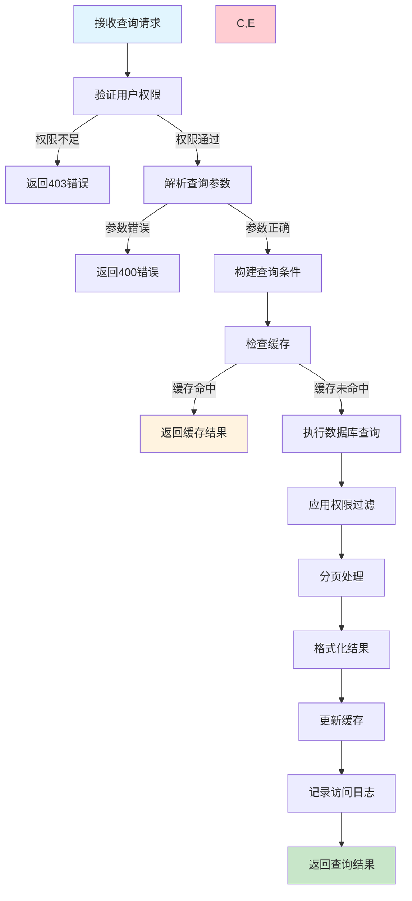
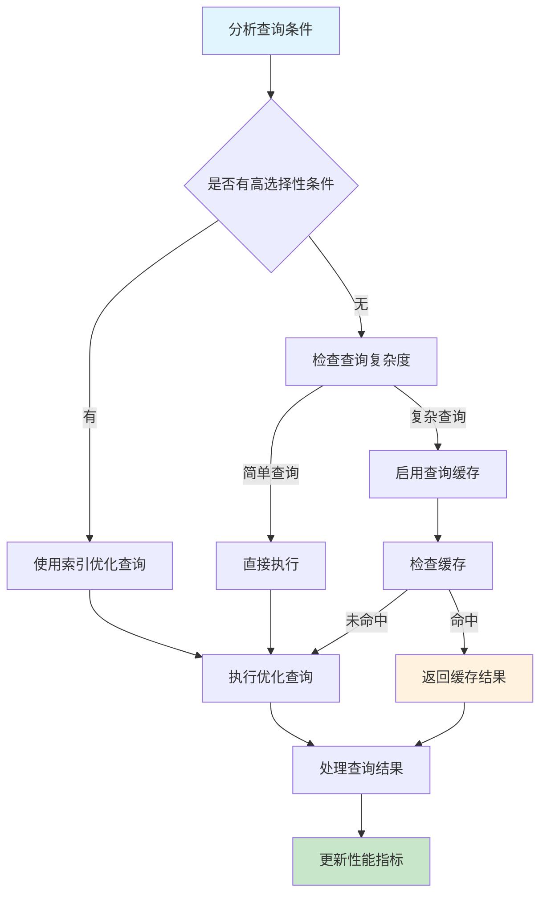

# 任务列表查询需求文档

## 1. 功能描述

### 1.1 功能概述
任务列表查询功能提供灵活的任务检索和过滤能力，支持多维度查询条件、分页显示、排序功能，满足用户对任务管理的各种查询需求。

### 1.2 主要功能列表
- 多条件组合查询（名称、类型、状态、创建人等）
- 时间范围过滤（创建时间、更新时间、执行时间）
- 分页和排序支持
- 快速搜索和模糊匹配
- 标签过滤和分组显示
- 收藏任务和最近访问

### 1.3 查询场景
- **运维监控**：查看执行失败或超时的任务
- **日常管理**：查看自己创建的任务列表
- **系统分析**：按类型统计任务分布
- **故障排查**：快速定位问题任务

## 2. 功能目标

### 2.1 业务目标
- 提供高效的任务检索体验
- 支持复杂查询条件组合
- 快速定位特定任务
- 支持大数据量的分页展示

### 2.2 技术目标
- 查询响应时间小于1秒
- 支持10万+任务的列表查询
- 复杂查询性能优化
- 缓存机制提升查询效率

### 2.3 用户体验目标
- 直观的查询条件设置
- 友好的列表展示界面
- 快速的搜索响应
- 智能的查询建议

## 3. 输入输出

### 3.1 输入参数

#### 3.1.1 分页参数
- `page` (int): 页码，从1开始，默认1
- `page_size` (int): 每页大小，范围1-100，默认20
- `sort_by` (string): 排序字段，默认created_at
- `sort_order` (string): 排序方向，asc/desc，默认desc

#### 3.1.2 过滤条件
- `task_name` (string): 任务名称（支持模糊匹配）
- `task_type` (array): 任务类型列表
- `status` (array): 任务状态列表
- `priority_range` (object): 优先级范围
- `created_by` (array): 创建人列表
- `tags` (array): 标签列表
- `create_time_range` (object): 创建时间范围
- `last_run_time_range` (object): 最近执行时间范围

#### 3.1.3 快速查询
- `keyword` (string): 关键词搜索（名称、描述、标签）
- `favorites_only` (boolean): 仅显示收藏任务
- `recent_only` (boolean): 仅显示最近访问任务

### 3.2 输出参数

#### 3.2.1 成功响应
```json
{
  "code": 200,
  "message": "查询成功",
  "data": {
    "tasks": [
      {
        "task_id": "task_20240116_001",
        "task_name": "数据同步任务",
        "task_type": "command",
        "status": "active",
        "priority": 8,
        "next_run_time": "2024-01-17T02:00:00Z",
        "last_run_status": "success",
        "created_by": "admin",
        "created_at": "2024-01-16T14:30:00Z",
        "updated_at": "2024-01-16T15:30:00Z",
        "tags": ["data", "sync"],
        "is_favorite": true
      }
    ],
    "pagination": {
      "page": 1,
      "page_size": 20,
      "total_pages": 15,
      "total_count": 289,
      "has_next": true,
      "has_prev": false
    },
    "statistics": {
      "total_tasks": 289,
      "active_tasks": 156,
      "paused_tasks": 23,
      "failed_tasks": 8
    }
  }
}
```

### 3.3 查询优化参数
- `include_statistics` (boolean): 是否包含统计信息，默认true
- `include_tags` (boolean): 是否包含标签信息，默认true
- `fields` (array): 指定返回字段，用于优化查询性能

## 4. 接口设计

### 4.1 API接口定义

#### 4.1.1 任务列表查询
```
GET /api/v1/task/list
Authorization: Bearer {token}
```

**查询参数示例：**
```
GET /api/v1/task/list?page=1&page_size=20&task_type=command,http&status=active,paused&sort_by=priority&sort_order=desc&keyword=数据
```

#### 4.1.2 高级查询
```
POST /api/v1/task/search
Content-Type: application/json
```

**请求体示例：**
```json
{
  "page": 1,
  "page_size": 20,
  "filters": {
    "task_name": "数据*",
    "task_type": ["command", "http"],
    "status": ["active", "paused"],
    "priority_range": {"min": 5, "max": 10},
    "created_by": ["admin", "user1"],
    "tags": ["data", "sync"],
    "create_time_range": {
      "start": "2024-01-01T00:00:00Z",
      "end": "2024-01-31T23:59:59Z"
    }
  },
  "sort": {
    "field": "priority",
    "order": "desc"
  },
  "options": {
    "include_statistics": true,
    "include_tags": true
  }
}
```

#### 4.1.3 我的任务列表
```
GET /api/v1/task/my?page=1&page_size=20
```

#### 4.1.4 收藏任务列表
```
GET /api/v1/task/favorites?page=1&page_size=20
```

### 4.2 内部服务接口
```go
type TaskListService interface {
    ListTasks(ctx context.Context, req *ListTasksRequest) (*ListTasksResponse, error)
    SearchTasks(ctx context.Context, req *SearchTasksRequest) (*SearchTasksResponse, error)
    GetMyTasks(ctx context.Context, userID string, req *ListTasksRequest) (*ListTasksResponse, error)
    GetFavoriteTasks(ctx context.Context, userID string, req *ListTasksRequest) (*ListTasksResponse, error)
}
```

## 5. 数据结构

### 5.1 用户收藏表（user_task_favorites）
```sql
CREATE TABLE user_task_favorites (
    id BIGINT AUTO_INCREMENT PRIMARY KEY COMMENT '主键ID',
    user_id VARCHAR(64) NOT NULL COMMENT '用户ID',
    task_id VARCHAR(64) NOT NULL COMMENT '任务ID',
    created_at DATETIME DEFAULT CURRENT_TIMESTAMP COMMENT '收藏时间',
    UNIQUE KEY uk_user_task (user_id, task_id),
    INDEX idx_user_id (user_id),
    INDEX idx_task_id (task_id)
) COMMENT='用户任务收藏表';
```

### 5.2 用户访问记录表（user_task_visits）
```sql
CREATE TABLE user_task_visits (
    id BIGINT AUTO_INCREMENT PRIMARY KEY COMMENT '主键ID',
    user_id VARCHAR(64) NOT NULL COMMENT '用户ID',
    task_id VARCHAR(64) NOT NULL COMMENT '任务ID',
    visit_count INT DEFAULT 1 COMMENT '访问次数',
    last_visit_at DATETIME DEFAULT CURRENT_TIMESTAMP COMMENT '最后访问时间',
    UNIQUE KEY uk_user_task (user_id, task_id),
    INDEX idx_user_id (user_id),
    INDEX idx_last_visit (last_visit_at)
) COMMENT='用户任务访问记录表';
```

### 5.3 Go数据结构
```go
type ListTasksRequest struct {
    Page         int                    `json:"page" v:"min:1"`
    PageSize     int                    `json:"page_size" v:"between:1,100"`
    SortBy       string                 `json:"sort_by"`
    SortOrder    string                 `json:"sort_order" v:"in:asc,desc"`
    Filters      map[string]interface{} `json:"filters"`
    Keyword      string                 `json:"keyword"`
    FavoritesOnly bool                  `json:"favorites_only"`
    RecentOnly   bool                   `json:"recent_only"`
    Options      *QueryOptions          `json:"options"`
}

type ListTasksResponse struct {
    Tasks      []*TaskSummary `json:"tasks"`
    Pagination *Pagination    `json:"pagination"`
    Statistics *TaskStats     `json:"statistics,omitempty"`
}

type TaskSummary struct {
    TaskID        string    `json:"task_id"`
    TaskName      string    `json:"task_name"`
    TaskType      string    `json:"task_type"`
    Status        string    `json:"status"`
    Priority      int       `json:"priority"`
    NextRunTime   *string   `json:"next_run_time,omitempty"`
    LastRunStatus string    `json:"last_run_status"`
    CreatedBy     string    `json:"created_by"`
    CreatedAt     string    `json:"created_at"`
    UpdatedAt     string    `json:"updated_at"`
    Tags          []string  `json:"tags,omitempty"`
    IsFavorite    bool      `json:"is_favorite"`
}

type Pagination struct {
    Page       int  `json:"page"`
    PageSize   int  `json:"page_size"`
    TotalPages int  `json:"total_pages"`
    TotalCount int  `json:"total_count"`
    HasNext    bool `json:"has_next"`
    HasPrev    bool `json:"has_prev"`
}

type TaskStats struct {
    TotalTasks  int `json:"total_tasks"`
    ActiveTasks int `json:"active_tasks"`
    PausedTasks int `json:"paused_tasks"`
    FailedTasks int `json:"failed_tasks"`
}
```

## 6. 异常处理

### 6.1 参数验证异常
- **分页参数异常**：页码或页大小超出范围
- **排序参数异常**：不支持的排序字段
- **过滤条件异常**：无效的过滤值或格式
- **时间范围异常**：开始时间晚于结束时间

### 6.2 业务逻辑异常
- **权限不足**：无权限查看某些任务
- **查询超时**：复杂查询执行超时
- **结果集过大**：查询结果超出系统限制

### 6.3 系统异常
- **数据库异常**：查询执行失败
- **缓存异常**：缓存服务不可用
- **内存不足**：大结果集处理失败

## 7. 流程图

### 7.1 任务列表查询主流程



### 7.2 查询优化策略流程



## 8. 安全性考虑

### 8.1 数据权限
- **行级权限**：用户只能查看有权限的任务
- **字段级权限**：敏感字段根据权限显示
- **租户隔离**：多租户环境的数据隔离

### 8.2 查询安全
- **SQL注入防护**：参数化查询防止注入攻击
- **查询限制**：限制查询复杂度和结果集大小
- **频率限制**：防止查询接口被恶意调用

### 8.3 敏感信息保护
- **数据脱敏**：敏感信息在列表中脱敏显示
- **日志记录**：记录查询操作的审计日志
- **权限验证**：每次查询都进行权限验证

## 9. 日志与监控

### 9.1 查询日志
- **查询记录**：记录查询条件和结果统计
- **性能日志**：记录查询执行时间和资源使用
- **用户行为**：记录用户的查询模式和偏好

### 9.2 性能监控
- **查询性能**：监控查询响应时间分布
- **缓存效率**：监控缓存命中率和效果
- **数据库负载**：监控查询对数据库的影响
- **用户体验**：监控查询成功率和用户满意度

### 9.3 告警规则
- **查询超时**：查询执行时间超过阈值
- **缓存失效**：缓存命中率低于预期
- **慢查询告警**：复杂查询执行时间过长
- **异常查询**：异常的查询模式或频率

### 9.4 日志格式
```json
{
  "timestamp": "2024-01-16T16:00:00Z",
  "level": "INFO",
  "service": "task-list",
  "operation": "list_tasks",
  "user_id": "user_123",
  "query_params": {
    "page": 1,
    "page_size": 20,
    "filters": ["task_type", "status"],
    "sort_by": "priority"
  },
  "result_count": 15,
  "cache_hit": true,
  "duration_ms": 45,
  "result": "success"
}
```

## 10. 测试用例

### 10.1 功能测试用例

#### 10.1.1 基础查询测试
**测试目标：** 验证基础的分页和排序功能

**测试用例：**
- 默认查询（第一页，20条记录）
- 指定页码和页大小查询
- 按创建时间排序查询
- 按优先级排序查询

**预期结果：** 返回正确的分页数据和排序结果

#### 10.1.2 过滤条件测试
**测试目标：** 验证各种过滤条件的组合查询

**测试场景：**
- 按任务类型过滤
- 按状态过滤
- 按时间范围过滤
- 多条件组合过滤

**测试数据：**
```json
{
  "filters": {
    "task_type": ["command"],
    "status": ["active"],
    "create_time_range": {
      "start": "2024-01-01T00:00:00Z",
      "end": "2024-01-31T23:59:59Z"
    }
  }
}
```

**预期结果：** 返回符合条件的任务列表

#### 10.1.3 关键词搜索测试
**测试目标：** 验证模糊搜索功能

**测试场景：**
- 按任务名称搜索
- 按描述内容搜索
- 按标签搜索
- 组合关键词搜索

**预期结果：** 返回包含关键词的任务列表

#### 10.1.4 权限控制测试
**测试目标：** 验证查询权限控制

**测试场景：**
- 普通用户查询自己的任务
- 管理员查询所有任务
- 无权限用户的查询限制

**预期结果：** 根据权限返回相应的任务列表

### 10.2 性能测试用例

#### 10.2.1 大数据量查询测试
**测试目标：** 验证大数据量场景下的查询性能

**测试场景：** 查询包含10万条任务记录的数据库
**预期结果：** 查询响应时间不超过1秒

#### 10.2.2 复杂查询性能测试
**测试目标：** 验证复杂查询条件的性能

**测试场景：** 使用多个过滤条件和排序的复杂查询
**预期结果：** 查询响应时间不超过2秒

#### 10.2.3 并发查询测试
**测试目标：** 验证并发查询的性能和稳定性

**测试场景：** 100个用户同时进行查询操作
**预期结果：** 所有查询正常响应，系统稳定运行

#### 10.2.4 缓存效果测试
**测试目标：** 验证查询缓存的效果

**测试场景：** 重复执行相同的查询请求
**预期结果：** 缓存命中率达到80%以上

### 10.3 安全测试用例

#### 10.3.1 SQL注入防护测试
**测试目标：** 验证SQL注入攻击防护

**测试数据：** 在查询参数中包含SQL注入代码
**预期结果：** 系统正确过滤恶意代码，查询正常执行

#### 10.3.2 权限越界测试
**测试目标：** 验证权限边界控制

**测试场景：** 用户尝试查询无权限的任务
**预期结果：** 返回空结果或权限错误

### 10.4 异常测试用例

#### 10.4.1 参数异常测试
**测试目标：** 验证异常参数的处理

**测试场景：**
- 负数页码
- 超大页大小
- 无效的排序字段
- 错误的时间格式

**预期结果：** 返回相应的参数错误信息

#### 10.4.2 数据库异常测试
**测试目标：** 验证数据库异常时的处理

**测试场景：** 模拟数据库连接失败或查询超时
**预期结果：** 返回服务异常错误，不影响系统稳定性

#### 10.4.3 缓存异常测试
**测试目标：** 验证缓存服务异常的处理

**测试场景：** 缓存服务不可用
**预期结果：** 直接查询数据库，功能正常使用 