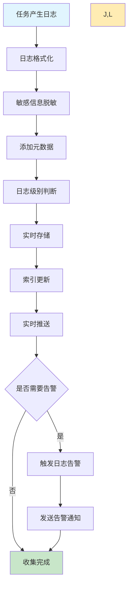
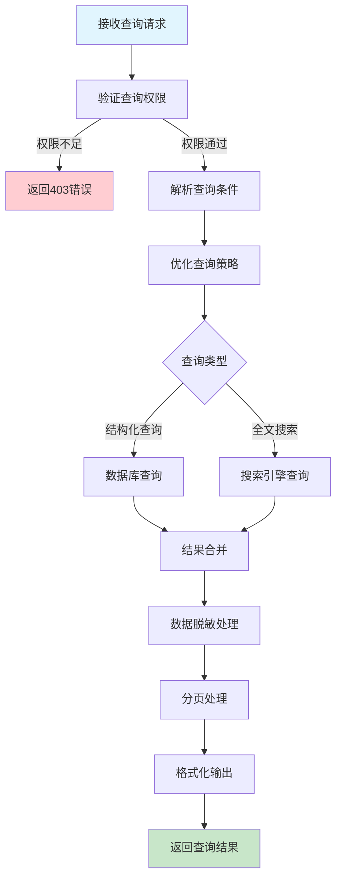
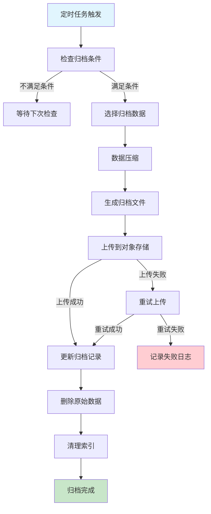

# 任务日志管理需求文档

## 1. 功能描述

### 1.1 功能概述
任务日志管理功能提供完整的任务执行日志收集、存储、查询和分析能力，支持结构化和非结构化日志处理，帮助用户追踪任务执行过程和排查问题。

### 1.2 主要功能列表
- 实时日志收集和存储
- 多级别日志分类管理
- 日志搜索和过滤查询
- 日志下载和导出功能
- 日志压缩和归档
- 日志统计和分析
- 日志告警和监控

### 1.3 日志类型
- **执行日志**：任务执行过程的详细记录
- **错误日志**：任务执行中的错误和异常
- **性能日志**：任务执行的性能指标
- **系统日志**：系统级别的操作记录

## 2. 功能目标

### 2.1 业务目标
- 提供全面的任务执行追踪
- 支持高效的问题诊断和排查
- 满足合规和审计要求
- 提供数据驱动的优化建议

### 2.2 技术目标
- 日志收集实时性小于1秒
- 支持TB级日志数据存储
- 日志查询响应时间小于3秒
- 日志系统可用性99.9%

### 2.3 安全目标
- 敏感信息的自动脱敏
- 日志访问的权限控制
- 日志数据的完整性保护
- 日志传输的安全加密

## 3. 输入输出

### 3.1 输入参数

#### 3.1.1 日志查询参数
- `task_id` (string): 任务ID
- `log_level` (string): 日志级别，debug/info/warn/error
- `time_range` (object): 时间范围
- `keyword` (string): 关键词搜索
- `limit` (int): 返回条数限制，默认100

#### 3.1.2 日志过滤参数
- `source` (string): 日志来源
- `tags` (array): 标签过滤
- `exclude_keywords` (array): 排除关键词
- `regex_pattern` (string): 正则表达式匹配

#### 3.1.3 日志导出参数
- `export_format` (string): 导出格式，txt/json/csv
- `include_metadata` (boolean): 是否包含元数据
- `compression` (boolean): 是否压缩，默认true

### 3.2 输出参数

#### 3.2.1 日志查询响应
```json
{
  "code": 200,
  "message": "查询成功",
  "data": {
    "logs": [
      {
        "log_id": "log_20240116_001",
        "task_id": "task_20240116_001",
        "log_level": "info",
        "timestamp": "2024-01-16T19:30:15.123Z",
        "source": "task-executor",
        "message": "开始执行数据同步任务",
        "metadata": {
          "thread_id": "worker-001",
          "hostname": "node-01",
          "process_id": 12345
        },
        "tags": ["execution", "start"]
      }
    ],
    "pagination": {
      "total": 2580,
      "page": 1,
      "page_size": 100,
      "has_more": true
    },
    "search_info": {
      "query_time_ms": 45,
      "matched_total": 2580
    }
  }
}
```

#### 3.2.2 日志统计响应
```json
{
  "code": 200,
  "message": "统计成功",
  "data": {
    "summary": {
      "total_logs": 125680,
      "error_count": 856,
      "warning_count": 2341,
      "info_count": 122483
    },
    "time_distribution": [
      {
        "time_bucket": "2024-01-16T19:00:00Z",
        "count": 1250,
        "error_count": 12
      }
    ],
    "top_error_messages": [
      {
        "message": "数据库连接超时",
        "count": 45,
        "first_seen": "2024-01-16T10:15:00Z",
        "last_seen": "2024-01-16T19:25:00Z"
      }
    ]
  }
}
```

## 4. 接口设计

### 4.1 API接口定义

#### 4.1.1 查询任务日志
```
GET /api/v1/task/{task_id}/logs?level=info&start_time=xxx&end_time=xxx&keyword=xxx&page=1&page_size=100
Authorization: Bearer {token}
```

#### 4.1.2 搜索日志
```
POST /api/v1/logs/search
Content-Type: application/json
```

**请求体示例：**
```json
{
  "query": {
    "task_ids": ["task_001", "task_002"],
    "log_level": ["error", "warn"],
    "time_range": {
      "start": "2024-01-16T00:00:00Z",
      "end": "2024-01-16T23:59:59Z"
    },
    "keyword": "连接超时",
    "regex_pattern": "error.*timeout.*"
  },
  "sort": {
    "field": "timestamp",
    "order": "desc"
  },
  "pagination": {
    "page": 1,
    "page_size": 100
  }
}
```

#### 4.1.3 导出日志
```
POST /api/v1/logs/export
Content-Type: application/json
```

#### 4.1.4 获取日志统计
```
POST /api/v1/logs/statistics
Content-Type: application/json
```

#### 4.1.5 实时日志流
```
WS /api/v1/task/{task_id}/logs/stream
Authorization: Bearer {token}
```

### 4.2 内部服务接口
```go
type TaskLogService interface {
    CollectLog(ctx context.Context, req *LogCollectionRequest) error
    QueryLogs(ctx context.Context, req *LogQueryRequest) (*LogQueryResponse, error)
    SearchLogs(ctx context.Context, req *LogSearchRequest) (*LogSearchResponse, error)
    ExportLogs(ctx context.Context, req *LogExportRequest) (*LogExportResponse, error)
    GetLogStatistics(ctx context.Context, req *LogStatisticsRequest) (*LogStatisticsResponse, error)
    StreamLogs(ctx context.Context, taskID string, ch chan<- *LogEntry) error
}
```

## 5. 数据结构

### 5.1 任务日志表（task_logs）
```sql
CREATE TABLE task_logs (
    id BIGINT AUTO_INCREMENT PRIMARY KEY COMMENT '主键ID',
    log_id VARCHAR(64) UNIQUE NOT NULL COMMENT '日志ID',
    task_id VARCHAR(64) NOT NULL COMMENT '任务ID',
    log_level ENUM('debug', 'info', 'warn', 'error', 'fatal') NOT NULL COMMENT '日志级别',
    source VARCHAR(64) NOT NULL COMMENT '日志来源',
    message TEXT NOT NULL COMMENT '日志消息',
    metadata JSON COMMENT '元数据',
    tags JSON COMMENT '标签',
    timestamp DATETIME(3) NOT NULL COMMENT '时间戳(毫秒精度)',
    created_at DATETIME DEFAULT CURRENT_TIMESTAMP COMMENT '创建时间',
    INDEX idx_task_id (task_id),
    INDEX idx_log_level (log_level),
    INDEX idx_timestamp (timestamp),
    INDEX idx_source (source),
    FULLTEXT KEY ft_message (message)
) COMMENT='任务日志表';
```

### 5.2 日志归档表（task_logs_archive）
```sql
CREATE TABLE task_logs_archive (
    id BIGINT AUTO_INCREMENT PRIMARY KEY COMMENT '主键ID',
    archive_id VARCHAR(64) UNIQUE NOT NULL COMMENT '归档ID',
    task_id VARCHAR(64) NOT NULL COMMENT '任务ID',
    archive_path VARCHAR(512) NOT NULL COMMENT '归档文件路径',
    log_count INT NOT NULL COMMENT '日志条数',
    file_size BIGINT NOT NULL COMMENT '文件大小(字节)',
    start_time DATETIME NOT NULL COMMENT '开始时间',
    end_time DATETIME NOT NULL COMMENT '结束时间',
    compression_type VARCHAR(32) DEFAULT 'gzip' COMMENT '压缩类型',
    created_at DATETIME DEFAULT CURRENT_TIMESTAMP COMMENT '创建时间',
    INDEX idx_task_id (task_id),
    INDEX idx_start_time (start_time),
    INDEX idx_end_time (end_time)
) COMMENT='日志归档表';
```

### 5.3 Go数据结构
```go
type LogEntry struct {
    LogID     string                 `json:"log_id"`
    TaskID    string                 `json:"task_id"`
    LogLevel  string                 `json:"log_level"`
    Timestamp string                 `json:"timestamp"`
    Source    string                 `json:"source"`
    Message   string                 `json:"message"`
    Metadata  map[string]interface{} `json:"metadata,omitempty"`
    Tags      []string               `json:"tags,omitempty"`
}

type LogQueryRequest struct {
    TaskID    string     `json:"task_id" v:"required"`
    LogLevel  []string   `json:"log_level"`
    TimeRange *TimeRange `json:"time_range"`
    Keyword   string     `json:"keyword"`
    Source    string     `json:"source"`
    Limit     int        `json:"limit" v:"min:1,max:1000"`
    Offset    int        `json:"offset" v:"min:0"`
}

type LogSearchRequest struct {
    Query      *LogSearchQuery `json:"query" v:"required"`
    Sort       *SortConfig     `json:"sort"`
    Pagination *Pagination     `json:"pagination"`
}

type LogSearchQuery struct {
    TaskIDs      []string  `json:"task_ids"`
    LogLevel     []string  `json:"log_level"`
    TimeRange    *TimeRange `json:"time_range"`
    Keyword      string    `json:"keyword"`
    RegexPattern string    `json:"regex_pattern"`
    Sources      []string  `json:"sources"`
    Tags         []string  `json:"tags"`
    ExcludeKeywords []string `json:"exclude_keywords"`
}

type LogStatisticsRequest struct {
    TaskIDs   []string   `json:"task_ids"`
    TimeRange *TimeRange `json:"time_range" v:"required"`
    GroupBy   string     `json:"group_by" v:"in:hour,day,level,source"`
}

type LogStatisticsResponse struct {
    Summary            *LogSummary           `json:"summary"`
    TimeDistribution   []*TimeDistribution   `json:"time_distribution"`
    LevelDistribution  []*LevelDistribution  `json:"level_distribution"`
    TopErrorMessages   []*ErrorStatistics    `json:"top_error_messages"`
}

type LogSummary struct {
    TotalLogs   int64 `json:"total_logs"`
    ErrorCount  int64 `json:"error_count"`
    WarningCount int64 `json:"warning_count"`
    InfoCount   int64 `json:"info_count"`
    DebugCount  int64 `json:"debug_count"`
}

type LogExportRequest struct {
    Query         *LogSearchQuery `json:"query" v:"required"`
    ExportFormat  string          `json:"export_format" v:"in:txt,json,csv"`
    IncludeMetadata bool          `json:"include_metadata"`
    Compression   bool            `json:"compression"`
}
```

## 6. 异常处理

### 6.1 日志收集异常
- **收集超时**：日志收集操作超时
- **格式解析错误**：日志格式解析失败
- **存储空间不足**：日志存储空间不足
- **网络传输错误**：日志传输网络异常

### 6.2 查询异常
- **查询超时**：日志查询操作超时
- **索引异常**：全文索引服务异常
- **内存溢出**：大量日志查询导致内存不足
- **权限不足**：无权限访问特定日志

### 6.3 存储异常
- **磁盘故障**：日志存储磁盘故障
- **数据损坏**：日志数据文件损坏
- **归档失败**：日志归档操作失败
- **清理异常**：过期日志清理异常

## 7. 流程图

### 7.1 日志收集流程



### 7.2 日志查询流程



### 7.3 日志归档流程



## 8. 安全性考虑

### 8.1 数据安全
- **敏感信息脱敏**：自动识别和脱敏敏感信息
- **访问控制**：基于角色的日志访问权限
- **数据加密**：敏感日志数据加密存储
- **传输安全**：日志传输使用TLS加密

### 8.2 隐私保护
- **个人信息保护**：自动识别和保护个人隐私信息
- **数据脱敏规则**：可配置的脱敏规则和策略
- **访问审计**：记录所有日志访问操作
- **数据保留策略**：合规的数据保留和清理策略

### 8.3 系统安全
- **注入攻击防护**：防止日志注入攻击
- **资源限制**：防止恶意查询消耗系统资源
- **速率限制**：限制日志查询的频率
- **异常检测**：检测异常的日志访问模式

## 9. 日志与监控

### 9.1 日志系统监控
- **收集性能监控**：监控日志收集的性能指标
- **存储容量监控**：监控日志存储空间使用情况
- **查询性能监控**：监控日志查询的响应时间
- **错误率监控**：监控日志系统的错误率

### 9.2 业务指标监控
- **日志量统计**：统计不同级别日志的数量
- **错误趋势分析**：分析错误日志的趋势变化
- **热点任务识别**：识别产生大量日志的任务
- **异常模式检测**：检测异常的日志模式

### 9.3 告警规则
- **存储空间告警**：存储空间不足告警
- **错误激增告警**：错误日志数量激增告警
- **查询性能告警**：查询响应时间过长告警
- **系统异常告警**：日志系统服务异常告警

### 9.4 日志格式
```json
{
  "timestamp": "2024-01-16T19:30:00Z",
  "level": "INFO",
  "service": "task-log",
  "operation": "collect_log",
  "task_id": "task_20240116_001",
  "log_level": "info",
  "log_count": 1,
  "processing_time_ms": 12,
  "storage_size_bytes": 256,
  "result": "success"
}
```

## 10. 测试用例

### 10.1 功能测试用例

#### 10.1.1 日志收集测试
**测试目标：** 验证日志收集功能的完整性

**测试用例：**
- 收集不同级别的日志
- 收集包含特殊字符的日志
- 收集大量日志的性能测试
- 验证敏感信息脱敏功能

**预期结果：** 所有日志正确收集，敏感信息已脱敏

#### 10.1.2 日志查询测试
**测试目标：** 验证日志查询功能的准确性

**测试场景：**
- 按任务ID查询日志
- 按时间范围查询日志
- 按关键词搜索日志
- 复合条件查询日志

**预期结果：** 查询结果准确，响应时间合理

#### 10.1.3 日志导出测试
**测试目标：** 验证日志导出功能

**测试场景：**
- 导出不同格式的日志文件
- 导出大量日志数据
- 验证导出文件的完整性

**预期结果：** 导出文件格式正确，数据完整

#### 10.1.4 实时日志流测试
**测试目标：** 验证实时日志推送功能

**测试场景：** WebSocket连接实时接收日志
**预期结果：** 日志实时推送，延迟小于1秒

### 10.2 性能测试用例

#### 10.2.1 大量日志收集测试
**测试目标：** 验证大量日志收集的性能

**测试场景：** 每秒收集10000条日志
**预期结果：** 系统稳定运行，日志不丢失

#### 10.2.2 并发查询测试
**测试目标：** 验证并发查询的性能

**测试场景：** 100个用户同时查询日志
**预期结果：** 所有查询正常响应，性能不降级

#### 10.2.3 大数据量查询测试
**测试目标：** 验证大数据量查询性能

**测试场景：** 查询包含1000万条日志的数据集
**预期结果：** 查询响应时间小于3秒

### 10.3 异常测试用例

#### 10.3.1 存储异常测试
**测试目标：** 验证存储异常时的处理

**测试场景：** 模拟磁盘空间不足
**预期结果：** 系统正确处理异常，触发告警

#### 10.3.2 查询超时测试
**测试目标：** 验证查询超时的处理

**测试场景：** 执行复杂的长时间查询
**预期结果：** 查询超时后正确返回错误信息

#### 10.3.3 数据损坏测试
**测试目标：** 验证数据损坏时的处理

**测试场景：** 模拟日志文件损坏
**预期结果：** 系统检测到损坏并尝试恢复 