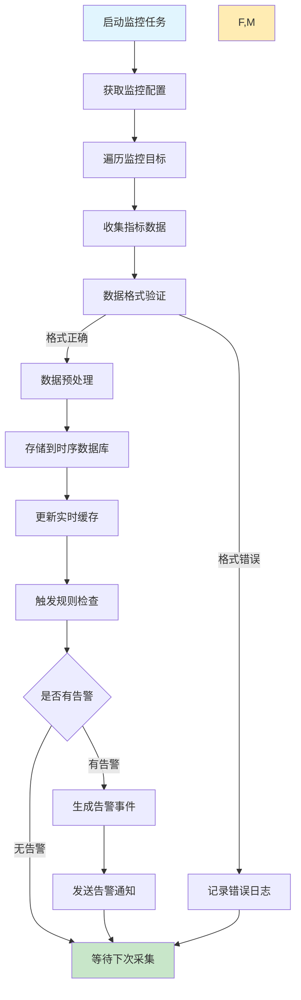
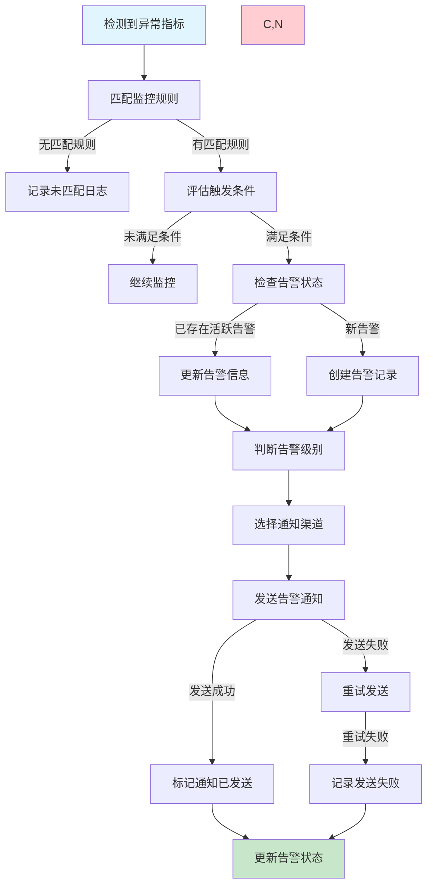

# 任务监控需求文档

## 1. 功能描述

### 1.1 功能概述
任务监控功能提供全方位的任务运行状态监控、性能指标收集、异常检测和告警通知，确保任务系统的稳定运行和及时发现问题。

### 1.2 主要功能列表
- 实时状态监控
- 性能指标收集
- 异常检测和告警
- 健康检查机制
- 监控数据可视化
- 历史趋势分析
- 自定义监控规则

### 1.3 监控维度
- **任务级监控**：单个任务的执行状态和性能
- **系统级监控**：整体任务系统的运行状况
- **资源监控**：CPU、内存、磁盘等资源使用
- **业务监控**：业务指标和KPI监控

## 2. 功能目标

### 2.1 业务目标
- 提供全面的任务监控能力
- 及时发现和响应任务异常
- 支持业务决策的数据支撑
- 提升系统运维效率

### 2.2 技术目标
- 监控数据延迟小于10秒
- 支持百万级监控指标采集
- 告警响应时间小于30秒
- 监控系统可用性99.95%

### 2.3 安全目标
- 监控数据的安全传输
- 敏感指标的访问控制
- 监控配置的权限管理
- 告警信息的安全保护

## 3. 输入输出

### 3.1 输入参数

#### 3.1.1 监控配置参数
- `monitor_type` (string): 监控类型，status/performance/business
- `target_tasks` (array): 监控目标任务列表
- `metrics` (array): 监控指标列表
- `check_interval` (int): 检查间隔秒数，默认60
- `alert_rules` (array): 告警规则配置

#### 3.1.2 查询参数
- `time_range` (object): 时间范围
- `metrics` (array): 查询的指标名称
- `group_by` (array): 分组字段
- `filters` (object): 过滤条件

#### 3.1.3 告警规则参数
- `rule_name` (string): 规则名称
- `condition` (object): 触发条件
- `threshold` (object): 阈值配置
- `notification` (object): 通知配置

### 3.2 输出参数

#### 3.2.1 监控数据响应
```json
{
  "code": 200,
  "message": "查询成功",
  "data": {
    "metrics": [
      {
        "metric_name": "task_execution_count",
        "task_id": "task_20240116_001",
        "timestamp": "2024-01-16T19:00:00Z",
        "value": 156,
        "labels": {
          "status": "success",
          "task_type": "command"
        }
      }
    ],
    "summary": {
      "total_points": 1440,
      "time_range": {
        "start": "2024-01-15T19:00:00Z",
        "end": "2024-01-16T19:00:00Z"
      }
    }
  }
}
```

#### 3.2.2 实时状态响应
```json
{
  "code": 200,
  "message": "获取成功",
  "data": {
    "system_status": {
      "status": "healthy",
      "total_tasks": 1205,
      "running_tasks": 45,
      "failed_tasks": 3,
      "pending_tasks": 78
    },
    "resource_usage": {
      "cpu_percent": 35.2,
      "memory_percent": 68.5,
      "disk_usage_percent": 45.8,
      "network_io_mbps": 125.3
    },
    "performance_metrics": {
      "avg_execution_time": 1245,
      "success_rate": 95.8,
      "throughput_per_hour": 3600,
      "queue_length": 12
    }
  }
}
```

## 4. 接口设计

### 4.1 API接口定义

#### 4.1.1 获取实时监控数据
```
GET /api/v1/monitor/realtime
Authorization: Bearer {token}
```

#### 4.1.2 查询历史监控数据
```
POST /api/v1/monitor/metrics
Content-Type: application/json
```

**请求体示例：**
```json
{
  "time_range": {
    "start": "2024-01-15T00:00:00Z",
    "end": "2024-01-16T00:00:00Z"
  },
  "metrics": ["task_execution_count", "task_duration", "task_success_rate"],
  "group_by": ["task_type", "status"],
  "filters": {
    "task_type": ["command", "http"]
  }
}
```

#### 4.1.3 创建监控规则
```
POST /api/v1/monitor/rules
Content-Type: application/json
```

#### 4.1.4 获取告警历史
```
GET /api/v1/monitor/alerts?start_time=xxx&end_time=xxx&status=xxx
```

### 4.2 WebSocket接口
```
WS /api/v1/monitor/realtime-stream
Authorization: Bearer {token}
```

**实时数据推送：**
```json
{
  "type": "metric_update",
  "timestamp": "2024-01-16T19:00:00Z",
  "data": {
    "metric_name": "task_execution_count",
    "value": 157,
    "task_id": "task_20240116_001",
    "change": "+1"
  }
}
```

### 4.3 内部服务接口
```go
type TaskMonitorService interface {
    CollectMetrics(ctx context.Context, req *MetricsCollectionRequest) error
    GetRealtimeStatus(ctx context.Context) (*RealtimeStatusResponse, error)
    QueryMetrics(ctx context.Context, req *MetricsQueryRequest) (*MetricsQueryResponse, error)
    CreateMonitorRule(ctx context.Context, req *CreateRuleRequest) (*CreateRuleResponse, error)
    TriggerAlert(ctx context.Context, alert *AlertEvent) error
}
```

## 5. 数据结构

### 5.1 监控指标表（monitor_metrics）
```sql
CREATE TABLE monitor_metrics (
    id BIGINT AUTO_INCREMENT PRIMARY KEY COMMENT '主键ID',
    metric_name VARCHAR(128) NOT NULL COMMENT '指标名称',
    task_id VARCHAR(64) COMMENT '任务ID',
    metric_value DECIMAL(20,6) NOT NULL COMMENT '指标值',
    labels JSON COMMENT '标签信息',
    timestamp DATETIME NOT NULL COMMENT '时间戳',
    created_at DATETIME DEFAULT CURRENT_TIMESTAMP COMMENT '创建时间',
    INDEX idx_metric_name (metric_name),
    INDEX idx_task_id (task_id),
    INDEX idx_timestamp (timestamp),
    INDEX idx_metric_time (metric_name, timestamp)
) COMMENT='监控指标表';
```

### 5.2 监控规则表（monitor_rules）
```sql
CREATE TABLE monitor_rules (
    id BIGINT AUTO_INCREMENT PRIMARY KEY COMMENT '主键ID',
    rule_id VARCHAR(64) UNIQUE NOT NULL COMMENT '规则ID',
    rule_name VARCHAR(255) NOT NULL COMMENT '规则名称',
    rule_type ENUM('threshold', 'trend', 'anomaly') NOT NULL COMMENT '规则类型',
    target_metric VARCHAR(128) NOT NULL COMMENT '目标指标',
    condition_config JSON NOT NULL COMMENT '条件配置',
    notification_config JSON NOT NULL COMMENT '通知配置',
    enabled BOOLEAN DEFAULT TRUE COMMENT '是否启用',
    created_by VARCHAR(64) NOT NULL COMMENT '创建人',
    created_at DATETIME DEFAULT CURRENT_TIMESTAMP COMMENT '创建时间',
    updated_at DATETIME DEFAULT CURRENT_TIMESTAMP ON UPDATE CURRENT_TIMESTAMP COMMENT '更新时间',
    INDEX idx_rule_id (rule_id),
    INDEX idx_target_metric (target_metric),
    INDEX idx_enabled (enabled)
) COMMENT='监控规则表';
```

### 5.3 告警记录表（monitor_alerts）
```sql
CREATE TABLE monitor_alerts (
    id BIGINT AUTO_INCREMENT PRIMARY KEY COMMENT '主键ID',
    alert_id VARCHAR(64) UNIQUE NOT NULL COMMENT '告警ID',
    rule_id VARCHAR(64) NOT NULL COMMENT '规则ID',
    alert_level ENUM('info', 'warning', 'error', 'critical') NOT NULL COMMENT '告警级别',
    alert_title VARCHAR(255) NOT NULL COMMENT '告警标题',
    alert_message TEXT NOT NULL COMMENT '告警消息',
    metric_name VARCHAR(128) NOT NULL COMMENT '相关指标',
    metric_value DECIMAL(20,6) COMMENT '触发值',
    task_id VARCHAR(64) COMMENT '相关任务ID',
    status ENUM('active', 'resolved', 'suppressed') DEFAULT 'active' COMMENT '告警状态',
    triggered_at DATETIME NOT NULL COMMENT '触发时间',
    resolved_at DATETIME COMMENT '解决时间',
    notification_sent BOOLEAN DEFAULT FALSE COMMENT '是否已发送通知',
    INDEX idx_alert_id (alert_id),
    INDEX idx_rule_id (rule_id),
    INDEX idx_alert_level (alert_level),
    INDEX idx_status (status),
    INDEX idx_triggered_at (triggered_at)
) COMMENT='告警记录表';
```

### 5.4 Go数据结构
```go
type MetricsQueryRequest struct {
    TimeRange *TimeRange          `json:"time_range" v:"required"`
    Metrics   []string            `json:"metrics" v:"required|array:min,1"`
    GroupBy   []string            `json:"group_by"`
    Filters   map[string][]string `json:"filters"`
    Limit     int                 `json:"limit" v:"min:1,max:10000"`
}

type TimeRange struct {
    Start string `json:"start" v:"required"`
    End   string `json:"end" v:"required"`
}

type MetricPoint struct {
    MetricName string                 `json:"metric_name"`
    TaskID     string                 `json:"task_id,omitempty"`
    Timestamp  string                 `json:"timestamp"`
    Value      float64                `json:"value"`
    Labels     map[string]string      `json:"labels,omitempty"`
}

type RealtimeStatusResponse struct {
    SystemStatus      *SystemStatus      `json:"system_status"`
    ResourceUsage     *ResourceUsage     `json:"resource_usage"`
    PerformanceMetrics *PerformanceMetrics `json:"performance_metrics"`
    Timestamp         string             `json:"timestamp"`
}

type SystemStatus struct {
    Status       string `json:"status"`
    TotalTasks   int    `json:"total_tasks"`
    RunningTasks int    `json:"running_tasks"`
    FailedTasks  int    `json:"failed_tasks"`
    PendingTasks int    `json:"pending_tasks"`
}

type ResourceUsage struct {
    CPUPercent        float64 `json:"cpu_percent"`
    MemoryPercent     float64 `json:"memory_percent"`
    DiskUsagePercent  float64 `json:"disk_usage_percent"`
    NetworkIOMbps     float64 `json:"network_io_mbps"`
}

type MonitorRule struct {
    RuleID             string                 `json:"rule_id"`
    RuleName           string                 `json:"rule_name"`
    RuleType           string                 `json:"rule_type"`
    TargetMetric       string                 `json:"target_metric"`
    ConditionConfig    map[string]interface{} `json:"condition_config"`
    NotificationConfig map[string]interface{} `json:"notification_config"`
    Enabled            bool                   `json:"enabled"`
}

type AlertEvent struct {
    AlertID      string  `json:"alert_id"`
    RuleID       string  `json:"rule_id"`
    AlertLevel   string  `json:"alert_level"`
    AlertTitle   string  `json:"alert_title"`
    AlertMessage string  `json:"alert_message"`
    MetricName   string  `json:"metric_name"`
    MetricValue  float64 `json:"metric_value"`
    TaskID       string  `json:"task_id,omitempty"`
    TriggeredAt  string  `json:"triggered_at"`
}
```

## 6. 异常处理

### 6.1 数据收集异常
- **采集超时**：指标数据采集超时
- **数据格式错误**：收集到的数据格式不正确
- **存储异常**：监控数据存储失败
- **网络异常**：数据传输网络错误

### 6.2 监控规则异常
- **规则配置错误**：监控规则配置无效
- **阈值计算错误**：阈值条件计算异常
- **规则冲突**：多个规则产生冲突
- **权限不足**：无权限创建或修改规则

### 6.3 告警异常
- **通知发送失败**：告警通知发送失败
- **告警风暴**：短时间内产生大量告警
- **重复告警**：相同告警重复触发
- **告警延迟**：告警触发延迟过大

## 7. 流程图

### 7.1 监控数据收集流程



### 7.2 告警处理流程



## 8. 安全性考虑

### 8.1 数据安全
- **传输加密**：监控数据传输使用TLS加密
- **存储加密**：敏感监控数据加密存储
- **数据脱敏**：敏感业务指标脱敏处理
- **访问控制**：基于角色的监控数据访问控制

### 8.2 配置安全
- **权限验证**：监控规则配置需要相应权限
- **配置审核**：重要监控规则需要审核流程
- **变更追踪**：监控配置变更的完整记录
- **回滚机制**：支持监控配置的快速回滚

### 8.3 告警安全
- **告警去重**：防止告警信息泄露敏感数据
- **通知加密**：告警通知内容加密传输
- **接收验证**：验证告警接收方的身份
- **防刷保护**：防止告警接口被恶意调用

## 9. 日志与监控

### 9.1 监控系统自监控
- **采集状态监控**：监控数据采集的成功率
- **存储性能监控**：监控数据存储的性能指标
- **查询性能监控**：监控数据查询的响应时间
- **告警系统监控**：监控告警系统的可用性

### 9.2 性能指标
- **数据延迟**：从产生到存储的数据延迟
- **查询性能**：不同时间范围查询的性能
- **存储效率**：监控数据的存储压缩率
- **并发处理**：系统并发处理能力

### 9.3 业务指标
- **覆盖率**：监控覆盖的任务比例
- **准确性**：监控数据的准确性评估
- **及时性**：异常发现的及时性
- **有效性**：告警的有效性和误报率

### 9.4 日志格式
```json
{
  "timestamp": "2024-01-16T19:00:00Z",
  "level": "INFO",
  "service": "task-monitor",
  "operation": "collect_metrics",
  "target": "task_20240116_001",
  "metric_name": "task_execution_count",
  "metric_value": 157,
  "collection_time_ms": 45,
  "result": "success"
}
```

## 10. 测试用例

### 10.1 功能测试用例

#### 10.1.1 监控数据收集测试
**测试目标：** 验证监控数据收集功能

**测试用例：**
- 收集任务执行状态指标
- 收集系统资源使用指标
- 收集自定义业务指标
- 验证数据收集的完整性

**预期结果：** 所有指标正确收集并存储

#### 10.1.2 实时监控测试
**测试目标：** 验证实时监控数据展示

**测试场景：** 查看实时任务执行状态
**预期结果：** 数据更新延迟小于10秒

#### 10.1.3 告警规则测试
**测试目标：** 验证告警规则的触发机制

**测试场景：**
- 设置任务失败率告警规则
- 模拟任务失败触发告警
- 验证告警通知发送

**预期结果：** 告警规则正确触发，通知及时发送

#### 10.1.4 历史数据查询测试
**测试目标：** 验证历史监控数据查询功能

**测试场景：** 查询过去24小时的任务执行趋势
**预期结果：** 查询结果准确，响应时间合理

### 10.2 性能测试用例

#### 10.2.1 大量指标收集测试
**测试目标：** 验证大量监控指标的收集性能

**测试场景：** 同时收集10000个任务的监控指标
**预期结果：** 系统稳定运行，数据不丢失

#### 10.2.2 查询性能测试
**测试目标：** 验证大时间范围数据查询性能

**测试场景：** 查询30天内的监控数据趋势
**预期结果：** 查询响应时间小于5秒

#### 10.2.3 并发查询测试
**测试目标：** 验证并发查询的性能

**测试场景：** 100个用户同时查询监控数据
**预期结果：** 所有查询正常响应

### 10.3 异常测试用例

#### 10.3.1 数据收集异常测试
**测试目标：** 验证数据收集异常的处理

**测试场景：** 模拟网络中断导致数据收集失败
**预期结果：** 系统正确处理异常，记录错误日志

#### 10.3.2 告警风暴测试
**测试目标：** 验证告警风暴的处理机制

**测试场景：** 短时间内触发大量告警
**预期结果：** 系统正确处理告警风暴，不影响正常服务

#### 10.3.3 存储异常测试
**测试目标：** 验证存储服务异常的处理

**测试场景：** 模拟时序数据库服务异常
**预期结果：** 系统优雅降级，数据缓存到本地 