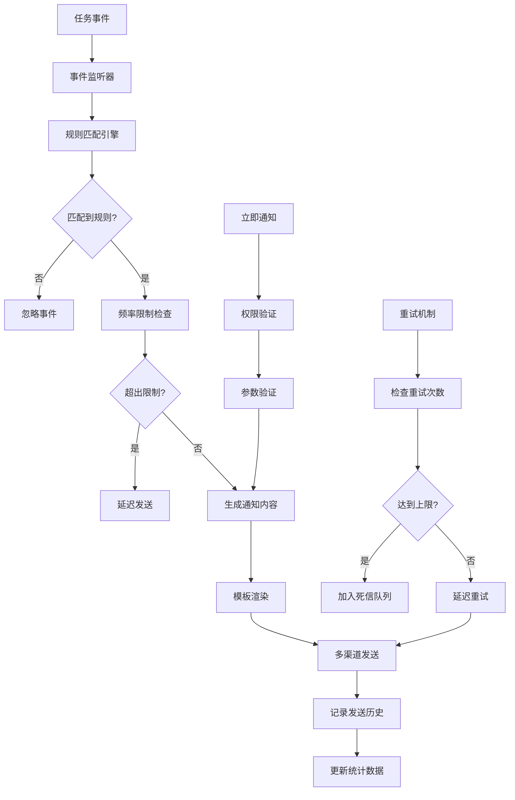

# 任务通知功能需求文档

## 1. 功能描述

任务通知功能提供全面的任务事件通知服务，支持多种通知渠道和触发条件，确保相关人员及时了解任务状态变化、异常情况和重要事件。该功能通过灵活的通知规则配置、模板化消息内容和可靠的消息投递机制，提供高效的任务监控和告警能力。

### 核心功能
- **多渠道通知**：支持邮件、短信、WebSocket、Webhook等通知方式
- **事件驱动**：基于任务状态变化自动触发通知
- **规则配置**：灵活的通知规则和条件设置
- **模板管理**：可定制的通知消息模板
- **批量通知**：支持批量任务的聚合通知

## 2. 功能目标

### 2.1 性能目标
- **响应时间**：通知发送延迟 ≤ 30秒
- **投递成功率**：通知投递成功率 ≥ 99%
- **并发处理**：支持1000个并发通知发送
- **可用性**：通知服务可用性 ≥ 99.9%

### 2.2 功能目标
- **通知覆盖率**：关键事件通知覆盖率 = 100%
- **规则匹配精度**：通知规则匹配准确率 ≥ 99.5%
- **模板覆盖**：提供20+预定义通知模板
- **渠道支持**：支持5+主流通知渠道

## 3. 输入输出

### 3.1 输入参数

#### 通知规则配置
```json
{
  "rule_name": "任务失败通知",
  "description": "当任务执行失败时发送通知",
  "conditions": {
    "task_status": ["failed", "timeout"],
    "task_types": ["critical_job"],
    "queue_ids": [1, 2, 3],
    "user_ids": [100, 200]
  },
  "notification_config": {
    "channels": ["email", "sms", "webhook"],
    "template_id": "task_failure_template",
    "recipients": {
      "email": ["admin@example.com", "ops@example.com"],
      "sms": ["+8613800000000"],
      "webhook": ["https://webhook.example.com/notify"]
    },
    "frequency_limit": {
      "max_per_hour": 10,
      "cooldown_minutes": 5
    }
  }
}
```

#### 立即通知请求
```json
{
  "task_id": "12345",
  "notification_type": "manual",
  "channels": ["email", "webhook"],
  "recipients": {
    "email": ["user@example.com"],
    "webhook": ["https://api.example.com/notify"]
  },
  "message": {
    "title": "任务状态更新",
    "content": "任务 #12345 已完成执行",
    "priority": "normal"
  }
}
```

### 3.2 输出结果

#### 通知发送结果
```json
{
  "status": "success",
  "data": {
    "notification_id": "notify_12345",
    "task_id": "12345",
    "sent_at": "2024-01-01T10:00:00Z",
    "channels": [
      {
        "type": "email",
        "status": "sent",
        "recipients": ["user@example.com"],
        "message_id": "email_msg_001"
      },
      {
        "type": "webhook",
        "status": "failed",
        "recipients": ["https://api.example.com/notify"],
        "error": "Connection timeout"
      }
    ],
    "summary": {
      "total_channels": 2,
      "successful": 1,
      "failed": 1
    }
  }
}
```

## 4. 接口设计

### 4.1 RESTful API接口

#### 4.1.1 创建通知规则
```http
POST /api/v1/notifications/rules
Content-Type: application/json
Authorization: Bearer {token}
```

#### 4.1.2 立即发送通知
```http
POST /api/v1/notifications/send
Content-Type: application/json
Authorization: Bearer {token}
```

#### 4.1.3 获取通知历史
```http
GET /api/v1/notifications/history?task_id={id}&limit={limit}
Authorization: Bearer {token}
```

#### 4.1.4 管理通知模板
```http
GET /api/v1/notifications/templates
POST /api/v1/notifications/templates
PUT /api/v1/notifications/templates/{id}
DELETE /api/v1/notifications/templates/{id}
Authorization: Bearer {token}
```

### 4.2 WebSocket接口

#### 4.2.1 实时通知推送
```javascript
const ws = new WebSocket('ws://localhost:8080/ws/notifications');
ws.onmessage = function(event) {
  const notification = JSON.parse(event.data);
  showNotification(notification);
};
```

## 5. 数据结构

### 5.1 数据库表设计

#### notification_rules表
```sql
CREATE TABLE notification_rules (
    id BIGINT PRIMARY KEY AUTO_INCREMENT,
    rule_name VARCHAR(100) NOT NULL,
    description TEXT,
    conditions JSON NOT NULL,
    notification_config JSON NOT NULL,
    is_active BOOLEAN DEFAULT TRUE,
    created_by BIGINT NOT NULL,
    created_at TIMESTAMP DEFAULT CURRENT_TIMESTAMP,
    updated_at TIMESTAMP DEFAULT CURRENT_TIMESTAMP ON UPDATE CURRENT_TIMESTAMP,
    
    UNIQUE KEY uk_rule_name (rule_name),
    INDEX idx_is_active (is_active),
    INDEX idx_created_by (created_by)
);
```

#### notification_history表
```sql
CREATE TABLE notification_history (
    id BIGINT PRIMARY KEY AUTO_INCREMENT,
    notification_id VARCHAR(50) NOT NULL,
    task_id BIGINT NOT NULL,
    rule_id BIGINT NULL,
    notification_type ENUM('auto', 'manual') DEFAULT 'auto',
    channels JSON NOT NULL,
    recipients JSON NOT NULL,
    message_content JSON NOT NULL,
    status ENUM('pending', 'sending', 'sent', 'failed') DEFAULT 'pending',
    sent_at TIMESTAMP NULL,
    error_message TEXT NULL,
    
    INDEX idx_notification_id (notification_id),
    INDEX idx_task_id (task_id),
    INDEX idx_rule_id (rule_id),
    INDEX idx_status (status),
    INDEX idx_sent_at (sent_at),
    FOREIGN KEY (task_id) REFERENCES tasks(id) ON DELETE CASCADE
);
```

#### notification_templates表
```sql
CREATE TABLE notification_templates (
    id BIGINT PRIMARY KEY AUTO_INCREMENT,
    template_name VARCHAR(100) NOT NULL,
    template_type ENUM('email', 'sms', 'webhook', 'websocket') NOT NULL,
    subject_template TEXT,
    content_template TEXT NOT NULL,
    variables JSON,
    is_system BOOLEAN DEFAULT FALSE,
    created_by BIGINT NOT NULL,
    created_at TIMESTAMP DEFAULT CURRENT_TIMESTAMP,
    
    UNIQUE KEY uk_template_name_type (template_name, template_type),
    INDEX idx_template_type (template_type),
    INDEX idx_is_system (is_system)
);
```

### 5.2 Go语言数据结构

```go
type NotificationRule struct {
    ID                 int64                    `json:"id"`
    RuleName           string                   `json:"rule_name" validate:"required,max=100"`
    Description        string                   `json:"description"`
    Conditions         *NotificationConditions  `json:"conditions" validate:"required"`
    NotificationConfig *NotificationConfig      `json:"notification_config" validate:"required"`
    IsActive           bool                     `json:"is_active"`
    CreatedBy          int64                    `json:"created_by"`
    CreatedAt          time.Time                `json:"created_at"`
}

type NotificationConditions struct {
    TaskStatus   []string `json:"task_status"`
    TaskTypes    []string `json:"task_types"`
    QueueIDs     []int64  `json:"queue_ids"`
    UserIDs      []int64  `json:"user_ids"`
    Severity     []string `json:"severity"`
    TimeRange    *TimeRange `json:"time_range,omitempty"`
}

type NotificationConfig struct {
    Channels        []string                    `json:"channels" validate:"required,min=1"`
    TemplateID      string                      `json:"template_id"`
    Recipients      map[string][]string         `json:"recipients" validate:"required"`
    FrequencyLimit  *FrequencyLimit             `json:"frequency_limit,omitempty"`
    Priority        string                      `json:"priority" validate:"oneof=low normal high critical"`
}
```

## 6. 异常处理

### 6.1 异常类型定义
```go
const (
    ErrInvalidChannel      = "INVALID_CHANNEL"
    ErrTemplateNotFound    = "TEMPLATE_NOT_FOUND"
    ErrRecipientInvalid    = "RECIPIENT_INVALID"
    ErrFrequencyLimited    = "FREQUENCY_LIMITED"
    ErrDeliveryFailed      = "DELIVERY_FAILED"
)
```

### 6.2 重试机制
- 通知发送失败时自动重试
- 指数退避重试策略
- 最大重试次数限制
- 死信队列处理

### 6.3 降级策略
- 主通道失败时切换备用通道
- 批量通知拆分为单个通知
- 通知内容简化处理

## 7. 流程图



## 8. 安全性考虑

### 8.1 访问控制
- 通知规则创建和修改权限控制
- 敏感通知内容的访问限制
- 通知接收者权限验证

### 8.2 数据保护
- 通知内容的敏感信息过滤
- 通知历史的访问权限控制
- 传输过程的加密保护

### 8.3 防滥用措施
- 通知频率限制
- 通知规则数量限制
- 异常行为检测和阻断

## 9. 日志与监控

### 9.1 日志规范
```go
s.logger.Info("通知发送成功",
    zap.String("notification_id", notificationID),
    zap.Int64("task_id", taskID),
    zap.String("channel", channel),
    zap.String("recipient", recipient))
```

### 9.2 监控指标
- 通知发送成功率
- 各渠道投递延迟
- 规则匹配准确率
- 通知频率统计

### 9.3 告警配置
- 通知发送失败率过高告警
- 通知延迟过长告警
- 通知服务异常告警

## 10. 测试用例

### 10.1 功能测试
- 通知规则创建和匹配测试
- 多渠道通知发送测试
- 模板渲染功能测试
- 频率限制机制测试

### 10.2 性能测试
- 大量通知并发发送测试
- 通知发送延迟测试
- 系统负载压力测试

### 10.3 异常测试
- 通知渠道异常处理测试
- 模板格式错误处理测试
- 网络异常恢复测试

### 10.4 集成测试
- 与任务管理模块集成测试
- 外部通知服务集成测试
- 端到端通知流程测试 