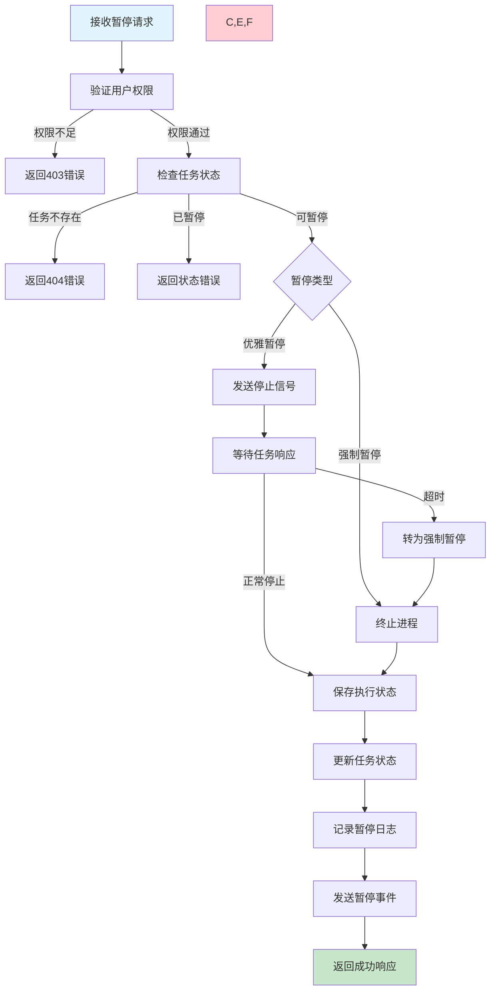
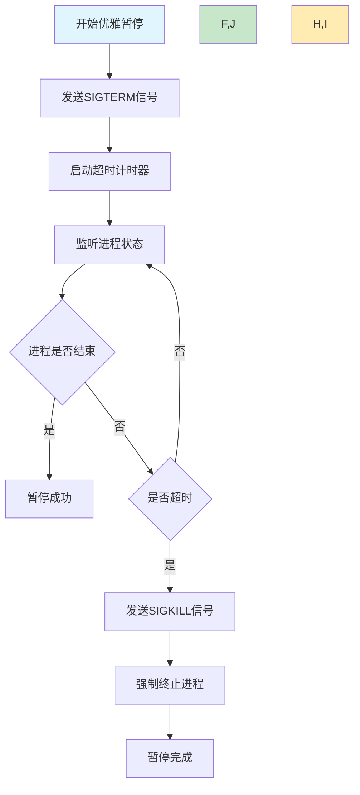

# 任务暂停需求文档

## 1. 功能描述

### 1.1 功能概述
任务暂停功能允许用户临时停止正在运行或计划中的任务，保持任务配置不变，可以随时恢复执行。支持优雅停止、强制停止和批量暂停操作。

### 1.2 主要功能列表
- 优雅暂停正在运行的任务
- 强制暂停无响应的任务
- 暂停计划中的任务调度
- 批量暂停多个任务
- 保存暂停时的执行状态
- 暂停原因记录和追踪

### 1.3 暂停策略
- **优雅暂停**：等待当前操作完成后停止
- **强制暂停**：立即终止任务进程
- **调度暂停**：停止后续的调度执行
- **状态保护**：保留暂停前的执行状态

## 2. 功能目标

### 2.1 业务目标
- 提供灵活的任务控制能力
- 支持临时性的任务暂停需求
- 确保暂停操作的安全性
- 便于任务状态的管理

### 2.2 技术目标
- 暂停操作响应时间小于5秒
- 优雅暂停成功率达到95%以上
- 支持大批量任务的并发暂停
- 状态保存的完整性保证

### 2.3 安全目标
- 严格的暂停权限验证
- 重要任务的暂停确认
- 完整的暂停操作审计
- 数据一致性保障

## 3. 输入输出

### 3.1 输入参数

#### 3.1.1 单个暂停参数
- `task_id` (string): 任务ID
- `pause_type` (string): 暂停类型，graceful/force，默认graceful
- `timeout` (int): 优雅暂停超时时间（秒），默认30
- `reason` (string): 暂停原因
- `save_state` (boolean): 是否保存执行状态，默认true

#### 3.1.2 批量暂停参数
- `task_ids` (array): 任务ID列表
- `pause_type` (string): 暂停类型
- `timeout` (int): 优雅暂停超时时间
- `reason` (string): 暂停原因

#### 3.1.3 条件暂停参数
- `filters` (object): 暂停条件过滤器
- `pause_type` (string): 暂停类型
- `preview` (boolean): 是否仅预览，默认false

### 3.2 输出参数

#### 3.2.1 成功响应
```json
{
  "code": 200,
  "message": "任务暂停成功",
  "data": {
    "task_id": "task_20240116_001",
    "task_name": "数据同步任务",
    "previous_status": "running",
    "current_status": "paused",
    "pause_type": "graceful",
    "paused_at": "2024-01-16T17:00:00Z",
    "saved_state": {
      "progress": 65,
      "last_checkpoint": "record_650",
      "execution_context": {
        "processed_count": 650,
        "total_count": 1000
      }
    }
  }
}
```

#### 3.2.2 批量暂停响应
```json
{
  "code": 200,
  "message": "批量暂停完成",
  "data": {
    "paused_count": 8,
    "failed_count": 2,
    "paused_tasks": [
      {
        "task_id": "task_001",
        "status": "paused",
        "pause_type": "graceful"
      }
    ],
    "failed_tasks": [
      {
        "task_id": "task_002",
        "reason": "任务已处于暂停状态"
      }
    ]
  }
}
```

## 4. 接口设计

### 4.1 API接口定义

#### 4.1.1 暂停单个任务
```
POST /api/v1/task/{task_id}/pause
Content-Type: application/json
Authorization: Bearer {token}
```

**请求体示例：**
```json
{
  "pause_type": "graceful",
  "timeout": 30,
  "reason": "系统维护，临时暂停",
  "save_state": true
}
```

#### 4.1.2 批量暂停任务
```
POST /api/v1/task/batch/pause
Content-Type: application/json
```

#### 4.1.3 条件暂停任务
```
POST /api/v1/task/pause-by-condition
Content-Type: application/json
```

#### 4.1.4 获取暂停状态
```
GET /api/v1/task/{task_id}/pause-status
```

### 4.2 内部服务接口
```go
type TaskPauseService interface {
    PauseTask(ctx context.Context, req *PauseTaskRequest) (*PauseTaskResponse, error)
    BatchPauseTasks(ctx context.Context, req *BatchPauseRequest) (*BatchPauseResponse, error)
    PauseByCondition(ctx context.Context, req *PauseByConditionRequest) (*PauseByConditionResponse, error)
    GetPauseStatus(ctx context.Context, taskID string) (*PauseStatusResponse, error)
}
```

## 5. 数据结构

### 5.1 任务暂停记录表（task_pause_logs）
```sql
CREATE TABLE task_pause_logs (
    id BIGINT AUTO_INCREMENT PRIMARY KEY COMMENT '主键ID',
    task_id VARCHAR(64) NOT NULL COMMENT '任务ID',
    pause_type ENUM('graceful', 'force') NOT NULL COMMENT '暂停类型',
    previous_status VARCHAR(32) NOT NULL COMMENT '暂停前状态',
    paused_by VARCHAR(64) NOT NULL COMMENT '暂停操作人',
    pause_reason VARCHAR(500) COMMENT '暂停原因',
    saved_state JSON COMMENT '保存的执行状态',
    paused_at DATETIME DEFAULT CURRENT_TIMESTAMP COMMENT '暂停时间',
    INDEX idx_task_id (task_id),
    INDEX idx_paused_by (paused_by),
    INDEX idx_paused_at (paused_at)
) COMMENT='任务暂停记录表';
```

### 5.2 Go数据结构
```go
type PauseTaskRequest struct {
    TaskID    string `json:"task_id" v:"required"`
    PauseType string `json:"pause_type" v:"in:graceful,force"`
    Timeout   int    `json:"timeout" v:"min:1,max:300"`
    Reason    string `json:"reason" v:"length:0,500"`
    SaveState bool   `json:"save_state"`
}

type PauseTaskResponse struct {
    TaskID         string          `json:"task_id"`
    TaskName       string          `json:"task_name"`
    PreviousStatus string          `json:"previous_status"`
    CurrentStatus  string          `json:"current_status"`
    PauseType      string          `json:"pause_type"`
    PausedAt       string          `json:"paused_at"`
    SavedState     *ExecutionState `json:"saved_state,omitempty"`
}

type ExecutionState struct {
    Progress         int                    `json:"progress"`
    LastCheckpoint   string                 `json:"last_checkpoint"`
    ExecutionContext map[string]interface{} `json:"execution_context"`
}

type BatchPauseRequest struct {
    TaskIDs   []string `json:"task_ids" v:"required|array:min,1"`
    PauseType string   `json:"pause_type" v:"in:graceful,force"`
    Timeout   int      `json:"timeout" v:"min:1,max:300"`
    Reason    string   `json:"reason" v:"length:0,500"`
}
```

## 6. 异常处理

### 6.1 参数验证异常
- **任务不存在**：指定的任务ID无效
- **状态异常**：任务已处于暂停状态
- **参数格式错误**：暂停类型或超时时间格式错误

### 6.2 业务逻辑异常
- **权限不足**：用户无任务暂停权限
- **任务保护**：系统关键任务不允许暂停
- **暂停超时**：优雅暂停超时未完成
- **进程异常**：无法正常停止任务进程

### 6.3 系统异常
- **数据库异常**：状态更新失败
- **进程控制异常**：无法向进程发送信号
- **状态保存异常**：执行状态保存失败

## 7. 流程图

### 7.1 任务暂停主流程



### 7.2 优雅暂停处理流程



## 8. 安全性考虑

### 8.1 权限控制
- **暂停权限验证**：只有有权限的用户才能暂停任务
- **任务所有权**：用户只能暂停自己创建的任务
- **系统任务保护**：关键系统任务需要特殊权限暂停

### 8.2 操作安全
- **确认机制**：重要任务暂停需要二次确认
- **时间窗口**：优雅暂停的合理超时时间设置
- **状态保护**：确保暂停过程中数据的一致性

### 8.3 审计追踪
- **暂停记录**：完整记录暂停操作的详情
- **状态快照**：保存暂停时的完整状态
- **恢复支持**：为后续恢复提供必要信息

## 9. 日志与监控

### 9.1 操作日志
- **暂停日志**：记录任务暂停的详细信息
- **状态变更日志**：记录状态转换过程
- **错误日志**：记录暂停失败的原因

### 9.2 业务监控
- **暂停频率**：监控任务暂停的频率和模式
- **暂停成功率**：监控优雅暂停的成功率
- **暂停时长**：统计任务的暂停持续时间

### 9.3 告警规则
- **暂停超时告警**：优雅暂停超时告警
- **频繁暂停告警**：短时间内频繁暂停告警
- **强制暂停告警**：强制暂停操作告警

### 9.4 日志格式
```json
{
  "timestamp": "2024-01-16T17:00:00Z",
  "level": "INFO",
  "service": "task-pause",
  "operation": "pause_task",
  "task_id": "task_20240116_001",
  "pause_type": "graceful",
  "previous_status": "running",
  "user_id": "user_123",
  "reason": "系统维护",
  "timeout": 30,
  "duration_ms": 2500,
  "result": "success"
}
```

## 10. 测试用例

### 10.1 功能测试用例

#### 10.1.1 优雅暂停测试
**测试目标：** 验证优雅暂停功能

**测试用例：**
- 暂停正在运行的任务
- 暂停计划中的任务
- 设置不同的超时时间

**预期结果：** 任务正常暂停，状态保存完整

#### 10.1.2 强制暂停测试
**测试目标：** 验证强制暂停功能

**测试场景：** 暂停无响应的任务
**预期结果：** 任务强制停止，状态更新正确

#### 10.1.3 批量暂停测试
**测试目标：** 验证批量暂停功能

**测试场景：** 同时暂停10个任务
**预期结果：** 所有任务正确暂停

#### 10.1.4 权限控制测试
**测试目标：** 验证暂停权限控制

**测试场景：** 无权限用户尝试暂停任务
**预期结果：** 返回权限不足错误

### 10.2 性能测试用例

#### 10.2.1 暂停响应时间测试
**测试目标：** 验证暂停操作的响应性能

**测试场景：** 暂停不同类型的任务
**预期结果：** 暂停操作在5秒内完成

#### 10.2.2 并发暂停测试
**测试目标：** 验证并发暂停的性能

**测试场景：** 50个用户同时暂停不同任务
**预期结果：** 所有暂停操作正常完成

### 10.3 异常测试用例

#### 10.3.1 超时处理测试
**测试目标：** 验证优雅暂停超时的处理

**测试场景：** 任务在超时时间内未响应
**预期结果：** 自动转为强制暂停

#### 10.3.2 状态异常测试
**测试目标：** 验证异常状态的处理

**测试场景：** 暂停已暂停的任务
**预期结果：** 返回状态错误 