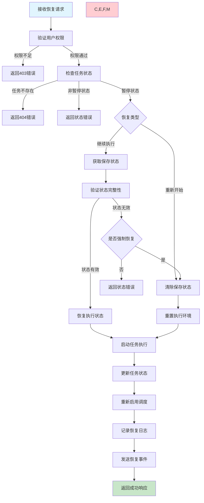
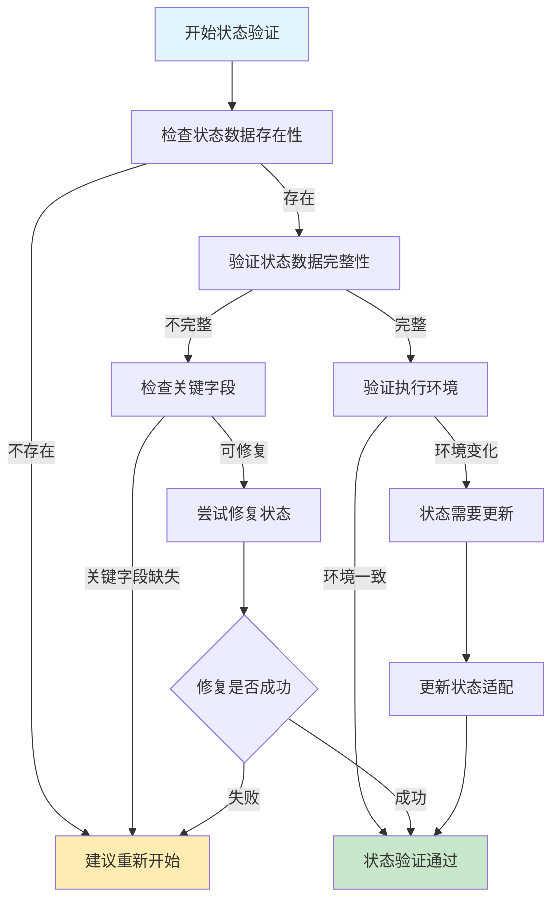

# 任务恢复需求文档

## 1. 功能描述

### 1.1 功能概述
任务恢复功能用于重新启动已暂停的任务，支持从暂停点继续执行或重新开始执行。包括状态恢复、进度恢复和批量恢复等功能。

### 1.2 主要功能列表
- 恢复暂停状态的任务
- 从暂停点继续执行
- 重新开始执行任务
- 批量恢复多个任务
- 恢复执行状态和进度
- 恢复原因记录和追踪

### 1.3 恢复策略
- **状态恢复**：恢复到暂停前的执行状态
- **进度恢复**：从暂停点继续执行
- **重新开始**：忽略之前进度，重新执行
- **调度恢复**：重新启用任务调度

## 2. 功能目标

### 2.1 业务目标
- 提供灵活的任务恢复能力
- 支持精确的进度恢复
- 确保恢复操作的可靠性
- 最小化任务中断影响

### 2.2 技术目标
- 恢复操作响应时间小于3秒
- 状态恢复准确率达到99%以上
- 支持大批量任务的并发恢复
- 进度恢复的数据一致性保证

### 2.3 安全目标
- 严格的恢复权限验证
- 恢复操作的完整审计
- 状态验证确保数据安全
- 异常恢复的回滚机制

## 3. 输入输出

### 3.1 输入参数

#### 3.1.1 单个恢复参数
- `task_id` (string): 任务ID
- `resume_type` (string): 恢复类型，continue/restart，默认continue
- `force_resume` (boolean): 是否强制恢复，默认false
- `reason` (string): 恢复原因
- `validate_state` (boolean): 是否验证状态，默认true

#### 3.1.2 批量恢复参数
- `task_ids` (array): 任务ID列表
- `resume_type` (string): 恢复类型
- `force_resume` (boolean): 是否强制恢复
- `reason` (string): 恢复原因

#### 3.1.3 条件恢复参数
- `filters` (object): 恢复条件过滤器
- `resume_type` (string): 恢复类型
- `preview` (boolean): 是否仅预览，默认false

### 3.2 输出参数

#### 3.2.1 成功响应
```json
{
  "code": 200,
  "message": "任务恢复成功",
  "data": {
    "task_id": "task_20240116_001",
    "task_name": "数据同步任务",
    "previous_status": "paused",
    "current_status": "running",
    "resume_type": "continue",
    "resumed_at": "2024-01-16T18:00:00Z",
    "restored_state": {
      "progress": 65,
      "last_checkpoint": "record_650",
      "execution_context": {
        "processed_count": 650,
        "total_count": 1000
      }
    },
    "next_run_time": "2024-01-17T02:00:00Z"
  }
}
```

#### 3.2.2 批量恢复响应
```json
{
  "code": 200,
  "message": "批量恢复完成",
  "data": {
    "resumed_count": 8,
    "failed_count": 2,
    "resumed_tasks": [
      {
        "task_id": "task_001",
        "status": "running",
        "resume_type": "continue"
      }
    ],
    "failed_tasks": [
      {
        "task_id": "task_002",
        "reason": "任务不处于暂停状态"
      }
    ]
  }
}
```

## 4. 接口设计

### 4.1 API接口定义

#### 4.1.1 恢复单个任务
```
POST /api/v1/task/{task_id}/resume
Content-Type: application/json
Authorization: Bearer {token}
```

**请求体示例：**
```json
{
  "resume_type": "continue",
  "force_resume": false,
  "reason": "维护完成，恢复执行",
  "validate_state": true
}
```

#### 4.1.2 批量恢复任务
```
POST /api/v1/task/batch/resume
Content-Type: application/json
```

#### 4.1.3 条件恢复任务
```
POST /api/v1/task/resume-by-condition
Content-Type: application/json
```

#### 4.1.4 获取恢复状态
```
GET /api/v1/task/{task_id}/resume-status
```

### 4.2 内部服务接口
```go
type TaskResumeService interface {
    ResumeTask(ctx context.Context, req *ResumeTaskRequest) (*ResumeTaskResponse, error)
    BatchResumeTasks(ctx context.Context, req *BatchResumeRequest) (*BatchResumeResponse, error)
    ResumeByCondition(ctx context.Context, req *ResumeByConditionRequest) (*ResumeByConditionResponse, error)
    GetResumeStatus(ctx context.Context, taskID string) (*ResumeStatusResponse, error)
    ValidateResumeState(ctx context.Context, taskID string) (*StateValidationResponse, error)
}
```

## 5. 数据结构

### 5.1 任务恢复记录表（task_resume_logs）
```sql
CREATE TABLE task_resume_logs (
    id BIGINT AUTO_INCREMENT PRIMARY KEY COMMENT '主键ID',
    task_id VARCHAR(64) NOT NULL COMMENT '任务ID',
    resume_type ENUM('continue', 'restart') NOT NULL COMMENT '恢复类型',
    previous_status VARCHAR(32) NOT NULL COMMENT '恢复前状态',
    resumed_by VARCHAR(64) NOT NULL COMMENT '恢复操作人',
    resume_reason VARCHAR(500) COMMENT '恢复原因',
    restored_state JSON COMMENT '恢复的执行状态',
    resumed_at DATETIME DEFAULT CURRENT_TIMESTAMP COMMENT '恢复时间',
    INDEX idx_task_id (task_id),
    INDEX idx_resumed_by (resumed_by),
    INDEX idx_resumed_at (resumed_at)
) COMMENT='任务恢复记录表';
```

### 5.2 Go数据结构
```go
type ResumeTaskRequest struct {
    TaskID        string `json:"task_id" v:"required"`
    ResumeType    string `json:"resume_type" v:"in:continue,restart"`
    ForceResume   bool   `json:"force_resume"`
    Reason        string `json:"reason" v:"length:0,500"`
    ValidateState bool   `json:"validate_state"`
}

type ResumeTaskResponse struct {
    TaskID        string          `json:"task_id"`
    TaskName      string          `json:"task_name"`
    PreviousStatus string         `json:"previous_status"`
    CurrentStatus string          `json:"current_status"`
    ResumeType    string          `json:"resume_type"`
    ResumedAt     string          `json:"resumed_at"`
    RestoredState *ExecutionState `json:"restored_state,omitempty"`
    NextRunTime   *string         `json:"next_run_time,omitempty"`
}

type BatchResumeRequest struct {
    TaskIDs     []string `json:"task_ids" v:"required|array:min,1"`
    ResumeType  string   `json:"resume_type" v:"in:continue,restart"`
    ForceResume bool     `json:"force_resume"`
    Reason      string   `json:"reason" v:"length:0,500"`
}

type StateValidationResponse struct {
    Valid         bool     `json:"valid"`
    Issues        []string `json:"issues,omitempty"`
    Recommendation string  `json:"recommendation,omitempty"`
}
```

## 6. 异常处理

### 6.1 参数验证异常
- **任务不存在**：指定的任务ID无效
- **状态异常**：任务不处于暂停状态
- **参数格式错误**：恢复类型或其他参数格式错误

### 6.2 业务逻辑异常
- **权限不足**：用户无任务恢复权限
- **状态验证失败**：保存的状态数据损坏或不一致
- **依赖未满足**：依赖的任务未完成
- **资源不足**：系统资源不足无法恢复

### 6.3 系统异常
- **数据库异常**：状态更新失败
- **调度器异常**：无法重新调度任务
- **状态恢复异常**：执行状态恢复失败

## 7. 流程图

### 7.1 任务恢复主流程



### 7.2 状态验证流程



## 8. 安全性考虑

### 8.1 权限控制
- **恢复权限验证**：只有有权限的用户才能恢复任务
- **任务所有权**：用户只能恢复自己创建的任务
- **系统任务保护**：关键系统任务的恢复需要特殊权限

### 8.2 状态安全
- **状态验证**：确保恢复的状态数据有效和安全
- **环境检查**：验证执行环境的一致性
- **回滚机制**：恢复失败时的状态回滚

### 8.3 操作审计
- **恢复记录**：完整记录恢复操作的详情
- **状态追踪**：记录状态恢复的过程
- **异常记录**：记录恢复过程中的异常情况

## 9. 日志与监控

### 9.1 操作日志
- **恢复日志**：记录任务恢复的详细信息
- **状态恢复日志**：记录状态恢复过程
- **验证日志**：记录状态验证结果

### 9.2 业务监控
- **恢复频率**：监控任务恢复的频率和模式
- **恢复成功率**：监控恢复操作的成功率
- **状态验证率**：监控状态验证的通过率

### 9.3 告警规则
- **恢复失败告警**：任务恢复失败告警
- **状态异常告警**：状态验证失败告警
- **频繁恢复告警**：短时间内频繁恢复告警

### 9.4 日志格式
```json
{
  "timestamp": "2024-01-16T18:00:00Z",
  "level": "INFO",
  "service": "task-resume",
  "operation": "resume_task",
  "task_id": "task_20240116_001",
  "resume_type": "continue",
  "previous_status": "paused",
  "user_id": "user_123",
  "reason": "维护完成",
  "state_valid": true,
  "duration_ms": 1800,
  "result": "success"
}
```

## 10. 测试用例

### 10.1 功能测试用例

#### 10.1.1 继续执行恢复测试
**测试目标：** 验证从暂停点继续执行的恢复功能

**测试用例：**
- 恢复有保存状态的暂停任务
- 验证进度恢复的准确性
- 检查执行环境的一致性

**预期结果：** 任务从暂停点正确恢复执行

#### 10.1.2 重新开始恢复测试
**测试目标：** 验证重新开始执行的恢复功能

**测试场景：** 忽略之前进度，重新执行任务
**预期结果：** 任务从头开始执行

#### 10.1.3 批量恢复测试
**测试目标：** 验证批量恢复功能

**测试场景：** 同时恢复10个暂停任务
**预期结果：** 所有任务正确恢复

#### 10.1.4 状态验证测试
**测试目标：** 验证状态验证功能

**测试场景：**
- 状态数据完整的恢复
- 状态数据损坏的恢复
- 执行环境变化的恢复

**预期结果：** 正确识别状态问题并给出建议

### 10.2 性能测试用例

#### 10.2.1 恢复响应时间测试
**测试目标：** 验证恢复操作的响应性能

**测试场景：** 恢复不同复杂度的任务
**预期结果：** 恢复操作在3秒内完成

#### 10.2.2 并发恢复测试
**测试目标：** 验证并发恢复的性能

**测试场景：** 50个用户同时恢复不同任务
**预期结果：** 所有恢复操作正常完成

### 10.3 异常测试用例

#### 10.3.1 状态损坏测试
**测试目标：** 验证状态数据损坏时的处理

**测试场景：** 保存的状态数据不完整或损坏
**预期结果：** 正确识别问题并提供解决方案

#### 10.3.2 环境变化测试
**测试目标：** 验证执行环境变化时的处理

**测试场景：** 依赖服务或配置发生变化
**预期结果：** 正确处理环境差异 