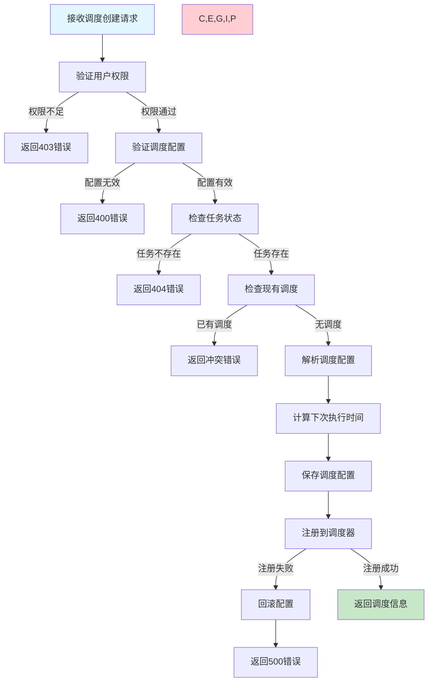
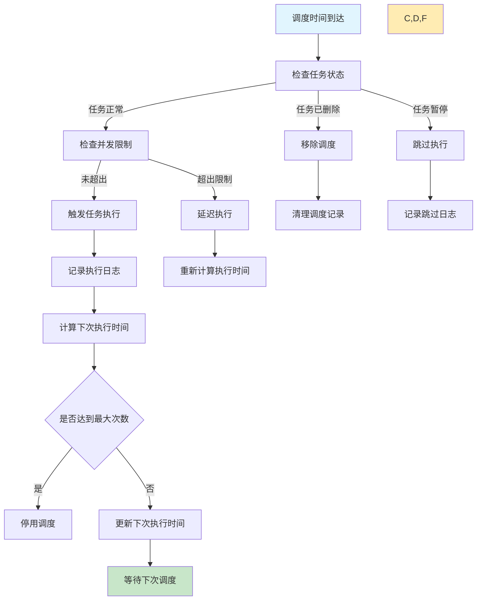

# 任务调度管理需求文档

## 1. 功能描述

### 1.1 功能概述
任务调度管理功能提供灵活的任务执行时间安排，支持多种调度类型、时区处理、调度策略优化等功能，确保任务按预定计划准确执行。

### 1.2 主要功能列表
- Cron表达式调度
- 固定间隔调度
- 一次性定时调度
- 复杂调度策略组合
- 时区感知调度
- 调度冲突检测和处理
- 调度历史记录和统计

### 1.3 调度类型
- **Cron调度**：基于Cron表达式的复杂时间调度
- **间隔调度**：固定时间间隔的重复执行
- **延迟调度**：延迟指定时间后执行
- **条件调度**：基于条件触发的调度

## 2. 功能目标

### 2.1 业务目标
- 提供精确的任务调度能力
- 支持复杂的调度需求
- 确保调度的可靠性和准确性
- 提供调度策略的灵活配置

### 2.2 技术目标
- 调度精度误差小于1秒
- 支持10万+任务的并发调度
- 调度器高可用性达到99.9%
- 调度计算性能优化

### 2.3 安全目标
- 调度配置的权限控制
- 调度策略的安全验证
- 调度操作的完整审计
- 异常调度的监控告警

## 3. 输入输出

### 3.1 输入参数

#### 3.1.1 Cron调度参数
- `cron_expression` (string): Cron表达式
- `timezone` (string): 时区，默认Asia/Shanghai
- `enabled` (boolean): 是否启用，默认true
- `max_runs` (int): 最大执行次数，0表示无限制
- `end_time` (string): 结束时间

#### 3.1.2 间隔调度参数
- `interval_seconds` (int): 间隔秒数
- `initial_delay` (int): 初始延迟秒数，默认0
- `max_runs` (int): 最大执行次数
- `jitter_seconds` (int): 随机抖动秒数，默认0

#### 3.1.3 延迟调度参数
- `delay_seconds` (int): 延迟秒数
- `schedule_time` (string): 指定执行时间

### 3.2 输出参数

#### 3.2.1 调度创建响应
```json
{
  "code": 200,
  "message": "调度创建成功",
  "data": {
    "schedule_id": "schedule_20240116_001",
    "task_id": "task_20240116_001",
    "schedule_type": "cron",
    "schedule_config": {
      "cron_expression": "0 2 * * *",
      "timezone": "Asia/Shanghai",
      "enabled": true
    },
    "next_run_time": "2024-01-17T02:00:00+08:00",
    "next_5_runs": [
      "2024-01-17T02:00:00+08:00",
      "2024-01-18T02:00:00+08:00",
      "2024-01-19T02:00:00+08:00",
      "2024-01-20T02:00:00+08:00",
      "2024-01-21T02:00:00+08:00"
    ],
    "created_at": "2024-01-16T18:30:00Z"
  }
}
```

#### 3.2.2 调度状态查询响应
```json
{
  "code": 200,
  "message": "查询成功",
  "data": {
    "schedule_id": "schedule_20240116_001",
    "status": "active",
    "total_runs": 156,
    "successful_runs": 148,
    "failed_runs": 8,
    "last_run_time": "2024-01-16T02:00:00+08:00",
    "last_run_status": "success",
    "next_run_time": "2024-01-17T02:00:00+08:00",
    "average_duration": 1245
  }
}
```

## 4. 接口设计

### 4.1 API接口定义

#### 4.1.1 创建任务调度
```
POST /api/v1/task/{task_id}/schedule
Content-Type: application/json
Authorization: Bearer {token}
```

**请求体示例：**
```json
{
  "schedule_type": "cron",
  "schedule_config": {
    "cron_expression": "0 2 * * *",
    "timezone": "Asia/Shanghai",
    "enabled": true,
    "max_runs": 0,
    "end_time": null
  },
  "description": "每天凌晨2点执行数据同步"
}
```

#### 4.1.2 更新任务调度
```
PUT /api/v1/task/{task_id}/schedule
Content-Type: application/json
```

#### 4.1.3 获取调度详情
```
GET /api/v1/task/{task_id}/schedule
```

#### 4.1.4 删除任务调度
```
DELETE /api/v1/task/{task_id}/schedule
```

#### 4.1.5 预览调度时间
```
POST /api/v1/schedule/preview
Content-Type: application/json
```

**请求体示例：**
```json
{
  "schedule_type": "cron",
  "cron_expression": "0 2 * * *",
  "timezone": "Asia/Shanghai",
  "preview_count": 10,
  "start_time": "2024-01-16T00:00:00Z"
}
```

### 4.2 内部服务接口
```go
type TaskScheduleService interface {
    CreateSchedule(ctx context.Context, req *CreateScheduleRequest) (*CreateScheduleResponse, error)
    UpdateSchedule(ctx context.Context, req *UpdateScheduleRequest) (*UpdateScheduleResponse, error)
    DeleteSchedule(ctx context.Context, taskID string) error
    GetSchedule(ctx context.Context, taskID string) (*ScheduleResponse, error)
    PreviewSchedule(ctx context.Context, req *PreviewScheduleRequest) (*PreviewScheduleResponse, error)
    ValidateCronExpression(ctx context.Context, expression string) (*ValidationResponse, error)
}
```

## 5. 数据结构

### 5.1 任务调度表（task_schedules）
```sql
CREATE TABLE task_schedules (
    id BIGINT AUTO_INCREMENT PRIMARY KEY COMMENT '主键ID',
    schedule_id VARCHAR(64) UNIQUE NOT NULL COMMENT '调度ID',
    task_id VARCHAR(64) NOT NULL COMMENT '任务ID',
    schedule_type ENUM('cron', 'interval', 'delay', 'once') NOT NULL COMMENT '调度类型',
    schedule_config JSON NOT NULL COMMENT '调度配置',
    enabled BOOLEAN DEFAULT TRUE COMMENT '是否启用',
    next_run_time DATETIME COMMENT '下次执行时间',
    last_run_time DATETIME COMMENT '上次执行时间',
    run_count INT DEFAULT 0 COMMENT '执行次数',
    max_runs INT DEFAULT 0 COMMENT '最大执行次数',
    created_at DATETIME DEFAULT CURRENT_TIMESTAMP COMMENT '创建时间',
    updated_at DATETIME DEFAULT CURRENT_TIMESTAMP ON UPDATE CURRENT_TIMESTAMP COMMENT '更新时间',
    INDEX idx_task_id (task_id),
    INDEX idx_next_run_time (next_run_time),
    INDEX idx_enabled (enabled),
    UNIQUE KEY uk_task_schedule (task_id)
) COMMENT='任务调度表';
```

### 5.2 调度执行记录表（schedule_execution_logs）
```sql
CREATE TABLE schedule_execution_logs (
    id BIGINT AUTO_INCREMENT PRIMARY KEY COMMENT '主键ID',
    schedule_id VARCHAR(64) NOT NULL COMMENT '调度ID',
    task_id VARCHAR(64) NOT NULL COMMENT '任务ID',
    scheduled_time DATETIME NOT NULL COMMENT '计划执行时间',
    actual_start_time DATETIME COMMENT '实际开始时间',
    execution_status ENUM('triggered', 'running', 'success', 'failed', 'skipped') NOT NULL COMMENT '执行状态',
    delay_seconds INT COMMENT '延迟秒数',
    duration_ms INT COMMENT '执行时长(毫秒)',
    error_message TEXT COMMENT '错误信息',
    created_at DATETIME DEFAULT CURRENT_TIMESTAMP COMMENT '创建时间',
    INDEX idx_schedule_id (schedule_id),
    INDEX idx_task_id (task_id),
    INDEX idx_scheduled_time (scheduled_time),
    INDEX idx_execution_status (execution_status)
) COMMENT='调度执行记录表';
```

### 5.3 Go数据结构
```go
type CreateScheduleRequest struct {
    TaskID         string          `json:"task_id" v:"required"`
    ScheduleType   string          `json:"schedule_type" v:"required|in:cron,interval,delay,once"`
    ScheduleConfig *ScheduleConfig `json:"schedule_config" v:"required"`
    Description    string          `json:"description" v:"length:0,500"`
}

type ScheduleConfig struct {
    // Cron调度配置
    CronExpression string `json:"cron_expression,omitempty"`
    Timezone       string `json:"timezone,omitempty"`
    
    // 间隔调度配置
    IntervalSeconds int `json:"interval_seconds,omitempty"`
    InitialDelay    int `json:"initial_delay,omitempty"`
    JitterSeconds   int `json:"jitter_seconds,omitempty"`
    
    // 延迟/一次性调度配置
    DelaySeconds int    `json:"delay_seconds,omitempty"`
    ScheduleTime string `json:"schedule_time,omitempty"`
    
    // 通用配置
    Enabled  bool   `json:"enabled"`
    MaxRuns  int    `json:"max_runs"`
    EndTime  string `json:"end_time,omitempty"`
}

type CreateScheduleResponse struct {
    ScheduleID     string            `json:"schedule_id"`
    TaskID         string            `json:"task_id"`
    ScheduleType   string            `json:"schedule_type"`
    ScheduleConfig *ScheduleConfig   `json:"schedule_config"`
    NextRunTime    string            `json:"next_run_time"`
    Next5Runs      []string          `json:"next_5_runs"`
    CreatedAt      string            `json:"created_at"`
}

type ScheduleExecutionLog struct {
    ID               int64  `json:"id"`
    ScheduleID       string `json:"schedule_id"`
    TaskID           string `json:"task_id"`
    ScheduledTime    string `json:"scheduled_time"`
    ActualStartTime  string `json:"actual_start_time,omitempty"`
    ExecutionStatus  string `json:"execution_status"`
    DelaySeconds     int    `json:"delay_seconds"`
    DurationMs       int    `json:"duration_ms"`
    ErrorMessage     string `json:"error_message,omitempty"`
}
```

## 6. 异常处理

### 6.1 参数验证异常
- **Cron表达式无效**：Cron表达式格式错误或无效
- **时区无效**：不支持的时区格式
- **时间范围错误**：结束时间早于开始时间
- **调度配置冲突**：多种调度类型配置冲突

### 6.2 业务逻辑异常
- **权限不足**：用户无调度配置权限
- **调度冲突**：任务已存在调度配置
- **资源限制**：超出系统调度任务数量限制
- **时间窗口限制**：调度时间超出允许范围

### 6.3 系统异常
- **调度器异常**：调度引擎服务不可用
- **时间服务异常**：系统时间服务异常
- **数据库异常**：调度配置保存失败

## 7. 流程图

### 7.1 调度创建流程



### 7.2 调度执行流程



## 8. 安全性考虑

### 8.1 权限控制
- **调度权限验证**：只有有权限的用户才能配置调度
- **任务所有权**：用户只能配置自己任务的调度
- **系统任务保护**：关键任务的调度需要特殊权限

### 8.2 配置安全
- **表达式验证**：严格验证Cron表达式的安全性
- **时间范围限制**：限制调度的时间范围
- **频率限制**：防止过于频繁的调度配置

### 8.3 执行安全
- **并发控制**：防止同一任务的并发执行冲突
- **资源保护**：防止调度任务消耗过多系统资源
- **异常处理**：调度异常时的安全处理

## 9. 日志与监控

### 9.1 调度日志
- **配置日志**：记录调度配置的变更
- **执行日志**：记录每次调度执行的详情
- **异常日志**：记录调度过程中的异常

### 9.2 性能监控
- **调度精度**：监控调度执行时间的精度
- **调度延迟**：监控调度执行的延迟情况
- **调度成功率**：监控调度触发的成功率

### 9.3 业务监控
- **调度统计**：统计不同类型调度的使用情况
- **高频调度**：监控高频执行的调度任务
- **调度冲突**：监控调度时间冲突的情况

### 9.4 日志格式
```json
{
  "timestamp": "2024-01-16T18:30:00Z",
  "level": "INFO",
  "service": "task-schedule",
  "operation": "schedule_trigger",
  "schedule_id": "schedule_20240116_001",
  "task_id": "task_20240116_001",
  "scheduled_time": "2024-01-16T18:30:00Z",
  "actual_time": "2024-01-16T18:30:01Z",
  "delay_ms": 1000,
  "result": "success"
}
```

## 10. 测试用例

### 10.1 功能测试用例

#### 10.1.1 Cron调度测试
**测试目标：** 验证Cron表达式调度功能

**测试用例：**
- 标准Cron表达式（0 2 * * *）
- 复杂Cron表达式（0 */5 9-17 * MON-FRI）
- 不同时区的Cron调度
- 带结束时间的Cron调度

**预期结果：** 调度时间计算准确，执行时间精确

#### 10.1.2 间隔调度测试
**测试目标：** 验证固定间隔调度功能

**测试场景：** 设置60秒间隔的重复调度
**预期结果：** 每60秒触发一次任务执行

#### 10.1.3 延迟调度测试
**测试目标：** 验证延迟执行调度功能

**测试场景：** 设置5分钟后执行的一次性调度
**预期结果：** 5分钟后准确触发任务执行

#### 10.1.4 调度更新测试
**测试目标：** 验证调度配置更新功能

**测试场景：** 修改现有的Cron表达式
**预期结果：** 下次执行时间按新配置计算

### 10.2 性能测试用例

#### 10.2.1 大量调度测试
**测试目标：** 验证大量调度任务的性能

**测试场景：** 配置10000个不同的调度任务
**预期结果：** 系统稳定运行，调度精度不受影响

#### 10.2.2 调度精度测试
**测试目标：** 验证调度执行的时间精度

**测试场景：** 设置秒级精度的调度任务
**预期结果：** 执行时间误差小于1秒

#### 10.2.3 并发调度测试
**测试目标：** 验证同时触发多个调度的性能

**测试场景：** 100个任务在同一时间点调度执行
**预期结果：** 所有调度正常触发，无遗漏

### 10.3 异常测试用例

#### 10.3.1 无效表达式测试
**测试目标：** 验证无效Cron表达式的处理

**测试数据：** 格式错误的Cron表达式
**预期结果：** 返回表达式验证错误

#### 10.3.2 系统时间变更测试
**测试目标：** 验证系统时间变更时的处理

**测试场景：** 系统时间向前或向后调整
**预期结果：** 调度系统正确适应时间变更

#### 10.3.3 调度器服务异常测试
**测试目标：** 验证调度器服务异常的处理

**测试场景：** 调度器服务重启或异常
**预期结果：** 服务恢复后调度正常工作 