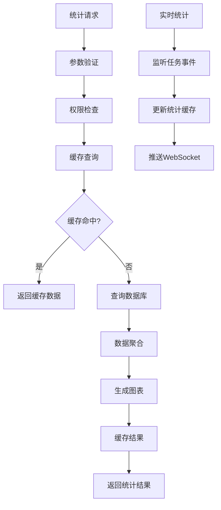

# 任务统计功能需求文档

## 1. 功能描述

任务统计功能提供全面的任务数据分析和报表服务，通过多维度的数据统计和可视化展示，帮助用户了解任务执行情况、性能指标、趋势分析等关键信息。该功能支持实时统计、历史分析、自定义报表和数据导出，为任务管理和优化决策提供数据支持。

### 核心功能
- **实时统计**：任务状态、执行情况的实时数据统计
- **历史分析**：任务执行历史趋势和性能分析
- **多维统计**：按时间、队列、用户、类型等维度统计
- **可视化展示**：图表形式展示统计数据
- **报表导出**：支持多种格式的报表导出功能

## 2. 功能目标

### 2.1 性能目标
- **响应时间**：统计查询 ≤ 3秒
- **数据刷新**：实时统计数据刷新间隔 ≤ 30秒
- **并发处理**：支持100个并发统计查询
- **数据量**：支持千万级任务数据统计

### 2.2 功能目标
- **统计精度**：统计数据准确率 = 100%
- **维度覆盖**：支持10+统计维度组合
- **报表类型**：提供20+预定义报表模板
- **数据时效性**：实时数据延迟 ≤ 1分钟

## 3. 输入输出

### 3.1 输入参数

#### 统计查询请求
```json
{
  "statistics_type": "execution_summary",
  "time_range": {
    "start_time": "2024-01-01T00:00:00Z",
    "end_time": "2024-01-31T23:59:59Z",
    "granularity": "day"
  },
  "dimensions": ["status", "queue_id", "user_id"],
  "filters": {
    "queue_ids": [1, 2, 3],
    "task_types": ["data_sync", "batch_process"],
    "user_ids": [100, 200]
  },
  "group_by": ["status", "queue_id"],
  "order_by": [{"field": "count", "direction": "desc"}]
}
```

### 3.2 输出结果

#### 统计数据响应
```json
{
  "status": "success",
  "data": {
    "summary": {
      "total_tasks": 1500,
      "success_rate": 95.2,
      "avg_duration": 125.5,
      "time_range": "2024-01-01 to 2024-01-31"
    },
    "details": [
      {
        "dimensions": {
          "status": "success",
          "queue_id": 1
        },
        "metrics": {
          "count": 800,
          "percentage": 53.3,
          "avg_duration": 120.0,
          "total_duration": 96000
        }
      }
    ],
    "charts": {
      "trend_chart": {
        "type": "line",
        "data": [...],
        "config": {...}
      }
    }
  }
}
```

## 4. 接口设计

### 4.1 RESTful API接口

#### 4.1.1 获取统计数据
```http
POST /api/v1/tasks/statistics
Content-Type: application/json
Authorization: Bearer {token}
```

#### 4.1.2 获取预定义报表
```http
GET /api/v1/tasks/reports/{report_type}
Authorization: Bearer {token}
```

#### 4.1.3 导出统计报表
```http
POST /api/v1/tasks/statistics/export
Content-Type: application/json
Authorization: Bearer {token}
```

#### 4.1.4 获取实时统计
```http
GET /api/v1/tasks/statistics/realtime
Authorization: Bearer {token}
```

### 4.2 WebSocket接口

#### 4.2.1 实时统计推送
```javascript
const ws = new WebSocket('ws://localhost:8080/ws/statistics');
ws.onmessage = function(event) {
  const stats = JSON.parse(event.data);
  updateStatsDashboard(stats);
};
```

## 5. 数据结构

### 5.1 数据库表设计

#### task_statistics_cache表
```sql
CREATE TABLE task_statistics_cache (
    id BIGINT PRIMARY KEY AUTO_INCREMENT,
    cache_key VARCHAR(255) NOT NULL,
    statistics_type VARCHAR(50) NOT NULL,
    time_range_start TIMESTAMP NOT NULL,
    time_range_end TIMESTAMP NOT NULL,
    dimensions JSON,
    result_data JSON NOT NULL,
    created_at TIMESTAMP DEFAULT CURRENT_TIMESTAMP,
    expires_at TIMESTAMP NOT NULL,
    
    UNIQUE KEY uk_cache_key (cache_key),
    INDEX idx_statistics_type (statistics_type),
    INDEX idx_time_range (time_range_start, time_range_end),
    INDEX idx_expires_at (expires_at)
);
```

#### task_statistics_config表
```sql
CREATE TABLE task_statistics_config (
    id BIGINT PRIMARY KEY AUTO_INCREMENT,
    config_name VARCHAR(100) NOT NULL,
    config_type ENUM('report', 'dashboard', 'alert') NOT NULL,
    config_data JSON NOT NULL,
    is_public BOOLEAN DEFAULT FALSE,
    created_by BIGINT NOT NULL,
    created_at TIMESTAMP DEFAULT CURRENT_TIMESTAMP,
    
    UNIQUE KEY uk_config_name (config_name),
    INDEX idx_config_type (config_type),
    INDEX idx_created_by (created_by)
);
```

### 5.2 Go语言数据结构

```go
type StatisticsRequest struct {
    StatisticsType string           `json:"statistics_type" validate:"required"`
    TimeRange      *TimeRange       `json:"time_range" validate:"required"`
    Dimensions     []string         `json:"dimensions"`
    Filters        map[string]interface{} `json:"filters"`
    GroupBy        []string         `json:"group_by"`
    OrderBy        []OrderByClause  `json:"order_by"`
}

type StatisticsResult struct {
    Summary *StatisticsSummary    `json:"summary"`
    Details []StatisticsDetail    `json:"details"`
    Charts  map[string]ChartData  `json:"charts"`
    Meta    *StatisticsMeta       `json:"meta"`
}

type StatisticsSummary struct {
    TotalTasks    int64   `json:"total_tasks"`
    SuccessRate   float64 `json:"success_rate"`
    AvgDuration   float64 `json:"avg_duration"`
    TimeRange     string  `json:"time_range"`
}
```

## 6. 异常处理

### 6.1 异常类型定义
```go
const (
    ErrInvalidTimeRange    = "INVALID_TIME_RANGE"
    ErrInvalidDimension    = "INVALID_DIMENSION"
    ErrDataNotAvailable    = "DATA_NOT_AVAILABLE"
    ErrStatisticsTimeout   = "STATISTICS_TIMEOUT"
    ErrPermissionDenied    = "PERMISSION_DENIED"
)
```

### 6.2 数据缺失处理
- 历史数据缺失时使用默认值
- 实时数据异常时回退到缓存数据
- 提供数据质量评估指标

## 7. 流程图



## 8. 安全性考虑

### 8.1 访问控制
- 基于用户权限的数据过滤
- 统计查询频率限制
- 敏感统计数据的访问控制

### 8.2 数据保护
- 统计结果的脱敏处理
- 防止通过统计接口泄露敏感信息
- 统计查询的日志记录

### 8.3 性能保护
- 大数据量查询的限制和分页
- 复杂统计查询的超时控制
- 并发查询数量限制

## 9. 日志与监控

### 9.1 日志规范
```go
s.logger.Info("统计查询完成",
    zap.String("statistics_type", req.StatisticsType),
    zap.Int("result_count", len(result.Details)),
    zap.Duration("duration", duration))
```

### 9.2 监控指标
- 统计查询响应时间
- 缓存命中率
- 数据查询频率
- 统计准确性指标

### 9.3 告警配置
- 统计查询响应时间过长告警
- 缓存命中率过低告警
- 统计数据异常告警

## 10. 测试用例

### 10.1 功能测试
- 多维度统计查询测试
- 时间范围统计测试
- 实时统计推送测试
- 报表导出功能测试

### 10.2 性能测试
- 大数据量统计性能测试
- 并发查询压力测试
- 缓存命中率测试

### 10.3 异常测试
- 无效参数处理测试
- 数据缺失场景测试
- 权限异常处理测试

### 10.4 集成测试
- 与任务执行模块集成测试
- 实时数据同步测试
- 跨模块统计数据一致性测试 