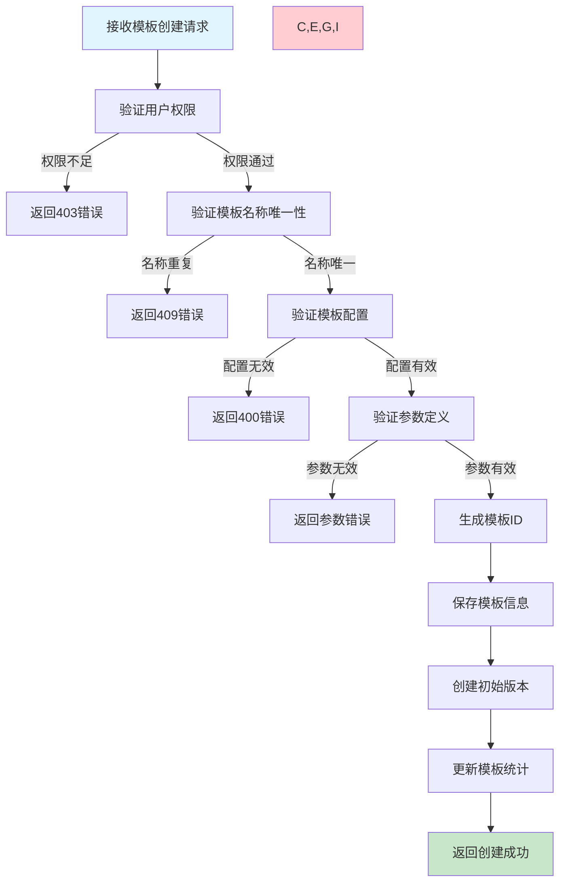
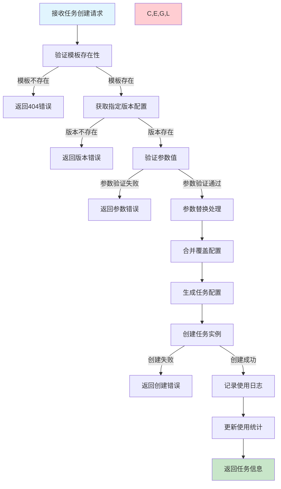
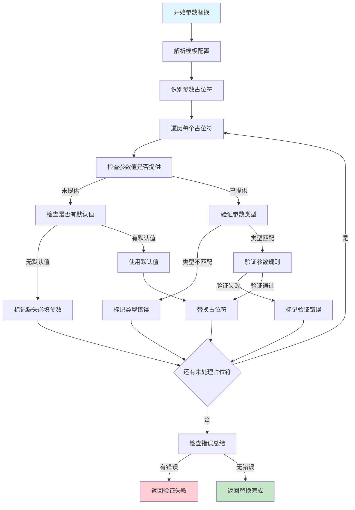

# 任务模板管理需求文档

## 1. 功能描述

### 1.1 功能概述
任务模板管理功能提供可重用的任务配置模板，支持模板创建、版本管理、参数化配置和快速任务生成，提高任务创建的效率和一致性。

### 1.2 主要功能列表
- 任务模板创建和编辑
- 模板参数化配置
- 模板版本管理
- 模板分类和标签管理
- 基于模板快速创建任务
- 模板共享和权限控制
- 模板使用统计和分析

### 1.3 模板类型
- **基础模板**：包含基本任务配置的模板
- **参数化模板**：支持动态参数替换的模板
- **组合模板**：包含多个子任务的复合模板
- **系统模板**：系统预定义的标准模板

## 2. 功能目标

### 2.1 业务目标
- 提高任务创建的效率
- 确保任务配置的一致性
- 支持最佳实践的标准化
- 降低任务配置的复杂度

### 2.2 技术目标
- 模板创建响应时间小于2秒
- 支持1万+模板的管理
- 基于模板创建任务小于3秒
- 模板系统可用性99.9%

### 2.3 安全目标
- 模板配置的权限控制
- 敏感参数的安全处理
- 模板使用的审计追踪
- 模板内容的完整性验证

## 3. 输入输出

### 3.1 输入参数

#### 3.1.1 模板创建参数
- `template_name` (string): 模板名称
- `template_type` (string): 模板类型，basic/parameterized/composite/system
- `description` (string): 模板描述
- `category` (string): 模板分类
- `tags` (array): 模板标签
- `template_config` (object): 模板配置

#### 3.1.2 参数化配置
- `parameters` (array): 参数列表
- `parameter_name` (string): 参数名称
- `parameter_type` (string): 参数类型
- `default_value` (any): 默认值
- `required` (boolean): 是否必填
- `validation_rules` (object): 验证规则

#### 3.1.3 任务创建参数
- `template_id` (string): 模板ID
- `template_version` (string): 模板版本
- `parameter_values` (object): 参数值映射
- `override_config` (object): 覆盖配置

### 3.2 输出参数

#### 3.2.1 模板创建响应
```json
{
  "code": 200,
  "message": "模板创建成功",
  "data": {
    "template_id": "tpl_20240116_001",
    "template_name": "数据同步任务模板",
    "template_type": "parameterized",
    "version": "1.0.0",
    "category": "data-processing",
    "tags": ["etl", "database"],
    "parameters": [
      {
        "name": "source_database",
        "type": "string",
        "required": true,
        "description": "源数据库连接字符串"
      },
      {
        "name": "batch_size",
        "type": "integer",
        "default_value": 1000,
        "required": false,
        "description": "批处理大小"
      }
    ],
    "created_at": "2024-01-16T20:30:00Z",
    "created_by": "user_123"
  }
}
```

#### 3.2.2 模板列表响应
```json
{
  "code": 200,
  "message": "查询成功",
  "data": {
    "templates": [
      {
        "template_id": "tpl_20240116_001",
        "template_name": "数据同步任务模板",
        "template_type": "parameterized",
        "current_version": "1.2.0",
        "category": "data-processing",
        "tags": ["etl", "database"],
        "usage_count": 45,
        "last_used": "2024-01-16T19:30:00Z",
        "created_at": "2024-01-16T20:30:00Z"
      }
    ],
    "pagination": {
      "total": 156,
      "page": 1,
      "page_size": 20,
      "has_more": true
    }
  }
}
```

## 4. 接口设计

### 4.1 API接口定义

#### 4.1.1 创建任务模板
```
POST /api/v1/templates
Content-Type: application/json
Authorization: Bearer {token}
```

**请求体示例：**
```json
{
  "template_name": "数据同步任务模板",
  "template_type": "parameterized",
  "description": "用于数据库间数据同步的标准模板",
  "category": "data-processing",
  "tags": ["etl", "database", "sync"],
  "template_config": {
    "task_type": "command",
    "command": "python sync_data.py --source={{source_database}} --target={{target_database}} --batch={{batch_size}}",
    "timeout": 3600,
    "retry_policy": {
      "max_retries": 3,
      "retry_delay": 60
    }
  },
  "parameters": [
    {
      "name": "source_database",
      "type": "string",
      "required": true,
      "description": "源数据库连接字符串",
      "validation_rules": {
        "pattern": "^(mysql|postgresql)://.*"
      }
    },
    {
      "name": "target_database",
      "type": "string",
      "required": true,
      "description": "目标数据库连接字符串"
    },
    {
      "name": "batch_size",
      "type": "integer",
      "default_value": 1000,
      "required": false,
      "description": "批处理大小",
      "validation_rules": {
        "min": 100,
        "max": 10000
      }
    }
  ]
}
```

#### 4.1.2 获取模板列表
```
GET /api/v1/templates?category=data-processing&tags=etl&page=1&page_size=20
```

#### 4.1.3 获取模板详情
```
GET /api/v1/templates/{template_id}?version=1.2.0
```

#### 4.1.4 更新模板
```
PUT /api/v1/templates/{template_id}
Content-Type: application/json
```

#### 4.1.5 基于模板创建任务
```
POST /api/v1/templates/{template_id}/create-task
Content-Type: application/json
```

**请求体示例：**
```json
{
  "task_name": "用户数据同步-20240116",
  "template_version": "1.2.0",
  "parameter_values": {
    "source_database": "mysql://source.db:3306/users",
    "target_database": "postgresql://target.db:5432/users",
    "batch_size": 2000
  },
  "override_config": {
    "schedule": {
      "cron_expression": "0 2 * * *"
    }
  }
}
```

### 4.2 内部服务接口
```go
type TaskTemplateService interface {
    CreateTemplate(ctx context.Context, req *CreateTemplateRequest) (*CreateTemplateResponse, error)
    UpdateTemplate(ctx context.Context, req *UpdateTemplateRequest) (*UpdateTemplateResponse, error)
    DeleteTemplate(ctx context.Context, templateID string) error
    GetTemplate(ctx context.Context, templateID string, version string) (*TemplateResponse, error)
    ListTemplates(ctx context.Context, req *ListTemplatesRequest) (*ListTemplatesResponse, error)
    CreateTaskFromTemplate(ctx context.Context, req *CreateTaskFromTemplateRequest) (*CreateTaskResponse, error)
    ValidateTemplate(ctx context.Context, req *ValidateTemplateRequest) (*ValidationResponse, error)
}
```

## 5. 数据结构

### 5.1 任务模板表（task_templates）
```sql
CREATE TABLE task_templates (
    id BIGINT AUTO_INCREMENT PRIMARY KEY COMMENT '主键ID',
    template_id VARCHAR(64) UNIQUE NOT NULL COMMENT '模板ID',
    template_name VARCHAR(255) NOT NULL COMMENT '模板名称',
    template_type ENUM('basic', 'parameterized', 'composite', 'system') NOT NULL COMMENT '模板类型',
    current_version VARCHAR(32) NOT NULL COMMENT '当前版本',
    description TEXT COMMENT '模板描述',
    category VARCHAR(64) COMMENT '模板分类',
    tags JSON COMMENT '模板标签',
    is_public BOOLEAN DEFAULT FALSE COMMENT '是否公开',
    usage_count INT DEFAULT 0 COMMENT '使用次数',
    created_by VARCHAR(64) NOT NULL COMMENT '创建人',
    created_at DATETIME DEFAULT CURRENT_TIMESTAMP COMMENT '创建时间',
    updated_at DATETIME DEFAULT CURRENT_TIMESTAMP ON UPDATE CURRENT_TIMESTAMP COMMENT '更新时间',
    INDEX idx_template_name (template_name),
    INDEX idx_template_type (template_type),
    INDEX idx_category (category),
    INDEX idx_created_by (created_by),
    INDEX idx_usage_count (usage_count)
) COMMENT='任务模板表';
```

### 5.2 模板版本表（template_versions）
```sql
CREATE TABLE template_versions (
    id BIGINT AUTO_INCREMENT PRIMARY KEY COMMENT '主键ID',
    version_id VARCHAR(64) UNIQUE NOT NULL COMMENT '版本ID',
    template_id VARCHAR(64) NOT NULL COMMENT '模板ID',
    version VARCHAR(32) NOT NULL COMMENT '版本号',
    template_config JSON NOT NULL COMMENT '模板配置',
    parameters JSON COMMENT '参数定义',
    changelog TEXT COMMENT '变更说明',
    is_active BOOLEAN DEFAULT TRUE COMMENT '是否激活',
    created_by VARCHAR(64) NOT NULL COMMENT '创建人',
    created_at DATETIME DEFAULT CURRENT_TIMESTAMP COMMENT '创建时间',
    INDEX idx_template_id (template_id),
    INDEX idx_version (version),
    INDEX idx_is_active (is_active),
    UNIQUE KEY uk_template_version (template_id, version)
) COMMENT='模板版本表';
```

### 5.3 模板使用记录表（template_usage_logs）
```sql
CREATE TABLE template_usage_logs (
    id BIGINT AUTO_INCREMENT PRIMARY KEY COMMENT '主键ID',
    usage_id VARCHAR(64) UNIQUE NOT NULL COMMENT '使用记录ID',
    template_id VARCHAR(64) NOT NULL COMMENT '模板ID',
    template_version VARCHAR(32) NOT NULL COMMENT '使用的版本',
    task_id VARCHAR(64) NOT NULL COMMENT '生成的任务ID',
    parameter_values JSON COMMENT '参数值',
    used_by VARCHAR(64) NOT NULL COMMENT '使用人',
    used_at DATETIME DEFAULT CURRENT_TIMESTAMP COMMENT '使用时间',
    INDEX idx_template_id (template_id),
    INDEX idx_task_id (task_id),
    INDEX idx_used_by (used_by),
    INDEX idx_used_at (used_at)
) COMMENT='模板使用记录表';
```

### 5.4 Go数据结构
```go
type CreateTemplateRequest struct {
    TemplateName   string                 `json:"template_name" v:"required|length:1,255"`
    TemplateType   string                 `json:"template_type" v:"required|in:basic,parameterized,composite,system"`
    Description    string                 `json:"description" v:"length:0,1000"`
    Category       string                 `json:"category" v:"length:0,64"`
    Tags           []string               `json:"tags"`
    TemplateConfig map[string]interface{} `json:"template_config" v:"required"`
    Parameters     []TemplateParameter    `json:"parameters"`
    IsPublic       bool                   `json:"is_public"`
}

type TemplateParameter struct {
    Name            string                 `json:"name" v:"required"`
    Type            string                 `json:"type" v:"required|in:string,integer,float,boolean,array,object"`
    DefaultValue    interface{}            `json:"default_value,omitempty"`
    Required        bool                   `json:"required"`
    Description     string                 `json:"description"`
    ValidationRules map[string]interface{} `json:"validation_rules,omitempty"`
}

type UpdateTemplateRequest struct {
    TemplateID     string                 `json:"template_id" v:"required"`
    TemplateName   string                 `json:"template_name,omitempty"`
    Description    string                 `json:"description,omitempty"`
    Category       string                 `json:"category,omitempty"`
    Tags           []string               `json:"tags,omitempty"`
    TemplateConfig map[string]interface{} `json:"template_config,omitempty"`
    Parameters     []TemplateParameter    `json:"parameters,omitempty"`
    Changelog      string                 `json:"changelog"`
    BumpVersion    string                 `json:"bump_version" v:"in:major,minor,patch"`
}

type CreateTaskFromTemplateRequest struct {
    TemplateID       string                 `json:"template_id" v:"required"`
    TemplateVersion  string                 `json:"template_version"`
    TaskName         string                 `json:"task_name" v:"required"`
    ParameterValues  map[string]interface{} `json:"parameter_values"`
    OverrideConfig   map[string]interface{} `json:"override_config"`
}

type TemplateResponse struct {
    TemplateID      string                 `json:"template_id"`
    TemplateName    string                 `json:"template_name"`
    TemplateType    string                 `json:"template_type"`
    CurrentVersion  string                 `json:"current_version"`
    Description     string                 `json:"description"`
    Category        string                 `json:"category"`
    Tags            []string               `json:"tags"`
    TemplateConfig  map[string]interface{} `json:"template_config"`
    Parameters      []TemplateParameter    `json:"parameters"`
    IsPublic        bool                   `json:"is_public"`
    UsageCount      int                    `json:"usage_count"`
    CreatedBy       string                 `json:"created_by"`
    CreatedAt       string                 `json:"created_at"`
    UpdatedAt       string                 `json:"updated_at"`
}

type ListTemplatesRequest struct {
    Category     string   `json:"category"`
    Tags         []string `json:"tags"`
    TemplateType string   `json:"template_type"`
    IsPublic     *bool    `json:"is_public"`
    CreatedBy    string   `json:"created_by"`
    Keyword      string   `json:"keyword"`
    Page         int      `json:"page" v:"min:1"`
    PageSize     int      `json:"page_size" v:"min:1,max:100"`
    SortBy       string   `json:"sort_by" v:"in:name,created_at,updated_at,usage_count"`
    SortOrder    string   `json:"sort_order" v:"in:asc,desc"`
}
```

## 6. 异常处理

### 6.1 模板配置异常
- **配置格式错误**：模板配置JSON格式错误
- **参数定义冲突**：参数名称重复或定义冲突
- **循环依赖**：组合模板中存在循环引用
- **配置验证失败**：模板配置不符合规范

### 6.2 参数验证异常
- **必填参数缺失**：创建任务时缺少必填参数
- **参数类型错误**：参数值类型不匹配
- **参数值超出范围**：参数值不符合验证规则
- **参数引用错误**：模板中参数引用不存在

### 6.3 版本管理异常
- **版本冲突**：同时修改导致版本冲突
- **版本不存在**：引用的模板版本不存在
- **版本格式错误**：版本号格式不正确
- **版本回退失败**：版本回退操作失败

## 7. 流程图

### 7.1 模板创建流程



### 7.2 基于模板创建任务流程



### 7.3 模板参数替换流程



## 8. 安全性考虑

### 8.1 权限控制
- **模板创建权限**：控制谁可以创建和编辑模板
- **模板使用权限**：控制谁可以使用特定模板
- **公开模板管理**：管理公开模板的访问权限
- **敏感模板保护**：对包含敏感信息的模板加强保护

### 8.2 参数安全
- **敏感参数处理**：对敏感参数进行加密存储
- **参数注入防护**：防止通过参数进行代码注入
- **参数验证**：严格验证参数值的安全性
- **参数审计**：记录敏感参数的使用情况

### 8.3 配置安全
- **配置验证**：验证模板配置的安全性
- **恶意配置检测**：检测可能的恶意配置
- **配置隔离**：确保不同用户的模板配置隔离
- **版本完整性**：确保模板版本的完整性

## 9. 日志与监控

### 9.1 模板操作日志
- **模板创建日志**：记录模板创建的详细信息
- **模板使用日志**：记录模板使用的情况
- **版本变更日志**：记录模板版本的变更历史
- **权限操作日志**：记录权限相关的操作

### 9.2 使用统计监控
- **使用频率统计**：统计模板的使用频率
- **热门模板分析**：分析最受欢迎的模板
- **使用趋势监控**：监控模板使用的趋势变化
- **错误率监控**：监控基于模板创建任务的错误率

### 9.3 性能监控
- **创建性能**：监控模板创建的性能
- **查询性能**：监控模板查询的性能
- **参数替换性能**：监控参数替换的性能
- **存储使用率**：监控模板存储的使用情况

### 9.4 日志格式
```json
{
  "timestamp": "2024-01-16T20:30:00Z",
  "level": "INFO",
  "service": "task-template",
  "operation": "create_task_from_template",
  "template_id": "tpl_20240116_001",
  "template_version": "1.2.0",
  "task_id": "task_20240116_100",
  "user_id": "user_123",
  "parameter_count": 3,
  "processing_time_ms": 150,
  "result": "success"
}
```

## 10. 测试用例

### 10.1 功能测试用例

#### 10.1.1 模板创建测试
**测试目标：** 验证模板创建功能的完整性

**测试用例：**
- 创建基础模板
- 创建参数化模板
- 创建组合模板
- 验证模板配置验证功能

**预期结果：** 所有类型模板正确创建，配置验证有效

#### 10.1.2 参数替换测试
**测试目标：** 验证参数替换功能的准确性

**测试场景：**
- 简单字符串参数替换
- 复杂对象参数替换
- 带默认值的参数处理
- 参数验证规则测试

**预期结果：** 参数替换准确，验证规则生效

#### 10.1.3 模板版本管理测试
**测试目标：** 验证模板版本管理功能

**测试场景：**
- 创建新版本
- 版本回退
- 版本比较
- 版本删除

**预期结果：** 版本管理功能正常，版本历史完整

#### 10.1.4 基于模板创建任务测试
**测试目标：** 验证基于模板创建任务的功能

**测试场景：** 使用不同模板创建各种类型任务
**预期结果：** 任务创建成功，配置正确应用

### 10.2 性能测试用例

#### 10.2.1 大量模板管理测试
**测试目标：** 验证大量模板的管理性能

**测试场景：** 创建和管理10000个模板
**预期结果：** 系统性能稳定，响应时间合理

#### 10.2.2 复杂参数替换性能测试
**测试目标：** 验证复杂参数替换的性能

**测试场景：** 处理包含100个参数的复杂模板
**预期结果：** 参数替换时间小于1秒

#### 10.2.3 并发使用测试
**测试目标：** 验证模板并发使用的性能

**测试场景：** 100个用户同时使用模板创建任务
**预期结果：** 所有操作正常完成，无性能降级

### 10.3 异常测试用例

#### 10.3.1 参数验证异常测试
**测试目标：** 验证参数验证的异常处理

**测试场景：**
- 缺少必填参数
- 参数类型错误
- 参数值超出范围

**预期结果：** 正确识别参数错误并返回详细信息

#### 10.3.2 版本冲突测试
**测试目标：** 验证版本冲突的处理

**测试场景：** 同时修改同一模板版本
**预期结果：** 系统正确处理冲突，保持数据一致性

#### 10.3.3 模板损坏测试
**测试目标：** 验证模板数据损坏的处理

**测试场景：** 模拟模板配置数据损坏
**预期结果：** 系统检测到损坏并提供恢复选项 