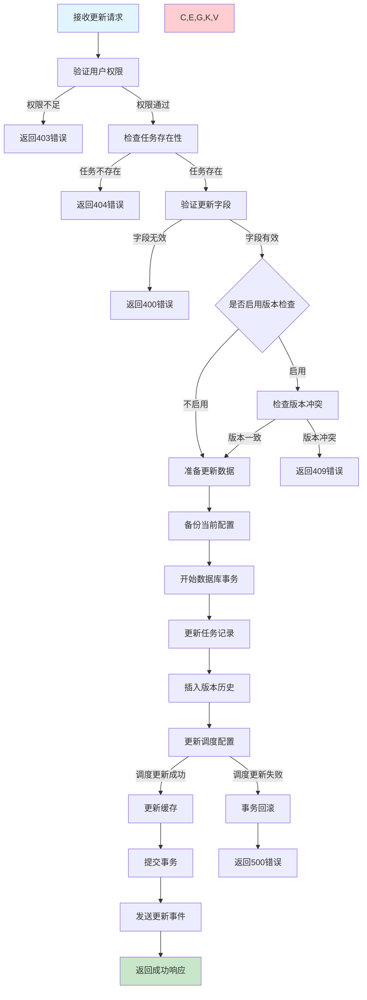
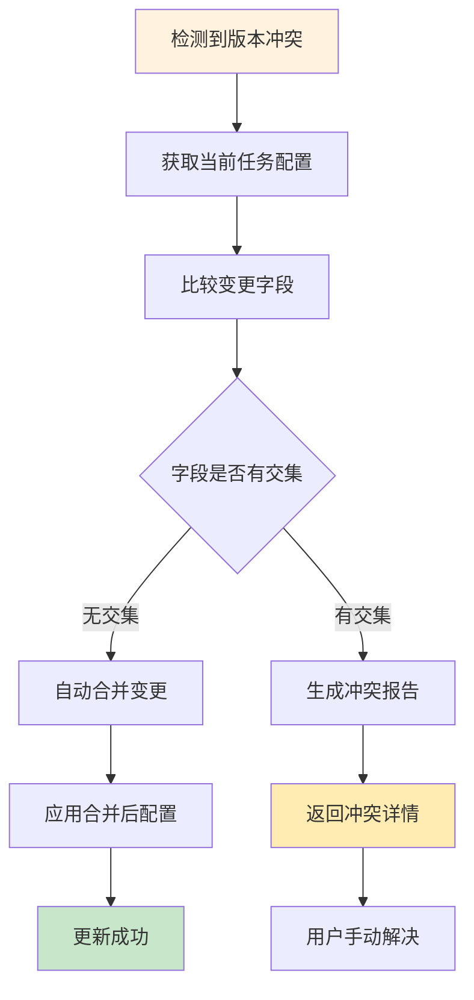

# 任务更新需求文档

## 1. 功能描述

### 1.1 功能概述
任务更新功能用于修改已存在任务的配置信息、调度策略、执行参数等属性。支持部分字段更新和批量更新，确保任务配置的灵活性和可维护性。

### 1.2 主要功能列表
- 修改任务基本信息（名称、描述、标签）
- 更新任务配置参数
- 调整调度策略和时间
- 修改优先级和超时设置
- 更新依赖关系
- 批量更新多个任务

### 1.3 更新策略
- **热更新**：不影响正在执行的任务实例
- **预览更新**：更新前显示变更内容
- **版本控制**：保留任务配置历史版本
- **权限控制**：基于角色的更新权限

## 2. 功能目标

### 2.1 业务目标
- 支持任务配置的动态调整需求
- 提供安全可靠的更新机制
- 确保更新操作的可追溯性
- 支持批量操作提升效率

### 2.2 技术目标
- 更新操作响应时间小于2秒
- 支持并发更新操作
- 配置变更的原子性保证
- 向后兼容性维护

### 2.3 安全目标
- 严格的更新权限验证
- 敏感配置变更审计
- 误操作防护机制
- 配置回滚能力

## 3. 输入输出

### 3.1 输入参数

#### 3.1.1 必需参数
- `task_id` (string): 任务ID
- `update_fields` (object): 要更新的字段和值

#### 3.1.2 可选参数
- `version_check` (boolean): 是否进行版本冲突检查，默认true
- `apply_to_running` (boolean): 是否应用到运行中的实例，默认false
- `backup_before_update` (boolean): 更新前是否备份，默认true

### 3.2 输出参数

#### 3.2.1 成功响应
```json
{
  "code": 200,
  "message": "任务更新成功",
  "data": {
    "task_id": "task_20240116_001",
    "updated_fields": ["priority", "timeout", "description"],
    "version": 3,
    "next_run_time": "2024-01-17T02:00:00Z",
    "updated_at": "2024-01-16T15:30:00Z"
  }
}
```

#### 3.2.2 版本冲突响应
```json
{
  "code": 409,
  "message": "任务版本冲突",
  "data": {
    "current_version": 3,
    "request_version": 2,
    "conflict_fields": ["schedule_config"]
  }
}
```

## 4. 接口设计

### 4.1 API接口定义

#### 4.1.1 更新任务
```
PUT /api/v1/task/{task_id}
Content-Type: application/json
Authorization: Bearer {token}
```

**请求体示例：**
```json
{
  "update_fields": {
    "description": "更新后的任务描述",
    "priority": 8,
    "timeout": 1800,
    "schedule_config": {
      "cron_expression": "0 3 * * *"
    },
    "tags": ["data", "sync", "nightly"]
  },
  "version_check": true,
  "current_version": 2
}
```

#### 4.1.2 批量更新任务
```
PUT /api/v1/task/batch
Content-Type: application/json
```

#### 4.1.3 获取任务更新历史
```
GET /api/v1/task/{task_id}/versions
```

### 4.2 内部服务接口
```go
type TaskUpdateService interface {
    UpdateTask(ctx context.Context, req *UpdateTaskRequest) (*UpdateTaskResponse, error)
    BatchUpdateTasks(ctx context.Context, req *BatchUpdateRequest) (*BatchUpdateResponse, error)
    ValidateUpdateFields(ctx context.Context, taskID string, fields map[string]interface{}) error
}
```

## 5. 数据结构

### 5.1 任务版本历史表（task_versions）
```sql
CREATE TABLE task_versions (
    version_id VARCHAR(64) PRIMARY KEY COMMENT '版本ID',
    task_id VARCHAR(64) NOT NULL COMMENT '任务ID',
    version_number INT NOT NULL COMMENT '版本号',
    config_snapshot JSON NOT NULL COMMENT '配置快照',
    change_summary JSON COMMENT '变更摘要',
    changed_by VARCHAR(64) NOT NULL COMMENT '变更人',
    change_reason VARCHAR(500) COMMENT '变更原因',
    created_at DATETIME DEFAULT CURRENT_TIMESTAMP COMMENT '创建时间',
    INDEX idx_task_id (task_id),
    INDEX idx_version_number (version_number),
    UNIQUE KEY uk_task_version (task_id, version_number)
) COMMENT='任务版本历史表';
```

### 5.2 Go数据结构
```go
type UpdateTaskRequest struct {
    TaskID          string                 `json:"task_id" v:"required"`
    UpdateFields    map[string]interface{} `json:"update_fields" v:"required"`
    VersionCheck    bool                   `json:"version_check"`
    CurrentVersion  int                    `json:"current_version"`
    ChangeReason    string                 `json:"change_reason" v:"length:0,500"`
    ApplyToRunning  bool                   `json:"apply_to_running"`
}

type UpdateTaskResponse struct {
    TaskID        string   `json:"task_id"`
    UpdatedFields []string `json:"updated_fields"`
    Version       int      `json:"version"`
    NextRunTime   string   `json:"next_run_time,omitempty"`
    UpdatedAt     string   `json:"updated_at"`
}
```

## 6. 异常处理

### 6.1 参数验证异常
- **任务不存在**：指定的任务ID无效
- **字段无效**：尝试更新不允许的字段
- **数据格式错误**：更新值的格式不正确
- **版本冲突**：任务已被其他用户修改

### 6.2 业务逻辑异常
- **权限不足**：用户无任务更新权限
- **任务状态异常**：任务处于不可更新状态
- **依赖冲突**：依赖关系更新导致循环依赖
- **调度冲突**：新的调度配置与现有调度冲突

### 6.3 系统异常
- **数据库异常**：更新操作失败
- **调度器异常**：调度配置更新失败
- **缓存异常**：缓存更新失败

## 7. 流程图

### 7.1 任务更新主流程



### 7.2 版本冲突处理流程



## 8. 安全性考虑

### 8.1 权限控制
- **细粒度权限**：不同字段需要不同级别的更新权限
- **任务所有权**：只能更新自己创建或被授权的任务
- **敏感字段保护**：关键配置字段需要特殊权限

### 8.2 数据安全
- **配置验证**：严格验证更新数据的合法性
- **敏感信息处理**：对密码等敏感信息进行加密处理
- **SQL注入防护**：防止通过更新参数进行SQL注入

### 8.3 操作审计
- **变更记录**：完整记录所有更新操作
- **版本追踪**：保留配置变更的完整历史
- **回滚支持**：支持快速回滚到之前版本

## 9. 日志与监控

### 9.1 操作日志
- **更新日志**：记录任务更新的详细信息
- **版本日志**：记录版本变更和冲突处理
- **错误日志**：记录更新失败的原因

### 9.2 业务监控
- **更新频率**：监控任务更新的频率和模式
- **字段统计**：统计最常更新的字段类型
- **成功率监控**：监控更新操作的成功率

### 9.3 告警规则
- **频繁更新告警**：单个任务短时间内多次更新
- **批量更新失败**：批量更新操作失败率过高
- **权限异常**：异常的权限访问尝试

### 9.4 日志格式
```json
{
  "timestamp": "2024-01-16T15:30:00Z",
  "level": "INFO",
  "service": "task-update",
  "operation": "update_task",
  "task_id": "task_20240116_001",
  "updated_fields": ["priority", "timeout"],
  "old_version": 2,
  "new_version": 3,
  "user_id": "user_123",
  "change_reason": "优化执行时间",
  "duration_ms": 180,
  "result": "success"
}
```

## 10. 测试用例

### 10.1 功能测试用例

#### 10.1.1 正常更新测试
**测试目标：** 验证各种字段的正常更新功能

**测试用例：**
- 更新任务描述和标签
- 修改调度时间和优先级
- 更新超时时间和重试次数
- 修改任务配置参数

**测试数据：**
```json
{
  "update_fields": {
    "description": "新的任务描述",
    "priority": 9,
    "timeout": 2400,
    "schedule_config": {
      "cron_expression": "0 4 * * *"
    }
  }
}
```

**预期结果：** 更新成功，返回新的版本号和更新时间

#### 10.1.2 版本冲突测试
**测试目标：** 验证版本冲突检测和处理

**测试步骤：**
1. 用户A获取任务配置（版本2）
2. 用户B更新任务配置（版本变为3）
3. 用户A基于版本2提交更新

**预期结果：** 返回409版本冲突错误，包含冲突详情

#### 10.1.3 权限控制测试
**测试目标：** 验证更新权限控制

**测试场景：**
- 无权限用户尝试更新任务
- 普通用户尝试更新敏感字段
- 跨租户任务更新尝试

**预期结果：** 返回403权限不足错误

#### 10.1.4 批量更新测试
**测试目标：** 验证批量更新功能

**测试场景：** 同时更新10个任务的优先级
**预期结果：** 所有任务更新成功，操作具有原子性

### 10.2 性能测试用例

#### 10.2.1 并发更新测试
**测试目标：** 验证并发更新的性能和稳定性

**测试场景：** 50个用户同时更新不同任务
**预期结果：** 所有更新在3秒内完成，无数据不一致

#### 10.2.2 大字段更新测试
**测试目标：** 验证大配置文件的更新性能

**测试场景：** 更新包含大量配置项的任务
**预期结果：** 更新时间不超过5秒

### 10.3 安全测试用例

#### 10.3.1 恶意数据注入测试
**测试目标：** 验证恶意数据防护

**测试数据：** 在更新字段中包含SQL注入代码
**预期结果：** 系统正确过滤恶意代码

#### 10.3.2 越权更新测试
**测试目标：** 验证越权访问防护

**测试场景：** 用户尝试更新其他用户的任务
**预期结果：** 返回403权限不足错误

### 10.4 异常测试用例

#### 10.4.1 数据库异常测试
**测试目标：** 验证数据库异常时的处理

**测试场景：** 模拟数据库连接失败
**预期结果：** 返回500错误，不影响其他操作

#### 10.4.2 调度器异常测试
**测试目标：** 验证调度器更新失败的处理

**测试场景：** 调度服务不可用时更新调度配置
**预期结果：** 更新操作回滚，保持数据一致性

#### 10.4.3 版本历史异常测试
**测试目标：** 验证版本历史记录失败的处理

**测试场景：** 版本历史表空间不足
**预期结果：** 主更新成功，版本历史记录失败不影响主操作 