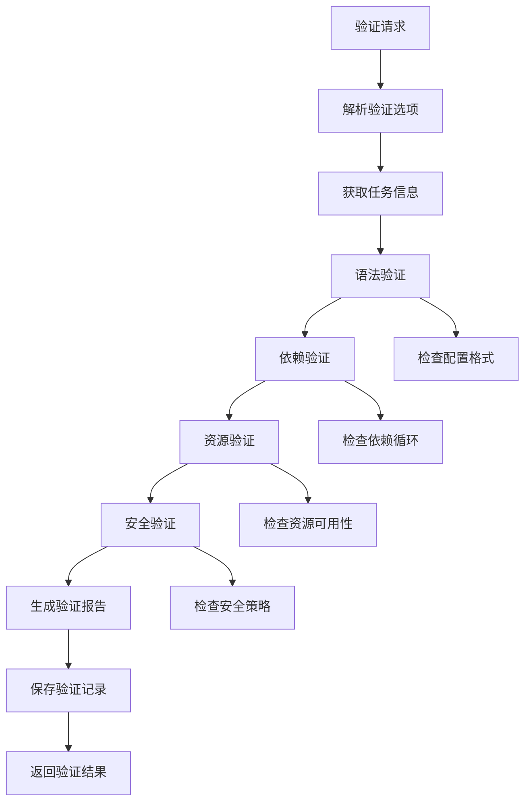

# 任务验证功能需求文档

## 1. 功能描述

任务验证功能提供全面的任务配置检查和验证服务，确保任务在执行前配置正确、依赖关系有效、资源可用。该功能通过多层次的验证机制，包括语法验证、逻辑验证、资源验证和安全验证，提高任务执行的成功率和系统稳定性。

### 核心功能
- **配置验证**：检查任务配置的语法和逻辑正确性
- **依赖验证**：验证任务依赖关系的有效性和一致性
- **资源验证**：检查所需资源的可用性和权限
- **安全验证**：验证任务配置的安全性和合规性
- **批量验证**：支持多个任务的批量验证操作

## 2. 功能目标

### 2.1 性能目标
- **响应时间**：单个任务验证 ≤ 3秒
- **批量验证**：100个任务批量验证 ≤ 60秒
- **并发处理**：支持30个并发验证操作
- **准确率**：验证结果准确率 ≥ 99.8%

### 2.2 功能目标
- **覆盖率**：验证规则覆盖所有任务类型和配置项
- **检测率**：配置错误检测率 ≥ 95%
- **误报率**：验证误报率 ≤ 2%
- **修复建议**：80%的验证错误提供修复建议

## 3. 输入输出

### 3.1 输入参数

#### 单个任务验证
```json
{
  "task_id": "12345",
  "validation_options": {
    "check_syntax": true,
    "check_dependencies": true,
    "check_resources": true,
    "check_security": true,
    "check_performance": false
  }
}
```

#### 批量任务验证
```json
{
  "task_ids": ["12345", "12346", "12347"],
  "validation_options": {
    "check_syntax": true,
    "check_dependencies": true,
    "parallel_execution": true,
    "stop_on_first_error": false
  }
}
```

### 3.2 输出结果

#### 成功响应
```json
{
  "status": "success",
  "data": {
    "task_id": "12345",
    "validation_result": {
      "overall_status": "valid|warning|error",
      "score": 85,
      "checks": [
        {
          "category": "syntax",
          "status": "passed",
          "message": "配置语法正确"
        },
        {
          "category": "dependencies",
          "status": "warning",
          "message": "存在潜在的循环依赖风险",
          "suggestion": "建议重新设计依赖关系"
        }
      ]
    }
  }
}
```

## 4. 接口设计

### 4.1 RESTful API接口

#### 4.1.1 单个任务验证
```http
POST /api/v1/tasks/{id}/validate
Content-Type: application/json
Authorization: Bearer {token}
```

#### 4.1.2 批量任务验证
```http
POST /api/v1/tasks/batch-validate
Content-Type: application/json
Authorization: Bearer {token}
```

#### 4.1.3 获取验证规则
```http
GET /api/v1/tasks/validation-rules
Authorization: Bearer {token}
```

#### 4.1.4 验证历史查询
```http
GET /api/v1/tasks/{id}/validation-history
Authorization: Bearer {token}
```

## 5. 数据结构

### 5.1 数据库表设计

#### task_validation_records表
```sql
CREATE TABLE task_validation_records (
    id BIGINT PRIMARY KEY AUTO_INCREMENT,
    task_id BIGINT NOT NULL,
    validation_type ENUM('manual', 'auto', 'scheduled') DEFAULT 'manual',
    validation_result JSON NOT NULL,
    overall_status ENUM('valid', 'warning', 'error') NOT NULL,
    score INT NOT NULL DEFAULT 0,
    validated_by BIGINT NOT NULL,
    validated_at TIMESTAMP DEFAULT CURRENT_TIMESTAMP,
    
    INDEX idx_task_id (task_id),
    INDEX idx_overall_status (overall_status),
    INDEX idx_validated_at (validated_at),
    FOREIGN KEY (task_id) REFERENCES tasks(id) ON DELETE CASCADE
);
```

#### validation_rules表
```sql
CREATE TABLE validation_rules (
    id BIGINT PRIMARY KEY AUTO_INCREMENT,
    rule_name VARCHAR(100) NOT NULL,
    rule_category ENUM('syntax', 'logic', 'resource', 'security', 'performance'),
    rule_config JSON NOT NULL,
    is_active BOOLEAN DEFAULT TRUE,
    severity ENUM('error', 'warning', 'info') DEFAULT 'error',
    created_at TIMESTAMP DEFAULT CURRENT_TIMESTAMP,
    
    UNIQUE KEY uk_rule_name (rule_name),
    INDEX idx_category (rule_category),
    INDEX idx_is_active (is_active)
);
```

### 5.2 Go语言数据结构

```go
type ValidationOptions struct {
    CheckSyntax       bool `json:"check_syntax"`
    CheckDependencies bool `json:"check_dependencies"`
    CheckResources    bool `json:"check_resources"`
    CheckSecurity     bool `json:"check_security"`
    CheckPerformance  bool `json:"check_performance"`
}

type ValidationResult struct {
    TaskID         int64            `json:"task_id"`
    OverallStatus  ValidationStatus `json:"overall_status"`
    Score          int              `json:"score"`
    Checks         []ValidationCheck `json:"checks"`
    ValidatedAt    time.Time        `json:"validated_at"`
}

type ValidationCheck struct {
    Category    string `json:"category"`
    RuleName    string `json:"rule_name"`
    Status      string `json:"status"`
    Message     string `json:"message"`
    Suggestion  string `json:"suggestion,omitempty"`
    Severity    string `json:"severity"`
}
```

## 6. 异常处理

### 6.1 异常类型定义
```go
const (
    ErrTaskNotFound       = "TASK_NOT_FOUND"
    ErrValidationFailed   = "VALIDATION_FAILED"
    ErrInvalidRule        = "INVALID_RULE"
    ErrPermissionDenied   = "PERMISSION_DENIED"
    ErrResourceTimeout    = "RESOURCE_TIMEOUT"
)
```

### 6.2 验证错误分类
- **语法错误**：配置格式错误、参数类型错误
- **逻辑错误**：业务逻辑不一致、配置冲突
- **资源错误**：资源不存在、权限不足
- **安全错误**：安全策略违规、敏感信息泄露

## 7. 流程图



## 8. 安全性考虑

### 8.1 访问控制
- 验证用户对任务的访问权限
- 限制验证操作的频率和范围
- 敏感配置的访问权限检查

### 8.2 数据保护
- 验证过程中保护敏感信息
- 验证日志的安全存储
- 防止通过验证接口泄露系统信息

### 8.3 验证规则安全
- 验证规则的权限控制
- 防止恶意验证规则注入
- 验证规则的版本管理

## 9. 日志与监控

### 9.1 日志规范
```go
s.logger.Info("任务验证完成",
    zap.Int64("task_id", taskID),
    zap.String("status", result.OverallStatus),
    zap.Int("score", result.Score),
    zap.Duration("duration", duration))
```

### 9.2 监控指标
- 验证操作响应时间
- 验证通过率统计
- 各类验证错误统计
- 验证规则执行效率

### 9.3 告警配置
- 验证失败率过高告警
- 验证响应时间异常告警
- 验证规则执行异常告警

## 10. 测试用例

### 10.1 功能测试
- 各类验证规则测试
- 批量验证功能测试
- 验证历史记录测试
- 验证报告生成测试

### 10.2 性能测试
- 单个验证响应时间测试
- 批量验证性能测试
- 并发验证压力测试

### 10.3 异常测试
- 无效任务ID处理
- 验证规则异常处理
- 网络超时处理

### 10.4 集成测试
- 与任务管理模块集成
- 与权限管理模块集成
- 验证结果持久化测试 