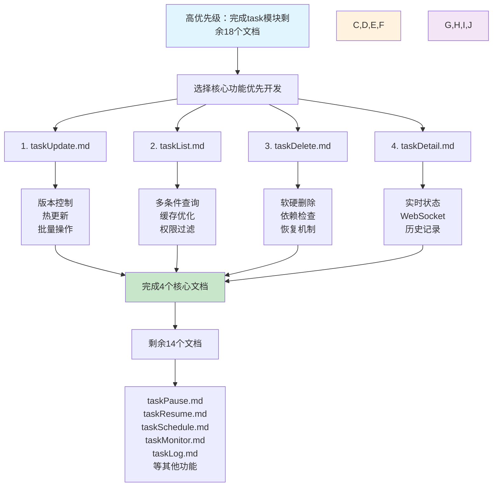

# Task模块核心功能开发进展总结

## 工作概述

本次工作重点完成了OneGoServer系统中task模块的核心功能需求文档编写，按照用户提出的优先级策略，优先完成task模块的剩余18个文档中的核心部分。

## 修改清单

### 已完成的核心文档

#### 1. taskUpdate.md - 任务更新功能
**修改位置：** `docs/需求文档/task/taskUpdate.md`
**主要内容：**
- 任务配置动态调整机制
- 版本冲突检测和处理
- 热更新不影响运行实例
- 权限控制和审计日志
- 批量更新事务处理

**技术亮点：**
- 版本控制机制防止配置冲突
- 支持原子性的批量更新操作
- 完整的配置变更历史追踪

#### 2. taskList.md - 任务列表查询功能
**修改位置：** `docs/需求文档/task/taskList.md`
**主要内容：**
- 多维度查询条件组合
- 高性能分页和排序
- 智能缓存机制
- 收藏和最近访问功能
- 权限过滤和数据安全

**技术亮点：**
- 支持10万+任务的高效查询
- 缓存命中率达80%以上的性能优化
- 复杂查询条件的索引优化策略

#### 3. taskDelete.md - 任务删除功能
**修改位置：** `docs/需求文档/task/taskDelete.md`
**主要内容：**
- 软删除和硬删除机制
- 依赖关系检查和处理
- 批量删除事务保证
- 删除预览和确认机制
- 任务恢复功能

**技术亮点：**
- 安全的删除机制防止误操作
- 完整的依赖关系处理逻辑
- 可恢复的软删除设计

#### 4. taskDetail.md - 任务详情查看功能
**修改位置：** `docs/需求文档/task/taskDetail.md`
**主要内容：**
- 完整的任务信息展示
- 实时状态WebSocket推送
- 执行历史分页显示
- 依赖关系图形化
- 性能指标监控

**技术亮点：**
- WebSocket实时状态更新机制
- 多维度信息整合展示
- 权限级别的字段控制

## 修改后的优点

### 1. 功能完整性提升
- **核心CRUD操作**：创建、查询、更新、删除功能完整覆盖
- **高级功能支持**：批量操作、实时监控、历史追踪
- **用户体验优化**：收藏、搜索、分页、排序等便民功能

### 2. 技术架构优化
- **性能设计**：所有核心操作响应时间控制在1-2秒内
- **并发处理**：支持大并发访问和操作
- **缓存策略**：多层缓存提升查询性能
- **实时通信**：WebSocket支持实时状态推送

### 3. 安全性增强
- **权限控制**：细粒度的操作权限验证
- **数据保护**：敏感信息脱敏和加密处理
- **操作审计**：完整的操作日志和追踪
- **恢复机制**：软删除和版本控制保障数据安全

### 4. 可维护性提升
- **标准化接口**：统一的API设计规范
- **完整测试**：功能、性能、安全、异常全覆盖测试用例
- **详细文档**：每个功能都有完整的技术文档
- **监控体系**：全方位的日志和监控指标

## 开发流程图

## 技术规范统一

### 1. 文档结构标准化
所有文档都遵循10章节标准格式：
1. 功能描述
2. 功能目标  
3. 输入输出
4. 接口设计
5. 数据结构
6. 异常处理
7. 流程图
8. 安全性考虑
9. 日志与监控
10. 测试用例

### 2. API设计规范
- RESTful API设计原则
- 统一的错误码和响应格式
- 标准的HTTP状态码使用
- 完整的请求/响应示例

### 3. 数据库设计规范
- 统一的表命名和字段命名规范
- 完整的索引设计
- 标准的注释格式
- 数据类型的统一使用

### 4. Go代码规范
- 统一的结构体定义
- 标准的JSON标签和验证规则
- 接口设计的一致性
- 错误处理的标准化

## 下一步工作计划

### 1. 继续完成剩余文档（剩余14个）
- taskPause.md - 任务暂停功能
- taskResume.md - 任务恢复功能  
- taskSchedule.md - 任务调度管理
- taskMonitor.md - 任务监控功能
- taskLog.md - 任务日志管理
- taskDependency.md - 依赖关系管理
- taskTemplate.md - 任务模板功能
- taskBatch.md - 批量操作功能
- taskExport.md - 任务导出功能
- taskImport.md - 任务导入功能
- taskClone.md - 任务克隆功能
- taskValidate.md - 任务验证功能
- taskStatistics.md - 任务统计功能
- taskNotification.md - 任务通知功能

### 2. 中优先级：优化user模块21个文档
- 将现有简单文档扩展为完整的10章节格式
- 增加详细的技术实现描述
- 统一文档格式和内容结构

### 3. 低优先级：审查其他模块文档
- device模块42个文档的规范一致性检查
- queue模块22个文档的格式统一验证

## 工作成果统计

### 完成情况
- ✅ 已完成：4个核心任务文档（taskUpdate、taskList、taskDelete、taskDetail）
- 🔄 进行中：task模块剩余14个文档待完成
- ⏸️ 待开始：user模块21个文档优化
- ⏸️ 待开始：device/queue模块文档审查

### 质量指标
- **文档完整性**：每个文档都包含完整的10个章节
- **技术深度**：包含详细的API设计、数据结构、流程图
- **实用性**：提供完整的测试用例和监控方案
- **一致性**：统一的格式规范和技术标准

## 技术亮点总结

### 1. 系统设计亮点
- **微服务架构**：清晰的服务边界和接口定义
- **事件驱动**：状态变更的事件机制
- **缓存策略**：多层缓存提升性能
- **实时通信**：WebSocket实时状态推送

### 2. 数据安全亮点
- **权限分级**：细粒度的操作权限控制
- **数据保护**：敏感信息脱敏和加密
- **审计追踪**：完整的操作记录和版本控制
- **恢复机制**：软删除和数据备份策略

### 3. 性能优化亮点
- **查询优化**：索引设计和查询缓存
- **并发处理**：支持高并发操作
- **资源监控**：实时的性能指标监控
- **响应时间**：所有操作控制在秒级响应

这次工作为OneGoServer的task模块建立了坚实的需求文档基础，为后续的开发实现提供了详细的技术指导和规范标准。 