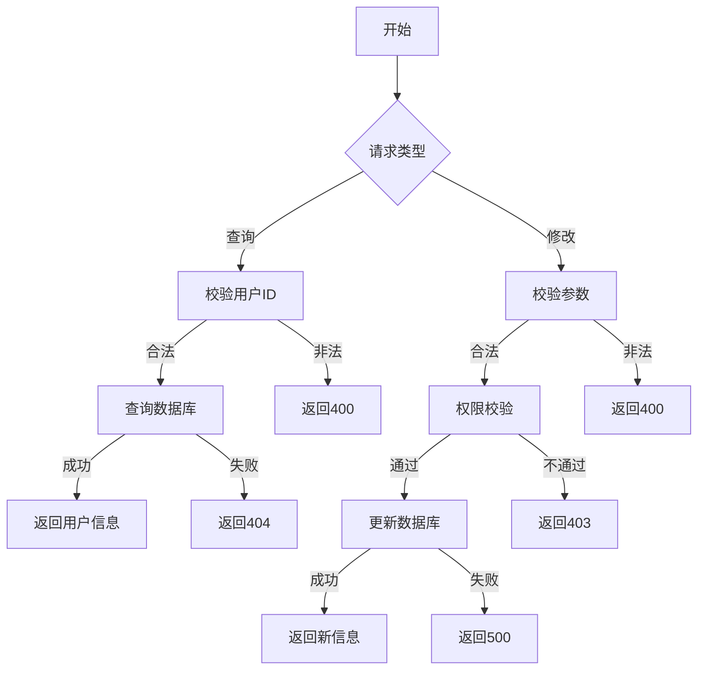

# 用户基础信息管理需求文档

## 1. 功能描述
用户基础信息管理用于对系统中的用户基本资料进行增、查、改操作，包括用户名、手机号、邮箱、头像、状态等。

## 2. 目标
- 支持用户基础信息的查询、修改。
- 保证数据一致性和安全性。
- 提供完善的接口和数据结构定义。

## 3. 输入输出
### 输入
- 用户ID
- 基础信息字段（用户名、手机号、邮箱、头像、状态等）

### 输出
- 操作结果（成功/失败）
- 用户基础信息详情

## 4. API/接口设计
| 接口 | 方法 | 路径 | 描述 |
| ---- | ---- | ---- | ---- |
| 查询用户基础信息 | GET | /api/user/v1/basic/{userId} | 获取指定用户基础信息 |
| 修改用户基础信息 | PUT | /api/user/v1/basic/{userId} | 修改指定用户基础信息 |

#### 请求示例
- GET /api/user/v1/basic/123
- PUT /api/user/v1/basic/123
  ```json
  {
    "username": "newname",
    "email": "new@email.com",
    "phone": "12345678901",
    "avatar": "url",
    "status": 1
  }
  ```

#### 响应示例
```json
{
  "code": 0,
  "msg": "success",
  "data": {
    "userId": 123,
    "username": "newname",
    "email": "new@email.com",
    "phone": "12345678901",
    "avatar": "url",
    "status": 1
  }
}
```

## 5. 数据结构
```go
// 用户基础信息结构体
UserBasicInfo struct {
    UserID   int64  `json:"userId"`
    Username string `json:"username"`
    Email    string `json:"email"`
    Phone    string `json:"phone"`
    Avatar   string `json:"avatar"`
    Status   int    `json:"status"`
}
```

## 6. 异常处理
- 用户不存在：返回404，"用户不存在"
- 参数校验失败：返回400，"参数错误"
- 权限不足：返回403，"无权限"
- 服务器异常：返回500，"服务器错误"

## 7. 流程图


## 8. 安全性
- 仅允许有权限的用户修改信息。
- 输入参数严格校验，防止注入攻击。
- 日志记录敏感操作。

## 9. 日志
- 记录用户信息修改操作，包括操作人、时间、内容。
- 记录异常和失败原因。

## 10. 测试用例
1. 查询存在用户基础信息，返回正确数据。
2. 查询不存在用户，返回404。
3. 修改用户基础信息成功。
4. 修改不存在用户，返回404。
5. 修改无权限用户，返回403。
6. 修改参数非法，返回400。
7. 服务器异常，返回500。 