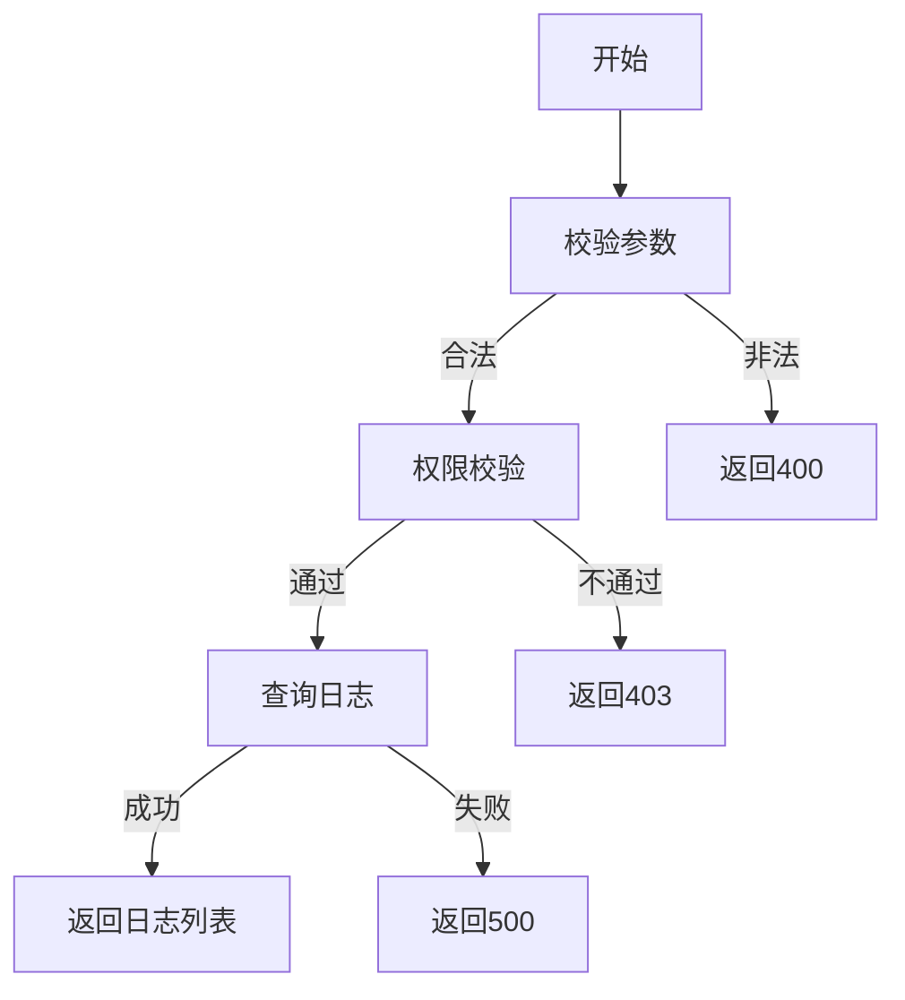

# 用户行为日志需求文档

## 1. 功能描述
用户行为日志用于记录用户在系统中的各种操作行为，包括登录、登出、数据访问、数据修改等操作。

## 2. 目标
- 记录用户操作行为，便于审计和问题排查。
- 支持按时间、用户、操作类型等条件查询日志。

## 3. 输入输出
### 输入
- 用户ID
- 操作类型
- 操作内容
- 时间范围

### 输出
- 用户行为日志列表
- 分页信息

## 4. API/接口设计
| 接口 | 方法 | 路径 | 描述 |
| ---- | ---- | ---- | ---- |
| 查询用户行为日志 | GET | /api/user/v1/behavior/log | 查询用户行为日志 |

#### 请求示例
GET /api/user/v1/behavior/log?userId=1&startTime=2023-01-01&endTime=2023-12-31&page=1&pageSize=20

#### 响应示例
```json
{
  "code": 0,
  "msg": "success",
  "data": {
    "list": [
      {
        "id": 1,
        "userId": 1,
        "action": "login",
        "content": "用户登录",
        "ip": "192.168.1.1",
        "createTime": "2023-01-01 10:00:00"
      }
    ],
    "pagination": {
      "total": 100,
      "page": 1,
      "pageSize": 20
    }
  }
}
```

## 5. 数据结构
```go
UserBehaviorLogItem struct {
    ID         int64  `json:"id"`
    UserID     int64  `json:"userId"`
    Action     string `json:"action"`
    Content    string `json:"content"`
    IP         string `json:"ip"`
    CreateTime string `json:"createTime"`
}
```

## 6. 异常处理
- 参数校验失败：返回400，"参数错误"
- 权限不足：返回403，"无权限"
- 服务器异常：返回500，"服务器错误"

## 7. 流程图


## 8. 安全性
- 仅允许有权限的用户查询。
- 防止敏感信息泄露。

## 9. 日志
- 记录日志查询操作。
- 记录异常和失败原因。

## 10. 测试用例
1. 正常查询用户行为日志。
2. 按时间范围查询。
3. 按用户ID查询。
4. 参数非法，返回400。
5. 权限不足，返回403。
6. 服务器异常，返回500。 