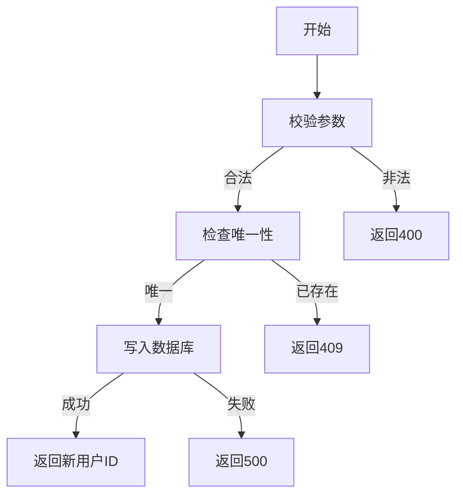

# 创建用户需求文档

## 1. 功能描述
创建用户用于在系统中新增用户账号，录入基础信息并分配初始角色。

## 2. 目标
- 支持管理员创建新用户。
- 校验输入信息合法性。
- 分配默认或指定角色。

## 3. 输入输出
### 输入
- 用户名、邮箱、手机号、初始密码、角色等

### 输出
- 操作结果（成功/失败）
- 新用户ID

## 4. API/接口设计
| 接口 | 方法 | 路径 | 描述 |
| ---- | ---- | ---- | ---- |
| 创建用户 | POST | /api/user/v1/create | 创建新用户 |

#### 请求示例
POST /api/user/v1/create
```json
{
  "username": "newuser",
  "email": "new@email.com",
  "phone": "12345678901",
  "password": "pass1234",
  "roles": ["user"]
}
```

#### 响应示例
```json
{
  "code": 0,
  "msg": "success",
  "data": {
    "userId": 124
  }
}
```

## 5. 数据结构
```go
UserCreateRequest struct {
    Username string   `json:"username"`
    Email    string   `json:"email"`
    Phone    string   `json:"phone"`
    Password string   `json:"password"`
    Roles    []string `json:"roles"`
}
UserCreateResponse struct {
    UserID int64 `json:"userId"`
}
```

## 6. 异常处理
- 用户名/邮箱/手机号已存在：返回409，"用户已存在"
- 参数校验失败：返回400，"参数错误"
- 权限不足：返回403，"无权限"
- 服务器异常：返回500，"服务器错误"

## 7. 流程图


## 8. 安全性
- 仅允许有权限的管理员创建用户。
- 密码加密存储。
- 输入参数严格校验。

## 9. 日志
- 记录用户创建操作。
- 记录异常和失败原因。

## 10. 测试用例
1. 正常创建新用户。
2. 用户名已存在，返回409。
3. 邮箱已存在，返回409。
4. 参数非法，返回400。
5. 权限不足，返回403。
6. 服务器异常，返回500。 