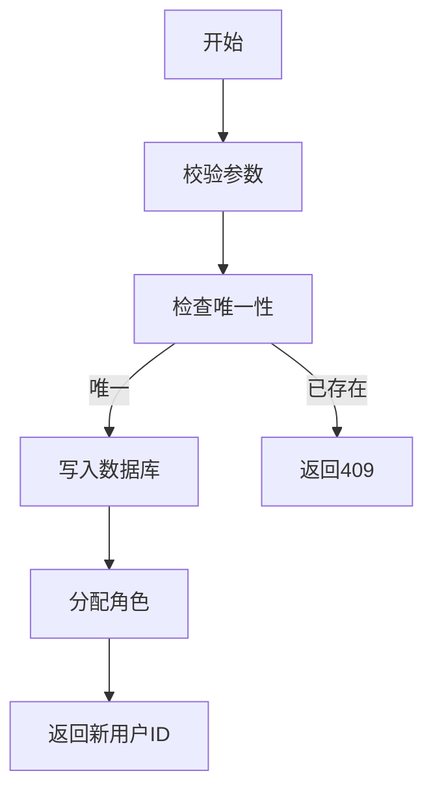

# 用户创建功能需求文档

## 1. 功能描述
用户创建功能用于在系统中新增用户账号，录入基础信息、分配初始角色和权限，支持多种注册方式（管理员创建、用户自助注册、第三方注册）。

## 2. 功能目标
- 支持管理员和用户自助创建账号
- 校验用户名、邮箱、手机号唯一性和格式
- 支持分配默认/指定角色与权限
- 响应时间≤2秒，批量导入≤30秒/百人
- 创建成功率≥99.9%

## 3. 输入输出
### 输入参数
- 用户名、邮箱、手机号、初始密码、角色、扩展属性

#### 请求示例
```json
{
  "username": "newuser",
  "email": "new@email.com",
  "phone": "12345678901",
  "password": "pass1234",
  "roles": ["user"],
  "profile": {"nickname": "新用户", "avatar": "url"}
}
```

### 输出结果
- 操作结果（成功/失败）
- 新用户ID、初始信息

#### 响应示例
```json
{
  "code": 0,
  "msg": "success",
  "data": {
    "userId": 124,
    "username": "newuser"
  }
}
```

## 4. 接口设计
### RESTful API
| 接口 | 方法 | 路径 | 描述 |
| ---- | ---- | ---- | ---- |
| 创建用户 | POST | /api/user/v1/create | 创建新用户 |
| 批量导入 | POST | /api/user/v1/batch-create | 批量导入用户 |

### WebSocket
- 暂无

## 5. 数据结构
### 数据库表
```sql
CREATE TABLE users (
  id BIGINT PRIMARY KEY AUTO_INCREMENT,
  username VARCHAR(50) NOT NULL UNIQUE,
  email VARCHAR(100) NOT NULL UNIQUE,
  phone VARCHAR(20) NOT NULL UNIQUE,
  password_hash VARCHAR(128) NOT NULL,
  status ENUM('active','inactive','locked') DEFAULT 'active',
  created_at TIMESTAMP DEFAULT CURRENT_TIMESTAMP,
  updated_at TIMESTAMP DEFAULT CURRENT_TIMESTAMP ON UPDATE CURRENT_TIMESTAMP
);
```

### Go结构体
```go
type UserCreateRequest struct {
    Username string   `json:"username" validate:"required,min=3,max=50"`
    Email    string   `json:"email" validate:"required,email"`
    Phone    string   `json:"phone" validate:"required,len=11"`
    Password string   `json:"password" validate:"required,min=6,max=32"`
    Roles    []string `json:"roles"`
    Profile  *Profile `json:"profile,omitempty"`
}
type UserCreateResponse struct {
    UserID   int64  `json:"userId"`
    Username string `json:"username"`
}
```

## 6. 异常处理
- 用户名/邮箱/手机号已存在：409 Conflict
- 参数校验失败：400 Bad Request
- 权限不足：403 Forbidden
- 服务器异常：500 Internal Server Error
- 批量导入部分失败时返回详细失败列表

## 7. 流程图


## 8. 安全性考虑
- 仅允许有权限的管理员或开放注册时用户自助创建
- 密码加密存储（bcrypt/argon2）
- 输入参数严格校验，防止SQL注入
- 注册频率限制，防止恶意注册

## 9. 日志与监控
- 记录用户创建操作、失败原因、来源IP
- 监控注册成功率、异常率、响应时间
- 告警：注册失败率>5%时通知运维

## 10. 测试用例
1. 正常创建新用户
2. 用户名/邮箱/手机号已存在，返回409
3. 参数非法，返回400
4. 权限不足，返回403
5. 服务器异常，返回500
6. 批量导入部分失败
7. 密码加密校验
8. 注册频率限制测试 