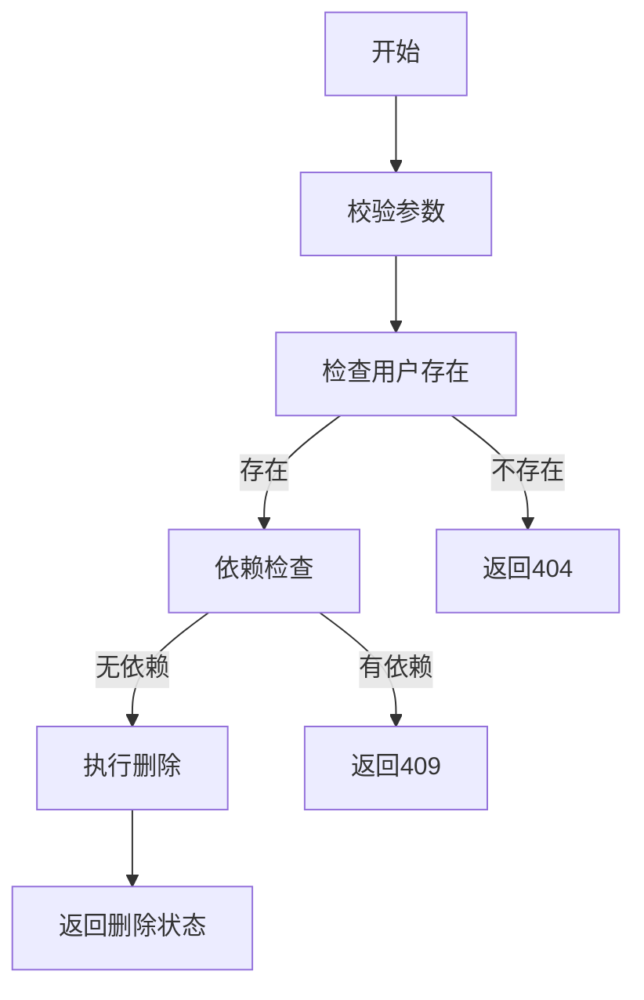

# 用户删除功能需求文档

## 1. 功能描述
用户删除功能用于安全地移除用户账号，支持软删除和硬删除两种模式，保障数据安全和可恢复性。

## 2. 功能目标
- 支持管理员批量/单个删除用户
- 支持软删除（可恢复）和硬删除（彻底移除）
- 删除前依赖检查（如任务、日志等）
- 响应时间≤2秒，批量≤30秒/百人
- 删除成功率≥99.9%

## 3. 输入输出
### 输入参数
- 用户ID、删除模式（soft/hard）

#### 请求示例
```json
{
  "userId": 124,
  "mode": "soft"
}
```

### 输出结果
- 操作结果（成功/失败）
- 删除后状态

#### 响应示例
```json
{
  "code": 0,
  "msg": "success",
  "data": {
    "userId": 124,
    "status": "deleted"
  }
}
```

## 4. 接口设计
### RESTful API
| 接口 | 方法 | 路径 | 描述 |
| ---- | ---- | ---- | ---- |
| 删除用户 | POST | /api/user/v1/delete | 删除用户 |
| 批量删除 | POST | /api/user/v1/batch-delete | 批量删除用户 |

## 5. 数据结构
### Go结构体
```go
type UserDeleteRequest struct {
    UserID int64  `json:"userId" validate:"required"`
    Mode   string `json:"mode" validate:"oneof=soft hard"`
}
type UserDeleteResponse struct {
    UserID int64  `json:"userId"`
    Status string `json:"status"`
}
```

## 6. 异常处理
- 用户不存在：404 Not Found
- 权限不足：403 Forbidden
- 依赖未清理：409 Conflict
- 服务器异常：500 Internal Server Error

## 7. 流程图


## 8. 安全性考虑
- 仅允许管理员操作
- 删除操作需二次确认
- 软删除可恢复，硬删除需权限校验
- 删除操作审计

## 9. 日志与监控
- 记录删除操作、失败原因、来源IP
- 监控删除成功率、异常率、响应时间
- 告警：删除失败率>5%时通知运维

## 10. 测试用例
1. 正常软删除用户
2. 正常硬删除用户
3. 用户不存在，返回404
4. 有依赖未清理，返回409
5. 权限不足，返回403
6. 服务器异常，返回500
7. 批量删除部分失败
8. 删除操作日志校验 