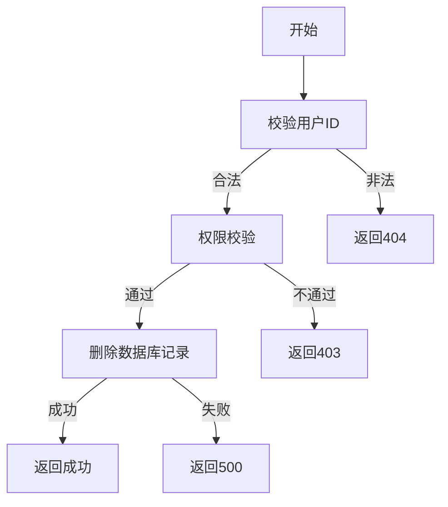

# 删除用户需求文档

## 1. 功能描述
删除用户用于从系统中移除指定用户账号，通常仅限管理员操作。

## 2. 目标
- 支持管理员删除用户。
- 校验用户存在性和操作权限。

## 3. 输入输出
### 输入
- 用户ID

### 输出
- 操作结果（成功/失败）

## 4. API/接口设计
| 接口 | 方法 | 路径 | 描述 |
| ---- | ---- | ---- | ---- |
| 删除用户 | DELETE | /api/user/v1/delete/{userId} | 删除指定用户 |

#### 请求示例
DELETE /api/user/v1/delete/123

#### 响应示例
```json
{
  "code": 0,
  "msg": "success"
}
```

## 5. 数据结构
无特殊结构，仅需用户ID。

## 6. 异常处理
- 用户不存在：返回404，"用户不存在"
- 权限不足：返回403，"无权限"
- 服务器异常：返回500，"服务器错误"

## 7. 流程图


## 8. 安全性
- 仅允许有权限的管理员删除用户。
- 操作需二次确认。

## 9. 日志
- 记录用户删除操作。
- 记录异常和失败原因。

## 10. 测试用例
1. 正常删除用户。
2. 用户不存在，返回404。
3. 权限不足，返回403。
4. 服务器异常，返回500。 