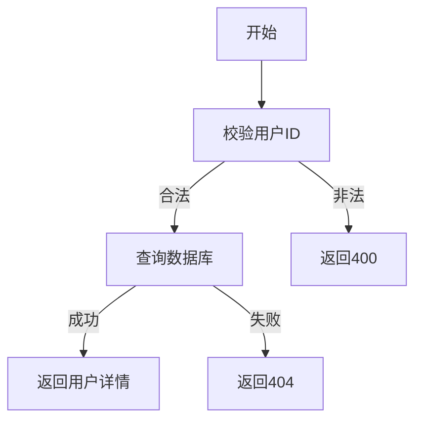

# 用户详情查询需求文档

## 1. 功能描述
用户详情查询用于获取指定用户的完整信息，包括基础信息、角色、权限、状态等。

## 2. 目标
- 支持通过用户ID查询用户详情。
- 返回用户的全部关键信息。

## 3. 输入输出
### 输入
- 用户ID

### 输出
- 用户详情（基础信息、角色、权限、状态等）

## 4. API/接口设计
| 接口 | 方法 | 路径 | 描述 |
| ---- | ---- | ---- | ---- |
| 用户详情查询 | GET | /api/user/v1/detail/{userId} | 查询指定用户详情 |

#### 请求示例
GET /api/user/v1/detail/123

#### 响应示例
```json
{
  "code": 0,
  "msg": "success",
  "data": {
    "userId": 123,
    "username": "abc",
    "email": "abc@email.com",
    "phone": "12345678901",
    "avatar": "url",
    "status": 1,
    "roles": ["admin"],
    "permissions": ["user:view", "user:edit"]
  }
}
```

## 5. 数据结构
```go
UserDetail struct {
    UserID      int64    `json:"userId"`
    Username    string   `json:"username"`
    Email       string   `json:"email"`
    Phone       string   `json:"phone"`
    Avatar      string   `json:"avatar"`
    Status      int      `json:"status"`
    Roles       []string `json:"roles"`
    Permissions []string `json:"permissions"`
}
```

## 6. 异常处理
- 用户不存在：返回404，"用户不存在"
- 参数校验失败：返回400，"参数错误"
- 权限不足：返回403，"无权限"
- 服务器异常：返回500，"服务器错误"

## 7. 流程图


## 8. 安全性
- 仅允许有权限的用户查询。
- 输入参数严格校验。

## 9. 日志
- 记录用户详情查询操作。
- 记录异常和失败原因。

## 10. 测试用例
1. 查询存在用户详情，返回正确数据。
2. 查询不存在用户，返回404。
3. 查询无权限用户，返回403。
4. 参数非法，返回400。
5. 服务器异常，返回500。 