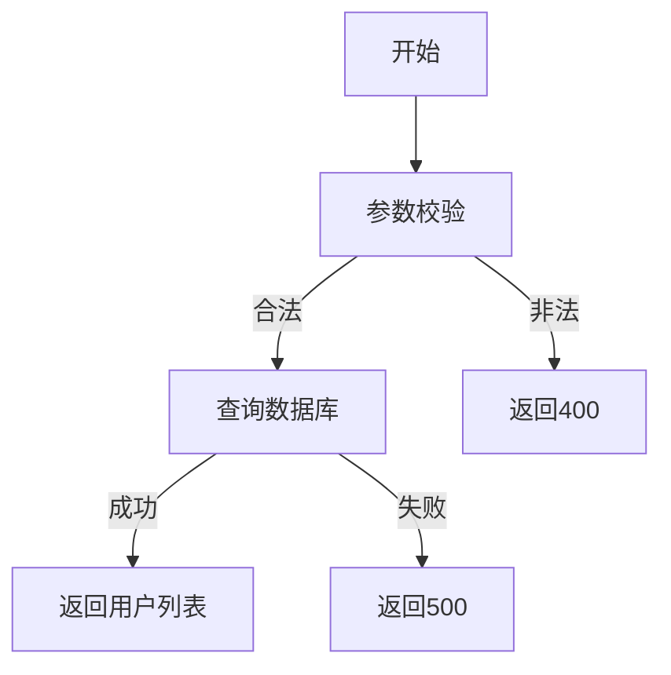

# 用户列表查询需求文档

## 1. 功能描述
用户列表查询用于分页获取系统内所有用户的基础信息，支持多条件筛选（如用户名、状态、角色等）。

## 2. 目标
- 支持分页、条件筛选查询用户列表。
- 返回用户基础信息及分页信息。

## 3. 输入输出
### 输入
- 分页参数（page, pageSize）
- 筛选条件（用户名、状态、角色等）

### 输出
- 用户列表
- 分页信息（总数、页码、每页数量）

## 4. API/接口设计
| 接口 | 方法 | 路径 | 描述 |
| ---- | ---- | ---- | ---- |
| 用户列表查询 | GET | /api/user/v1/list | 分页查询用户列表 |

#### 请求示例
GET /api/user/v1/list?page=1&pageSize=20&username=abc&status=1

#### 响应示例
```json
{
  "code": 0,
  "msg": "success",
  "data": {
    "list": [
      {
        "userId": 1,
        "username": "abc",
        "email": "abc@email.com",
        "status": 1
      }
    ],
    "pagination": {
      "total": 100,
      "page": 1,
      "pageSize": 20
    }
  }
}
```

## 5. 数据结构
```go
// 用户列表项
UserListItem struct {
    UserID   int64  `json:"userId"`
    Username string `json:"username"`
    Email    string `json:"email"`
    Status   int    `json:"status"`
}
// 分页信息
Pagination struct {
    Total    int `json:"total"`
    Page     int `json:"page"`
    PageSize int `json:"pageSize"`
}
```

## 6. 异常处理
- 参数校验失败：返回400，"参数错误"
- 服务器异常：返回500，"服务器错误"

## 7. 流程图


## 8. 安全性
- 仅允许有权限的用户查询。
- 防止SQL注入，参数严格校验。

## 9. 日志
- 记录用户列表查询操作。
- 记录异常和失败原因。

## 10. 测试用例
1. 正常分页查询用户列表。
2. 按用户名筛选查询。
3. 按状态筛选查询。
4. 参数非法，返回400。
5. 服务器异常，返回500。 