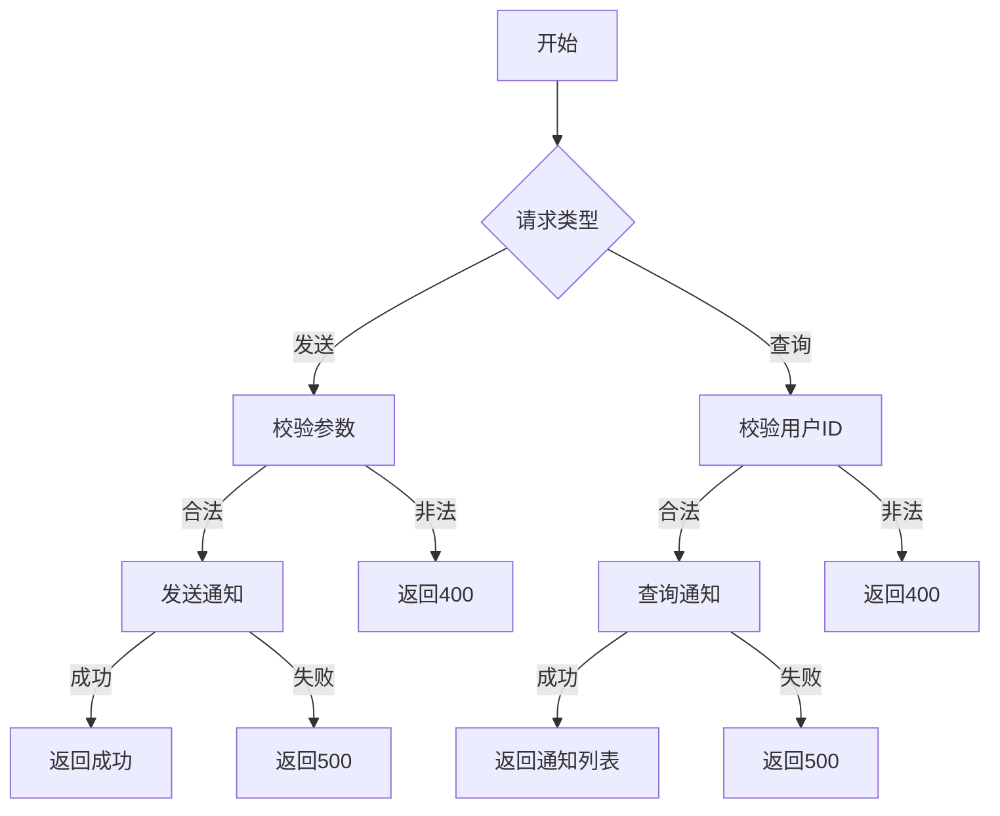

# 用户通知管理需求文档

## 1. 功能描述
用户通知管理用于向用户发送系统通知，包括消息推送、邮件通知、短信通知等。

## 2. 目标
- 支持向用户发送各种类型的通知。
- 支持查询用户通知历史。

## 3. 输入输出
### 输入
- 用户ID
- 通知内容
- 通知类型

### 输出
- 操作结果（成功/失败）
- 通知列表

## 4. API/接口设计
| 接口 | 方法 | 路径 | 描述 |
| ---- | ---- | ---- | ---- |
| 发送通知 | POST | /api/user/v1/notification/send | 向用户发送通知 |
| 查询通知 | GET | /api/user/v1/notification/list | 查询用户通知列表 |

#### 请求示例
POST /api/user/v1/notification/send
```json
{
  "userId": 123,
  "title": "系统通知",
  "content": "您有一条新的系统通知",
  "type": "system"
}
```
GET /api/user/v1/notification/list?userId=123&page=1&pageSize=20

#### 响应示例
```json
{
  "code": 0,
  "msg": "success",
  "data": {
    "list": [
      {
        "id": 1,
        "userId": 123,
        "title": "系统通知",
        "content": "您有一条新的系统通知",
        "type": "system",
        "createTime": "2023-01-01 10:00:00"
      }
    ],
    "pagination": {
      "total": 100,
      "page": 1,
      "pageSize": 20
    }
  }
}
```

## 5. 数据结构
```go
UserNotificationRequest struct {
    UserID  int64  `json:"userId"`
    Title   string `json:"title"`
    Content string `json:"content"`
    Type    string `json:"type"`
}
UserNotificationItem struct {
    ID         int64  `json:"id"`
    UserID     int64  `json:"userId"`
    Title      string `json:"title"`
    Content    string `json:"content"`
    Type       string `json:"type"`
    CreateTime string `json:"createTime"`
}
```

## 6. 异常处理
- 用户不存在：返回404，"用户不存在"
- 参数校验失败：返回400，"参数错误"
- 权限不足：返回403，"无权限"
- 服务器异常：返回500，"服务器错误"

## 7. 流程图


## 8. 安全性
- 仅允许有权限的用户发送通知。
- 输入参数严格校验。

## 9. 日志
- 记录通知发送操作。
- 记录异常和失败原因。

## 10. 测试用例
1. 正常发送通知。
2. 正常查询通知列表。
3. 用户不存在，返回404。
4. 权限不足，返回403。
5. 参数非法，返回400。
6. 服务器异常，返回500。 